# 279.完全平方数

    279. 完全平方数
    给定正整数 n，找到若干个完全平方数（比如 1, 4, 9, 16, ...）使得它们的和等于 n。你需要让组成和的完全平方数的个数最少。

    给你一个整数 n ，返回和为 n 的完全平方数的 最少数量 。

    完全平方数 是一个整数，其值等于另一个整数的平方；换句话说，其值等于一个整数自乘的积。例如，1、4、9 和 16 都是完全平方数，而 3 和 11 不是。

    

    示例 1：

    输入：n = 12
    输出：3 
    解释：12 = 4 + 4 + 4
    示例 2：

    输入：n = 13
    输出：2
    解释：13 = 4 + 9

平平无奇279.

关键字：数组，最少。那么有没有想起来我们的数组思路



## 贪心

`dp[i] = Math.min(dp[i-j*j]) + 1 where k*k<i`


## BFS

`(val, level) => [1,n] 入队列 (val+i*i),level+1`

    val == n 时，level是一个解


## SSH的办法

这个题目可以翻译成一个完全背包问题,有[1,4,9,16,....]这个多个硬币，需要凑出n块钱，最少需要多少枚硬币

```java
for(int i = 0; i< coins.length; i++) {
    int coin = coins[i];
    for(int j = coin; j<n; j++) {
        dp[j] = Math.min(dp[j-coin[i]] + 1, dp[j]);
    }
}
```