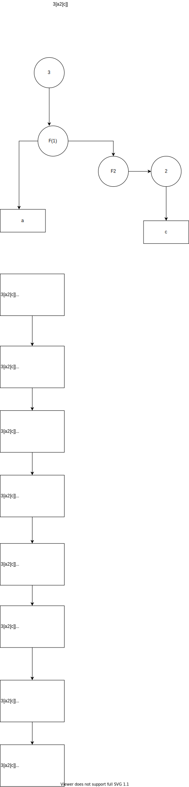

## 394. 字符串解码

```java
给定一个经过编码的字符串，返回它解码后的字符串。

编码规则为: k[encoded_string]，表示其中方括号内部的 encoded_string 正好重复 k 次。注意 k 保证为正整数。

你可以认为输入字符串总是有效的；输入字符串中没有额外的空格，且输入的方括号总是符合格式要求的。

此外，你可以认为原始数据不包含数字，所有的数字只表示重复的次数 k ，例如不会出现像 3a 或 2[4] 的输入。

 

示例 1：

输入：s = "3[a]2[bc]"
输出："aaabcbc"
示例 2：

输入：s = "3[a2[c]]"
输出："accaccacc"
示例 3：

输入：s = "2[abc]3[cd]ef"
输出："abcabccdcdcdef"
示例 4：

输入：s = "abc3[cd]xyz"
输出："abccdcdcdxyz"
```

本体属于有思路+没思路
* 有思路，*大概*知道是需要recursive，dfs, 一个函数call另一个函数
* 没思路，除了recursive，就没有任何想法了

会纠结于细节，如果decode `[]`,如果是多层嵌套怎么办，如果多层嵌套加多孩子怎么办，把自己多思路陷进了无限多细节里边。


所以我按照没思路来走SSH

* Smaller
    * 
* Similar
    * 38.Count and Say
    * 1087.brace-expansion
    * 有点像树的问题 
    
    ,
* High level
    * 假设子问题已经解决
,


综合以上描述，对于测试用例 3[a2[c]]，假设F(1) = [a2[c]], F(1)已经解决，我们知道结果就是F(1)F(1)F(1), 即F(1)重复3遍

```java
["last_multi", "last_res"]    

F(1) = "" + 3 * F(2), []
F(2) = a + 2 F(3)   [3, ""]
F(3) = "" + 1 F(4)  [[3,""], [2, "a"]]
F(4) = c            [[3,""], [2, "a"], [1, ""]] 

""+1*c=c            [[3,""], [2, "a"]]
"a"+2*c=acc         [[3,""]]
""+3*acc=accacc     []

```

### 字符类扫描操作的公式。
**res = last res + last_modify(res)*

#### 栈题解

如果能想到这个题目是表达式求值，那么问题就迎刃而解，扫描表达式，一个op stack和一个num stack，处理运算符的precedent，然后入栈，出栈，计算求值

具体算法描述如下：
```java
* 构造辅助栈stack,辅助变量 multi = 0, res = 0
    * 遍历字符串的每个字符c
    * 如果c是数字,更新multi
    * 如果c是字母，更新res
    * c = '['，**入栈**multi和res,变为last_multi, last_res重置multi和res
    * c = ']'，出栈last_res和last_mult
        * res = last_res + last_multi * res
        * last_res是上个 [ 到当前 [ 的字符串，例如 "3[a2[c]]" 中的 a
        * cur_multi是当前 [ 到 ] 内字符串的重复倍数，例如 "3[a2[c]]" 中的 2
```

```java
* step 1

    3[a2[c]]
    ^
    stack: 
    res:
    multi: 3

* Step 2

    3[a2[c]]
     ^
     进栈，并重置
    stack: (3, "")
    res:
    multi: 0

* Step3

    3[a2[c]]
      ^
    stack: (3, "")
    res: "a"
    multi: 0    

* Step4

    3[a2[c]]
       ^
    进栈，并重置
    stack: (3, "")
    res: "a"
    multi: 2    

* Step5

    3[a2[c]]
        ^
    stack: (3, "")(2, "a")
    res: ""
    multi: 0

* Step6

    3[a2[c]]
         ^
    stack: (3, "")(2, "a")
    res: "c"
    multi: 0    

* Step7

    3[a2[c]]
          ^
          出栈 res = last_res + last_multi * res
    stack: (3, "")
    res: "a" + 2 * "c" = "acc"
    multi: 0        

* Step9

    3[a2[c]]
           ^
           c
            出栈 res = last_res + last_multi * res
    stack: 
    res: "" + 3 * "acc" = "accaccacc"
    multi: 0     
```

```java
class Solution {
        // Top down, recursive
        // parent depends on children
        /*
         3[a2[c]]
         /
         3 F(1)
         / 
         3 a2F(2)
         /
         3 a 2c
         */
         //DFS
    // Time O(n)
    // Space O(n), stack space
    public String decodeString(String s) {
        //  return decodeString(s, 0)[1];
         return decodeStringStack(s);
    }
    // 表达式求值解法
    private String decodeStringStack(String s) {
        // 3[a2[c]]
        Stack<String> ops = new Stack<>();
        Stack<String> data = new Stack<>();
        int mul = 0; // lastest mul, the number between last [ and this [
        StringBuilder res = new StringBuilder(); // latest res, the string betwin last [ and current [

        for(int i = 0; i < s.length(); i++) {
            char c = s.charAt(i);
            if(Character.isDigit(c)) {
                mul *= 10;
                mul += c-'0';
            } else if(Character.isAlphabetic(c)) {
                res.append(c);
            } else if(c == '[') {
                ops.push(String.valueOf(mul));
                data.push(res.toString());

                mul = 0;
                res = new StringBuilder();
            } else if(c==']') {
                int multi = Integer.valueOf(ops.pop());
                StringBuilder tmp = new StringBuilder();
                while(multi > 0) {
                    tmp.append(res);
                    multi--;
                }
                res = new StringBuilder(data.pop() + tmp.toString());
            }
        }
        return res.toString();
    }

  
}
```

#### 递归题解

因为字符串一个scan的dfs，我们需要递归回来以后，继续往前扫描，所以，我们需要把当前index传下去，也许要dfs回来以后把index带回来。

所以返回值为 `String[] = {index, 当前string结果}`

```java
  // 返回参数非常重要，[0]是返回时index，[1]是已经[]里被decode出来的string
    private String[] decodeString(String s, int idx) {
        int mult = 0;
        StringBuilder res = new StringBuilder();
        for(int i = idx; i < s.length(); i++) {
            char c = s.charAt(i);
            if(Character.isDigit(c)) {
                mult *= 10;
                mult += c-'0';
            } else if(Character.isAlphabetic(c)){
                res.append(c);
            } else if(c == '[') {
                // '[' 开始递归
                String[] subStr = decodeString(s, i+1);
                while(mult>0) {
                    res.append(subStr[1]);
                    mult--;
                }
                i = Integer.valueOf(subStr[0]);
            } else if(c == ']'){
                // ']'返回，
                return new String[] {String.valueOf(i), res.toString()};
            }
        }
        return new String[]{"0",res.toString()};

        
    }
```