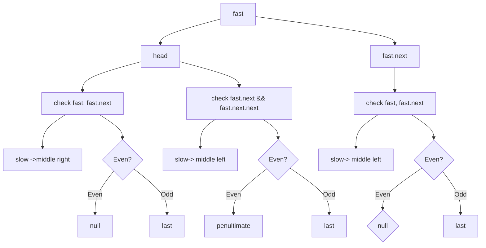
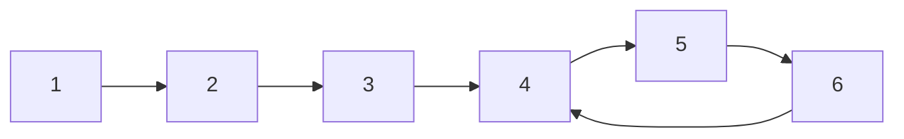

# Linked List

Most of the linked list problem can be resolved by recursive because of it's recursive nature, Node and Node.next.

## 经典题目
* [206. 反转链表](./206-reverse-linked-list/)
* [21. 合并两个有序链表](./21.merge-two-sorted-lists)
* [141. 环形链表](./141.linked-list-cycle/)
* [83. 删除排序链表中的重复元素](./83.remove-duplicates-from-sorted-list)
* [234. 回文链表](./234-palindrome-linked-list/234.md)
* [160. 相交链表](./160.intersection-of-two-linked-lists/)
* [203. 移除链表元素](./203.remove-linked-list-elements)
* [237. 删除链表中的节点](./237.delete-node-in-a-linked-list)
* [876. 链表的中间结点](./876.middle-of-the-linked-list)
    * also check the [LinkedList](./LinkedList.md) slow and fast pointer analysis

## Floyd's slow and fast pointers
One very important skill in LinkedList is the FLoyd's slow and fast pointers, as known as the Tortoise and Hare approach.
A math prove can be found [here](https://drive.google.com/file/d/1AUZpYvtZgtVVGw5SvxlPVfh_hehIiIEf/view)

It's often used to navigate a linked list where you don’t know the size in advance.
### slow and fast pointer template

```java
ListNode slow = head;
ListNode fast = head.next;
ListNode fast = head;
while(fast != null && fast.next != null) {
    slow = slow.next;
    fast = fast.next.next;
}
```

and analysis of different fast initial value and check condition
```

public ListNode middleNode(ListNode head) {
        ListNode slow = head;
        ListNode fast = head;
        while (fast.next != null && fast.next.next != null) {
            slow = slow.next;
            fast = fast.next.next;
        }
        System.out.println("head check next.next slow:" + slow.val + " fast:" + (fast==null?-1:fast.val));

        slow = head;
        fast = head;
        while (fast != null && fast.next != null) {
            slow = slow.next;
            fast = fast.next.next;
        }
        System.out.println("head check next, slow:" + slow.val + " fast:" + (fast==null?-1:fast.val));

        slow = head;
        fast = head.next;
        while (fast != null && fast.next != null) {
            slow = slow.next;
            fast = fast.next.next;
        }
        System.out.println("head.next check next slow:" + slow.val + " fast:" + (fast==null?-1:fast.val));


        return slow;
}

## Odd [1,2,3,4,5]
head check next.next slow:3 fast:5
head check next, slow:3 fast:5
head.next check next slow:3 fast:-1

## Even [1,2,3,4,5,6]
head check next.next slow:3 fast:5
head check next, slow:4 fast:-1
head.next check next slow:3 fast:6

```

| num| fast | check |  slow | fast |
|-----|------|-------| ------| -----|
| even | head | head, head.next | mid, right | null |
| odd | head | head, head.next | mid, right | last |
| even | head | head.next, head.next.next | mid, left | penultimate |
| odd | head | head.next, head.next.next | mid, left | last |
| even | head.next | head, head.next | mid, left | null |
| odd | head.next | head, head.next | mid, left | last |


### problems
*  detecting cyclic linked list
The typical problem for slow and fast pointers is detecting cyclic linked list. 




* k-th node from the end

fast go to kth, then slow and fast go together until fast reaches to the end. Then the slow is the kth from the end.

* medium node
slow go once, fast go twice, then slow is midium and fast the end.


