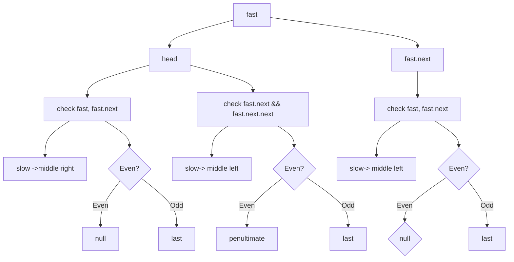
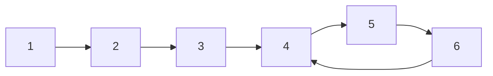

# 快慢指针

## Floyd's slow and fast pointers
One very important skill in LinkedList is the FLoyd's slow and fast pointers, as known as the Tortoise and Hare approach.
A math prove can be found [here](https://drive.google.com/file/d/1AUZpYvtZgtVVGw5SvxlPVfh_hehIiIEf/view)

It's often used to navigate a linked list where you don’t know the size in advance.

快慢指针用来
* 计算长度
* 长度相关的所有话题
    * 最中间节点
    * 倒数第k个
    * 中间某一段
* 环

### 模板

```java
ListNode slow = head;
ListNode fast = head.next; // 0, 1
ListNode fast = head; // 0, 0
while(hasMore(fast)) {
    slow = slow.next;
    fast = fast.next.next;
}

// 乐观跳
bool hasMore(fast) {
   return fast != null && fast.next != null;
}
// 悲观跳
bool hasMore(fast) {
   fast.next != null && fast.next.next != null
}
```


## 快慢指针不同初始值和检查条件

```java
public ListNode middleNode(ListNode head) {
         // 0, 0, 乐观跳
        ListNode slow = head;
        ListNode fast = head;         
        while (fast != null && fast.next != null) {
            slow = slow.next;
            fast = fast.next.next;
        }
        System.out.println("head, check next, slow:" + slow.val + " fast:" + (fast==null?-1:fast.val));

         // 0, 0 悲观跳
        slow = head;
        fast = head;
        while (fast.next != null && fast.next.next != null) {
            slow = slow.next;
            fast = fast.next.next;
        }
        System.out.println("head, check next.next slow:" + slow.val + " fast:" + (fast==null?-1:fast.val));

         // 0, 1 乐观跳
        slow = head;
        fast = head.next;
        while (fast != null && fast.next != null) {
            slow = slow.next;
            fast = fast.next.next;
        }
        System.out.println("head.next check next slow:" + slow.val + " fast:" + (fast==null?-1:fast.val));

         // 0， 1 悲观跳
        slow = head;
        fast = head.next;
        while (fast.next != null && fast.next.next != null) {
            slow = slow.next;
            fast = fast.next.next;
        }
        System.out.println("head.next, check next.next slow:" + slow.val + " fast:" + (fast==null?-1:fast.val));


        return slow;
}


```

### 初始条件 slow=0, fast=0
#### Odd [1,2,3,4,5]
* head check next.next slow:3 fast:5
* head check next, slow:3 fast:5
#### Even [1,2,3,4,5,6]
* head check next.next slow:3 fast:5
* head check next, slow:4 fast:-1


| num| fast | 跳法 |  slow at | fast | half half|
|-----|------|-------| ------| -----| ----- |
| even | head | head, head.next 乐观跳 | mid+slight right => index=len/2, start of second half | null | length(left) = length(right)|
| odd | head | head, head.next 乐观跳| mid=>index=tail(len/2),  | last | length(left) = length(right)-1 |
| even | head | head.next, head.next.next 悲观跳| left | penultimate (second last) | length(left) = length(right)|
| odd | head | head.next, head.next.next 悲观跳| mid | last | length(left)+1 = length(right)-1 |





### 初始条件 slow=0, fast=1

### Odd [1,2,3,4,5]
* head.next chec next.next slow:2 fast:4, wrong
* head.next check next slow:3 fast:-1

### Even [1,2,3,4,5,6]
* head.next check next.next slow:3 fast:6
* head.next check next slow:3 fast:6


| num| fast | check |  slow | fast |
|-----|------|-------| ------| -----|
| even | head.next | head, head.next | mid, left | null |
| odd | head.next | head, head.next | mid, left | last |
| even | head.next | head.next, head.next.next | mid, left | null |
| odd | head.next | head.next, head.next.next | mid, left | last |



### problems

*  detecting cyclic linked list
The typical problem for slow and fast pointers is detecting cyclic linked list. 




* k-th node from the end

   fast go to kth, then slow and fast go together until fast reaches to the end. Then the slow is the kth from the end.

* medium node

   slow go once, fast go twice, then slow is midium and fast the end.


