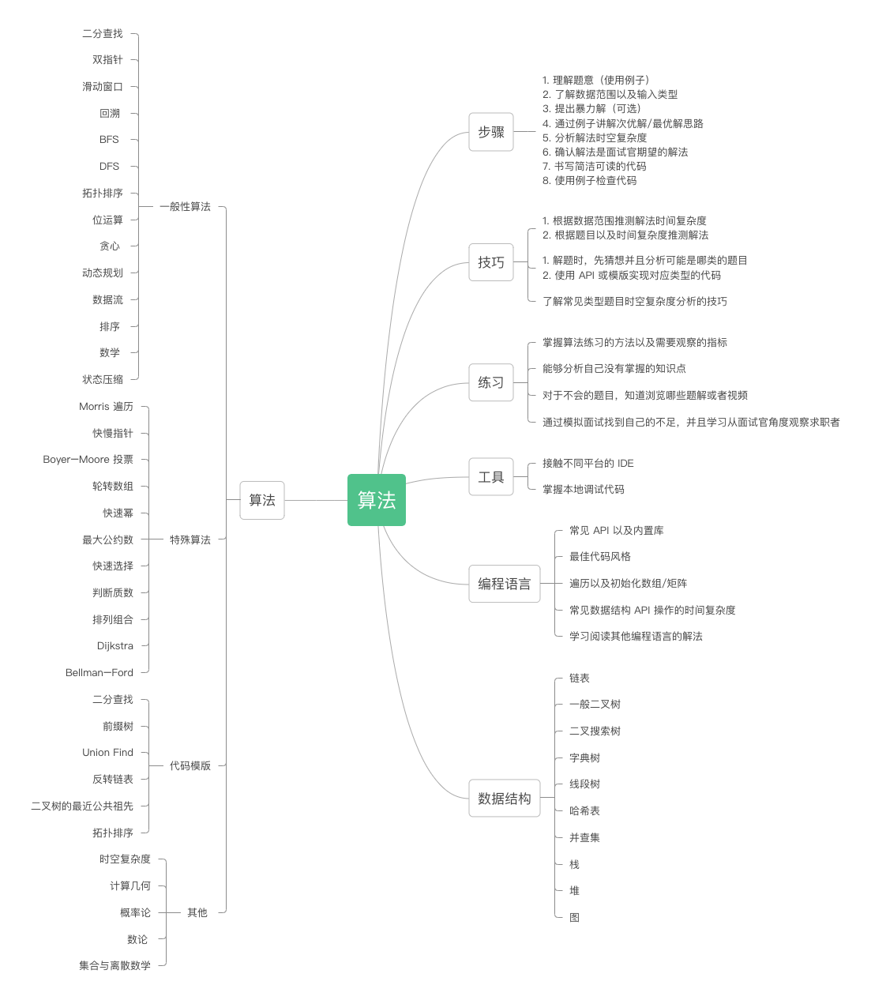

# Overview

## [知识点](./catalogue.md)

## [怎样面试](./codingInterviewACT.md)
* ACT
    * Ask
    * Confirm
    * Test

## [特殊解法](./algor401.md)

## 算法复盘
1. 理解题目
    * 未知量
    * 已知数据
    * 条件
    * 重新阐述
2. 拟定方案
3. SSH 方法
    1. 完全没有思路 SSH方法
        * Similar：找到解决过的相似题目：
        * Smaller：解决一道更简单的题目
        * High level：假定子问题已经被解决
    1. 做过的题做不出来
        * 需要进行总结和回顾算法以及数据结构
    1. 看不懂题解
        * 先从简单和中等的题目开始，有的题目可能涉及比较多子问题或者比较多数据结构，需要懂得拆分问题。
    1. 有思路但是写不对
        * 一般情况下是思路不够清晰，一些细的关键点没有想清楚，或者对于编程语言的熟悉不够
    1. 题目总结和回顾
        * 每类题目要总结出API
    1. 思路覆盘
        * 自己的思路卡在哪里        
# 数据结构
## 🌀 Linked List
链表可以先提出使用额外空间的暴力解，拿到基本分，再优化到常数空间的解
* [链表基础与API](./LinkedList.md)
* [移动链表节点总结](./LinkedListMoving.md)

## ✌️ Binary Tree
* [二叉树基础与API](./binaryTree.md)
* [二叉树错题本](./binaryProblemNotes.md)
## 二叉搜索树 🟡
* [二叉搜索树](./binarySearchTree.md)
## Trie(字典树/前缀树)
* [Trie(字典树/前缀树)](./trie.md)
## 线段树 🔴
* [线段树Segment Tree](./segmentTree.md)
## 📏Hash/double pointers/sliding windows
* [Map,HashMap及API](./mapAPI.md)
* [哈希表和双指针与滑动窗口](./hashTwoPointers.md)
## Union find(并查集)
* [union find](./unionFindSet.md)
## 📚 栈，队列，Stack Queue Deque
* [栈队列API](./stackQueueAPI.md)
* [栈队列经典题目的图解](./stackQueue.md)
* [栈队列错题本](./stackQueueProblemNotes.md)
### PriorityQueue
* [优先队列](./priorityQueueAPI.md)
### 单调栈
* [单调栈API](./monotoneStack.md)

## 🗺️ 图论
* [图论基础](./graph.md)
* [图论DFS错题本](./graphDFSProblemNotes.md)
## 📱 矩阵
* [矩阵及API](./matrix.md)
## 🔡 字符串
* [字符串及API](./string.md)
* [字符串扫描并操作](./stringScanAndModify.md)
## 数组Array
* [数组及其API](./arrayAPI.md)
# 一般算法
## 🔎 Binary Search 
* [二分查找与API](./binarySearch.md)
## double pointers/滑动窗口
* [哈希表和双指针与滑动窗口](./hashTwoPointers.md)
## ☯️ 递归/回溯
* [递归基础与API](./recursive.md)
    * DFS, BFS
## 拓扑排序 🟡
## 🔟󠀽󠀽⏭️2️⃣ 位运算
* [位运算](./bits.md)
## 贪心
* [贪心题目证明](./greedyProof.md)
## 💹 动态规划 DP 
* [动态规划基础](./dynamicProgramming.md)
## 数据流
## 🔀 排序算法 
* [排序算法与其无处不在的应用](./sort.md)
## 数学 Math
* [数学题目基础及API](./mathAPI.md)
## 状态压缩 🟡
# 特殊算法
## Morris 遍历
## [快慢指针](./LinkedListFastSlow.md)
## Boyer-Moore投票 🟡
## 轮转数组 🟡
## [模板API](./codeAPI.md)
* 快速幂法
* 快速乘法
* 快速排序
* 快速选择
## 最大公约数 🟡
## 判断质数 🟡
## 排列组合 🟡
## Dijkstra 🟡
## Bellman-Ford 🟡
# 代码模版
## ✌️ Binary Tree
* [二叉树基础与API](./binaryTree.md)
## 前缀和 presum
* [前缀和](./prefixSumAPI.md)
## Union Find 🟡
## [链表(反转， merge)](./LinkedList.md)
## 拓扑排序 🟡
## 二叉树最近公共祖先 🟡
* [二叉树错题本](./binaryProblemNotes.md)

## Miscs

* 递归和动态规划的一些共同点
递归相关的词汇，recursive, top down, buttom up, BFS, DFS, DFS+backtrack,DFS+(pre-order, in-order+postorder + level)

dp相关的词汇， top down, buttom up, tabulation or memoization

dp+recursive，leetcode半壁江山

* 一些符号的读法
    * a' a prime
    * () parentheses
    * [] bracket
    * {} curly bracket/braces
    * n! factorial

* int加减乘除的题目处理溢出

    处理溢出情况，通常要处理下次迭代溢出， x > MAX_VALUE || x < MIN_VALUE
    比如，7 整数反转这个题目，每次迭代就是 x *= 10， 所以 这里的条件是
    res < Integer.MIN_VALUE/10 || res > Integer.MAX_VALUE / 10

## ⚙️ 难题
* 1631.最小体力消耗路径
* 721.账户合并

## 代表问题
* [394.字符串解码](./394.decode-string/394.md)
    * 递归，dfs
* [279.279. 完全平方数](./279.perfect-squares/279.md)
    * BFS
    * 背包
    * 递归

* [456.132 Pattern](./456.132-pattern/132-pattern.md)
    * 如何在数组里寻找元素
## 面经
[FB面经](./FB面经.md)

