# Array 数组
## Array API及应用
* 获取倒数第 k 个元素
*  从后到前遍历数组
*  每隔 k 个元素遍历数组
*  高效轮转数组（189. 轮转数组）
*  前缀和的模版，前缀和的使用场景
    * [前缀和](./prefixSumAPI.md)
*  差分数组的实现与使用场景
*  建立等差等比数组以及其基本公式

常见的数组题目如下：给定1 - 2 个数组，求符合某个条件的最短（或最长）的子数组（或其长度）。

一道数组题基本有两个大方向
1. 动态规划/贪心
2. 可以通过两层循环暴力解找到所有子数组，然后检查每个子数组再更新答案来解，时间复杂度为  O(N^2*T) （O(T) 为检查子数组的时间），这种情况可以考虑三种优化手段：
    1. 二分查找，
    2. 滑动窗口，
    3. 栈/单调栈。
    4. 前缀和
    
先考虑二分查找，二分查找可以将时间复杂度降为 O(Nlog(range) * T) range 是二分查找的左右区间范围。
    
其次是滑动窗口和栈/单调栈，可以理解这类的数组题关键点在于：将数组中每个索引当成 right，找到其对应的最长/最短的的 left。

例如题目 https://leetcode-cn.com/problems/longest-substring-without-repeating-characters/ 中，以 pww 为例，每个索引对应的 left 如下：

            p w w
    索引     0 1  2
    left    0  0  1

使用滑动窗口一个重要的充分条件是随着索引的增加，满足答案的**left 单调不减**，在这题中一定存在：

`left[i] <= left[j] if j > i`

你说的这题 https://leetcode-cn.com/problems/longest-well-performing-interval/ 并不符合这个条件，例如：

`[6,6,9,9,6,9,9,9,9]`

可以看到当 j = 4 的时候 left = 2 合法区间为 [9, 9, 6]

但是当 j = 8 的时候 left 等于 0 合法区间为  [6,6,9,9,6,9,9,9,9]

这种时候可以考虑使用二分查找以及栈/单调栈来解。

[单调栈](./monotoneStack.md)