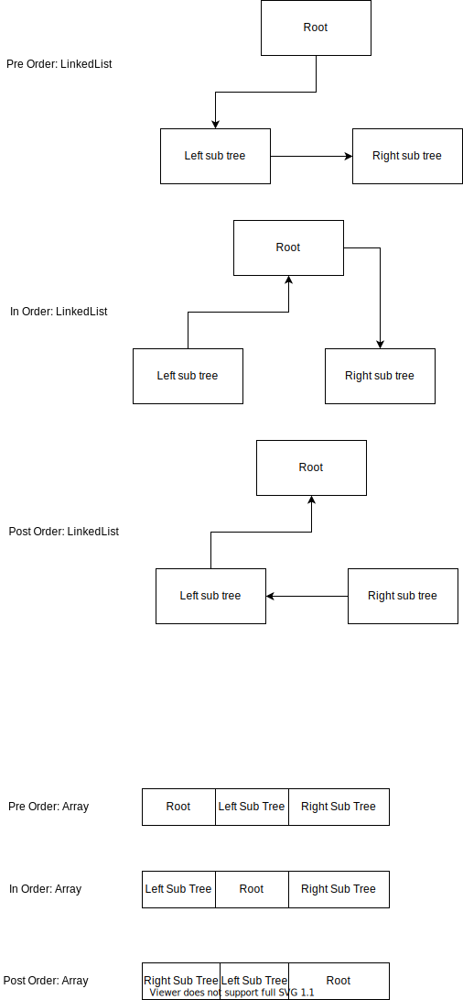

# Tree

Binary Tree, Binary Search tree
二叉树是一种有向无环图


##  经典题目
二叉树的题目有几类，
* 求值 
    * [104. 二叉树的最大深度](./104.maximum-depth-of-binary-tree/104.md)
* 操作，修改
    * [226. 翻转二叉树](https://leetcode-cn.com/problems/invert-binary-tree/)
    * [617. 合并二叉树](./617.merge-two-binary-trees/)
    * [426. 将二叉搜索树转化为排序的双向链](https://leetcode-cn.com/problems/convert-binary-search-tree-to-sorted-doubly-linked-list/)
    * [430. 扁平化多级双向链表](https://leetcode-cn.com/problems/flatten-a-multilevel-doubly-linked-list/)
* 特性
    * 二叉树比较(相同，对称，镜像)
        * [100. 相同的树](./100.same-tree)
        * [101. 对称二叉树](./101.symmetric-tree)


## API  
* `preTraveral(root).forEach(x-> visit(x))`
* `inTraveral(root).forEach(x-> visit(x))`
* `postTraveral(root).forEach(x-> visit(x))`
* `levelTraveral(root).forEach(x-> visit(x))`

## 解法API模版·

```
    // global variable
    **返回值** solution(root， **参数列表**) {
        // pre visit(x)
        solution(root.left)
        // mid visit(x)
        solution(root.right)
        // post visit(x)
    }
```


## 父节点和子节点之间的关系
Finding out the relationshipt between the parent node and children nodes

找出父节点和子节点 之间的关系



* Top down的递归，父节点带信息到子节点的计算。
* 如果是buttom up，我们需要从子节点带数据出去父节点，可以用返回值，hashmap来实现


## Binary Tree
### representation of a tree



### Tree Traveral
树有多种traversal的方法，其中dfs可以实现前序，中序，后序。大部分情况下，你需要首先了解父节点和子节点的依赖关系。


```
/* binary tree travesal */
void traverse(TreeNode root) {
    // preOrder
    traverse(root.left)
    // inOrder
    traverse(root.right)
    // postOrder
}
```
For the recursive solution, the main point is to find out what need to happen to one node.


### Breadth First Search(**level traversal**)


```java
void bfs(Node root) {
    Queue queue = new Queue();
    queue.offer(root);

    while(!queue.isEmpty()){
        Node node = (Node)queue.poll();

        if(node.getLeft() != null){
            queue.offer(node.getLeft());
        }

        if(node.getRight() != null){
            queue.offer(node.getRight());
        }
    }
}

```
In above tempalte, we don't really see the level info, let's create a new tempalte.


```java

// leveled
void leveledBFS(Node root) {
    Queue queue = new Queue();
    queue.offer(root);
    int level = 0;
    while(!queue.isEmpty()){
        for(int i = q.size(); i > 0; i--) {
            Node node = (Node)queue.poll();

            if(node.getLeft() != null){
                queue.offer(node.getLeft());
            }

            if(node.getRight() != null){
                queue.offer(node.getRight());
            }
        }
        level++;
    }
}

// item->level pair
// obviously, this is more Cumbersome then the last one.
void itemLeveledBFS(Node root) {
    Queue queue = new Queue();
    queue.offer(root);
    int level = 1;
    Map<TreeNode, Integer> map = new LinkedHashMap<>();
    map.put(root, 1);
    while(!queue.isEmpty()){
        for(int i = q.size(); i > 0; i--) {
            Node node = (Node)queue.poll();

            if(node.getLeft() != null){
                queue.offer(node.getLeft());
                level = map.get(cur)+1;
                map.put(cur.left, level);
            }

            if(node.getRight() != null){
                queue.offer(node.getRight());
                level = map.get(cur)+1;
                map.put(cur.right, level);
            }
        }
    }
}

```


### Depth First Search	

General signature of DFS solution

`dfs(node)`

`dfs(node, x, y, z) where x, y, z are elements helping achieve dfs result of node`


#### preOrder, inOrder, postOrder
 * [Better post order traversal](x-devonthink-item://1A56BAC0-62CC-4DC6-A20E-A0ACB1E6213E)


```java
    // preOrder is Root -> Left -> Right, so push root immediately at 179
    void preOrderDFS(Node root) {
        if(root == null)
            return;

        Stack<Node> stack = new Stack<>();
        stack.push(root);

        while(!stack.isEmpty()){
            Node node = (Node)stack.pop();

            // 这个取法很重要，特别是有的题目里，要求改变指针指向，left和right可以cache原左右指针
            Node left = node.getLeft();
            Node right = node.getRight();

            if(right != null){
                stack.push(right);
            }

            if(left != null){
                stack.push(left);
            }
        }
    }

    
    // usually we denote BST using inOrder traversal
    // inOrder is  Left -> Root -> Right, so need to process left sub tree first, so keep going left before process any node
    void inOrderDFS(Node root) {
        if(root == null)
            return;

        Stack<Node> stack = new Stack<>();
        Node p = root;  // We need this separate pointer to track our current position in the tree

        /* 
         * Why we need a separate current pointer (p) for inOrder but not preOrder:
         * 
         * In preOrder, we visit the node first, then its children. So we can simply push the root,
         * process it immediately when popping, and then push its children.
         * 
         * In inOrder, we must visit all left children before the node itself. We can't just push the root
         * and pop it immediately because we need to process all its left descendants first.
         * 
         * The current pointer (p) allows us to traverse down the left side of any subtree
         * before processing any nodes, which is essential for inOrder traversal.
         */

        while(!stack.isEmpty() || p != null){
            if(p != null){ // if it is not null, push to stack and go down the tree to left
                stack.push(p);
                p = p.left;  // Keep going left without processing nodes yet
            } else { 
                // When p is null, we've reached the leftmost node of the current subtree
                // Now we can start processing nodes (left -> root -> right)
                Node temp = (Node)stack.pop();
                visit(temp);  // Process the node (this happens after all left children)
                p = temp.right;  // Move to the right child
            }
        }
    }

    // Alternative inOrder traversal implementation that might be easier to remember
    // This approach uses a "fully process subtree" mental model
    // 1. current to track where are you
    // 2. Left-Push-Pop-Process-Righ
    void inOrderDFSAlternative(Node root) {
        if (root == null)
            return;
            
        Stack<Node> stack = new Stack<>();
        Node current = root;
        
        // Keep going until we've processed all nodes
        while (current != null || !stack.isEmpty()) {
            // Phase 1: Push all left nodes onto stack
            // This ensures we'll process leftmost nodes first
            while (current != null) {
                stack.push(current);
                current = current.left;
            }
            
            // Phase 2: Process current node (which is the leftmost unprocessed node)
            current = stack.pop();
            visit(current);
            
            // Phase 3: Move to right subtree and repeat
            current = current.right;
        }
    }
    
    // Another alternative using a "color" approach to mark if a node needs processing
    // This approach uses the same pattern for all three traversals (pre, in, post)
    void inOrderWithColorMarking(Node root) {
        if (root == null)
            return;
            
        // Use a pair to track if we've seen a node before
        // false = first visit (push children), true = second visit (process node)
        Stack<Pair<Node, Boolean>> stack = new Stack<>();
        stack.push(new Pair<>(root, false));
        
        while (!stack.isEmpty()) {
            Pair<Node, Boolean> pair = stack.pop();
            Node node = pair.getKey();
            Boolean processed = pair.getValue();
            
            if (node == null)
                continue;
                
            if (processed) {
                // Second visit - process the node
                visit(node);
            } else {
                // First visit - push right, node, left (in reverse order for stack)
                // For inorder: push right, node (marked for processing), left
                stack.push(new Pair<>(node.right, false));
                stack.push(new Pair<>(node, true));  // Mark for processing when seen again
                stack.push(new Pair<>(node.left, false));
            }
        }
    }

// post-Order
// post-order is widely use in mathematical expression. It is easier to write a program to parse a post-order expression. Here is an example
// in-order is also ok, but need to fiture out the priority of operation, post-order honor the operator priority already.

    iterativePostorder(node)
        s ← empty stack
        lastNodeVisited ← null
        while (not s.isEmpty() or node ≠ null)
            if (node ≠ null)
            s.push(node)
            node ← node.left
            else
            peekNode ← s.peek()
            // if right child exists and traversing node
            // from left child, then move right
            if (peekNode.right ≠ null and lastNodeVisited ≠ peekNode.right)
                node ← peekNode.right
            else
                visit(peekNode)
                lastNodeVisited ← s.pop()

    void postDFS(Node root) {
        Node node = root;
        Stack<Node> stack = new Stack<>();
        Node lastVisited = null;
        while(!stack.isEmpty() || node != null) {
            if(node != null) {
                stack.push(node);
                node = node.left;
            } else {
                Node peekNode = stack.peek();
            // if right child exists and traversing node
            // from left child, then move right
                if(peekNode.right != null && lastVisited != peekNode.right) {
                    node = peekNode.right;
                } else {
                    visit(peekNode);
                    lastVisited = stack.pop();
                }
            }
        }


    }

```  

### 返回值
参考参数列表里分析的430，巧妙设计的返回值帮助我们实现无错的递归算法。

### 参数列表
一般来说，我们把所有需要的参数，全部放进参数列表，递归的过程中，更新参数列表
#### 例题
* 100. isSameTree
    * public boolean isSameTree(TreeNode p, TreeNode q) {
*  430.Flatten a Multilevel Doubly Linked List
    * public Node flatten(Node head) 
* 426. Tree to double list
    *  public Node treeToDoublyList(Node root)

#### 分析    
比如100 相同的树，我们把左右节点带进去已经足够
```java
public boolean isSameTree(TreeNode p, TreeNode q) {
        if(p == null && q == null) return true;
        if(p == null || q == null) return false;
        if(p.val != q.val) return false;
        return isSameTree(p.left, q.left) && isSameTree(p.right, q.right);
    }
```

100可能太简单，我们看一个稍微复杂的例子。430, 扁平化链表。

这个题目带一个root进去，也是不能解决问题的。但是我们观察到，对每一个note来说，只关心，prev和head和child last，然后涉及的函数代入了pre和head，返回值返回了child last。

如果不能够正确的返回child last，我们也可以把child last变成一个类变量


```java
    public Node flatten(Node head) {
        flattenInPlace(null, head);
        return head;
    }

    // Time O(n)
    // Space O(n)
    // 递归返回当前链表的最后一个非null节点
    Node flattenInPlace(Node prev, Node head) {
        // 因为是prev和head，如果head空，那么返回前一个
        if(head == null) return prev;
        // prev不空，那么展开
        if(prev != null) {
            prev.next = head;
            head.prev = prev;
            prev.child = null;
        }
        // 先记录child,next
        Node child = head.child;
        Node next = head.next;
        head.child = null;
        // 展开child
        Node childLast = flattenInPlace(head, child);
        // 展开next
        return flattenInPlace(childLast, next);
    }
```
但是有的题目，很难把需要的参数全部放进参数列表里，这时我们需要定义类成员变量，然后在递归的过程中访问更新

比如426 转换二叉树为双向链表

```java
class Solution {
  // the smallest (first) and the largest (last) nodes
  Node first = null;
  Node last = null;

  public void helper(Node node) {
    if (node != null) {
      // left
      helper(node.left);
      // node 
      if (last != null) {
        // link the previous node (last)
        // with the current one (node)
        last.right = node;
        node.left = last;
      }
      else {
        // keep the smallest node
        // to close DLL later on
        first = node;
      }
      last = node;
      // right
      helper(node.right);
    }
  }

  public Node treeToDoublyList(Node root) {
    if (root == null) return null;

    helper(root);
    // close DLL
    last.right = first;
    first.left = last;
    return first;
  }
}


```

## Specia Binary Tree

### 完全二叉树

### 完美二叉树
### 退化的链 


## BST使用场景
