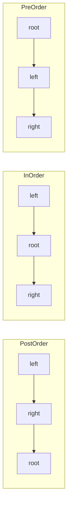
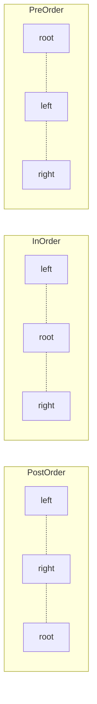

# Tree

Binary Tree, Binary Search tree
二叉树是一种有向无环图


##  经典题目
* [226. 翻转二叉树](https://leetcode-cn.com/problems/invert-binary-tree/)
* [104. 二叉树的最大深度](./104.maximum-depth-of-binary-tree/104.md/)
* [101. 对称二叉树](./110.balanced-binary-tree/)
* [617. 合并二叉树](./617.merge-two-binary-trees/)
* 二叉树比较(相同，对称，镜像)
    * [100. 相同的树](./100.same-tree)
    * [101. 对称二叉树](./101.symmetric-tree)


## API
* `preTraveral(root).forEach(x-> visit(x))`
* `inTraveral(root).forEach(x-> visit(x))`
* `postTraveral(root).forEach(x-> visit(x))`
* `levelTraveral(root).forEach(x-> visit(x))`

## The most important thing for Binary three's problem
Finding out the relationshipt between the parent node and children nodes



If it's a top down recursive, the recursive itself should work.
But if it's bottom up recurisve, sometimes we need a hashmap to store children's information for parent.

## Binary Tree

### representation of a tree


* LinkedList

* Array


### Tree Traveral
树有多种traversal的方法，其中dfs可以实现前序，中序，后序。大部分情况下，你需要首先了解父节点和子节点的依赖关系。


```
/* binary tree travesal */
void traverse(TreeNode root) {
    // preOrder
    traverse(root.left)
    // inOrder
    traverse(root.right)
    // postOrder
}
```
For the recursive solution, the main point is to find out what need to happen to one node.


### Breadth First Search
**level traversal**

```java
void bfs(Node root) {
    Queue queue = new Queue();
    queue.offer(root);

    while(!queue.isEmpty()){
        Node node = (Node)queue.poll();

        if(node.getLeft() != null){
            queue.offer(node.getLeft());
        }

        if(node.getRight() != null){
            queue.offer(node.getRight());
        }
    }
}

```

### Depth First Search	

General signature of DFS solution

`dfs(node)`

`dfs(node, x, y, z) where x, y, z are elements helping achieve dfs result of node`


#### preOrder, inOrder, postOrder
 * [Better post order traversal](x-devonthink-item://1A56BAC0-62CC-4DC6-A20E-A0ACB1E6213E)


```java
    // preOrder is 
    void preOrderDFS(Node root) {
        if(root == null)
            return;

        Stack<Node> stack = new Stack<>();
        stack.push(root);

        while(!stack.isEmpty()){
            Node node = (Node)stack.pop();

            Node left = node.getLeft();
            Node right = node.getRight();

            if(right != null){
                stack.push(right);
            }

            if(left != null){
                stack.push(left);
            }
        }
    }

// usually we denote BST using inOrder traversal
    void inOrderDFS(Node root) {
        if(root == null)
            return;

        Stack<Node> stack = new Stack<>();
        Node p = root;

        while(!stack.isEmpty() || p != null){
            if(p != null){ // if it is not null, push to stack and go down the tree to left
                stack.push(p);
                p = p.left;
            } else { // if no left child pop stack, process the node then let p point to the right
                Node temp = (Node)stack.pop();
                visit(temp);
                p = temp.right;
            }
        }
    }

// post-Order
// post-order is widely use in mathematical expression. It is easier to write a program to parse a post-order expression. Here is an example
// in-order is also ok, but need to fiture out the priority of operation, post-order honor the operator priority already.

    iterativePostorder(node)
        s ← empty stack
        lastNodeVisited ← null
        while (not s.isEmpty() or node ≠ null)
            if (node ≠ null)
            s.push(node)
            node ← node.left
            else
            peekNode ← s.peek()
            // if right child exists and traversing node
            // from left child, then move right
            if (peekNode.right ≠ null and lastNodeVisited ≠ peekNode.right)
                node ← peekNode.right
            else
                visit(peekNode)
                lastNodeVisited ← s.pop()

    void postDFS(Node root) {
        Node node = root;
        Stack<Node> stack = new Stack<>();
        Node lastVisited = null;
        while(!stack.isEmpty() || node != null) {
            if(node != null) {
                stack.push(node);
                node = node.left;
            } else {
                Node peekNode = stack.peek();
            // if right child exists and traversing node
            // from left child, then move right
                if(peekNode.right != null && lastVisited != peekNode.right) {
                    node = peekNode.right;
                } else {
                    visit(peekNode);
                    lastVisited = stack.pop();
                }
            }
        }


    }

```  

## Specia Binary Tree

### 完全二叉树

### 完美二叉树
### 退化的链 


## BST使用场景
