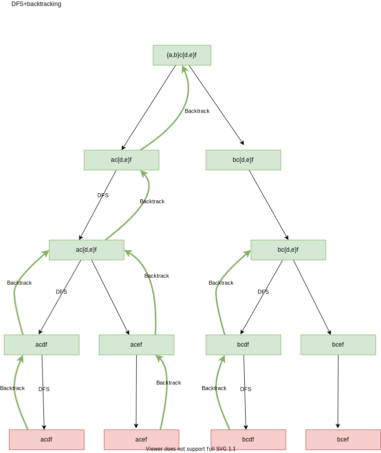

# DFS

    “给定一个图（树，字符串，矩阵），找到在遍历图的过程中，符合特定条件的数值或路径。”

上面的这个定义有点抽象，举两个例子：

Leetcode 113 Path Sum II

    "Given a binary tree and a sum, find all root-to-leaf paths where each path's sum equals the given sum."
    “给定一个有向无环图（二叉树），找到在遍历图的过程中，符合特定条件的数值（路径和等于 sum ）”

Leetcode 200 Number of Islands

    "Given a 2d grid map of '1's (land) and '0's (water), count the number of islands. An island is surrounded by water and is formed by connecting adjacent lands horizontally or vertically. You may assume all four edges of the grid are all surrounded by water."
    “给定一个无向无环图（矩阵），找到在遍历图的过程中，符合特定条件的数值（岛的数量）”

深度优先搜索是一种在回退之前尽可能深入**每个分支**的遍历算法。

深度优先一般配合回溯找所有解，但是dfs也可以没有回溯过程。

## 解题模式
1. 主函数
    主函数一般做两件事情 **第一，处理边界情况，例如图为空，初始节点满足条件的情况， 第二，遍历整个图。**

    有的题目要求返回布尔值，那么找到符合即可返回。**除了这种情况，都要遍历图中所有可达点。**如果不能通过初始节点访问所有节点，**那么主函数就需要对每个节点进行DFS遍历。Leetcode 200 Number of Islands**，遍历完初始节点后，其他节点仍然未知，所以需要继续遍历。

    ```text
    # 左侧为遍历初始节点后递归遍历（验证）过的点，右侧为仍需遍历的点
    110       0 
    110       0 
    110       0 
    000       0
    ```
2. DFS递归函数
    这个函数是一个递归函数，调用辅助函数，DFS只对当前节点的子节点(如果是无向图则临近节点)进行遍历即可，其他功能通过辅助函数实现

3. 辅助函数
    里边包含了is_valid和match两个子函数，分别用于判断子节点是否合法，当前状态是否符合条件。    

## 具体实现
1. 主函数
* 若从初始函数可以访问所有节点(Leetcode 113 Path Sum II)
```python
function main_fun(graph):
    # 边界情况，例如图空，或者初始节点本身就符合条件
    if not graph:
        return []
    # 如果需要返回值则创建变量（如最大值，最小值），如果是返回路径则创建数组:
    res = val // array
    element = first element in the graph
    # 对跟节点进行DFS遍历
    dfs(elemenent, res)
    # 返回结果
    return res

 ```

 * 若初始节点不可访问所有可达节点(Leetcode 200 Number of Islands):

 ```python
 function main_fun(graph):
    # 边界条件，例如图空，或者初始节点本身就符合条件
    if not graph:
        return []
    res = val // array
    # 对图里边的每个元素进行DFS遍历
    for element in the graph:
        dfs(element, res)
    # 返回结构
    return res
 ```

 * 如果题目要求返回布尔值，遍历图可以提前结束

 ```python
function main_func(graph):
    res = val // array
    for element in the graph:
        if dfs(element, res) is True:
            return True
    return False
 ```

2. DFS递归函数


* 写代码前，需要遍历节点的层次关系
    * 有向图，树结构遍历子节点
    * 字符串，根据实际情况，遍历临近字符，或者其他信任字符
    * 无向图，临近节点

更多实现的清参考[DFS实现深入浅出](./dfsImpDiveIn.md)


比如 Leetcode 200 Number of Islands 初始节点遍历流程图
```
                1
              (0, 0)
          /           \
          1            1
        (0,1)        (1,0)
        /  \         /   \
       1    1        1    0
    (0,2) (1,1)     (1,1) (2,0)
```
上图中，防止无向图(1,1)被重复遍历， visited， 或者把当前值设置为无效值(这样递归不会原路返回)，dfs遍历结束再还原。

* 函数实现
* 四个重点
    1. 防止点被重复遍历
    2. 检查节点是否合法
    3. 检查更新后的状态是否符合要求
    4. 更新接下来的DFS遍历参数
* 两种实现方式
    1. 形式1，match放到子节点遍历中，更新速度快，不过主函数需要处理边界情况
    2. 形式2，match放到DFS开头，速度慢，但是容易实现

    ```python
    function dfs_first(element, res, current, target, path):
        # 输入参数中
         
        # element 代表需要遍历的节点
        # res代表保存结果的最终容器
        # current 当前状态
        # target 目标中泰
        # path 遍历路径(可选)
        # 遍历每一个节点
        for each child in element:
        # 1. 大部分问题中，同一节点的遍历中，都不能使用同一节点，无向图中，需要修改图节点值为非法
            graph->val = unvalid value
            #2. 检查子节点是否合法，包括是否已经遍历过，是否越界
            if is_valid(child):
            #3. 检查子节点与元素组成的新状态是否符合条件
                if match(current, child, target):
                    # 更新最终结果
                    res += new_res
                else
                    dfs_first(child, res, current+child.val, target, path_child)
            graph->val = valid value

    function dfs_second(element, res, current, target, path):
        # element 代表需要遍历的节点
        # res 保存结果的最终容器
        # current 当前状态(可选)
        # target 目标状态
        # path 遍历路径(可选)
        # 1. 先验证当前状态是否符合条件
        if match(current, element, target):
            # 更新最终结果
            res += new_res
            return
        for each child in element:
            graph->val = unvalid value
            if is_valid(child):
                dfs_second(child, res, curent+child.val, target, path_child)
            graph->val = valid value

    function is_valid(child):
        # 如果child合法返回真，否则返回假
        # 如果child在矩阵范围内
        if 0 <= child.i < lengh of matrix and 0 <= child.y < length of first row of matrix:
            return True
        return False

    function match(current, child, target):
        # 如果当前 child 与 current的组合满足题目与target要求，返回真
        if current + child.val == target:
            return True
        return False
    ```

## 原题分析
### Leetcode 113 Path Sum II
```python
class Solution:
    def pathSum(self, root, sum):
        # 边界情况
        if not root:
            return []
        # 边界情况2，因为是在遍历中验证是否符合条件（意思就是在dfs开头并不验证），所以要检查初始条件是否符合要求
        if root.val == sum and not root.lefft and not root.right:
            return [[root.val]]
        # 因为初始节点可以访问所有可达节点，所以只需要遍历跟节点
        return self.dfs(root, [], root.val, sum, [root.val])

    def dfs(self, node, res, current, target, path):
        # 1. 遍历每一个子节点
        for n in [node.left, node.right]:
            # 2. 检查子节点是否合法，是否访问过，是否越界
            if self.is_valid(n):
                # 3. 检查子节点与元素组成的新状态是否符合条件
                if self.match(current, n, target):
                    # 4. 更新最终结果
                    res.append(path+[n.val])
                else 
                    # 5. 遍历所有合法子节点，更新状态
                    self.dfs(n, res, current+n.val, target, path+[n.val])
        return res
    
    def is_valid(self, node):
        # 只要存在即为真
        if node:
            return True
        return False

    def match(self, current, child, target):
        # 题目要求child必须是叶子节点，并且与之前值的和等于target
        if not child.left and not child.right and current + child.val == target:
            return True
        return False
```

### Leetcode 200 Number of Islands

第二题也类似，形式1和形式2

## 回溯
解决一个回溯问题，实际上就是一个决策树的遍历过程

1. 路径：也就是已经做出的选择。

2. 选择列表：也就是你当前可以做的选择。

3. 结束条件：也就是到达决策树底层，无法再做选择的条件

```
result = []
def backtrack(路径, 选择列表):
    if 满足结束条件:
        result.add(路径)
        return

    for 选择 in 选择列表:
        做选择
        backtrack(路径, 选择列表)
        撤销选择

// backtrack就是图的traversal

void traverse(TreeNode root) {
    for (TreeNode child : root.childern)
        // 前序遍历需要的操作
        traverse(child);
        // 后序遍历需要的操作
}
```
        
backtrack里做选择，撤销选择的部分，
* 如果是sum，可以用`backtrack(路径, 选择列表, sum+1)`，就完成了做选择和撤销选择的操作
* 如果是字符串，可以用`backtrack(路径, 选择列表, str+"i")`，但是这种用法不同创建新字符串，效率很差
    * `sb.append(char)`
    * `backtrack(路径, 选择列表, sb)`
    * `sb.deleteCharAt(sb.length()-1)`


## 题目
* 695.岛屿的最大面积
* 394.字符串解码
* 495.目标和
* 547.省份数量
* 1087.Brace Expansion


## 例题解答
for example, 1087. 花括号展开
 {a,b}c{d,e}f to ["acdf","acef","bcdf","bcef"]



