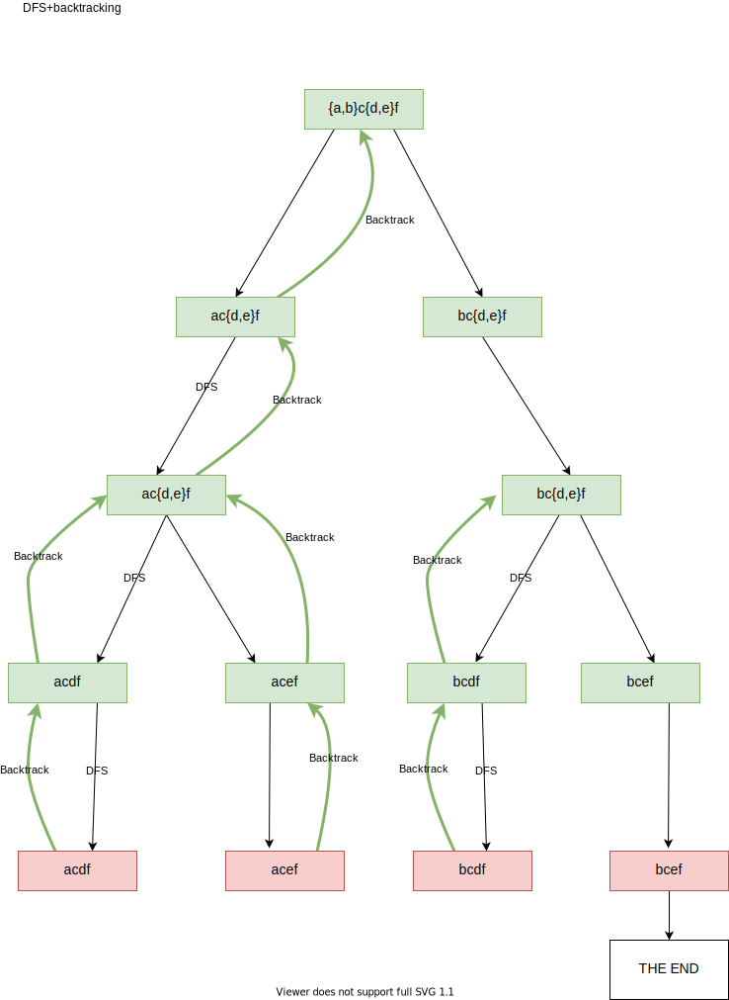

# DFS
* 695. 岛屿的最大面积
* 394. 字符串解码
* 495. 目标和
* 547. 省份数量
* 1087. Brace Expansion


深度优先搜索是一种在回退之前尽可能深入**每个分支**的遍历算法。深度优先+回溯

我们对选择列表进行遍历，当找到一个可能解的开始，我们对这个“开始”进行深度优先的决策树遍历+回溯

```
function DFSProblem:
    定义路径，定义选择状态
    定义result
    for 可能解 in 选择列表
        backtrack(选择列表，路径(可能解+选择状态), result)
    end
    return result
```

解决一个回溯问题，实际上就是一个决策树的遍历过程

1. 路径：也就是已经做出的选择。

2. 选择列表：也就是你当前可以做的选择。

3. 结束条件：也就是到达决策树底层，无法再做选择的条件

```
result = []
def backtrack(路径, 选择列表):
    if 满足结束条件:
        result.add(路径)
        return

    for 选择 in 选择列表:
        做选择
        backtrack(路径, 选择列表)
        撤销选择

// backtrack就是图的traversal

void traverse(TreeNode root) {
    for (TreeNode child : root.childern)
        // 前序遍历需要的操作
        traverse(child);
        // 后序遍历需要的操作
}
```

        
backtrack里做选择，撤销选择的部分，
* 如果是sum，可以用`backtrack(路径, 选择列表, sum+1)`，就完成了做选择和撤销选择的操作
* 如果是字符串，可以用`backtrack(路径, 选择列表, str+"i")`，但是这种用法不同创建新字符串，效率很差
    * `sb.append(char)`
    * `backtrack(路径, 选择列表, sb)`
    * `sb.deleteCharAt(sb.length()-1)`


for example, 1087. 花括号展开
 {a,b}c{d,e}f to ["acdf","acef","bcdf","bcef"]

 

