# DFS实现方式的深入浅出

DFS大家都不陌生，只要刷过一些题目，读过一些题解都会有看到一些模板，自己也会形成一套方法。

[A general approach to backtracking questions in Java (Subsets, Permutations, Combination Sum, Palindrome Partitioning)](https://leetcode.com/problems/combination-sum/discuss/16502/a-general-approach-to-backtracking-questions-in-java-subsets-permutations-combination-sum-palindrome-partitioning/)

[Java DFS 7ms - General Matrix Traversing DFS Template](https://leetcode.com/problems/longest-increasing-path-in-a-matrix/discuss/1089547/java-DFS-7ms-general-matrix-traversing-DFS-template)


但是在做新题的时候，或者做过的题过一段时间重新做一遍，还是会有疑惑。一些题目前后两次的写法可能都完全不同。

更有的题目，DFS写出来了 ，对不对，不是特别清楚；如果不对，也不知道哪里错了，dfs的题目mental debugging非常的困难，println debugging也非常的困难。

我们先看一下实现方式的疑惑，当这些疑惑都得到解答，我们得到一个清晰的实现方式，答案的正确性可能就容易保证。

从实现的角度来看，最多遇到的主要问题有三个：
* 主函数到底调用一次DFS还是要调用多次?
    * 我上边列出的两个例子里，有单个DFS call，有loop DFS call
* 什么地方check valid
    * 有的答案，主函数里check，
    * 有的答案在DFS check
    * 有的答案在遍历子问题check
* 什么地方 检查答案match并更改答案(集)
    * 同样，有的答案在DFS开始时检查并加入答案集
    * 有的答案在变例子问题时检查加入答案集

有没有一个方法论能够让我们清晰的回答上边的三个问题，从而写出一个清楚，正确的DFS答案。

请一定要阅读这篇文章[DFS 解题模式（难度中等）](https://zhuanlan.zhihu.com/p/72527178)。

下边试着带着问题找答案的角度来分享读完这篇文章的理解。

## 第一个问题，主函数调用一次DFS还是多次DFS

* 如果初始节点可以访问所有可达节点，调一次DFS

    ```python
    function main_fun_once(graph):
    # 边界情况，例如如果图是空的，或者初始节点本身就符合条件         
        if not graph:             
            return []         
        # 如果需要返回数值则创建变量（例如最大值，最小值），返回路径则创建数组：         
        res = val // array         
        element = first element in the graph         
        # 对根节点进行 DFS 遍历         
        dfs(element, res)         
        # 返回结果         
        return res
    ```

* 若从初始节点不能访问所有可达节点，多次调用 

    ```python
    function main_function(graph):         
        # 边界条件，例如如果图是空的，或者初始节点本身就符合条件         
        if not graph:             
            return []         
        res = val // array         
        # 对图里面每个元素进行 DFS 遍历         
        for element in the matrix:             
            dfs(element, res)         
        # 返回结果         
        return res
    ```

## 第二个问题: 什么地方检查isValid
只有两个地方需要 检查isValid
* main func里做边界条件处理，!isValid就直接返回
* 处理child 时，检查，那么进入到dfs的数据总是valid

## 第三个问题，什么时候检查答案加入/更新答案(集)
是在dfs的函数开头，还是在遍历child时，会有一些不同，导致实现有所差异




解答了以上的问题，熟练掌握了DFS这两种实现方式的mental model，保证每次写出的代码几乎都是一样的。顺便也解决了另一个每次写代码都 大不相同的问题。


## 例题示例

下边让我们用两种写法解一个例题

```
剑指 Offer 26. 树的子结构
输入两棵二叉树A和B，判断B是不是A的子结构。(约定空树不是任意一个树的子结构)

B是A的子结构， 即 A中有出现和B相同的结构和节点值。

例如:
给定的树 A:

     3
    / \
   4   5
  / \
 1   2
给定的树 B：

   4 
  /
 1
返回 true，因为 B 与 A 的一个子树拥有相同的结构和节点值。

示例 1：

输入：A = [1,2,3], B = [3,1]
输出：false
示例 2：

输入：A = [3,4,5,1,2], B = [4,1]
输出：true
```

### 实现方式一

```java
class Solution {
    public boolean isSubStructure(TreeNode A, TreeNode B) {
        return isSubStructureMethod1(A, B);
    }
    // 主函数，方式一
    // match放到子节点遍历中，更新速度快，不过主函数需要处理边界情况
    boolean isSubStructureMethod1(TreeNode A, TreeNode B) {
        if(B == null || A == null) return false;
        // 因为match放到子节点遍历中，主函数需要单独处理match A,B
        if(match(A, B)) return true;
        return dfs(A,  B);
    }
    boolean dfs(TreeNode A, TreeNode B) {
        if(match(A.left, B) || match(A.right, B)) return true;
        if(isValid(A.left)) {
            if(dfs(A.left, B)) return true;
        }
        if(isValid(A.right)) {
            if(dfs(A.right, B)) return true;
        }
        return false;
    }
    boolean isValid(TreeNode node) {
        return node != null;
    }
    boolean match(TreeNode A, TreeNode B) {
        if(B == null) return true;
        if(A == null || A.val != B.val) return false;
        return match(A.left, B.left) && match(A.right, B.right);
    }
}
```

### 实现方式二
```java
class Solution {
    public boolean isSubStructure(TreeNode A, TreeNode B) {
        return isSubStructureMethod2(A, B);
    }
    // 主函数，方式二
    // match放到DFS开头，速度慢，但是容易实现
    boolean isSubStructureMethod2(TreeNode A, TreeNode B) {
        if(B == null || A == null) return false;
        return dfs2(A, B);
    }
    boolean dfs2(TreeNode A, TreeNode B) {
        if(match(A,B)) {
            return true;
        }
        if(isValid(A.left)) {
            if(dfs2(A.left, B)) return true;
        }
        if(isValid(A.right)) {
            if(dfs2(A.right, B)) return true;
        }
        return false;
    }

    boolean isValid(TreeNode node) {
        return node != null;
    }
    boolean match(TreeNode A, TreeNode B) {
        if(B == null) return true;
        if(A == null || A.val != B.val) return false;
        return match(A.left, B.left) && match(A.right, B.right);
    }

}
```

## 例题示例2
需要主函数多次调用dfs

```
给定一个包含了一些 0 和 1 的非空二维数组 grid 。

一个 岛屿 是由一些相邻的 1 (代表土地) 构成的组合，这里的「相邻」要求两个 1 必须在水平或者竖直方向上相邻。你可以假设 grid 的四个边缘都被 0（代表水）包围着。

找到给定的二维数组中最大的岛屿面积。(如果没有岛屿，则返回面积为 0 。)

 

示例 1:

[[0,0,1,0,0,0,0,1,0,0,0,0,0],
 [0,0,0,0,0,0,0,1,1,1,0,0,0],
 [0,1,1,0,1,0,0,0,0,0,0,0,0],
 [0,1,0,0,1,1,0,0,1,0,1,0,0],
 [0,1,0,0,1,1,0,0,1,1,1,0,0],
 [0,0,0,0,0,0,0,0,0,0,1,0,0],
 [0,0,0,0,0,0,0,1,1,1,0,0,0],
 [0,0,0,0,0,0,0,1,1,0,0,0,0]]
对于上面这个给定矩阵应返回 6。注意答案不应该是 11 ，因为岛屿只能包含水平或垂直的四个方向的 1 。

```

### 实现方式二
```java
class Solution {
    public int maxAreaOfIsland(int[][] grid) {
        int m = grid.length;
        int n = grid[0].length;

        int max = 0;
        int[] ans = new int[1];
        // 初始节点不能够访问所有可达节点，所以遍历所有节点
        for(int i=0; i<m; i++) {
            for(int j=0; j<n; j++) {
                // 因为我们在child里检查match，所以main函数需要对基础case检查
                if(match(grid, i, j)) {
                    ans[0] = 1;
                    grid[i][j] = 2;
                    dfs(grid, i, j, ans);
                    max = Math.max(max, ans[0]);
                }
            }
        }
        for(int i=0; i<m; i++) {
            for(int j=0; j<n; j++) {
                if(grid[i][j] == 2) {
                    grid[i][j] = 1;
                }
            }
        }
        return max;
    }
    int[][] dirs = {{1,0}, {0,1}, {-1,0}, {0,-1}};

    void dfs(int[][] grid,int row, int col, int[] ans) {
        int m = grid.length;
        int n = grid[0].length;

        for(int i = 0; i < 4; i++) {
            int newi = row+dirs[i][0];
            int newj = col+dirs[i][1];
            grid[row][col] = 2;
            // 只对child 检查valid
            if(isValid(grid, newi, newj)) {
                // 检查match
                if(match(grid, newi, newj)) {
                    ans[0]++;
                    dfs(grid, newi, newj, ans);
                }
            }
        }
    }
    boolean isValid(int[][]grid, int row, int col) {
        int m = grid.length;
        int n = grid[0].length;
        return  row >= 0 && row < m && col >= 0 && col < n;
    }
    boolean match(int[][]grid, int row, int col) {
        return grid[row][col] == 1;
    }

}
```