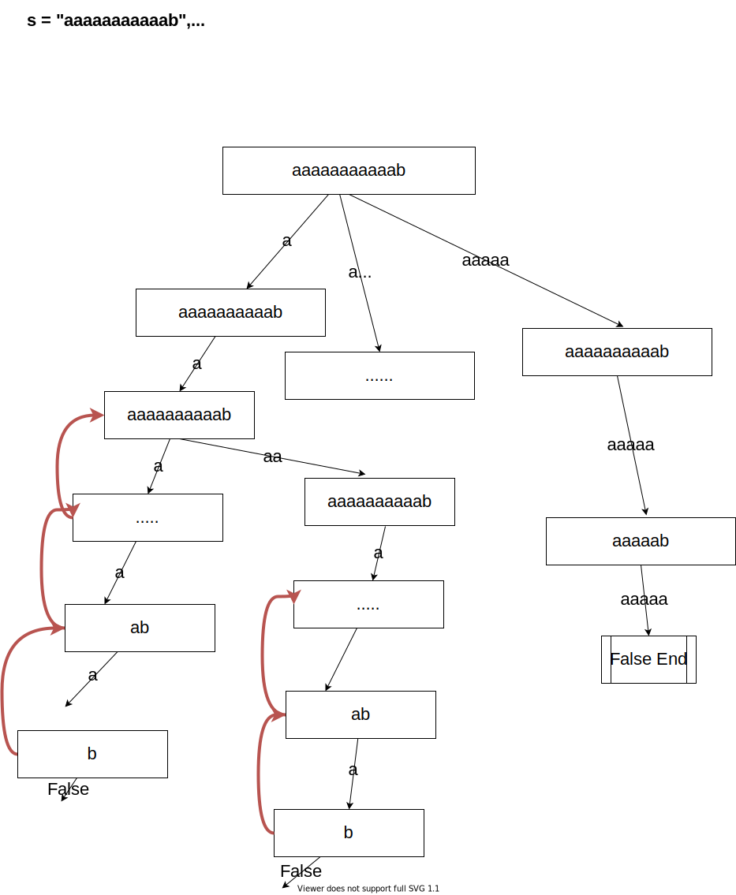

# DFS和记忆化
对树和图来说，DFS的搜索就是搜索所有的节点，是确定数目的子问题，finite DFS。图、树类的算法，需要遍历所有节点。

但是对有的题目，在题目中DFS的搜索空间是不确定，需要动态推演，Infinite DFS。这类题目的代表就是数组，字符串。

例题
```
s = "aaaaaaaaaaab", wordDict = ["a","aa","aaa", "aaaa", "aaaaa"]
符串串s是否可以由字典的字符串组成。
```




从图示可以看出，这种题目的DFS子问题个数根据test case有所不同。

此类问题，数组/字符串的DFS其实就是Top Down的DFS，父问题依赖子问题(父字符串的答案依赖子字符串的答案，整个数组的答案依赖部分数组的答案)。

此类的题目(很有)可能有大量的重复计算，因为重复子数组/重复子字符串是dfs经常出现的测试用例。

所以，在面对这样的问题，我们普遍可以使用记忆化来剪枝，也就是我们用一个数据结构(通常array)来记住子问题已经得到的解答。我们仍然会遍历所有的子问题，但是如果已经算出来的子问题，我们可以直接返回答案。


