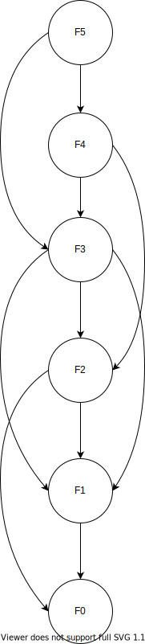

# 动态规划
## 核心问题

动态规划一般形式求最值，核心问题是**穷举**,动态规划的穷举特点
* 子问题重叠， 所以可以备忘录，避免不必要计算
* 最优子结构，所以可以合并子问题得到原问题


## 两大必要条件
- 最优子结构，可以用递归表示
	+ Optimal substructure means that the solution to a given optimization problem can be obtained by the combination of optimal solutions to its sub-problems.
	+ 答案可以通过合并子问题答案求得
- 子问题重叠
	+ 子问题不重叠就可以用分治

## Applying synamic programming
* Characterize the structure of an optimal solution.
* Recursively define the value of an optimal solution.
* Compute the value of an optimal solution.
* Construct an optimal solution from computed information.

### Step 1 Characterize the structure of an optimal solution
以matrix-chain multiplication problem为例
Ai...Aj, 我们可以把他们从k分为两段[Ai,Ai+1...Ak]和[Ak, Ak+1, ..., Aj]，这种情况是最优解。
那么[Ai,Ai+1...Ak]和[Ak, Ak+1, ..., Aj]必须也是最优解

### Step 2: A recursive solution
## 什么情况考虑动态规划
- 求最大值最小值
- 判断是否可行
- 统计方案个数

## 什么情况下不考虑动态规划
- 求出所有具体的方案而非方案个数
- 输入数据是一个集合而不是 序列
- 暴力算法的复杂度已经是多项式级别  
	+ 动态规划擅长优化指数级别复杂度（2^n, n!）到多项式级别复杂度（n^2, n^3）  
	+ 不擅长优化n^3到n^2  

## 动态规划的两种常见问题
tabulation or memoization 
## 动态规划的四要素
- 状态 State
	+ 存储小规模问题的结果
- 方程 Function
	+ 状态之间的联系,怎么通过小的状态,来算大的状态
- 初始化 Initialization
	- 最极限的小状态是什么, 起点。
	- 初始化一个二维的动态规划时 就去初始化第0行和第0列。
	- 如果不是跟坐标相关的动态规划 一般有N个数/字符,就开N+1个位置的数组 第0个位置单独留出来作初始化。
- 答案 Answer
	+ 最大的那个状态是什么,终点。

## 思考过程
明确【状态】 -> 定义dp 数组/函数的定义 -> 明确【选择】 -> 明确 base case


## Subproblems graphs

When we think about a dynamic programming problems, we should understand the set of subproblems involved and how subproblems depend on one another.

It is a directed graph, containing one vertex for each distinct sub problem.



## Bottom-up and top-down


* Top-down(with memoization)
```java
MEMOIZED-CUT_ROD(p,n)
	let r[0..n] be a new array
	fori = 0 to n
		r[i] = Integer.MIN_VALUE
	return MEMOIZED-CUT-ROD-AUX(p,n,r)

MEMOIZED-CUT-ROD-AUX(p,n,r)
	if r[n]>=0
		return r[n]
	if n== 0
		q = 0
	else q == Integer.MIN_VALUE
		for i = 1 to n
			q = max(q, p[i] + MEMOIZED-CUT_ROD(p, n-i, r))
	r[n] = q;
	return q;
```

Depth-first search of the subproblem graph


* Bottom-up
```java
BOTTOM-UP-CUT-ROD(p, n)
	let r[0..n] be a new array
	r[0] = 0
	for j = 1 to n
		q = Integer.MIN_VALUE
		for i = 1 to j
			q = max(q, p[i] + r[j-i])
		r[j] = q
	return r[n]		
```
buttom-up method considers the vertices of the subproblem graph in such an order that we solve the subproblems y adjacent to a given subproblem x before we solve subproblem x.

We consider the vertices of the subproblem graph in an order that is a "reverse topological sort" or a "topological sort of the transpose" of the subproblem grph.

* Complexity

Typically, the time to compute the solution to a subproblem is proportional to the degree(number of outgoing edges) of the corresponding vertex in the subproblem graph, and the number of the subproblems is equal to the number of vertices in the subproblem graph. Subproblem gragh G = (V, E). The running time of dynamic programming is linear in the number of vertices and edges. 

