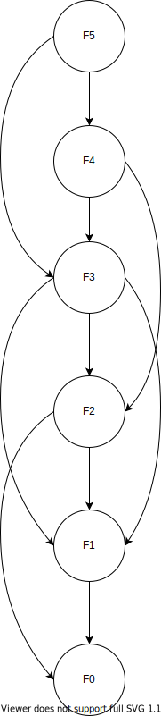

# 动态规划
## 核心问题

动态规划一般形式求最值，核心问题是**穷举**,动态规划的穷举特点
* 子问题重叠， 所以可以备忘录，避免不必要计算
* 最优子结构，所以可以合并子问题得到原问题


## 两大必要条件
- 最优子结构，可以用递归表示
	+ Optimal substructure means that the solution to a given optimization problem can be obtained by the combination of optimal solutions to its sub-problems.
	+ 答案可以通过合并子问题答案求得
- 子问题重叠
	+ 子问题不重叠就可以用分治
	+ overlapping sub

## 什么情况考虑动态规划
- 求最大值最小值
- 判断是否可行
- 统计方案个数

## 什么情况下不考虑动态规划
- 求出所有具体的方案而非方案个数
- 输入数据是一个集合而不是 序列
- 暴力算法的复杂度已经是多项式级别  
	+ 动态规划擅长优化指数级别复杂度（2^n, n!）到多项式级别复杂度（n^2, n^3）  
	+ 不擅长优化n^3到n^2  

## 动态规划的两种常见问题
tabulation or memoization 
## 动态规划的四要素
- 状态 State
	+ 存储小规模问题的结果
- 方程 Function
	+ 状态之间的联系,怎么通过小的状态,来算大的状态
- 初始化 Initialization
	- 最极限的小状态是什么, 起点。
	- 初始化一个二维的动态规划时 就去初始化第0行和第0列。
	- 如果不是跟坐标相关的动态规划 一般有N个数/字符,就开N+1个位置的数组 第0个位置单独留出来作初始化。
- 答案 Answer
	+ 最大的那个状态是什么
	* 是终点，返回终点的，还是中间的某个值(这时就需要一个变量维护这个答案)

## 思考过程
明确【状态】 -> 定义dp 数组/函数的定义 -> 明确【选择】 -> 明确 base case


## Subproblems graphs

When we think about a dynamic programming problems, we should understand the set of subproblems involved and how subproblems depend on one another.

It is a directed graph, containing one vertex for each distinct sub problem.



## Bottom-up and top-down


* Top-down(with memoization)
```java
MEMOIZED-CUT_ROD(p,n)
	let r[0..n] be a new array
	fori = 0 to n
		r[i] = Integer.MIN_VALUE
	return MEMOIZED-CUT-ROD-AUX(p,n,r)

MEMOIZED-CUT-ROD-AUX(p,n,r)
	if r[n]>=0
		return r[n]
	if n== 0
		q = 0
	else q == Integer.MIN_VALUE
		for i = 1 to n
			q = max(q, p[i] + MEMOIZED-CUT_ROD(p, n-i, r))
	r[n] = q;
	return q;
```

Depth-first search of the subproblem graph


* Bottom-up
```java
BOTTOM-UP-CUT-ROD(p, n)
	let r[0..n] be a new array
	r[0] = 0
	for j = 1 to n
		q = Integer.MIN_VALUE
		for i = 1 to j
			q = max(q, p[i] + r[j-i])
		r[j] = q
	return r[n]		
```
buttom-up method considers the vertices of the subproblem graph in such an order that we solve the subproblems y adjacent to a given subproblem x before we solve subproblem x.

We consider the vertices of the subproblem graph in an order that is a "reverse topological sort" or a "topological sort of the transpose" of the subproblem grph.

* Complexity

Typically, the time to compute the solution to a subproblem is proportional to the degree(number of outgoing edges) of the corresponding vertex in the subproblem graph, and the number of the subproblems is equal to the number of vertices in the subproblem graph. Subproblem gragh G = (V, E). The running time of dynamic programming is linear in the number of vertices and edges. 

## How to define a state
State是当前状况的一个snapshot
* ✅ Good states: holding/not holding stock, amount of money we have, position in array
* ❌ Bad states: actions like buy/sell (these are transitions)

State 应该是完备的，最小。

### Best Candidates for States:
#### Position-based:
* Index in array/string
* Current position in grid
* Current day
#### Resource-based:
* Amount of money/items
* Remaining capacity
* Number of transactions left
#### Status-based:
* Whether holding something
* Whether used something
* Current state of system
#### Combination of above:
## Checklist for Good State Definition:
* Can make next decision using only current state?
* Captures all necessary information?
* No redundant information?
* Can clearly define transitions between states?

Remember: States describe "where we are", transitions describe "how we move". This separation is key to clean DP solutions.

# 动态规划中二维转一维的通用优化技巧

动态规划问题中，从二维数组优化到一维数组是一种常见的空间优化技巧。这种优化适用于许多类型的动态规划问题，可以显著降低空间复杂度。

## 二维到一维的转换原理

在许多动态规划问题中，状态转移方程通常具有以下形式：

```
dp[i][j] = f(dp[i-1][j], dp[i][j-1], dp[i-1][j-1], ...)
```

也就是说，当前状态只依赖于：
1. 上一行的状态（dp[i-1][j]）
2. 当前行左侧的状态（dp[i][j-1]）
3. 有时还包括对角线的状态（dp[i-1][j-1]）

在这种情况下，我们可以使用一维数组来代替二维数组，因为：

1. 我们只需要保存"上一行"的状态
2. 当我们按行从左到右计算时，可以重用同一个数组

## 一维优化的通用步骤

1. **确定依赖关系**：分析状态转移方程，确定当前状态依赖哪些之前的状态

2. **选择合适的遍历顺序**：
   - 如果依赖上一行和左侧，通常从左到右、从上到下遍历
   - 如果依赖下一行和右侧，可能需要从右到左、从下到上遍历

3. **初始化一维数组**：根据原问题的初始条件设置

4. **更新策略**：
   - 在每一行的计算开始前，数组中保存的是上一行的结果
   - 计算当前行时，逐步更新数组，使其反映当前行的结果

## 常见的优化模式

### 模式一：依赖上一行和左侧
```java
// 二维DP
for (int i = 1; i <= m; i++) {
    for (int j = 1; j <= n; j++) {
        dp[i][j] = f(dp[i-1][j], dp[i][j-1]);
    }
}

// 一维DP
for (int i = 1; i <= m; i++) {
    for (int j = 1; j <= n; j++) {
        dp[j] = f(dp[j], dp[j-1]);  // dp[j]此时保存的是上一行的值
    }
}
```

### 模式二：依赖上一行和右侧
```java
// 二维DP
for (int i = 1; i <= m; i++) {
    for (int j = n; j >= 1; j--) {
        dp[i][j] = f(dp[i-1][j], dp[i][j+1]);
    }
}

// 一维DP
for (int i = 1; i <= m; i++) {
    for (int j = n; j >= 1; j--) {
        dp[j] = f(dp[j], dp[j+1]);  // dp[j]此时保存的是上一行的值
    }
}
```

### 模式三：依赖对角线和上一行
```java
// 二维DP
for (int i = 1; i <= m; i++) {
    for (int j = 1; j <= n; j++) {
        dp[i][j] = f(dp[i-1][j-1], dp[i-1][j]);
    }
}

// 一维DP
for (int i = 1; i <= m; i++) {
    int prev = dp[0];  // 保存对角线元素
    for (int j = 1; j <= n; j++) {
        int temp = dp[j];  // 暂存当前值用于下一个元素的对角线值
        dp[j] = f(prev, dp[j]);  // dp[j]保存的是上一行的值
        prev = temp;
    }
}
```

## 索引处理的差异

在二维转一维的过程中，索引处理通常有两种方式：

1. **0-indexed方式**：
   - 数组大小与问题规模相同
   - 直接使用原始索引
   - 返回dp[n-1]或类似位置

2. **1-indexed方式**：
   - 数组大小比问题规模大1
   - 需要进行索引转换
   - 返回dp[n]或类似位置

选择哪种方式主要取决于问题的边界条件和初始化需求。

## 适用场景

二维转一维的优化特别适用于以下场景：

1. **路径问题**：如网格中的路径计数、最短路径等
2. **序列问题**：如最长公共子序列、编辑距离等
3. **背包问题**：如0-1背包、完全背包等
4. **区间问题**：某些区间DP问题也可以优化

## 注意事项

1. **遍历顺序**：根据依赖关系确定正确的遍历顺序，避免覆盖需要的值
2. **临时变量**：有时需要使用临时变量保存某些状态，避免被覆盖
3. **初始化**：一维数组的初始化需要特别注意，确保与二维情况等价
4. **边界条件**：处理边界条件时需要格外小心，确保逻辑一致性

通过这种优化，我们可以将空间复杂度从O(m*n)降低到O(n)或O(m)（取决于选择保留哪个维度），同时保持时间复杂度不变。

# 动态规划状态转移模式：Push DP vs Pull DP

在编写状态转移方程时，有两种截然不同的视角，它们在大多数情况结果等价，但在某些特定问题（如允许提早结束的布尔型验证）中，性能差距可能极大（例如题解 LeetCode 139: Word Break）。

## 1. Push DP (向前推 / 发散型)
站在**当前已经算好的有效状态**，去扫描更新**未来**可能遇见的未知状态。

**思维视角**：“我已经确定到达了状态 `i`，看看从 `i` 出发能到达未来的哪些 `j`，并把它们点亮。”
**代码示例 (伪代码)**:
```java
// 从已经合法的最近状态，去推算未来
for (int i = 0; i < n; i++) {
    if (!dp[i]) continue; // 当前点 i 都不通，无法作为出发的垫脚石
    
    // 考察所有从 i 能到达的未来状态 j
    for (int j = i + 1; j <= n; j++) {
        if (canReach(i, j)) {
            dp[j] = true;
        }
    }
}
```
**痛点分析**：极其容易做**冗余运算**。如果 `dp[15]` 早就被前面的某条路径设为 `true` 了，那么当外层循环推进到新的 `i`（且它也能到达 `15`）时，内层循环仍然会继续执行重量级的验证（如 `canReach` 需要截取字符串、查哈希表等），毫无意义地再给 `dp[15]` 赋一遍值。这种模式很难用 `break` 对未来状态进行干净的提前终止操作。

## 2. Pull DP (向后拉 / 汇聚型)
通常意义上最标准的 DP 模型。站在**需要求解的目标状态**，回头去遍历**历史**已经算好的状态。

**思维视角**：“我现在要结算目标状态 `i`，我回头去遍历所有相关的历史状态 `j`，看看有没有合法的 `j` 能凑成现在的我？”
**代码示例 (伪代码)**:
```java
// 站在当前需要结算的目标 i，回溯所有的历史状态 j
for (int i = 1; i <= n; i++) {
    for (int j = 0; j < i; j++) {
        // 如果历史某点通达，并且能连上当前点
        if (dp[j] && canReach(j, i)) {
            dp[i] = true;
            break; // 【核心碾压优势】：验证通过，立刻打断内层循环！
        }
    }
}
```
**核心优势**：
1. **及时止损 (早期剪枝)**：这是绝杀优势。一旦找到**这辈子第一种**能把 `i` 拼凑好的方法，`dp[i]` 的值就锁定为真了。这时通过 `break` 立刻中断探索，规避了大量在已知结果上的白费力气。
2. **公式自然**：更容易无缝贴合常见的数学公式（比如斐波那契 `dp[n] = dp[n-1] + dp[n-2]` 天然就是 Pull 思维）。

### 总结意见
在面对诸如 **字符串划分验证**、**跳跃游戏验证** 之类、只需“找出一条可行路径”作为真值标准的问题中，**请毫无悬念地使用 Pull DP 架构**。只有在极少数场景（如松弛算法或是通过当前点更新后续所有的概率分布等）才需要特地换成 Push DP。