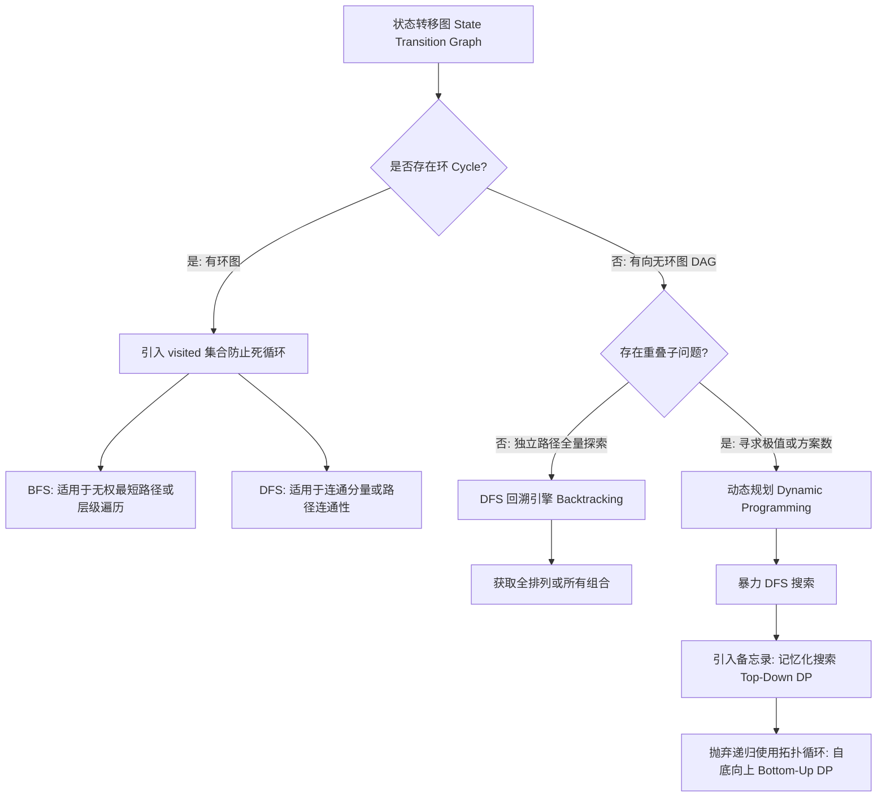

# 算法理论总纲：状态转移图 (State Transition Graph Theory)

在计算机科学的算法设计中，动态规划（Dynamic Programming）、图论遍历（Graph Traversal）以及深度优先/广度优先搜索（DFS/BFS）的底层逻辑是高度统一的。其核心抽象即为**状态转移图（State Transition Graph）**。

## 1. 核心概念与物理模型
将问题域中的“当前局面”定义为**节点（State/Node）**，将“可执行的选择或操作”定义为**有向边（Transition/Edge）**。所有的算法问题均可映射为图的拓扑结构。

根据该图的拓扑特性，算法设计的核心分水岭如下：

### 分水岭一：图的拓扑性质（环的存在性）
算法的第一步是判断状态转移图中是否存在**环（Cycle）**，即状态传递是否具有“无后效性（No Aftereffect）”。

* **有环图（Cyclic Graph）**：
  * **特征**：状态转移具有可逆性或多向性（例如四向移动的迷宫、社交网络）。
  * **算法约束**：必须引入 `visited` 集合来记录已访问状态，以阻断死循环。
  * **核心算法**：利用 BFS（广度优先搜索）解决最短路径或层级遍历问题；利用 DFS（深度优先搜索）解决连通性或路径试探问题。
  * **相关文档**：[graph.01. 图论与遍历框架](./graph.01.GraphAndTraversal.md)

* **有向无环图（Directed Acyclic Graph, DAG）**：
  * **特征**：状态转移严格单向，具有单向的时间流动效应（如数组下标的单调递增、矩阵的单向移动）。
  * **算法约束**：无需全局 `visited` 集合防范死循环（部分组合问题可能需要回溯路径上的局部去重）。
  * **后续分类**：进入分水岭二。

### 分水岭二：DAG 中的业务目标与重叠子问题
在确定拓扑结构为 DAG 后，算法设计取决于具体的业务需求以及状态的重叠程度。

* **路径全量探索（回溯法 Backtracking）**：
  * **特征**：要求枚举所有可行的独立路径（如全排列、组合总和）。
  * **核心算法**：DFS 回溯引擎。利用系统栈深入树的底部，收集结果后显式撤销状态（Backtrack）。
  * **相关文档**：[graph.02. DFS 引擎与回溯法](./graph.02.DFSEngineAndBacktracking.md)

* **最优化与重叠子问题（动态规划 Dynamic Programming）**：
  * **特征**：要求计算极值或总方案数，且多条不同的决策路径会汇聚于同一中间状态（Overlapping Subproblems）。
  * **算法演化路径**：
    1. **暴力搜索**：纯 DFS，时间复杂度呈指数级。
    2. **记忆化搜索（Top-Down DP）**：引入备忘录（Memoization）缓存已计算状态，将时间复杂度降至多项式级别。
    3. **自底向上递推（Bottom-Up DP）**：彻底摒弃递归，依据图的拓扑排序规则，利用循环语句直接进行状态转移。
  * **相关文档**：[graph.03. 动态规划的演化与降维](./graph.03.DynamicProgrammingEvolution.md)

---

## 结论与知识架构
这套理论将散落的算法知识点结构化：
1. **graph.01.GraphAndTraversal** 探讨底层图论基础与带环图的处理。
2. **graph.02.DFSEngineAndBacktracking** 剖析图的遍历引擎，并解决无重叠子问题的路径穷举。
3. **graph.03.DynamicProgrammingEvolution** 展示在重叠子问题场景下，如何将 DFS 引擎通过空间换时间（记忆化）最终转化为严谨的状态转移方程。
