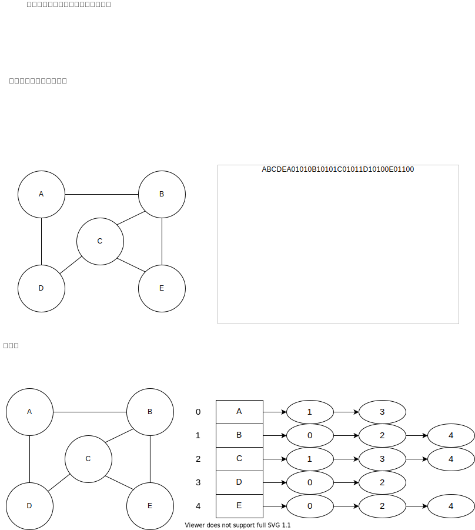

# 01. 图论与遍历框架 (Graph & Traversal)

在状态转移图中，如果状态的转移具有**可逆性**或**多向性**（即存在环），则进入了经典的图论范畴。

## 1. 核心理论：应对有环图的生死防线
在处理迷宫、社交网络、或者无向图时，最大的危险是**无限递归（死循环）**。
* **唯一解法**：必须引入 `visited` 集合（数组或哈希表）来记录已经评估过的状态。
* **物理意义**：将不可见的时间回溯强制切断，强行把带环图“撑开”成一棵没有环的搜索树。

## 2. 图的表示法
图在代码中通常表现为以下两种形式：
1. **邻接矩阵 (Adjacency Matrix)**：使用二维数组 `int[][] matrix` 表示连通性。适合稠密图。
2. **邻接表 (Adjacency List)**：使用 `Map<Integer, List<Integer>>` 或 `List<Integer>[]`。适合稀疏图。



## 3. 图的遍历模型
处理有环图时，我们只有两种遍历武器：

### BFS (广度优先搜索)：冲击波模型
* **物理特征**：像石头扔进水里产生的波纹，一层层向外均匀扩散。
* **核心结构**：依赖 `Queue`，严格按距离远近遍历。
* **应用场景**：所有要求“最短路径”、“最少步数”的无权图问题。因为一旦波纹触碰到终点，即是数学上的最短距离。

### DFS (深度优先搜索)：闪电模型
* **物理特征**：像闪电寻找地面，沿着一条分叉疯狂向下劈，撞到绝缘体（`visited` 或死胡同）才回头。
* **核心结构**：依赖函数调用栈（递归）。
* **应用场景**：探测连通分量、寻找是否存在一条路径、图的染色问题。

## 4. DFS 遍历的易错模式 (以连通分量为例)

在对图进行 DFS 染色/连通分量计数时，有一种极易犯错的代码结构：试图在递归函数内部既处理当前节点的选择，又处理连通分量的累加。

### 错误范例剖析 (以 LeetCode 547 朋友圈为例)
如果你试图在一个单一的 DFS 函数中完成所有工作，会导致逻辑混乱：

```java
// 错误写法：试图在深层递归中统计所有的连通分量，导致孤立节点丢失或重复计算
void dfs(int[][] isConnected, boolean[] visited, int idx, int[] cnt) {
    if(idx == n || visited[idx]) return;
    visited[idx] = true;
    for(int i = 0; i < n; i++) {
        if(i != idx && !visited[i] && isConnected[idx][i] == 1) {
            visited[i] = true;
            dfs(isConnected, visited, i, cnt);
            cnt[0]++; // 迷失：这里累加的到底是边还是连通分量？
        }
    }
    dfs(isConnected, visited, idx+1, cnt);
}
```
**根源问题**：将“寻找下一个尚未遍历的树的根节点”与“在当前树中向下深入”这两种完全不同的动作，强行揉捏在一个函数中。

### 正确的架构：解耦“图遍历”与“节点下探”
正确的架构必须将代码分为两层：
1. **外层循环（Caller）**：负责遍历所有节点，发现一个未被 `visited` 的节点，说明发现了一片**新大陆**，计数器 `+1`。
2. **内层 DFS（Callee）**：只负责纯粹的**染色任务**，把这片新大陆上所有连通的土地全部染成 `visited`。

```java
int findCircleNum(int[][] isConnected) {
    int n = isConnected.length;
    int cnt = 0;
    boolean[] visited = new boolean[n];
    
    // 外层 Caller：只负责寻找新大陆
    for (int i = 0; i < n; i++) {
        if (!visited[i]) {
            visited[i] = true; // 登陆新大陆
            dfs(isConnected, visited, i); // 放火烧山，把相连的土地全部标记
            cnt++; // 成功清扫一个连通分量
        }
    }
    return cnt;
}

// 内层 Callee：只负责深入染色，绝对不处理宏观的计件任务
void dfs(int[][] isConnected, boolean[] visited, int idx) {
    int n = isConnected.length;
    for (int i = 0; i < n; i++) {
        if (!visited[i] && isConnected[idx][i] == 1) {
            visited[i] = true;
            dfs(isConnected, visited, i);
        }
    }
}
```

## 5. 拓扑排序 (Topological Sorting)
当有向图被证明为**无环（DAG）**时，它就具备了严格的先后顺序。拓扑排序用于解开这些依赖。
* **相关文档**：[拓扑排序](./topologicalSorting.md)

## 6. 其他高阶图论算法
* **Dijkstra 算法**：带权图的最短路径问题。 [Dijkstra](./dijkstra.md)
* **并查集 (Union-Find)**：极其高效的**动态连通性**判断工具。 [并查集](./unionFindSet.md)
