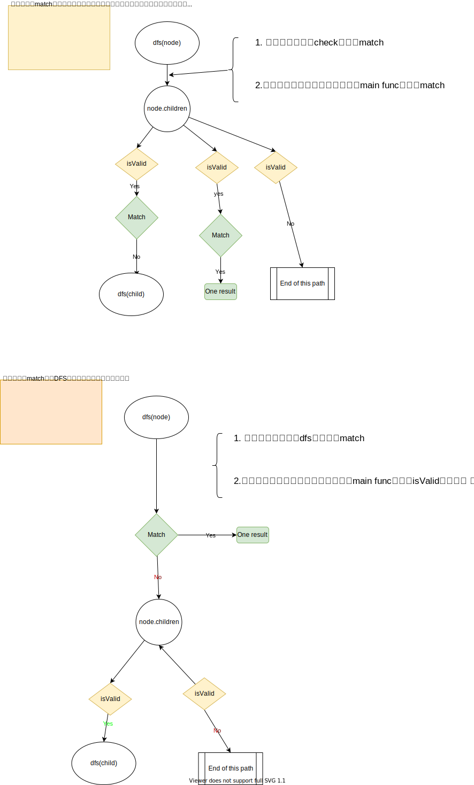
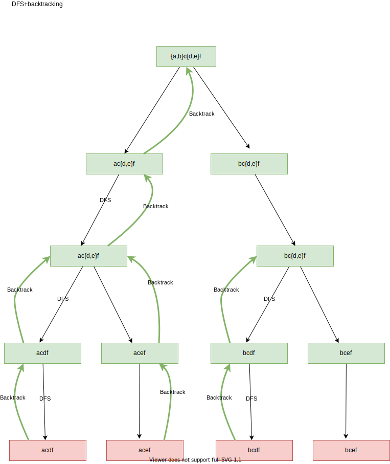
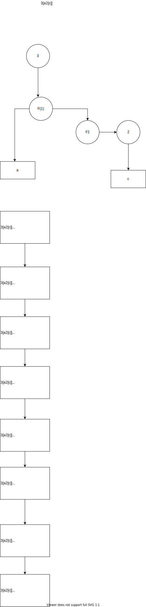

# 02. DFS 引擎与回溯法 (DFS Engine & Backtracking)

本章整合了 DFS 函数的工程结构、返回值的冒泡传递模型、以及无重叠子问题下的全量路径探索（回溯法）。

# DFS实现方式的深入浅出

DFS大家都不陌生，只要刷过一些题目，读过一些题解都会有看到一些模板，自己也会形成一套方法。

[A general approach to backtracking questions in Java (Subsets, Permutations, Combination Sum, Palindrome Partitioning)](https://leetcode.com/problems/combination-sum/discuss/16502/a-general-approach-to-backtracking-questions-in-java-subsets-permutations-combination-sum-palindrome-partitioning/)

[Java DFS 7ms - General Matrix Traversing DFS Template](https://leetcode.com/problems/longest-increasing-path-in-a-matrix/discuss/1089547/java-DFS-7ms-general-matrix-traversing-DFS-template)


但是在做新题的时候，或者做过的题过一段时间重新做一遍，还是会有疑惑。一些题目前后两次的写法可能都完全不同。

更有的题目，DFS写出来了 ，对不对，不是特别清楚；如果不对，也不知道哪里错了，dfs的题目mental debugging非常的困难，println debugging也非常的困难。

我们先看一下实现方式的疑惑，当这些疑惑都得到解答，我们得到一个清晰的实现方式，答案的正确性可能就容易保证。

从实现的角度来看，最多遇到的主要问题有三个：
* 主函数到底调用一次DFS还是要调用多次?
    * 我上边列出的两个例子里，有单个DFS call，有loop DFS call
* 什么地方check valid
    * 有的答案，主函数里check，
    * 有的答案在DFS check
    * 有的答案在遍历子问题check
* 什么地方 检查答案match并更改答案(集)
    * 同样，有的答案在DFS开始时检查并加入答案集
    * 有的答案在变例子问题时检查加入答案集

有没有一个方法论能够让我们清晰的回答上边的三个问题，从而写出一个清楚，正确的DFS答案。

请一定要阅读这篇文章[DFS 解题模式（难度中等）](https://zhuanlan.zhihu.com/p/72527178)。

下边试着带着问题找答案的角度来分享读完这篇文章的理解。

## 第一个问题，主函数调用一次DFS还是多次DFS

* 如果初始节点可以访问所有可达节点，调一次DFS

    ```python
    function main_fun_once(graph):
    # 边界情况，例如如果图是空的，或者初始节点本身就符合条件         
        if not graph:             
            return []         
        # 如果需要返回数值则创建变量（例如最大值，最小值），返回路径则创建数组：         
        res = val // array         
        element = first element in the graph         
        # 对根节点进行 DFS 遍历         
        dfs(element, res)         
        # 返回结果         
        return res
    ```

* 若从初始节点不能访问所有可达节点，多次调用 

    ```python
    function main_function(graph):         
        # 边界条件，例如如果图是空的，或者初始节点本身就符合条件         
        if not graph:             
            return []         
        res = val // array         
        # 对图里面每个元素进行 DFS 遍历         
        for element in the matrix:             
            dfs(element, res)         
        # 返回结果         
        return res
    ```

## 第二个问题: 什么地方检查isValid
只有两个地方需要 检查isValid
* main func里做边界条件处理，!isValid就直接返回
* 处理child 时，检查，那么进入到dfs的数据总是valid

## 第三个问题，什么时候检查答案加入/更新答案(集)
是在dfs的函数开头，还是在遍历child时，会有一些不同，导致实现有所差异




解答了以上的问题，熟练掌握了DFS这两种实现方式的mental model，保证每次写出的代码几乎都是一样的。顺便也解决了另一个每次写代码都 大不相同的问题。


## 例题示例

下边让我们用两种写法解一个例题

```
剑指 Offer 26. 树的子结构
输入两棵二叉树A和B，判断B是不是A的子结构。(约定空树不是任意一个树的子结构)

B是A的子结构， 即 A中有出现和B相同的结构和节点值。

例如:
给定的树 A:

     3
    / \
   4   5
  / \
 1   2
给定的树 B：

   4 
  /
 1
返回 true，因为 B 与 A 的一个子树拥有相同的结构和节点值。

示例 1：

输入：A = [1,2,3], B = [3,1]
输出：false
示例 2：

输入：A = [3,4,5,1,2], B = [4,1]
输出：true
```

### 实现方式一

```java
class Solution {
    public boolean isSubStructure(TreeNode A, TreeNode B) {
        return isSubStructureMethod1(A, B);
    }
    // 主函数，方式一
    // match放到子节点遍历中，更新速度快，不过主函数需要处理边界情况
    boolean isSubStructureMethod1(TreeNode A, TreeNode B) {
        if(B == null || A == null) return false;
        // 因为match放到子节点遍历中，主函数需要单独处理match A,B
        if(match(A, B)) return true;
        return dfs(A,  B);
    }
    boolean dfs(TreeNode A, TreeNode B) {
        if(match(A.left, B) || match(A.right, B)) return true;
        if(isValid(A.left)) {
            if(dfs(A.left, B)) return true;
        }
        if(isValid(A.right)) {
            if(dfs(A.right, B)) return true;
        }
        return false;
    }
    boolean isValid(TreeNode node) {
        return node != null;
    }
    boolean match(TreeNode A, TreeNode B) {
        if(B == null) return true;
        if(A == null || A.val != B.val) return false;
        return match(A.left, B.left) && match(A.right, B.right);
    }
}
```

### 实现方式二
```java
class Solution {
    public boolean isSubStructure(TreeNode A, TreeNode B) {
        return isSubStructureMethod2(A, B);
    }
    // 主函数，方式二
    // match放到DFS开头，速度慢，但是容易实现
    boolean isSubStructureMethod2(TreeNode A, TreeNode B) {
        if(B == null || A == null) return false;
        return dfs2(A, B);
    }
    boolean dfs2(TreeNode A, TreeNode B) {
        if(match(A,B)) {
            return true;
        }
        if(isValid(A.left)) {
            if(dfs2(A.left, B)) return true;
        }
        if(isValid(A.right)) {
            if(dfs2(A.right, B)) return true;
        }
        return false;
    }

    boolean isValid(TreeNode node) {
        return node != null;
    }
    boolean match(TreeNode A, TreeNode B) {
        if(B == null) return true;
        if(A == null || A.val != B.val) return false;
        return match(A.left, B.left) && match(A.right, B.right);
    }

}
```

## 例题示例2
需要主函数多次调用dfs

```
给定一个包含了一些 0 和 1 的非空二维数组 grid 。

一个 岛屿 是由一些相邻的 1 (代表土地) 构成的组合，这里的「相邻」要求两个 1 必须在水平或者竖直方向上相邻。你可以假设 grid 的四个边缘都被 0（代表水）包围着。

找到给定的二维数组中最大的岛屿面积。(如果没有岛屿，则返回面积为 0 。)

 

示例 1:

[[0,0,1,0,0,0,0,1,0,0,0,0,0],
 [0,0,0,0,0,0,0,1,1,1,0,0,0],
 [0,1,1,0,1,0,0,0,0,0,0,0,0],
 [0,1,0,0,1,1,0,0,1,0,1,0,0],
 [0,1,0,0,1,1,0,0,1,1,1,0,0],
 [0,0,0,0,0,0,0,0,0,0,1,0,0],
 [0,0,0,0,0,0,0,1,1,1,0,0,0],
 [0,0,0,0,0,0,0,1,1,0,0,0,0]]
对于上面这个给定矩阵应返回 6。注意答案不应该是 11 ，因为岛屿只能包含水平或垂直的四个方向的 1 。

```

### 实现方式二
```java
class Solution {
    public int maxAreaOfIsland(int[][] grid) {
        int m = grid.length;
        int n = grid[0].length;

        int max = 0;
        int[] ans = new int[1];
        // 初始节点不能够访问所有可达节点，所以遍历所有节点
        for(int i=0; i<m; i++) {
            for(int j=0; j<n; j++) {
                // 因为我们在child里检查match，所以main函数需要对基础case检查
                if(match(grid, i, j)) {
                    ans[0] = 1;
                    grid[i][j] = 2;
                    dfs(grid, i, j, ans);
                    max = Math.max(max, ans[0]);
                }
            }
        }
        for(int i=0; i<m; i++) {
            for(int j=0; j<n; j++) {
                if(grid[i][j] == 2) {
                    grid[i][j] = 1;
                }
            }
        }
        return max;
    }
    int[][] dirs = {{1,0}, {0,1}, {-1,0}, {0,-1}};

    void dfs(int[][] grid,int row, int col, int[] ans) {
        int m = grid.length;
        int n = grid[0].length;

        for(int i = 0; i < 4; i++) {
            int newi = row+dirs[i][0];
            int newj = col+dirs[i][1];
            grid[row][col] = 2;
            // 只对child 检查valid
            if(isValid(grid, newi, newj)) {
                // 检查match
                if(match(grid, newi, newj)) {
                    ans[0]++;
                    dfs(grid, newi, newj, ans);
                }
            }
        }
    }
    boolean isValid(int[][]grid, int row, int col) {
        int m = grid.length;
        int n = grid[0].length;
        return  row >= 0 && row < m && col >= 0 && col < n;
    }
    boolean match(int[][]grid, int row, int col) {
        return grid[row][col] == 1;
    }

}
```

---

# DFS Return Value 

## 定义
树/图的dfs，分决策和回溯。在设计函数的时候，求解的问题会影响我们设计的函数。

如果求的值是和递归的深入有线性关系，那么这个值就可以直接根据公式计算得出 ans = calc(root) + calc(root.children), 每个dfs的返回值也是 calc(root) + calc(root.children)
如果求的值不是和递归有线性关系，而是整个递归的某一部分，那么值就不能够有节点和其孩子直接求的。 这时calc(root) + calc(root.children)可能就变成了求值的一部分。 this.ans = calc(root) +calc(root.children). 但是函数的返回值就变为 calc(root) + select(calc(root.children)) 这里select可能是符合要求的一部分，但不能是全部，否则的话就会蜕变为第一种方案。

## 例题
很多题目需要dfs计算某个值，然后一番计算之后,跟节点和所有子节点的值某种计算就是最值。

例题112.Path Sum
```java
    public boolean hasPathSum(TreeNode root, int targetSum) {
        if(root == null) return false;
        // if(targetSum - root.val < 0) return false;
        if(targetSum - root.val == 0 && root.left == null && root.right == null) return true;
        return hasPathSum(root.left, targetSum - root.val) || hasPathSum(root.right, targetSum - root.val);
    }
```


但是也有类似的题目，缺需要一个global，在dfs过城中，需要不断的更新中这个值

例题:543. Diameter of Binary Tree

```java
class Solution {
    int max = 0; // globa值
    public int diameterOfBinaryTree(TreeNode root) {
        maxDiameterOfBinaryTree(root);
        return max-1;
    }
    int maxDiameterOfBinaryTree(TreeNode root) {
        if(root == null) return 0;
        int left = maxDiameterOfBinaryTree(root.left);
        int right = maxDiameterOfBinaryTree(root.right);
        // 不断更新这个值
        if(left+right+1 > max) {
            max = left+right+1;
        }
        return Math.max(left, right)+1;
    }
}
```

这两个题型的区别是

## 总结

1. 是要求的值会随着递归的深度而不断增加，比如求最大深度，所以可以直接计算得出
2. 是要求的值不一定是递归深度越大值越大，而是要在遍历的过程中记录最大值，然后返回最大值，比如最大路径和

---

# DFS

    “给定一个图（树，字符串，矩阵），找到在遍历图的过程中，符合特定条件的数值或路径。”

上面的这个定义有点抽象，举两个例子：

Leetcode 113 Path Sum II

    "Given a binary tree and a sum, find all root-to-leaf paths where each path's sum equals the given sum."
    “给定一个有向无环图（二叉树），找到在遍历图的过程中，符合特定条件的数值（路径和等于 sum ）”

Leetcode 200 Number of Islands

    "Given a 2d grid map of '1's (land) and '0's (water), count the number of islands. An island is surrounded by water and is formed by connecting adjacent lands horizontally or vertically. You may assume all four edges of the grid are all surrounded by water."
    “给定一个无向无环图（矩阵），找到在遍历图的过程中，符合特定条件的数值（岛的数量）”

深度优先搜索是一种在回退之前尽可能深入**每个分支**的遍历算法。

深度优先一般配合回溯找所有解，但是dfs也可以没有回溯过程。

## 解题模式
1. 主函数
    主函数一般做两件事情 **第一，处理边界情况，例如图为空，初始节点满足条件的情况， 第二，遍历整个图。**

    有的题目要求返回布尔值，那么找到符合即可返回。**除了这种情况，都要遍历图中所有可达点。**如果不能通过初始节点访问所有节点，**那么主函数就需要对每个节点进行DFS遍历。Leetcode 200 Number of Islands**，遍历完初始节点后，其他节点仍然未知，所以需要继续遍历。

    ```text
    # 左侧为遍历初始节点后递归遍历（验证）过的点，右侧为仍需遍历的点
    110       0 
    110       0 
    110       0 
    000       0
    ```
2. DFS递归函数
    这个函数是一个递归函数，调用辅助函数，DFS只对当前节点的子节点(如果是无向图则临近节点)进行遍历即可，其他功能通过辅助函数实现

3. 辅助函数
    里边包含了is_valid和match两个子函数，分别用于判断子节点是否合法，当前状态是否符合条件。    

## 具体实现
1. 主函数
* 若从初始函数可以访问所有节点(Leetcode 113 Path Sum II)
```python
function main_fun(graph):
    # 边界情况，例如图空，或者初始节点本身就符合条件
    if not graph:
        return []
    # 如果需要返回值则创建变量（如最大值，最小值），如果是返回路径则创建数组:
    res = val // array
    element = first element in the graph
    # 对跟节点进行DFS遍历
    dfs(elemenent, res)
    # 返回结果
    return res

 ```

 * 若初始节点不可访问所有可达节点(Leetcode 200 Number of Islands):

 ```python
 function main_fun(graph):
    # 边界条件，例如图空，或者初始节点本身就符合条件
    if not graph:
        return []
    res = val // array
    # 对图里边的每个元素进行DFS遍历
    for element in the graph:
        dfs(element, res)
    # 返回结构
    return res
 ```

 * 如果题目要求返回布尔值，遍历图可以提前结束

 ```python
function main_func(graph):
    res = val // array
    for element in the graph:
        if dfs(element, res) is True:
            return True
    return False
 ```

2. DFS递归函数


* 写代码前，需要遍历节点的层次关系
    * 有向图，树结构遍历子节点
    * 字符串，根据实际情况，遍历临近字符，或者其他信任字符
    * 无向图，临近节点

更多实现的清参考[DFS实现深入浅出](./dfsImpDiveIn.md)


比如 Leetcode 200 Number of Islands 初始节点遍历流程图
```
                1
              (0, 0)
          /           \
          1            1
        (0,1)        (1,0)
        /  \         /   \
       1    1        1    0
    (0,2) (1,1)     (1,1) (2,0)
```
上图中，防止无向图(1,1)被重复遍历， visited， 或者把当前值设置为无效值(这样递归不会原路返回)，dfs遍历结束再还原。

* 函数实现
* 四个重点
    1. 防止点被重复遍历
    2. 检查节点是否合法
    3. 检查更新后的状态是否符合要求
    4. 更新接下来的DFS遍历参数
* 两种实现方式
    1. 形式1，match放到子节点遍历中，更新速度快，不过主函数需要处理边界情况
    2. 形式2，match放到DFS开头，速度慢，但是容易实现

    ```python
    function dfs_first(element, res, current, target, path):
        # 输入参数中
         
        # element 代表需要遍历的节点
        # res代表保存结果的最终容器
        # current 当前状态
        # target 目标中泰
        # path 遍历路径(可选)
        # 遍历每一个节点
        for each child in element:
        # 1. 大部分问题中，同一节点的遍历中，都不能使用同一节点，无向图中，需要修改图节点值为非法
            graph->val = unvalid value
            #2. 检查子节点是否合法，包括是否已经遍历过，是否越界
            if is_valid(child):
            #3. 检查子节点与元素组成的新状态是否符合条件
                if match(current, child, target):
                    # 更新最终结果
                    res += new_res
                else
                    dfs_first(child, res, current+child.val, target, path_child)
            graph->val = valid value

    function dfs_second(element, res, current, target, path):
        # element 代表需要遍历的节点
        # res 保存结果的最终容器
        # current 当前状态(可选)
        # target 目标状态
        # path 遍历路径(可选)
        # 1. 先验证当前状态是否符合条件
        if match(current, element, target):
            # 更新最终结果
            res += new_res
            return
        for each child in element:
            graph->val = unvalid value
            if is_valid(child):
                dfs_second(child, res, curent+child.val, target, path_child)
            graph->val = valid value

    function is_valid(child):
        # 如果child合法返回真，否则返回假
        # 如果child在矩阵范围内
        if 0 <= child.i < lengh of matrix and 0 <= child.y < length of first row of matrix:
            return True
        return False

    function match(current, child, target):
        # 如果当前 child 与 current的组合满足题目与target要求，返回真
        if current + child.val == target:
            return True
        return False
    ```

## 原题分析
### Leetcode 113 Path Sum II
```python
class Solution:
    def pathSum(self, root, sum):
        # 边界情况
        if not root:
            return []
        # 边界情况2，因为是在遍历中验证是否符合条件（意思就是在dfs开头并不验证），所以要检查初始条件是否符合要求
        if root.val == sum and not root.lefft and not root.right:
            return [[root.val]]
        # 因为初始节点可以访问所有可达节点，所以只需要遍历跟节点
        return self.dfs(root, [], root.val, sum, [root.val])

    def dfs(self, node, res, current, target, path):
        # 1. 遍历每一个子节点
        for n in [node.left, node.right]:
            # 2. 检查子节点是否合法，是否访问过，是否越界
            if self.is_valid(n):
                # 3. 检查子节点与元素组成的新状态是否符合条件
                if self.match(current, n, target):
                    # 4. 更新最终结果
                    res.append(path+[n.val])
                else 
                    # 5. 遍历所有合法子节点，更新状态
                    self.dfs(n, res, current+n.val, target, path+[n.val])
        return res
    
    def is_valid(self, node):
        # 只要存在即为真
        if node:
            return True
        return False

    def match(self, current, child, target):
        # 题目要求child必须是叶子节点，并且与之前值的和等于target
        if not child.left and not child.right and current + child.val == target:
            return True
        return False
```

### Leetcode 200 Number of Islands

第二题也类似，形式1和形式2

## 回溯
解决一个回溯问题，实际上就是一个决策树的遍历过程

1. 路径：也就是已经做出的选择。

2. 选择列表：也就是你当前可以做的选择。

3. 结束条件：也就是到达决策树底层，无法再做选择的条件

```
result = []
def backtrack(路径, 选择列表):
    if 满足结束条件:
        result.add(路径)
        return

    for 选择 in 选择列表:
        做选择
        backtrack(路径, 选择列表)
        撤销选择

// backtrack就是图的traversal

void traverse(TreeNode root) {
    for (TreeNode child : root.childern)
        // 前序遍历需要的操作
        traverse(child);
        // 后序遍历需要的操作
}
```
        
backtrack里做选择，撤销选择的部分，
* 如果是sum，可以用`backtrack(路径, 选择列表, sum+1)`，就完成了做选择和撤销选择的操作
* 如果是字符串，可以用`backtrack(路径, 选择列表, str+"i")`，但是这种用法不同创建新字符串，效率很差
    * `sb.append(char)`
    * `backtrack(路径, 选择列表, sb)`
    * `sb.deleteCharAt(sb.length()-1)`


## 题目
* 695.岛屿的最大面积
* 394.字符串解码
* 495.目标和
* 547.省份数量
* 1087.Brace Expansion


## 例题解答
for example, 1087. 花括号展开
 {a,b}c{d,e}f to ["acdf","acef","bcdf","bcef"]





---

