# 图
图是一大类，如果把二叉树(有向无环图)也归到图里，一些逻辑上是图的链表，矩阵，甚至字符串都归类图，那么图的内容可以占到半壁江山。

* 连通图
    * 并查集
* 非连通图

* 有向图
    * 拓扑排序
* 无向图

### 表示方式
* 邻接表
* 邻接矩阵

### DFS 深度优先搜索
深度优先搜索是一种在回退之前尽可能深入每个分支的遍历算法。深度优先+回溯
* [DFS实现深入浅出](./dfsImpDiveIn.md)
* [深度优先+回溯 DFS+backtracking](./dfsBacktracking.md)
* [DFS返回值](./dfsReturnValue.md)
* [深度优先+记忆化 DFS+memo](./dfsMemo.md)
* [1087. Brace Expansion](./1087.brace-expansion)

### BFS 广度优先搜索
广度优先搜索是一种先访问所有同层结点，再继续深入下一层的遍历算法，用于得到无权图的最短路径。
* [1087. Brace Expansion](./1087.brace-expansion)

### DFS BFS做题时的取舍
* 当你看到图的题目，要求最少，最短，最XX的一般用DFS
* 如果题目要求个数，或者题目的解答必须要遍历所有几点一次，那么dfs
### Toplogic Sorting 拓扑排序
只针对有向无环图 Directed Acyclic Graph
* [拓扑排序](./topologicalSorting.md)

### 最短路径Dijstra
* [Dijkstra](./dijkstra.md)

### 并查集
* [并查集](./unionFindSet.md)

