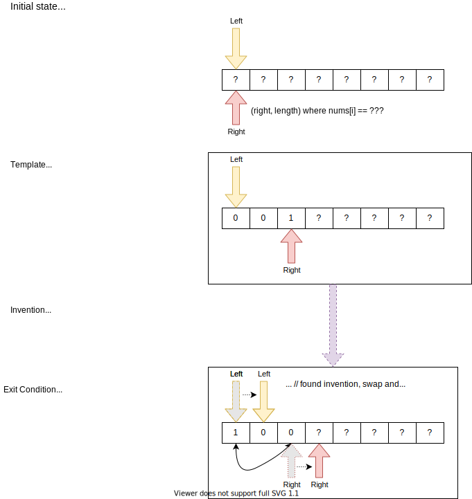

# hashmap and two pointers
## HashMap
O(1) find 所以HashMap会被用在很多需要查找的场景

hashmap的使用通常是tow pass，第一遍build map,第二遍使用

但是有时候one pass hash也很好，一遍build一遍使用，可避免在处理某个元素的时候，从hashmap里取出自己

HashMap可以存字符，也可以存字符位置，也可以存-1表示某种状态

* LC387. 字符串中的第一个唯一字符

## two pointers

两个指针解决问题。相向或同向。

双指针问题的关键是定义好两个指针的含义，题目一般要求将一个数据从一种状态变为另一种状态，比如无序变有序

* [0, left) 题目要求下需要处理并处理过的数据
* [left, length) 题目要求里不需要处理的数据
* [left, rigth] 未知的数据

### 283. 移动零

    给定一个数组 nums，编写一个函数将所有 0 移动到数组的末尾，同时保持非零元素的相对顺序。

    示例:

    输入: [0,1,0,3,12]
    输出: [1,3,12,0,0]


解法需要用到双指针，双指针的移动类似于 快速排序partition函数里的两个指针

```
int partition(int[] nums, int left, int right) {
    // define the pivot nums[high] or nums[low] or nums[random]
    // while(left < right) {
        // find an inversion
        // nums[left] > pivot && nums[right] < pivot, do swap(nums, left, right)
    }
    // find the partition point
}
```

* [0, left) < pivot
* [left, length) > pivot
* [left, rigth] 需要处理

The idea is to find a partition so that all elements before the partition  less than nums[partition], all elements after the partition are greater than nusm[partition].

所以这个题完全可以理解为找到一个partition，那么这个partition 左边都不等于0， 右边都等于0

two pointers关键要清楚指针的定义，这个指针位置左边都是XX，包不包含当前坐标。

和快排稍微不同的是
* 快排根据大于小于移动，跑到不能再跑移动。
* 这题左边不等0，右边等0，跑到不能再跑
* 因为要保证顺序，所以要同向而行
* [0, left) != 0
* [left, right) == 0
* [right, length) 需要处理
* 移动right，找到一个稳定态，找到一个不满足上述条件的left，right，swap，继续

```java
void moveZeros(int[] nums) {
    int left = 0, right = 0;
    while(right < nums.length) {
        if(nums[right] != 0) {
            int tmp = nums[left];
            nums[left] = nums[right];
            nums[right] = tmp;
            left++;
        }
        right++;
    }
}
```



### 滑动窗口
双指针用法里有一种用法，很重要，很常用的，然后有了自己的名字。滑动窗口。

一般滑动窗口用来把一个brutal force的O(n^2),o(n^3)的问题，简化为O(n)


* 数组或者字符串的subrange，最长，最短，某个value
* 有比较简单的方案 O(N²), O(2^N) or some other large time complexity

Find Some kind of **Optimal**, **longest**, **shortest** sequence that satisfies a given condition **exactly**.


滑动窗口也是一种~~动态规划~~贪心算法
* 最优子结构
* ~~子问题重叠~~，没有子问题重叠,图中把字符串重叠/数组选择重叠，但这不是子问题重叠
    * 子问题重叠，意味着F(i), F(j)有共同子问题f(k)，F(k)对两个调用着exactly相同结果
    * 滑动窗口可能不同的窗口会选择出相同的字符串，但是他们的左右指针指向并不同，所以并不能说是子问题
* 滑动窗口更像是贪心，每次选出最优解    





* Fast/Slow 快慢指针

    快指针按照条件grow窗口。对Minimum Window Substring问题，快指针grow窗口知道找到一个valid，即找到所有的字符。

    慢指针shrink窗口。找到窗口以后，慢指针往前移动，直到窗口里的内容invalid，也就是不再有所有字符的窗口。

    在找到时记录一下。

* Fast/Catchup  快追指针

    这个很像快慢指针，但是慢指针是直接跳到快指针的位置。

    比如Max Consecutive Sum问题，[1, 2, 3, -7, 7, 2, -12, 6]

    当当前和变为负数的时候，慢指针直接跳到快指针的位置。

* Fast/Lagging 快拖指针

    慢指针拖到快指针后边一个或者两个的位置，记录着一路过来的选择。

    House Robber

* Front/Back 前后指针

    two sum


#### To Sumup
* Fast/Slow
    * BitFLip
    * Minimum Window Substring
    * Consecutive Subarray Sum
*  Fast/Catchup
    *  Max Consecutive sum
    * buy/sell stocks
* Fast/Lag
    * House Robber
* Front/Back
    * Rain water
    * Sorted Two sum
