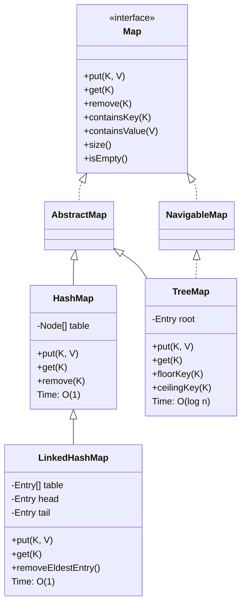

# Java Map类的结构与实现

## 类层次结构



## Map接口主要方法
- containsKey(K key): 检查是否包含指定的key
- containsValue(V value): 检查是否包含指定的value
- get(K key): 获取指定键的值
- put(K key, V value): 放入键值对

### Map.Entry接口
* Map.Entry<K,V>: 表示一个键值对
    * getValue(): 获取值
    * getKey(): 获取键
    * setValue(V value): 设置新值

### HashMap
* 基于HashTable实现
* 时间复杂度: O(1)
* 不保证键值对的顺序

### LinkedHashMap
* 继承HashMap
* 使用双向链表维护插入顺序
* 时间复杂度: O(1)
* 可用于LRU缓存实现

### TreeMap
* 基于红黑树实现,  implements the Map, NavigableMap, and SortedMap interface.
* 时间复杂度: O(log n)
* 键值对按键排序 - key sorted map

## code


```java
public static void main(String[] args)
    {
        Map<String, String> hm = new LinkedHashMap<>();
 
        hm.put("USA", "Washington");
        hm.put("United Kingdom", "London");
        hm.put("India", "New Delhi");
 
        System.out.println("LinkedHashMap : " + hm);
 
        hm = new TreeMap<>(hm);
        System.out.println("TreeMap : " + hm);
 
        hm = new HashMap<>(hm);
        System.out.println("HashMap : " + hm);
    }
```

The output
```
LinkedHashMap : {USA=Washington, United Kingdom=London, India=New Delhi}
TreeMap : {India=New Delhi, USA=Washington, United Kingdom=London}
HashMap : {United Kingdom=London, USA=Washington, India=New Delhi}

```

add, remove, containsKey, time complexity is O(log n) where n is number of elements present in TreeMap.


### TreeMap API
TreeMap是Key自然有序字典，红黑树实现的NavitableMap.

    O(log n) 的containsKey, get, put 和remove


因为key自然有序，所以有很多key顺序，搜索相关的api
* 获取头和尾或者某个key或者value
    * get(key)
    * containsKey 有没有key呢
    * containsValue 有没有value呢
    * firstEntry/firstKey
    * lastEntry/lastKey

有意思的几个api，为什么有意思，可以在一个数组中，用O(logN)的复杂度寻找一个满足条件的值/index
想要领略这些用法，请参考题目[456.132 Pattern](./456.132-pattern/132-pattern.md)

* 获取最近的key
    * ceilingEntry(key)/ ceilingKey(key)
        * 返回大于等于参数key的最小的key/entry，null如果找不到
    * floorKey/floorEntry
        * 返回小于等于参数key的最大的key/entry，null如果找不到
    * higherEntry(key)/higherKey
        * 返回一个严格大于参数key的key/entry，null如果找不到
    * lowerKey/lowerEntry(key)
        * 返回一个严格小于参数key的key/entry, null 如果找不到

        
