# martrix

矩阵也是一个大项目，虽然题型并不多，旋转，顺时针，逆时针，对角线。

## 遍历
* 顺时针
* 逆时针
* 对角线
* 环形遍历

下面我们用一道题引入各种遍历


## 置零
根据一些条件的置零，
* 另建一个二维数组标记状态，然后根据状态标记 O(m*n)
* 零件两个一位数组标记状态，然后根据状态标记 O(m+n)
* 投射到矩阵的第一行，第一列
    * 这个需要注意，在处理时，需要避开第一行第一列，回头单独处理

[73.set-matrix-zeroes 矩阵置零](./73.set-matrix-zeroes)



## 赋值

根据某些条件，改变矩阵的某些元素的值
* mark 
    * mark可以区分原值和目的值
    * 一个作用是在重新赋值根据mark确定值
    * 另一个作用，dfs的时候，可以作为visited
* 重新赋值

例子 130. 被围绕的区域，一个naive，直接的的版本，就是找到每一个'O',然后dfs，找到所有'O',再查找是不是有处于边界的，如果是，就不处理。如果没有边界元素，全部赋值'X'。

 [130. 被围绕的区域](./graphs/surroundedRegions.drawio.svg)

本处，有一个需要注意的地方，需要处理所有dfs出来以后的结果以后，操作需要写到dfs同层的函数

```java
class Solution {

    public void solve(char[][] board) {
        int m = board.length;
        int n = board[0].length;
        for(int i = 0; i < n; i++) {
            if(board[0][i] == 'O') {
                dfs(board, 0, i);
            }
            if(board[m-1][i] == 'O') {
                dfs(board, m-1, i);
            }
        }
        for(int i = 0; i < m; i++) {
            if(board[i][0] == 'O') {
                dfs(board, i, 0);
            }
            if(board[i][n-1] == 'O') {
                dfs(board, i, n-1);
            }
        }
        for(int i = 0; i < m; i++) {
            for(int j = 0; j < n; j++) {
                if(board[i][j] == 'A') {
                    board[i][j] = 'O';
                } else if(board[i][j]=='O') {
                    board[i][j] = 'X';
                }

            }
        }
    }

    private void dfs(char[][] board, int row, int col) {
        int m = board.length;
        int n = board[0].length;

        if(row < 0 || row == m || col < 0 || col == n || board[row][col] != 'O') {
            return;
        }
        board[row][col] = 'A';
        dfs(board, row+1, col);
        dfs(board, row-1, col);
        dfs(board, row, col+1);
        dfs(board, row, col-1);
    }
}
```


