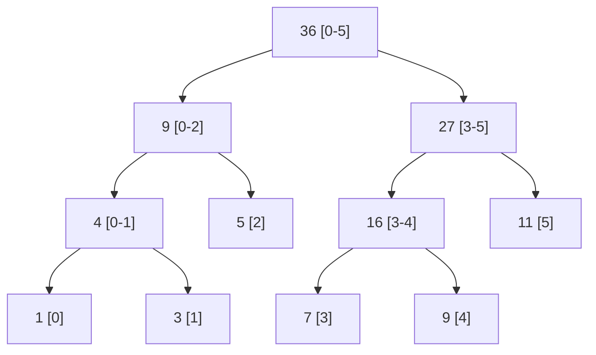

# 线段树
线段树（Segment Tree）：一种基于分治思想的二叉树，用于在区间上进行信息统计
线段树是一棵二叉树，每个节点代表一个区间。根节点代表的区间是整个数列的区间，每个节点的左右子树分别代表该节点区间的左右半部分。
假设对于 长度为 N 的 array A，我们有对应的线段树 T，那么……
* T 的根节点代表整个 array A
* T 的每个叶子节点都代表 array A 中的一个值 A[i]，0≤i<N
* T 中的每一个非叶节点都代表 array A 的一个子序列 A[i:j]，0≤i<j<N


```ascii
                        36[0-5]
                       /       \
                 9[0-2]         27[3-5]
                /     \         /      \
            4[0-1]    5[2]   16[3-4]   11[5]
           /    \            /     \
        1[0]    3[1]       7[3]    9[4]
```



> 经典问题：给出数列[1 4 2 3],求给定区间的最大值 例:query(0,1) = 4 query(2,3) = 3 query(0,3) = 4

当有n个元素时，线段树可以在 O(log N)的时间复杂度内实现单点修改、区间修改、区间查询（区间求和，求区间最大值，求区间最小值）等操作。

| 数据结构 | 更新 | 查询 |
|----| ----|----|
| 数组 | O (n)| O(n)| 
| 线段树 |O(Log N) |O(log N) | 

## 线段树的基本操作
线段树的基本操作包括:

1. **构建线段树 (Build)**: 根据输入数组构建线段树，时间复杂度 O(n)
    * `build(int node, int start, int end)`
2. **单点更新 (Update)**: 更新数组中某一个元素的值，时间复杂度 O(log n)
    * `update(int index, int val)`s

3. **区间查询 (Query)**: 查询区间的统计信息（如区间和、最大值、最小值），时间复杂度 O(log n)
    * `query(int left, int right)`
    * `queryRange(int node, int start, int end, int left, int right)`
    * `queryPoint(int node, int start, int end, int index)`
4. **区间更新 (Range Update)**: 更新一个区间内所有元素的值，通常使用懒惰传播，时间复杂度 O (log n)
    * `queryRange(int node, int start, int end, int left, int right)` 
    * `updateTree(int node, int start, int end, int index, int val)`
        * UPDATE ONE POINT, fit for nums problems
        * same as below
        * index: is the index of the element to be updated
    * `updateTree(int node, int start, int end, int left, int right int val)`
        * UPDATE A RANGE, fit for range problems
        * node: current node index in the segemnt tree, start from 0(root)
        * start: starting index of the interval represented by the current node, 0 for root node
        * end: ending index of the interval represented by the current node, n-1 for root node
            * [start-end]: defiens the range of the current node
        * left: starting index of the udpate range
        * right: ending index of the udpatge range
        * val: the value to be applied to the range, 
            * in case of sum, this is the value to add
            * in case of max/min, this is the value to compare with

## 线段树的实现

### 数组实现
对于一个长度为 n 的数组，其线段树的节点数量不会超过 4n，因此我们可以使用大小为 4n 的数组来存储线段树。

#### A plain version
```java
class SimpleSegmentTree {
    private int[] tree;
    private int[] nums;
    private int n;
    
    public SimpleSegmentTree(int[] nums) {
        this.nums = nums;
        n = nums.length;
        // Allocate memory for segment tree
        // Size of segment tree is 4*n
        int maxSize = 4 * n;
        tree = new int[maxSize];
        build(0, 0, n - 1);
    }
    
    // Build segment tree
    private void build(int node, int start, int end) {
        // Leaf node will store value from the input array
        if (start == end) {
            tree[node] = nums[start];
            return;
        }
        
        // Internal node will store sum of both children
        int mid = start + (end - start) / 2;
        int leftNode = 2 * node + 1;
        int rightNode = 2 * node + 2;
        
        // Recursively build left and right children
        build(leftNode, start, mid);
        build(rightNode, mid + 1, end);
        
        // Internal node stores sum of children
        tree[node] = tree[leftNode] + tree[rightNode];
    }
    
    // Update a value at index
    public void update(int index, int val) {
        // Validate index
        if (index < 0 || index >= n) {
            return;
        }
        
        // Update value in original array
        int diff = val - nums[index];
        nums[index] = val;
        
        // Update segment tree
        updateTree(0, 0, n - 1, index, diff);
    }
    
    // Helper method to update segment tree
    private void updateTree(int node, int start, int end, int index, int diff) {
        // Check if current node's range includes the index
        if (index < start || index > end) {
            return;
        }
        
        // Update current node
        tree[node] += diff;
        
        // If not leaf node, update children
        if (start != end) {
            int mid = start + (end - start) / 2;
            updateTree(2 * node + 1, start, mid, index, diff);
            updateTree(2 * node + 2, mid + 1, end, index, diff);
        }
    }
    
    // Query sum in range [left, right]
    public int query(int left, int right) {
        // Validate range
        if (left < 0 || right >= n || left > right) {
            return 0;
        }
        
        return queryRange(0, 0, n - 1, left, right);
    }
    
    // Helper method for range query
    private int queryRange(int node, int start, int end, int left, int right) {
        // No overlap
        if (start > right || end < left) {
            return 0;
        }
        
        // Complete overlap
        if (start >= left && end <= right) {
            return tree[node];
        }
        
        // Partial overlap - query both children
        int mid = start + (end - start) / 2;
        int leftSum = queryRange(2 * node + 1, start, mid, left, right);
        int rightSum = queryRange(2 * node + 2, mid + 1, end, left, right);
        
        return leftSum + rightSum;
    }
    
    // For debugging - print the tree
    public void printTree() {
        System.out.println("Segment Tree:");
        for (int i = 0; i < tree.length; i++) {
            System.out.print(tree[i] + " ");
        }
        System.out.println();
    }
}
```
#### Lazy version
- Efficiency : Range updates become O(log n) instead of O(n)
- Performance : Significantly reduces the number of node updates for range operations
```java
class SegmentTree {
    private int[] tree;
    private int[] lazy;
    private int[] nums;
    private int n;
    
    public SegmentTree(int[] nums) {
        this.nums = nums;
        n = nums.length;
        tree = new int[4 * n];
        lazy = new int[4 * n];
        build(0, 0, n - 1);
    }
    
    // 构建线段树
    private void build(int node, int start, int end) {
        if (start == end) {
            tree[node] = nums[start];
            return;
        }
        
        int mid = start + (end - start) / 2;
        int leftNode = 2 * node + 1;
        int rightNode = 2 * node + 2;
        
        build(leftNode, start, mid);
        build(rightNode, mid + 1, end);
        
        // 合并左右子树的信息
        tree[node] = tree[leftNode] + tree[rightNode]; // 这里是求和，可以根据需求修改
    }
    
    // 单点更新
    public void update(int index, int val) {
        update(0, 0, n - 1, index, val);
    }
    
    private void update(int node, int start, int end, int index, int val) {
        if (start == end) {
            nums[index] = val;
            tree[node] = val;
            return;
        }
        
        int mid = start + (end - start) / 2;
        int leftNode = 2 * node + 1;
        int rightNode = 2 * node + 2;
        
        if (index <= mid) {
            update(leftNode, start, mid, index, val);
        } else {
            update(rightNode, mid + 1, end, index, val);
        }
        
        tree[node] = tree[leftNode] + tree[rightNode];
    }
    
    // 区间查询
    public int query(int left, int right) {
        return query(0, 0, n - 1, left, right);
    }
    
    private int query(int node, int start, int end, int left, int right) {
        // 区间不重叠
        if (right < start || left > end) {
            return 0; // 求和的默认值
        }
        
        // 当前区间被查询区间完全包含
        if (left <= start && end <= right) {
            return tree[node];
        }
        
        // 处理懒惰标记
        if (lazy[node] != 0) {
            tree[node] += (end - start + 1) * lazy[node];
            if (start != end) {
                lazy[2 * node + 1] += lazy[node];
                lazy[2 * node + 2] += lazy[node];
            }
            lazy[node] = 0;
        }
        
        // 部分重叠，继续递归查询
        int mid = start + (end - start) / 2;
        int leftSum = query(2 * node + 1, start, mid, left, right);
        int rightSum = query(2 * node + 2, mid + 1, end, left, right);
        
        return leftSum + rightSum;
    }
    
    // 区间更新（懒惰传播）
    public void updateRange(int left, int right, int val) {
        updateRange(0, 0, n - 1, left, right, val);
    }
    
    private void updateRange(int node, int start, int end, int left, int right, int val) {
        // 处理之前的懒惰标记
        if (lazy[node] != 0) {
            tree[node] += (end - start + 1) * lazy[node];
            if (start != end) {
                lazy[2 * node + 1] += lazy[node];
                lazy[2 * node + 2] += lazy[node];
            }
            lazy[node] = 0;
        }
        
        // 区间不重叠
        if (start > right || end < left) {
            return;
        }
        
        // 当前区间被查询区间完全包含
        if (left <= start && end <= right) {
            tree[node] += (end - start + 1) * val;
            if (start != end) {
                lazy[2 * node + 1] += val;
                lazy[2 * node + 2] += val;
            }
            return;
        }
        
        // 部分重叠，继续递归更新
        int mid = start + (end - start) / 2;
        updateRange(2 * node + 1, start, mid, left, right, val);
        updateRange(2 * node + 2, mid + 1, end, left, right, val);
        
        tree[node] = tree[2 * node + 1] + tree[2 * node + 2];
    }
}
```

### 节点类实现
也可以使用节点类来实现线段树，这种方式更加灵活
```java
class SegmentTreeNode {
    int start, end;
    int sum;  // 可以根据需求改为max, min等
    SegmentTreeNode left, right;
    
    public SegmentTreeNode(int start, int end) {
        this.start = start;
        this.end = end;
        this.sum = 0;
        this.left = null;
        this.right = null;
    }
}

class SegmentTree {
    SegmentTreeNode root;
    
    public SegmentTree(int[] nums) {
        if (nums.length > 0) {
            root = buildTree(nums, 0, nums.length - 1);
        }
    }
    
    private SegmentTreeNode buildTree(int[] nums, int start, int end) {
        if (start > end) {
            return null;
        }
        
        SegmentTreeNode node = new SegmentTreeNode(start, end);
        
        if (start == end) {
            node.sum = nums[start];
        } else {
            int mid = start + (end - start) / 2;
            node.left = buildTree(nums, start, mid);
            node.right = buildTree(nums, mid + 1, end);
            node.sum = node.left.sum + node.right.sum;
        }
        
        return node;
    }
    
    public void update(int index, int val) {
        update(root, index, val);
    }
    
    private void update(SegmentTreeNode node, int index, int val) {
        if (node.start == node.end) {
            node.sum = val;
            return;
        }
        
        int mid = node.start + (node.end - node.start) / 2;
        if (index <= mid) {
            update(node.left, index, val);
        } else {
            update(node.right, index, val);
        }
        
        node.sum = node.left.sum + node.right.sum;
    }
    
    public int query(int left, int right) {
        return query(root, left, right);
    }
    
    private int query(SegmentTreeNode node, int left, int right) {
        if (node.start == left && node.end == right) {
            return node.sum;
        }
        
        int mid = node.start + (node.end - node.start) / 2;
        if (right <= mid) {
            return query(node.left, left, right);
        } else if (left > mid) {
            return query(node.right, left, right);
        } else {
            return query(node.left, left, mid) + query(node.right, mid + 1, right);
        }
    }
}
```
## 线段树的应用
1. 区间查询问题 ：
   - 区间求和（如：LeetCode 307. Range Sum Query - Mutable）
   - 区间最大/最小值
   - 区间GCD/LCM
2. 动态维护信息 ：
   - 动态维护区间统计信息，如区间内有多少个不同的数
   - 维护区间内的逆序对数量
3. 扫描线算法 ：
   - 矩形面积并问题
   - 天际线问题（如：LeetCode 218. The Skyline Problem）
4. 区间更新问题 ：
   - 区间加法/乘法
   - 区间覆盖

## 线段树相关的LeetCode题目
* [307. Range Sum Query - Mutable](./307.range-sum-query-mutable/)
* 315. Count of Smaller Numbers After Self
* 327. Count of Range Sum
* 699. Falling Squares
* 715. Range Module
* 732. My Calendar III
* [218. The Skyline Problem](./218.the-skyline-problem/)


### Case Study: 218. Skyline
```
Buildings: [ [2,9,10], [3,7,15], [5,12,12] ]

Segment Tree Structure (Max Height):

                    15[0-12]
                   /        \
             15[0-7]        12[7-12]
            /      \        /      \
        10[0-2] 15[2-7] 12[7-9] 12[9-12]
                /     \
          10[2-3] 15[3-7]
```

Range Sum Segment Tree          |  Skyline Segment Tree
--------------------------------|------------------------
Stores sum of values            |  Stores maximum height
Used for cumulative operations  |  Used for peak detection
Updates add to values           |  Updates set maximum values
Queries return totals           |  Queries return highest point          

A practical emaple:
```
After [2,9,10]:
       10[2-9]

After [3,7,15]:
       15[3-7]
      /      \
   10[2-3] 15[3-7]

After [5,12,12]:
       15[2-12]
      /        \
   15[2-7]    12[7-12]
  /      \
10[2-3] 15[3-7]
```
## 线段树的优化
1. 懒惰传播（Lazy Propagation） ：延迟更新子节点，提高区间更新效率
2. 离散化 ：当区间范围很大但实际使用的点很少时，可以将坐标离散化
3. 动态开点 ：不预先分配所有节点，而是按需创建节点，节省空间


## 线段树与其他数据结构的比较
| Data Structure | Single Point Update | Range Query | Range Update | Space Complexity |
|----------------|-------------------|-------------|--------------|------------------|
| Array | O(1) | O(n) | O(n) | O(n) |
| Prefix Sum | O(n) | O(1) | O(n) | O(n) |
| Binary Indexed Tree | O(log n) | O(log n) | O(log² n) | O(n) |
| Segment Tree | O(log n) | O(log n) | O(log n) | O(n) |
