# Sliding window(滑动窗口)
[双指针](./hashTwoPointers.md)用法里有一种很常用的用法，很重要，然后有了自己的名字：滑动窗口。

* 一般滑动窗口用来把一个brutal force的O(n^2),o(n^3)的问题，简化为O(n),或者O(n^2)
* 数组或者字符串的subrange，最长，最短，某个value，符合某个条件的

## What is a Sliding Window?
Think of it like a video camera that can zoom in and out:
```
String: "ADOBECODEBANC"
        [A]              Initial window size 1
        [ADO]            Expanded to size 3
        [ADOB]           Expanded to size 4
           [DOB]         Slid right
           [DOBE]        Expanded
              [BEC]      Slid right
```


# Three Types of Window Movement
* EXPAND
* CONTRACT
* SLIDE
## 1. EXPAND (Growing the Window)
```
"ADOBECODEBANC"
[A] → [AD] → [ADO] → [ADOB]
```
When to use:
- Need more characters
- Current window doesn't satisfy condition
- Looking for a larger pattern

## 2. CONTRACT (Shrinking the Window)
```
"ADOBECODEBANC"
[ADOB] → [DOB] → [OB]
```
When to use:
- Window has extra characters
- Looking for minimum size
- Current window is too big

## 3. SLIDE (Moving the Window)
```
"ADOBECODEBANC"
[ADO] → [DOB] → [OBE]
```
When to use:
- Fixed size window
- Need to check all positions
- Like finding anagrams

# Template for Sliding Window

## Basic Structure
```java
// Initialize window bounds
int start = 0, end = 0;

// Initialize window state
Map<Character, Integer> window = new HashMap<>();

// Process string
while (end < s.length()) {
    // 1. Expand: Add character at end
    char c = s.charAt(end++);
    window.put(c, window.getOrDefault(c, 0) + 1);
    
    // 2. Contract: Remove characters from start if needed
    while (needToShrink()) {
        char d = s.charAt(start++);
        window.put(d, window.get(d) - 1);
        // updateAnswer();
    }
    
    // 3. Update answer if needed
    updateAnswer();
}
```
## 核心概念 定义窗口 Windows
- HashMap for character frequencies
   - let's define for intialization we mark c in target as `map[c]--`
   - [0, ∞) mean nothing, these chars count are of no use
   - (-∞, 0) means a target's char is founded
      - when expanding, check `map[c] < 0` first
      - when contract after update `map[c]--`, check `map[c] < 0` 
- Counter for conditions, count == 0, mean all found
- Set for unique elements if needed
# Real World Examples

## 1. Minimum Window Substring (LC 76)
Find smallest window containing all target characters

```
S: "ADOBECODEBANC"
T: "ABC"

Step-by-step visualization:
1. [A]DOBECODEBANC     Found: A    Need: B,C
2. [ADOB]ECODEBANC     Found: A,B  Need: C
3. [ADOBEC]ODEBANC     Found all!  Shrink...
4. DOBEC[BANC]         Better!     Answer="BANC"

Key States:
- Need to find: Map<Char, Count> of T
- Current window: Map<Char, Count> of window
- Valid when: All chars in T are found
```

## 2. Find All Anagrams (LC 438)
Find all anagrams of pattern in string

```
S: "cbaebabacd"
P: "abc"

Fixed-size window (size = P.length()):
[cba] → valid!      Add index 0
b[bae] → not valid
ba[aeb] → not valid
bae[eba] → not valid
baeb[bac] → valid!  Add index 5
```

# Common Patterns to Remember

1. Growing Window (Minimum Window Substring)
   - Expand until valid
   - Contract to minimize
   - Track minimum size

2. Fixed Window (Find Anagrams)
   - Window size = pattern size
   - Slide one by one
   - Compare window state

3. Variable Window (Longest Substring)
   - Expand while valid
   - Contract when invalid
   - Track maximum size

# Tips for Solving Sliding Window Problems

1. Ask yourself:
   - What makes a window valid?
   - When should I expand?
   - When should I contract?

2. Choose your window state:
   - HashMap for character frequencies
      - let's define for intialization we mark c in target as `map[c]--`
      - [0, ∞) mean nothing, these chars count are of no use
      - (-∞, 0) means a target's char is founded
         - when expanding, check `map[c] < 0` first
         - when contract after update `map[c]--`, check `map[c] < 0` 
   - Counter for conditions, count == 0, mean all found
   - Set for unique elements if needed

3. Optimize the solution:
   - Use array instead of HashMap for small character sets ✅
   - Track validity with counter instead of checking map ✅
   - Update state incrementally instead of recalculating

Remember: Sliding Window turns many O(n²) substring problems into O(n) solutions by avoiding repeated work!




## 滑动窗口的类别
* Fast/Slow 快慢指针

     **[s↝↝↝↝↝↝↝↝f     ]**

    快指针按照条件grow窗口。对Minimum Window Substring问题，快指针grow窗口知道找到一个valid，即找到所有的字符。

    慢指针shrink窗口。找到窗口以后，慢指针往前移动，直到窗口里的内容invalid，也就是不再有所有字符的窗口。

    在找到时记录一下。

* Fast/Catchup  快追指针

     **[s↝_________↝f     ]**

    这个很像快慢指针，但是慢指针是直接跳到快指针的位置。

    比如Max Consecutive Sum问题，[1, 2, 3, -7, 7, 2, -12, 6]

    当当前和变为负数的时候，慢指针直接跳到快指针的位置。

* Fast/Lagging 快拖指针

    **[     s↝f↝            ]**

    慢指针拖到快指针后边一个或者两个的位置，记录着一路过来的选择。

    House Robber

* Front/Back 前后指针

    **[s↝↝↝        ↜↜↜↜f]**

    two sum


### To Sum up
* Fast/Slow
    * BitFLip
    * Minimum Window Substring
    * Consecutive Subarray Sum
*  Fast/Catchup
    *  Max Consecutive sum
    * buy/sell stocks
* Fast/Lag
    * House Robber
* Front/Back
    * Rain water
    * Sorted Two sum


### 76 76. Minimum Window Substring76. 最小覆盖子串


```java
// two map version, need.include(c) to check whether a target's char is found
class Solution {
    public String minWindow(String s, String t) {
        // Initialize window state
        Map<Character, Integer> need = new HashMap<>();  // characters we need
        // need can be removed by designing, window[c]: 
        // >0 mean wanted, 
        // =0 all found, 
        // <0 means found more than needed
        Map<Character, Integer> window = new HashMap<>(); // current window state
        
        // Count characters needed from t
        for (char c : t.toCharArray()) {
            need.put(c, need.getOrDefault(c, 0) + 1);
        }
        
        // Initialize window bounds and answer tracking
        int start = 0, end = 0;
        int minStart = 0, minLen = Integer.MAX_VALUE;
        int required = need.size();  // number of unique chars we need
        int current = 0;   // number of chars we've found with correct count
        
        // Process string using sliding window
        while (end < s.length()) {
            // 1. Expand: Add character at end
            char c = s.charAt(end++);
            if (need.containsKey(c)) {
                window.put(c, window.getOrDefault(c, 0) + 1);
                // If we've found exactly what we need for this char
                if (window.get(c).equals(need.get(c))) {
                    current++;
                }
            }
            
            // 2. Contract: Remove characters from start if possible
            while (current == required) {  // we have all chars we need
                // Update answer if this window is smaller
                if (end - start < minLen) {
                    minStart = start;
                    minLen = end - start;
                }
                
                // Remove char at start
                char d = s.charAt(start++);
                if (need.containsKey(d)) {
                    // If removing this char breaks our window validity
                    if (window.get(d).equals(need.get(d))) {
                        current--;
                    }
                    window.put(d, window.get(d) - 1);
                }
            }
        }
        
        // Return answer
        return minLen == Integer.MAX_VALUE ? 
            "" : s.substring(minStart, minStart + minLen);
    }
}
```

```java
// one map version, `map[c]<0` means a target's char is found
class Solution {
    public String minWindow(String s, String t) {
        Map<Character, Integer> map = new HashMap<>(26); // char frequencies
        /** 
            - [0, ∞) mean many things, these chars are of no use
            - (-∞, 0) means NUM wantedfound more than needed
         */
        int count = 0; // condition, count more wanted
        int current = 0;
        int left = 0, right = 0;
        int length = Integer.MAX_VALUE;
        int minStart = 0;

        for(char c : t.toCharArray()) {
            map.put(c, map.getOrDefault(c, 0) - 1);
            count++;
        }
        while(right < s.length()) {
            char c = s.charAt(right++);
            if(map.getOrDefault(c, 0) < 0) {
                count--;
            }
            map.put(c, map.getOrDefault(c, 0) + 1);
            while(count == 0) {
                if(length > right - left ) {
                    length = right - left ;
                    minStart = left;
                }
                char d = s.charAt(left++);
                map.put(d, map.get(d)-1);
                if(map.get(d) < 0) {
                    count++;
                }
            }
        }
        if(length == Integer.MAX_VALUE) return "";
        return s.substring(minStart, minStart+length);

    }
}
```


### 例题题解
* 438.找到字符串中所有字母异位词


```java
class Solution {
    // 相似: 49 group-anagram
    public List<Integer> findAnagrams(String s, String p) {
        //"cbaebabacd"
        //        ^-^
        // first thing, how to verify the anagram
        // data structure to store the windows info to verify anagram
        // p map: char->counter, 
        // s map: char->counter, maintaining a valid subset of anagram of p.
        // findAnagramsFlexiWindow(s, p)
        return findAnagramsFixedWindow(s, p);
    }

    // 1. find valid window, and compare the right-left == p.length
    private List<Integer> findAnagramsFlexiWindow(String s, String p) {

        int[] pmap = new int[26];
        int[] smap = new int[26];
        for(int i = 0; i < p.length(); i++) {
            char c = p.charAt(i);
            pmap[c-'a']++;
        }

        List<Integer> ans = new ArrayList<>();
        int left = 0;
        for(int right = 0; right < s.length(); right++) {
            char c = s.charAt(right);
            smap[c-'a']++;

            while(smap[c-'a'] > pmap[c-'a']) {
                char cleft = s.charAt(left);
                smap[cleft-'a']--;
                left++;
            }
            if(right - left + 1 == p.length()) {
                ans.add(left);
            }
        }
        return ans;

    }

    // 2. fixed window, compare every scan to validate
    private  List<Integer> findAnagramsFixedWindow(String s, String p) {

        int[] pmap = new int[26];
        int[] smap = new int[26];
        for(int i = 0; i < p.length(); i++) {
            char c = p.charAt(i);
            pmap[c-'a']++;
        }
        List<Integer> ans = new ArrayList<>();
        int left = 0;
        //"cbaebabacd"
        for(int right = 0; right < s.length(); right++) {
            char c = s.charAt(right);
            smap[c-'a']++;
            if(right - left + 1 >= p.length()) {
                if(compareArray(smap, pmap)) {
                    ans.add(left);
                }
                smap[s.charAt(left)-'a']--;
                left++;
            }
        }
        return ans;
    }

    private boolean compareArray(int[] pmap, int[] smap) {
        for(int i = 0; i < 26; i++) {
            if(pmap[i] != smap[i]) {
                return false;
            }
        }
        return true;
    }
}
```


`cbaebabacd`

`abc`

intial [[a:1], [b:1], [c:1]], counter: 3

| outer | innter | left char | right char | current  value | counter|
| ---- | --- | --- | --- | --- | ---| 
|outer| |c |c| 0|counter = 2|
|outer| |c |b| 0|counter = 1|
|outer| |c |a| 0|counter = 0|
|   | inner check|c|a| 0|0|
|    |inner|c | a| 1| counter 1|
|outer|  |b|e| -1|counter = 1|
|outer|  |b|b| -1|counter = 1|
|outer|  |b|a| -1|counter = 1|
|outer|  |b|b| -2|counter = 1|
|outer|  |b|a| -2|counter = 1|
|outer|  |b|c| 0|counter = 0|
|    |inner check|b|c| -2|0|
|    |inner|b ++|c| -1| counter 0|
|    |inner check|a|c| -2|0|
|    |inner|a ++|c| -1| counter 0|
|    |inner check|e|c| -1|0|
|    |inner|e ++|c| 0| counter 0|
|    |inner check|b|c| -1|0|
|    |inner|b ++|c| 0| counter 0|
|    |inner check|a|c| -1|0|
|    |inner|a ++|c| 0| counter 0|
|    |inner check|b|c| 0|0|
|    |inner|b ++|c| 1| counter 1|
|outer|  |a|d| -1|counter = 1|