# 栈
栈是实现了LIFO的数据结构

thinking out of box的栈技巧，不需要有什么push进什么(literally push)，可以为virtual push, processed push。

举个例子：
* 20-valid-parentheses

```java
switch(c) {
                case '(':
                case '[':
                case '{':
                stack.push(c);
                break;
                case ')':
                if(stack.isEmpty() || stack.peek() != '(') {
                    return false;
                } else {
                    stack.pop();
                }
                break;
                case '}':
                if(stack.isEmpty() || stack.peek() != '{') {
                    return false;
                } else {
                    stack.pop();
                }
                break;
                case ']':
                if(stack.isEmpty() || stack.peek() != '[') {
                    return false;
                } else {
                    stack.pop();
                }

```

因为我们看到')'，栈顶是'('才是valid，实际上，如果我们在'('直接push')',比对就不这么verbose了

```java
switch(c) {
                case '(':
                stack.push(')');
                break;
                case '[':
                stack.push(']');
                break;
                case '{':
                stack.push(});
                break;
                case ')':
                case '}':
                case ']':
                if(stack.isEmpty() || stack.peek() != c) {
                    return false;
                } else {
                    stack.pop();
                }

```
## 单栈

利用FILO的性质，一个栈信息足够的题。
* [20. 有效的括号](./20.valid-parentheses/)

## 辅助栈
但是有时候，单栈没有足够的信息来解决问题，比如以下问题
* [104. 二叉树的最大深度](./104.maximum-depth-of-binary-tree/104.md/)
* [155. 最小栈](./155.min-stack/)

一个栈可以实现所有栈的功能，push，pop，top，但是最小栈需要另外的数据结构来维护。

一个naive解法就是维护一个list，添加元素就排序，然后总是返回list.get(0)。

这个解法复杂度非常高。一个排序O(nLogN),所以n个push就是O(n^2LogN)

实际上也是， 159ms，比95%的user都慢。

那么有没有办法只用O(1)的时间来维护这个最小值功能呢。

思路就是，这个最小值不能是算出来的，必须是在一个数据结构里维护的，一个可以和主栈同步更新的数据结构。

* 辅助栈解法示意图



* 225. 用队列实现
我们有两个FIFO的栈，如果模拟出一个LIFO的栈呢,如何把队列首尾变成栈的顶和尾


