# 栈
栈是实现了LIFO的数据结构


## 单栈

利用FILO的性质，一个栈信息足够的题。
* [20. 有效的括号](./20.valid-parentheses/)

## 辅助栈
但是有时候，单栈没有足够的信息来解决问题，比如以下问题
* [104. 二叉树的最大深度](./104.maximum-depth-of-binary-tree/104.md/)

### [155. 最小栈](./155.min-stack/)


```java
155.最小栈
设计一个支持 push ，pop ，top 操作，并能在常数时间内检索到最小元素的栈。

push(x) —— 将元素 x 推入栈中。
pop() —— 删除栈顶的元素。
top() —— 获取栈顶元素。
getMin() —— 检索栈中的最小元素。

```
一个栈可以实现所有栈的功能，push，pop，top，但是最小栈需要另外的数据结构来维护。

一个naive解法就是维护一个list，添加元素就排序，然后总是返回list.get(0)。

这个解法复杂度非常高。一个排序O(nLogN),所以n个push就是O(n^2LogN)

实际上也是， 159ms，比95%的user都慢。

那么有没有办法只用O(1)的时间来维护这个最小值功能呢。

思路就是，这个最小值不能是算出来的，必须是在一个数据结构里维护的，一个可以和主栈同步更新的数据结构。

* 辅助栈解法示意图


### 225.用队列实现
我们有两个FIFO的栈，如果模拟出一个LIFO的栈呢,如何把队列首尾变成栈的顶和尾



## 设计进栈元素

### 转换进栈元素
thinking out of box的栈技巧，不需要有什么push进什么(literally push)，可以为virtual push, processed push。

举个例子：
#### 20-valid-parentheses

```java
switch(c) {
                case '(':
                case '[':
                case '{':
                stack.push(c);
                break;
                case ')':
                if(stack.isEmpty() || stack.peek() != '(') {
                    return false;
                } else {
                    stack.pop();
                }
                break;
                case '}':
                if(stack.isEmpty() || stack.peek() != '{') {
                    return false;
                } else {
                    stack.pop();
                }
                break;
                case ']':
                if(stack.isEmpty() || stack.peek() != '[') {
                    return false;
                } else {
                    stack.pop();
                }

```

因为我们看到')'，栈顶是'('才是valid，实际上，如果我们在'('直接push')',比对就不这么verbose了

```java
switch(c) {
                case '(':
                stack.push(')');
                break;
                case '[':
                stack.push(']');
                break;
                case '{':
                stack.push(});
                break;
                case ')':
                case '}':
                case ']':
                if(stack.isEmpty() || stack.peek() != c) {
                    return false;
                } else {
                    stack.pop();
                }

```

### 打包进栈元素
这是一种通用的做法，特别是涉及的到数组，字符串的时候。

在这样的题目里，我们不但要关心当前元素，当前元素与上一个元素的值，可能还要关心当前元素与k个元素之前的关系。

这时，我们单单进展最新元素，无法得到结果。此时我们打包当前的元素和与之对应的位置进栈。

#### 239.滑动窗口最大值

```java
给你一个整数数组 nums，有一个大小为 k 的滑动窗口从数组的最左侧移动到数组的最右侧。你只可以看到在滑动窗口内的 k 个数字。滑动窗口每次只向右移动一位。

返回滑动窗口中的最大值。

 

示例 1：

输入：nums = [1,3,-1,-3,5,3,6,7], k = 3
输出：[3,3,5,5,6,7]
解释：
滑动窗口的位置                最大值
---------------               -----
[1  3  -1] -3  5  3  6  7       3
 1 [3  -1  -3] 5  3  6  7       3
 1  3 [-1  -3  5] 3  6  7       5
 1  3  -1 [-3  5  3] 6  7       5
 1  3  -1  -3 [5  3  6] 7       6
 1  3  -1  -3  5 [3  6  7]      7
示例 2：

输入：nums = [1], k = 1
输出：[1]

```

这个题目，我的第一思路就是priorityqueue，但是卡壳在了

```java
class Solution {
    public int[] maxSlidingWindow(int[] nums, int k) {
        PriorityQueue<int[]> pq = new PriorityQueue<>((a, b) -> 
            a[0]==b[0]?a[1]-b[1]:b[0]-a[0]);
        for(int i = 0; i < k; i++) {
            pq.offer(new int[]{nums[i], i});
        }
        int n = nums.length;
        int[] ans = new int[n-k+1];
        ans[0] = pq.peek()[0];
        int idx = 1;
        int i = k;
        while(i < n ) {
            pq.offer(new int[]{nums[i], i});
             while (pq.peek()[1] <= i - k) {
                pq.poll();
            }
            ans[idx] = pq.peek()[0];
            idx++;
            i++;
        }
        return ans;
    }
}
```