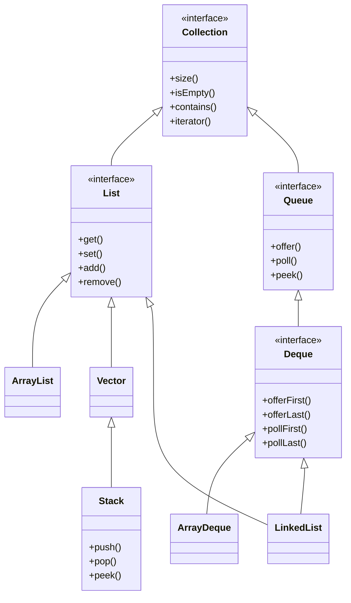

# Java集合框架中的栈和队列

# 栈 (Stack)
## 主要操作
* push() - 将元素压入栈顶
* pop() - 移除并返回栈顶元素
* peek() - 返回栈顶元素但不移除
* size() - 返回栈中元素个数
* isEmpty() - 检查栈是否为空

## 适用场景
* DFS（深度优先搜索）
    * 二叉树DFS
    * 矩阵搜索下一个可能
    * 字符串处理
    * 子问题和父问题
        * 实际上，栈可以模拟任何DFS的运行

# 队列 (Queue)
## 主要操作
* offer() - 在队列尾部添加元素
* poll() - 移除并返回队列头部元素
* peek() - 返回队列头部元素但不移除
* size() - 返回队列中元素个数
* isEmpty() - 检查栈是否为空

## 适用场景
* BFS
    * 二叉树层级遍历
    * 矩阵搜索邻居
    * String array 一个变多个

# 双向列表
## Deque
* HEAD Value
    * offerFirst(e)
    * pollFirst
    * peekFirst()
* Tail Value
    * OfferLst
    * pollLast
    * peekLast()
### Queue method
* addLast(e) => add(e)
* offerLast(e) => offer(e)
* removeFirst() => remove()
* pollFirst() => poll()
* getFirst() => element()
* peekFirst() => peek()

### Stack method
* addFirst(e)=> push()
* removeFirst() => pop()
* peekFirst() => peek()

# 类关系与操作

