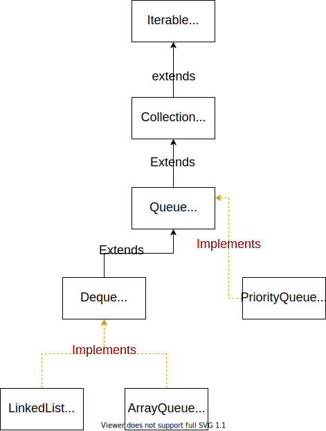

# 栈
* push()
* Pop()
* peek()
* size()
## 适用场景
* DFS
    * 二叉树DFS
    * 矩阵搜索下一个可能
    * string
    * 子问题和父问题
        * 实际上，栈是可以模拟任何dfs的运行

# 队列
* offer()
* poll()
* peek()
* size()
## 适用场景
* BFS
    * 二叉树层级遍历
    * 矩阵搜索邻居
    * String array 一个变多个

# 双向列表
## Deque
* HEAD VAlue
    * offerFirst(e)
    * pollFirst
    * peekFirst()
* Tail Value
    * OfferLst
    * pollLast
    * peekLast()
### Queue method
* addLast(e) => add(e)
* offerLast(e) => offer(e)
* removeFirst() => remove()
* pollFirst() => poll()
* getFirst() => element()
* peekFirst() => peek()

### Stack method
* addFirst(e)=> push()
* removeFirst() => pop()
* peekFirst() => peek()

# 类关系与操作

