# 并查集
* 并查集是一种数据结构
* 并查集这三个字，一个字代表一个意思。
* 并（Union），代表合并
* 查（Find），代表查找
* 集（Set），代表这是一个以字典为基础的数据结构，它的基本功能是合并集合中的元素，查找集合中的元素

并查集的典型应用是有关连通分量的问题

并查集解决单个问题（添加，合并，查找）的时间复杂度都是O(1)O(1)

因此，并查集可以应用到在线算法中

Union Find = Disjoint Set

## 实现

并查集跟树很像，只不过，在并查集这个数据结构里，节点记录父节点，树记录子节点

### 实现图解


### 路径压缩
图中的并查集可能会退化成长长列表，0->1->2->......->999->1000,这是时间复杂度退化为O(n)

```java
int find(x) {
    int root = x;
    while[fa[root] != root] {
        r = fa[root];
    }

    while(fa[x] != x) {
        int parent = fa[x];
        fa[x] = root;
        x = parent;
    }
    return x;
}
```



```java
class UnionFind {
    private Map<Integer,Integer> father;
    
    public UnionFind() {
        father = new HashMap<Integer,Integer>();
    }
    
    public void add(int x) {
        if (!father.containsKey(x)) {
            father.put(x, null);
        }
    }
    
    public void merge(int x, int y) {
        int rootX = find(x);
        int rootY = find(y);
        
        if (rootX != rootY){
            father.put(rootX,rootY);
        }
    }
    
    public int find(int x) {
        int root = x;
        
        while(father.get(root) != null){
            root = father.get(root);
        }
        
        while(x != root){
            int original_father = father.get(x);
            father.put(x,root);
            x = original_father;
        }
        
        return root;
    }
    
    public boolean isConnected(int x, int y) {
        return find(x) == find(y);
    }
} 

```

## 例题

### 323.无向图中连通分量的数目

```
给定编号从 0 到 n-1 的 n 个节点和一个无向边列表（每条边都是一对节点），请编写一个函数来计算无向图中连通分量的数目。

示例 1:

输入: n = 5 和 edges = [[0, 1], [1, 2], [3, 4]]

     0          3
     |          |
     1 --- 2    4 

输出: 2
示例 2:

输入: n = 5 和 edges = [[0, 1], [1, 2], [2, 3], [3, 4]]

     0           4
     |           |
     1 --- 2 --- 3

输出:  1

```

很明显的一个可以用并查集的问题，但是图中的问题，连通分量的数目，并查集本身并不能给出答案，这时往往我们需要另一个辅助的数据结构来保存结果

```java
class Solution {
    // 323. 无向图中连通分量的数目
    // Time O(n)
    // Space O(n)
    Map<Integer, Integer> uf = new HashMap<>(); // 储存连通分量
    Set<Integer> set = new HashSet<>(); // 储存跟节点个数

    void add(int x) {
        if(!uf.containsKey(x)) {
            uf.put(x, x);
        }
    }
    void merge(int x, int y) {
        int rootX = find(x);
        int rootY = find(y);
        if(rootX != rootY) {
            uf.put(rootY, rootX);
        }
    }
    int find(int x) {
        int root = x;
        while(root != uf.get(root)) {
            root = uf.get(root);
        }
        while(x != root) { // 压缩路径
            int tmp = uf.get(x);
            uf.put(tmp, root);
            x = tmp;
        }
        return root;
    }
    public int countComponents(int n, int[][] edges) {
        // 初始化并查集，每个节点都不需加入
        for(int i = 0; i < n; i++) {
            add(i);
        }
        for(int[] edge: edges) { // 构建并查集
            merge(edge[0], edge[1]);
        }
        for(int i = 0; i < n; i++) { // 计算根节点个数，也就是连通分量的个数
            set.add(find(i));
        }
        return set.size();
    }
}
```


## 并查集需要处理的情况
由上题可以看出，并查集只能解决连通分量的问题，在问题里，还需要处理更多的问题
* 有多少个连通分量
* 连通分量的个数
* 连通分量有没有环
* 
