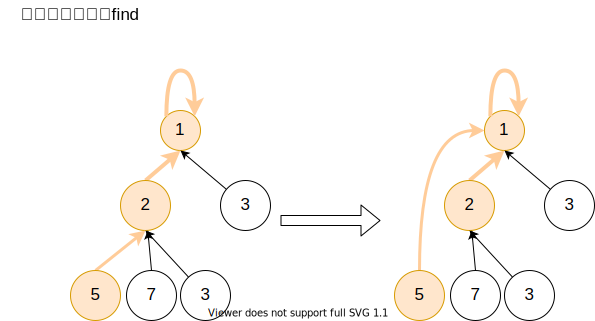

# 并查集
* 并查集是一种数据结构
* 并查集这三个字，一个字代表一个意思。
* 并（Union），代表合并
* 查（Find），代表查找
* 集（Set），代表这是一个管理不相交集合的数据结构，它的基本功能是合并集合中的元素，查找元素所属的集合
    * 在并查集的概念中，"集"指的是它管理的是不相交集合(Disjoint Sets)，而不是指它内部使用了Set数据结构。实际上，并查集通常使用数组或哈希表来实现

并查集的典型应用是有关连通分量的问题

并查集解决单个问题（添加，合并，查找）的时间复杂度都是O(1)

因此，并查集可以应用到在线算法中

Union Find = Disjoint Set

## 数学原理：等价关系与等价类

并查集的数学基石是**等价关系 (Equivalence Relation)**。理解这一点是识别所有并查集题型的钥匙。

### 等价关系的三公理

在集合论中，一个关系 R 定义在集合 S 上，如果它同时满足以下三个性质，则称 R 是一个等价关系：

1. **自反性 (Reflexivity)**：∀a ∈ S, a ~ a
   - 每个元素都与自己等价
   - 代码映射：`parent[x] = x`（初始化时每个元素是自己的代表）

2. **对称性 (Symmetry)**：a ~ b ⇒ b ~ a
   - 如果 a 与 b 等价，那么 b 与 a 也等价
   - 代码映射：`union(a, b)` 与 `union(b, a)` 效果相同

3. **传递性 (Transitivity)**：a ~ b ∧ b ~ c ⇒ a ~ c
   - 如果 a 与 b 等价、b 与 c 等价，那么 a 与 c 也等价
   - 代码映射：`union(a,b); union(b,c);` 之后 `find(a) == find(c)`

### 等价类 = 连通分量

**核心定理**：任何等价关系 ~ 都唯一地将集合 S 划分为若干互不相交的子集，这些子集称为**等价类 (Equivalence Classes)**。

```
S = [a₁] ∪ [a₂] ∪ ··· ∪ [aₖ],  [aᵢ] ∩ [aⱼ] = ∅ (i ≠ j)
```

这个数学定理直接对应并查集的结构：
* 每个等价类 = 一个**连通分量** = 并查集中的一棵**树**
* 等价类的**代表元素** = 树的**根节点** = `find(x)` 的返回值
* `union(x, y)` = 声明 x ~ y，触发两个等价类的**合并**

### find + union 的代数本质

每次 `union` 操作本质上是在对等价关系做**传递闭包 (Transitive Closure)** 的增量计算：

```
初始状态:  5个等价类        union(a,b):  合并等价类     union(b,c):  传递性闭包
[a] [b] [c] [d] [e]   →   {a,b} [c] [d] [e]     →   {a,b,c} [d] [e]
```

路径压缩和按秩合并是让这个增量计算趋近 O(1) 的工程优化，不改变代数语义。

### 题型识别的核心直觉

当你在题目中发现一种关系满足「自反、对称、传递」三性质时——就算题目没有明确给出图——这个问题在数学上就是在维护等价类，并查集天然适用。


## Core concepts
* `find(x)`: Determine which set x belongs to.
* `union(x, y)`: Merge two sets together
### 复杂度分析
在优化后的并查集实现中， find 和 union 操作的时间复杂度实际上是阿克曼函数(Ackerman function)的逆函数O(α(n))，这是一个增长极其缓慢的函数（远小于O(log n)）。
路经压缩和ranking合并，是复杂度趋近O(1)的原因。

* 如果只使用路经压缩的话，根据Hopcroft-Ullman的研究，仅使用路径压缩时，m次操作的摊还时间复杂度为O(m log n)。此时的树高度会被压缩到O(log n)级别。
* 当同时使用路径压缩和秩优化时（如Tarjan的优化方案），时间复杂度提升到O(m α(n))，其中α(n)是阿克曼函数的反函数，对于任何实际可输入的n值（n ≤ 10^600），α(n) ≤ 5
## Common applications
* Finding connected components in a graph
* Detecting cycles in a graph
* Network connectivity
    * [[0, 1], [1, 2], [3, 4]]
* Image processing (connected pixels)

## 实现Python
```python
class UnionFind:
    def __init__(self, size):
        self.parent = list(range(size))
        self.rank = [1] * size
    
    def find(self, x):
        # Path compression: make every node point directly to root
        if self.parent[x] != x:
            self.parent[x] = self.find(self.parent[x])
        return self.parent[x]
    
    def union(self, x, y):
        root_x = self.find(x)
        root_y = self.find(y)
        
        if root_x != root_y:
            # Union by rank
            if self.rank[root_x] < self.rank[root_y]:
                self.parent[root_x] = root_y
            elif self.rank[root_x] > self.rank[root_y]:
                self.parent[root_y] = root_x
            else:
                self.parent[root_y] = root_x
                self.rank[root_x] += 1
    
    def connected(self, x, y):
        return self.find(x) == self.find(y)

# Alternative implementation using dictionary for non-consecutive elements
class UnionFindDict:
    def __init__(self):
        self.parent = {}
        
    def add(self, x):
        if x not in self.parent:
            self.parent[x] = x
            
    def find(self, x):
        root = x
        # Find the root
        while self.parent[root] != root:
            root = self.parent[root]
            
        # Path compression
        while x != root:
            old_parent = self.parent[x]
            self.parent[x] = root
            x = old_parent
            
        return root
    
    def union(self, x, y):
        self.add(x)
        self.add(y)
        root_x = self.find(x)
        root_y = self.find(y)
        if root_x != root_y:
            self.parent[root_y] = root_x
            
    def connected(self, x, y):
        if x not in self.parent or y not in self.parent:
            return False
        return self.find(x) == self.find(y)
```        
## 实现Java

并查集跟树很像，只不过，在并查集这个数据结构里，节点记录父节点，树记录子节点

> [[0, 1], [1, 2], [3, 4]]`
### 实现
```java
class UnionFind {
    private int[] parent;
    // or use map
    private Map<Integer, Integer> parent;
    
    public UnionFind(int size) {
        parent = new int[size];
        
        // Initially, each element is its own parent
        for (int i = 0; i < size; i++) {
            parent[i] = i;
        }
    }
    
    // Find without path compression
    public int find(int x) {
        while (parent[x] != x) {
            x = parent[x];
        }
        return x;
    }
    
    // Union without rank
    public void union(int x, int y) {
        int rootX = find(x);
        int rootY = find(y);
        
        if (rootX != rootY) {
            parent[rootY] = rootX;  // Simply make rootX the parent of rootY
        }
    }
    
    // Check if two elements are in the same set
    public boolean connected(int x, int y) {
        return find(x) == find(y);
    }
}
```

## Optimizations
### Optimization1: 路径压缩(path compressoin)
图中的并查集可能会退化成长长列表，0->1->2->......->999->1000,这是时间复杂度退化为O(n)

```java
int find(x) {
    int root = x;
    while[fa[root] != root] {
        root = fa[root];
    }

    while(x != root) {
        int parent = fa[x];
        fa[x] = root;
        x = parent;
    }
    return root;
}
```



```java
class UnionFind {
    private Map<Integer,Integer> father;
    
    public UnionFind() {
        father = new HashMap<Integer,Integer>();
    }
    
    public void add(int x) {
        if (!father.containsKey(x)) {
            father.put(x, null);
        }
    }
    
    public void merge(int x, int y) {
        int rootX = find(x);
        int rootY = find(y);
        
        if (rootX != rootY){
            father.put(rootX,rootY);
        }
    }
    
    public int find(int x) {
        int root = x;
        
        while(father.get(root) != null){
            root = father.get(root);
        }
        
        while(x != root){
            int original_father = father.get(x);
            father.put(x,root);
            x = original_father;
        }
        
        return root;
    }
    
    public boolean isConnected(int x, int y) {
        return find(x) == find(y);
    }
} 
```

### Optimization 2: Uinon by rank
```java
class UnionFind {
    private int[] parent;
    private int[] rank;  // Used for path compression
    
    public UnionFind(int size) {
        parent = new int[size];
        rank = new int[size];
        
        // Initially, each element is its own parent
        for (int i = 0; i < size; i++) {
            parent[i] = i;
            rank[i] = 1;
        }
    }
    
    // Find with path compression
    public int find(int x) {
        if (parent[x] != x) {
            parent[x] = find(parent[x]);  // Path compression
        }
        return parent[x];
    }
    
    // Union by rank
    public void union(int x, int y) {
        int rootX = find(x);
        int rootY = find(y);
        
        if (rootX != rootY) {
            // Union by rank
            if (rank[rootX] < rank[rootY]) {
                parent[rootX] = rootY;  // Smaller tree (rootX) attaches to larger tree (rootY)
            } else if (rank[rootX] > rank[rootY]) {
                parent[rootY] = rootX;  // Smaller tree (rootY) attaches to larger tree (rootX)
            } else {  // Same rank
                parent[rootY] = rootX;  // Arbitrary choice
                rank[rootX]++;  // Height increases by 1
            }
        }
    }
    
    // Check if two elements are in the same set
    public boolean connected(int x, int y) {
        return find(x) == find(y);
    }
}
```

#### How union by rank help optimize the algorithm
```
Initial state:     After union without rank:    After union with rank:
1       4          1                           4
|       |          |                          / \
2       5          2                         1   5
|                  |                         |
3                  3                         2
                   |                         |
                   4                         3
                   |
                   5
Height: 2,2        Height: 5                 Height: 3

```
## Union Find Algorithm Visualization
### Initial State
```
Initially, each element is its own parent:

Elements:   0   1   2   3   4   5
Parents:    0   1   2   3   4   5
Rank:       1   1   1   1   1   1

Visualization:
0    1    2    3    4    5
⭕   ⭕   ⭕   ⭕   ⭕   ⭕
(Each node is a separate tree)
```

### Step 1: Union(1, 2)
```
After union(1, 2):

Elements:   0   1   2   3   4   5
Parents:    0   1   1   3   4   5
Rank:       1   2   1   1   1   1

Visualization:
0       1       3    4    5
⭕      ⭕      ⭕   ⭕   ⭕
       /
      2
```

### Step 2: Union(3, 4)
```
After union(3, 4):

Elements:   0   1   2   3   4   5
Parents:    0   1   1   3   3   5
Rank:       1   2   1   2   1   1

Visualization:
0       1       3        5
⭕      ⭕      ⭕       ⭕
       /      /
      2      4
```

### Step 3: Union(1, 3)
```
After union(1, 3) (union by rank - 1 and 3 have same rank, arbitrarily choose 1 as root):

Elements:   0   1   2   3   4   5
Parents:    0   1   1   1   3   5
Rank:       1   3   1   2   1   1

Visualization:
0       1           5
⭕      ⭕          ⭕
      /  \
     2    3
          |
          4
```

### Path Compression Example
```
When we call find(4), before path compression:
4 -> 3 -> 1

After path compression:
4 directly points to 1

Elements:   0   1   2   3   4   5
Parents:    0   1   1   1   1   5
Rank:       1   3   1   2   1   1

Visualization:
0       1           5
⭕      ⭕          ⭕
     /  |  \
    2   3   4
```

### Key Points

1. **Path Compression**
   - Makes the tree flat
   - All nodes point directly to root
   - Improves future operations

2. **Union by Rank**
   - Keeps trees balanced
   - Attaches smaller tree to larger tree
   - Prevents long chains

3. **Time Complexity**
   ```
   Without optimizations:
   - find():  O(N)
   - union(): O(N)

   With path compression and union by rank:
   - find():  ~O(1)
   - union(): ~O(1)
   ```

## 例题
* Number of Connected Components in an Undirected Graph
* Friend Circles / Number of Provinces
* Redundant Connection
* Accounts Merge
* Number of Islands II

### 323.无向图中连通分量的数目

```
给定编号从 0 到 n-1 的 n 个节点和一个无向边列表（每条边都是一对节点），请编写一个函数来计算无向图中连通分量的数目。

示例 1:

输入: n = 5 和 edges = [[0, 1], [1, 2], [3, 4]]

     0          3
     |          |
     1 --- 2    4 

输出: 2
示例 2:

输入: n = 5 和 edges = [[0, 1], [1, 2], [2, 3], [3, 4]]

     0           4
     |           |
     1 --- 2 --- 3

输出:  1

```

很明显的一个可以用并查集的问题，但是图中的问题，连通分量的数目，并查集本身并不能给出答案，这时往往我们需要另一个辅助的数据结构来保存结果

```java
class Solution {
    // 323. 无向图中连通分量的数目
    // Time O(n)
    // Space O(n)
    Map<Integer, Integer> uf = new HashMap<>(); // 储存连通分量
    Set<Integer> set = new HashSet<>(); // 储存跟节点个数

    void add(int x) {
        if(!uf.containsKey(x)) {
            uf.put(x, x);
        }
    }
    void merge(int x, int y) {
        int rootX = find(x);
        int rootY = find(y);
        if(rootX != rootY) {
            uf.put(rootY, rootX);
        }
    }
    int find(int x) {
        int root = x;
        while(root != uf.get(root)) {
            root = uf.get(root);
        }
        while(x != root) { // 压缩路径
            int tmp = uf.get(x);
            uf.put(tmp, root);
            x = tmp;
        }
        return root;
    }
    public int countComponents(int n, int[][] edges) {
        // 初始化并查集，每个节点都不需加入
        for(int i = 0; i < n; i++) {
            add(i);
        }
        for(int[] edge: edges) { // 构建并查集
            merge(edge[0], edge[1]);
        }
        for(int i = 0; i < n; i++) { // 计算根节点个数，也就是连通分量的个数
            set.add(find(i));
        }
        return set.size();
    }
}
```


## 并查集 vs DFS/BFS 决策框架

由上题可以看出，并查集的核心能力是维护连通分量。但拿到一道连通性问题时，到底该用并查集还是 DFS/BFS？以下是完整的决策树。

### 决策树

```
拿到一道图/集合/连通性问题
│
├─ 问题核心是连通性/分组吗？
│   ├─ 否 → DFS/BFS/DP/其他
│   └─ 是 ↓
│
├─ 需要路径信息（最短距离、具体路径）吗？
│   ├─ 是 → BFS 求距离 / DFS 求路径
│   └─ 否 ↓
│
├─ 是否有动态增量（在线添加边/元素，每次操作后查询）？
│   ├─ 是 → ✅ 并查集最优（杀手级场景）
│   └─ 否 ↓
│
├─ 需要遍历某个连通分量的所有成员吗？
│   ├─ 是 → DFS 或 并查集 + 辅助 Map（如 721 Accounts Merge）
│   └─ 否 → ✅ 并查集简洁高效（纯连通性判定/计数）
```

### 判据对照表

| 条件 | 推荐算法 | 原因 |
|------|---------|------|
| 只需判定连通性，不需路径 | **并查集** | O(α(n)) vs O(V+E) |
| 需要最短距离/路径 | **BFS/DFS** | 并查集不维护路径信息 |
| 边动态增加，在线查询 | **并查集** | DFS 每次要重新遍历全图 |
| 需要遍历分量的所有成员 | **DFS** 或 **并查集+辅助Map** | 并查集不维护成员列表 |
| 有向图的连通性 | **DFS/BFS** | 并查集天然适配无向图 |
| 判断环 + 定位冗余边 | **并查集** | union 时 find 相同 → 环 |

### 数学对偶性

同一问题（如 Number of Islands, Number of Provinces）往往可以用 DFS 和并查集两种方式解决。这不是巧合，而是数学上的对偶：

* **DFS 视角**：从节点出发，遍历所有可达节点 → 染色。「自顶向下的过程性思维」
* **UF 视角**：逐条处理边，合并端点所属的集合 → 代数运算。「自底向上的声明性思维」
* **数学等价**：两者计算的都是等价关系的**传递闭包 (Transitive Closure)**

### 并查集的杀手级优势：在线算法

当有 m 次「添加边 + 查询连通性」操作时：
* DFS/BFS：每次查询都要重新遍历，总计 O(m × (V+E))
* 并查集：每次合并+查询均摊 O(α(n)) ≈ O(1)，总计 O(m × α(n))

典型题：305. Number of Islands II（逐个加岛，每次返回岛屿数）

### 并查集需要辅助结构的常见场景

由上面 323 题可以看出，并查集本身只能回答「a 和 b 是否连通」，其他信息需要额外维护：

| 需要的信息 | 辅助结构 | 例题 |
|-----------|---------|------|
| 连通分量的数目 | 遍历所有 find(i)，用 Set 统计根节点数 | 323, 547 |
| 连通分量的成员列表 | Map\<root, List\<member\>\> | 721 Accounts Merge |
| 连通分量是否有环 | union 时检测 find(x) == find(y) | 684, 261 |
| 连通分量的大小 | int[] size，union 时累加 | 最大连通分量 |
| 元素间的相对关系 | 带权并查集（weight 数组） | 399 Evaluate Division |