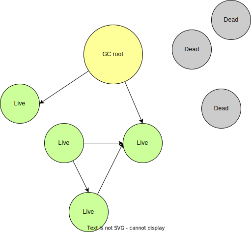
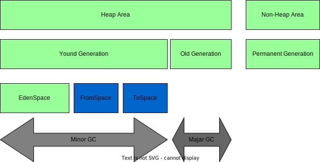
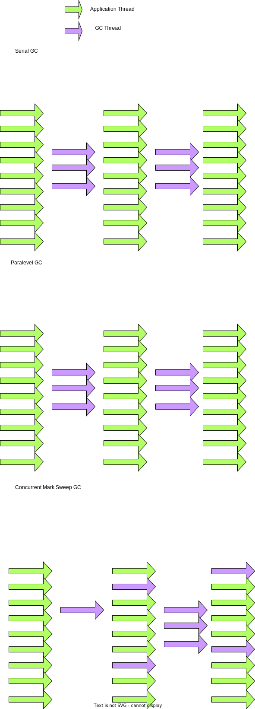

## Java GC

Garbage collection in Java is implemented as Java Garbage collector in JVM.

Objects can be 
* Live - being used and referenced
* Dead - no longer used or referenced

The core concept is reachability

Garbage collectors work on the concept of Garbage Colelction Roots(GC Roots) to identify 

### GC important concepts

Garbage collector scan objects reachability from GC roots.

### GC phrases
A general garbage collection phrases. And three different thinkings.

* Mark
* Sweep
* Compact

| Phrase | 1 | 2 | 3 | 4 | 5 | 6| 7|
|---|---|---|---|---|---|---|---|
|MARK | ✅ | 🟡 | ✅ | ✅ | 🟡 | ✅ | ✅ |
|SWEEP | ✅ | ⚪️ | ✅ | ✅ | ⚪️ | ✅ | ✅ |
|COMPACT | ✅ |  ✅ | ✅ |  ✅ | ✅ | ⚪️| ⚪️| 

#### cons
* MARK and SWEEP: memory friction
* MARK and COMPACT: coping is resource heavy and operational heavy.

### Generational Garbage collection
* Empirical analysis has shown that most objects in java are short lived.

So the optimization is to categorizes objects by age.

#### Yound generations
* **Eden space** - all new objects 
* **Survivor spaces(FromSpace & ToSpace)** - objects are moved here from Eden after one garbage collection cycle

the process goes 
1. Eden has all objects(live and dead)
2. **Minor GC occurs** - all dead are removed from Eden. All live objects are moved to S1. Eden and E2 are now emptry
3. New objects are created to Eden. some objects in Eden and S1 become dead.
4. **Minor GC occurs** - all dead objects are removed from Eden and S1. All live are move3d to S2. Eden and S1 are empty.

#### Old generations
Long-lived objects are eventually moved from Young Generation to the Old Generations.

Major garbage collection event will collect garbage from old generations.

## Types of Garbage collectors in JVM
### Serial GC
### Paralevel GC
### Concurrent Mark Sweep(CMS) GC

