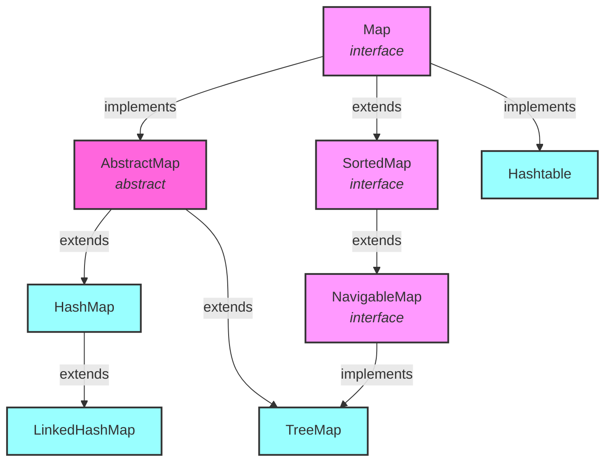

# Java HashMap Collection Hierarchy



Key characteristics:
- **HashMap**: Not synchronized, allows null keys/values, O(1) operations
- **Hashtable**: Synchronized, no null keys/values, legacy class
- **TreeMap**: Implements SortedMap, keeps keys sorted, O(log n) operations
- **LinkedHashMap**: (Subclass of HashMap) maintains insertion order

## HashMap实现原理
### 存储结构
* Array + (链表 or 红黑树)
```
Array of buckets
[0] -> null
[1] -> LinkedList or Red-Black Tree
[2] -> null
...
[n] -> LinkedList or Red-Black Tree
```

### Array 初始容量
* 默认大小16
* 负载因子0.75
### Array 扩容 resizing O(n)
size > capacity * load factor => New capacity = old capacity * 2 (max capacity 2^30)


### 初始容量
* 默认大小16
* 负载因子0.75
* 传k的话，那么初始化为 大于k的2^n, 
    * 比如初始值10，那么初始化为16
```
// 如何得到比初始值大的那个2^n
static final int tableSizeFor(int cap) {
  int n = cap - 1;
  n |= n >>> 1;
  n |= n >>> 2;
  n |= n >>> 4;
  n |= n >>> 8;
  n |= n >>> 16;
  return (n < 0) ? 1 : (n >= MAXIMUM_CAPACITY) ? MAXIMUM_CAPACITY : n + 1;
}

// 比如初值传50，算法就是让初始二进制右移1，2，4，8，16位，分别与自己异或，把高位第一个为1的数通过不断右移，把高位为1的后几位全变为1，111111 + 1 = 1000000 = 2^6（符合大于50并且是2的整数次幂 ）

```


### Hash值计算/索引计算

**Hash函数如何设计？索引如何计算**


拿key到hashcode（32位int值），高16位和低16位进行抑或运算

```java
// jdk1.8
static final int hash(Object key) {   
     int h;
     return (key == null) ? 0 : (h = key.hashCode()) ^ (h >>> 16);
    /* 
     h = key.hashCode() 为第一步：取hashCode值
     h ^ (h >>> 16)  为第二步：高位参与运算
    */
}

// index
bucketIndex = indexFor(hash, table.length);

static int indexFor(int h, int length) {
     return h & (length-1);
}
```
#### 为什么Hash函数这么设计

**扰动函数**

高bit低bit都参与hash计算，降低**碰撞**。

* 为什么能降低碰撞？
    1. hash值处在[-2^32, 2^32-1]，直接用hashcode也可以，使用此扰动函数，是为了之后的索引计算
    2. 索引计算，一般是 hash%length
    3. hash % length，根据散列值的设计（hashcode），碰撞会很严重。如果散列值设计的不好，最后几位出现规律，更多碰撞。
    4. 扰动函数的价值，高bit低bit都参与hash计算，降低**碰撞**。
* 位运算，开销不大
* 下标稳定(refer indexFor)
    * 取下标是 散列值 & 数组长度-1
    * 或者散列值 % 数组长度
    * 位运算 远快于 模运算
* 此处也解释了，为什么前边，HashMap的数组长度取2^n, 因为这样(length-1)正好就是数组长度取模.
    * 以16为例，
    * 16        => 0001 0000
    * 16 - 1=15 => 0000 1111
    * h & (length-1) 就是数组中有效下标

### bucket元素
Bucket 元素是链表 or 红黑树

#### 为什么链表+红黑树，而不是？
    
**为什么不能只要链表**
查询效率差

为什么不是只要**红黑树？**？
    
红黑树需要更多存储空间，并且要进行左旋，右旋，变色保持平衡；单链表不需要。
* 元素数小于8，单链表满足性能。O(n)
* 大于8，红黑树O(lngn)

只用**二叉查找树?**
可以，但是特殊情况下，会变成一条线形链表，深遍历。

### **链表转红黑树的长度互转阈值 8？**
| **链表转红黑树阈值 8？** | 红黑树转链表 | 
| ---- | ----- | 
| 8 | 6 | 

链表转红黑树的阈值8的原因

1. 泊松分布，8以上的概率很小。
2. 元素较少时，链表有更高的效率。

## HashMap 基本操作
### put方法/插入数据(你知道HashMap的数据插入原理吗?)

1. 判断数组是否为空，为空进行初始化;
2. 不为空，计算 k 的 hash 值，通过(n - 1) & hash计算应当存放在数组中的下标 index;
3. 查看 table[index] 是否存在数据，没有数据就构造一个Node节点存放在 table[index] 中；
4. 存在数据，说明发生了hash冲突(存在二个节点key的hash值一样), 继续判断key是否相等，相等，用新的value替换原数据(onlyIfAbsent为false)；
5. 如果不相等，判断当前节点类型是不是树型节点，如果是树型节点，创造树型节点插入红黑树中；
6. 如果不是树型节点，创建普通Node加入链表中；判断链表长度是否大于 8， 大于的话链表转换为红黑树；
7. 插入完成之后判断当前节点数是否大于阈值，如果大于开始扩容为原数组的二倍。

## 扩容
### 加载因子0.75， why not 0.6 or 0.8？
     final float loadFactor;    // 负载因子
     int modCount;  
     int size;  

     threshold = size * loadFactor;
```
举个例子，加载因子0.75, 初始值16，当16*0.75=12，就会触发扩容。


| loadFactor | pros | cons |
|------------|------|------|
| bigger | 数据多，空间利用率高 | 哈希冲突大，查找成本高 |
| smaller | 哈希冲突小，查找快 | 浪费空间, 提高扩容触发几率 |


### 扩容实现
JDK1.7: 扩容有两步，resize(double), 和transfer。如下图所示

```java
void resize(int newCapacity) {   //传入新的容量
    Entry[] oldTable = table;    //引用扩容前的Entry数组
    int oldCapacity = oldTable.length;         
    if (oldCapacity == MAXIMUM_CAPACITY) {  //扩容前的数组大小如果已经达到最大(2^30)
        threshold = Integer.MAX_VALUE; //修改阈值为int的最大值(2^31-1)，这样以后就不扩容了
        return;
    }
 
    Entry[] newTable = new Entry[newCapacity];  //初始化一个新的Entry数组
    transfer(newTable);                         //！！将数据转移到新的Entry数组里
    table = newTable;                           //HashMap的table属性引用新的Entry组
    threshold = (int)(newCapacity * loadFactor);//修改阈值
}

void transfer(Entry[] newTable) {
    Entry[] src = table;                   //src引用了旧的Entry数组
    int newCapacity = newTable.length;
    for (int j = 0; j < src.length; j++) { //遍历旧的Entry数组
        Entry<K,V> e = src[j];             //取得旧Entry数组的每个元素
        if (e != null) {
            src[j] = null;//释放旧Entry数组的对象引用（for循环后，旧的Entry数组不再引任何对象）
            do {
                Entry<K,V> next = e.next;
                int i = indexFor(e.hash, newCapacity); //！！重新计算每个元素在数组的位置
                e.next = newTable[i]; //标记[1]
                newTable[i] = e;      //将元素放在数组上
                e = next;             //访问下一个Entry链上的元素
            } while (e != null);
        }
    }
} 

```


### JDK 1.8


## HashMap线程安全?NO
* 多线程下扩容会死循环
* 多线程下 put 会导致元素丢失
* put 和 get 并发时会导致 get 到 null
### 扩容时死循环
JDK7, 头部插入

### 多线程下 put 会导致元素丢失
### put 和 get 并发时会导致 get 到 null
## 如何线程安全

*  Collections.SynchronizedMap()
    *
    ```java
    Map<String, Integer> testMap = new HashMap<>();
    ///...
    Map<String, Integer> map = Collections.synchronizedMap(testMap);
    内部实现等同于HashTable
    ```
* HashTable
* ConcurrentHashMap
## ConcurrentHashMap的实现
### JDK 1.7: 分段锁（Segment）
* 将数据分成多个段（Segment），每个段一个锁
* 每个Segment继承自ReentrantLock
* 默认16个段，最多支持16个线程并发写
* 优点：分段降低锁竞争

### JDK 1.8: CAS + synchronized
* 摒弃Segment，采用Node数组+链表+红黑树
#### 同步机制：
1. **CAS（Compare And Swap）**：
* 无锁算法，CPU原子指令
    * 原理：比较内存值V和预期值E，相同则更新为新值N
    * 使用场景：初始化table、更新Node等
    * 优点：无阻塞，性能好
    * 缺点：自旋消耗CPU，ABA问题
* 原理详解：
    ```java
    // CAS的伪代码实现
    public boolean compareAndSwap(int expectedValue, int newValue) {
        // 原子操作，不会被中断
        if (value == expectedValue) {
            value = newValue;
            return true;
        }
        return false;
    }
    ```
    * 具体执行过程：
    1. 读取当前值到CPU缓存
    2. 比较CPU缓存中的值与预期值
    3. 如果相等，则更新为新值
    4. 如果不等，说明其他线程修改过，返回false

    * ABA问题详解：
    ```java
    // 初始值 A
    // 线程1准备把 A 改成 B
    // 线程2把 A 改成 B，再改回 A
    // 线程1 CAS检查发现还是 A，成功改成 B
    // 问题：值虽然还是 A，但是已经发生过改变
    
    // 解决方案：使用版本号
    class AtomicStampedReference<V> {
        private V value;
        private int stamp; // 版本号
    }
    ```

    * 在ConcurrentHashMap中的应用：
    ```java
    // 初始化table数组
    private final Node<K,V>[] initTable() {
        Node<K,V>[] tab; int sc;
        while ((tab = table) == null || tab.length == 0) {
            if ((sc = sizeCtl) < 0) // 其他线程在初始化
                Thread.yield(); 
            // CAS设置sizeCtl为-1，标记正在初始化
            else if (U.compareAndSwapInt(this, SIZECTL, sc, -1)) {
                try {
                    // 初始化逻辑
                } finally {
                    sizeCtl = sc;
                }
                break;
            }
        }
        return tab;
    }
    ```

2. **synchronized**：
    * 使用场景：put操作时，锁定链表或红黑树的首节点
    * JDK 1.6后性能优化：
        - 偏向锁：无竞争时，标记线程ID
        - 轻量级锁：自旋等待
        - 重量级锁：线程阻塞
    * 实现原理：
        - 在对象头中存储锁信息（Mark Word）
        - 包含：锁状态、线程ID、锁记录、哈希码等

    * 锁升级过程：
    ```java
    // 无锁 -> 偏向锁 -> 轻量级锁 -> 重量级锁
    public class SynchronizedExample {
        public synchronized void method() {
            // 锁升级过程示例
            // 1. 第一次进入：偏向锁（记录线程ID）
            // 2. 其他线程竞争：升级为轻量级锁（自旋）
            // 3. 自旋超时：升级为重量级锁（阻塞）
        }
    }
    ```

    * 在ConcurrentHashMap中的应用：
    ```java
    final V putVal(K key, V value, boolean onlyIfAbsent) {
        // ...
        synchronized (f) { // f是链表的首节点
            if (tabAt(tab, i) == f) {
                if (fh >= 0) { // 链表
                    // 链表插入逻辑
                }
                else if (f instanceof TreeBin) { // 红黑树
                    // 红黑树插入逻辑
                }
            }
        }
        // ...
    }
    ```
#### 对比
| 机制 | 优点 | 缺点 |
|------|------|------|
| CAS | 无锁，性能好，无阻塞 | CPU消耗，ABA问题 |
| synchronized | 实现简单，保证可见性 | 阻塞，性能相对较低 |
| 分段锁 | 并发度高，锁竞争少 | 实现复杂，内存占用大 |

## HashMap vs ConcurrentHashMap 数据结构对比

| 版本 | HashMap 数据结构 | ConcurrentHashMap 数据结构 |
|------|------------------|----------------------------|
| JDK 1.7 | 数组 + 链表 | 分段锁 + 数组 + 链表 |
| JDK 1.8 | 数组 + (链表 or 红黑树) | 数组 + (链表 or 红黑树) |

## 详细对比

| 特性 | HashMap | ConcurrentHashMap |
|------|---------|-------------------|
| **JDK 1.7** | | |
| 数据结构 | 数组 + 链表 | 分段锁 + 数组 + 链表 |
| 线程安全 | 非线程安全 | 线程安全 |
| 锁机制 | 无锁 | 分段锁（Segment） |
| 并发度 | 单线程 | 默认16个段，支持16线程并发 |
| **JDK 1.8** | | |
| 数据结构 | 数组 + (链表 or 红黑树) | 数组 + (链表 or 红黑树) |
| 线程安全 | 非线程安全 | 线程安全 |
| 锁机制 | 无锁 | CAS + synchronized |
| 并发度 | 单线程 | 更高并发度 |
| 树化阈值 | 链表长度 >= 8 | 链表长度 >= 8 |
| 反树化阈值 | 链表长度 <= 6 | 链表长度 <= 6 |
| 扩容机制 | 重新计算hash | 利用高位bit判断 |
## 有序HashMap
TreeMap和LinkedHashMap
### LinedHashMap
* 双向链表
* head and tail节点
* LinkedHashMap节点Entry内部，还有before, after节点
### TreeMap
* 红黑树
* key的自然顺序排序，或者提供的comparator接口的比较函数

## Reference
* [安琪拉的博客](https://juejin.cn/post/6844904090711900168)
* [Java 8系列之重新认识HashMap](https://tech.meituan.com/2016/06/24/java-hashmap.html)
* [Java HashMap详解：源码分析、hash 原理、扩容机制、加载因子、线程不安全](https://javabetter.cn/collection/hashmap.html#_04%E3%80%81%E7%BA%BF%E7%A8%8B%E4%B8%8D%E5%AE%89%E5%85%A8)
