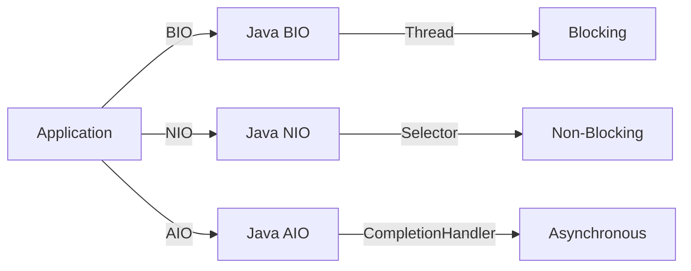
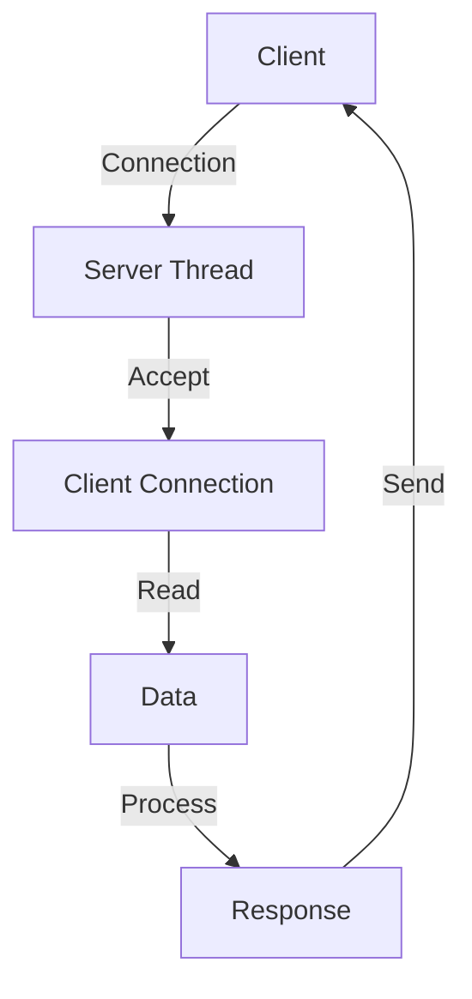
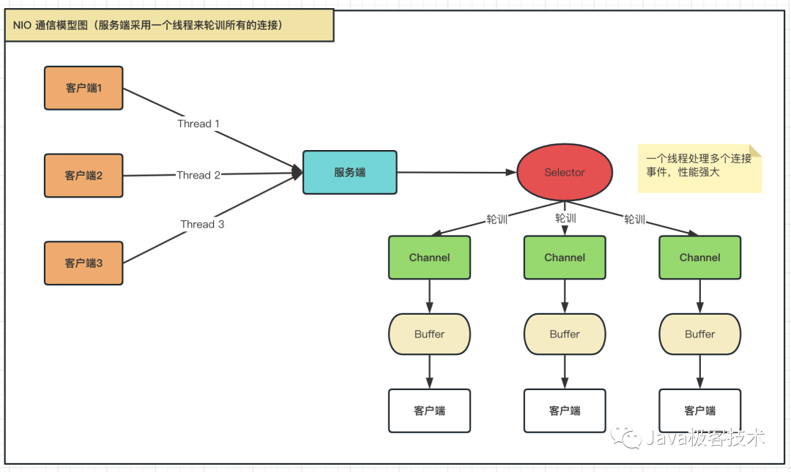
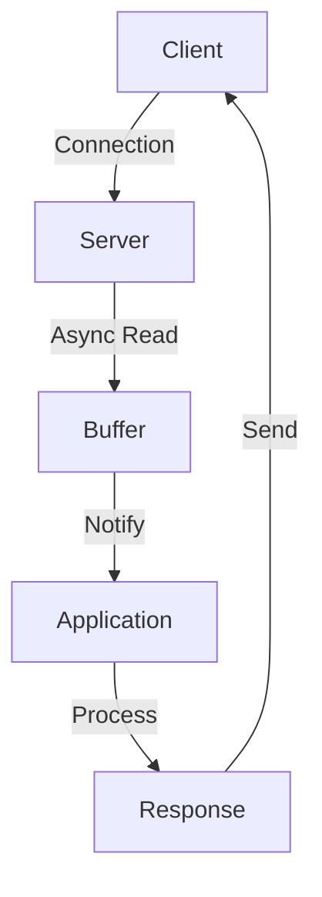

# Java IO Models
Java BIO (Blocking I/O) is a traditional I/O API that uses stream-based I/O and is blocking in nature. It uses a thread for each I/O operation and is not scalable.

Java NIO (Non-Blocking I/O) is a non-blocking I/O API that uses channels and buffers for I/O operations. It is more efficient than BIO and can be used for both blocking and non-blocking I/O operations.

Java AIO (Asynchronous I/O) is an asynchronous I/O API that uses callbacks and Futures for I/O operations. It is more efficient than NIO and can be used for both blocking and non-blocking I/O operations.



## BIO
- **Blocking I/O** is a synchronous model where one client connection corresponds to one thread. It blocks on accept and read methods.


### 代码实例
* [单客户端对单服务端，发送单条信息](https://juejin.cn/post/7121354128067919886)
* [单客户端对单服务端，发送多条消息](https://juejin.cn/post/7121354128067919886)
* [多客户端对单服务端，发送多条消息](https://juejin.cn/post/7121354128067919886)

## NIO
- **Non-blocking I/O** allows one thread to handle multiple requests using a multiplexer selector to check for I/O events. It includes three core components: Buffer, Channel, and Selector.



### **Buffer**
一个用于特定基本数据类型的容器，由java.nio包定义的，所有缓冲区都是Buffer抽象类的子类。Java NIO中的Buffer主要用于与NIO通道的交互，数据是从通道读入缓冲区，从缓冲区写入通道中的

```java
ByteBuffer
CharBuffer
ShortBuffer
IntBuffer
LongBuffer
FloatBuffer
DoubleBuffer
```
一些常用方法
```java
Buffer clear();// 清空缓冲区并返回对缓冲区的引用
Buffer flip();// 为将缓冲区的界限设置为当前位置，并将当前位置重制为0
int capacity();// 返回Buffer的capacity大小
boolean hasRemaining();// 判断缓冲区是否还有元素
int limit();// 返回Buffer的界限(limit)的位置
Buffer limit(int n);// 将设置缓冲区界限为n，并返回一个具有新limit的缓冲区对象
Buffer mark();//对缓冲区设置标记
int position();// 返回缓冲区的当前位置position
Buffer position(int n);// 将设置缓冲区的当前位置为n，并返回修改后的Buffer对象
int remaining();//返回position和limit之间的元素个数
Buffer reset();//将位置position转到以前设置的mark所有的位置
Buffer rewind();// 将位置设为0，取消设置的mark

```
### **Channel**    
由java.nio.channels包定义的。 通道是用于读写数据的基本单位。在Java NIO中，通道是通过它们对应的文件来实现的。一个通道可以被打开（open），读取（read）或写入（write）数据

**常用Channel实现类**
```
FileChannel：用于读取、写入、映射和操作文件的通道
DatagramChannel：通过UDP读写网络中的数据通道
SocketChannel：通过TCP读写网络中的数据
ServerSocketChannel：可以监听新进来的TCP连接，对每一个新进来的连接都会创建一个SocketChannel。【ServerSocketChannel类似ServerSocket，SocketChannel类似Socket】
```
**FileChannel常用方法**
```
int read(ByteBuffer dst);// 从Channel中读取数据到ByteBuffer
long read(ByteBuffer[] dsts);//将Channel中的数据分散到ByteBuffer[]中
int write(ByteBuffer src);// 将ByteBuffer中的数据写入到Channel
long write(ByteBuffer[] srcs);// 将ByteBuffer[]中的数据聚集到Channel
long position();//返回此通道的文件位置
FileChannel position(long p);// 设置此通道的文件位置
long size();// 返回此通道的文件的当前大小
FileChannel truncate(long s);// 将此通道的文件截取为指定大小s
void force(boolean metaData);//强制将所有对此通道的文件更新写入到存储设备中
```
### **Selector**

选择器(Selector)是SelectableChannel对象的多路复用器，Selector可以同时监控多个SelectableChannel的IO状况，利用Selector可使一个单独的线程管理多个Channel。Selector是非阻塞的IO的核心
### Code example
```java
// server
public class Server {
    public static void main(String[] args) throws  Exception{
        // 获取通道
        ServerSocketChannel serverSocketChannel = ServerSocketChannel.open();
        // 配置非阻塞模式
        serverSocketChannel.configureBlocking(false);
        // 绑定连接端口
        serverSocketChannel.bind(new InetSocketAddress(8888));
        // 获取选择器
        Selector selector = Selector.open();
        // 将通道注册到选择器上，并且指定监听接收事件
        serverSocketChannel.register(selector, SelectionKey.OP_ACCEPT);
        // 使用Selector选择器轮询已经就绪的事件
        while (selector.select()>0){
            System.out.println("开始轮询获取事件");
            // 获取选择器中所有已经就绪好的事件
            Iterator<SelectionKey> iterator = selector.selectedKeys().iterator();
            // 开始遍历事件
            while (iterator.hasNext()){
                // 拿到当前事件
                SelectionKey sk = iterator.next();
                // 判断当前事件是什么类型
                if (sk.isAcceptable()){
                    // 获取当前接入的客户端通道
                    SocketChannel socketChannel = serverSocketChannel.accept();
                    // 配置非阻塞模式
                    socketChannel.configureBlocking(false);
                    // 将本客户端通道注册到选择器
                    socketChannel.register(selector,SelectionKey.OP_READ);
                }else if (sk.isReadable()){
                    // 获取当前选择器上 《读》 就绪事件
                    SocketChannel channel =(SocketChannel) sk.channel();
                    // 读取数据
                    ByteBuffer buffer = ByteBuffer.allocate(1024);
                    int len =0;
                    while ((len = channel.read(buffer))>0){
                        buffer.flip();
                        System.out.println(new String(buffer.array(),0,len));
                        // 清除之前的数据
                        buffer.clear();
                    }
                }
                iterator.remove();
            }
        }

    }
}


// Client 
public class Client {
    public static void main(String[] args) throws Exception{
        // 获取通道
        SocketChannel socketChannel = SocketChannel.open(new InetSocketAddress(8888));
        // 配置非阻塞模式
        socketChannel.configureBlocking(false);
        // 分配指定缓冲区大小
        ByteBuffer buffer = ByteBuffer.allocate(1024);
        // 发送数据到服务端
        Scanner sc = new Scanner(System.in);
        while (true){
            System.out.println("请说：");
            String msg = sc.nextLine();
            buffer.put(("zuiyu:"+msg).getBytes());
            buffer.flip();
            socketChannel.write(buffer);
            buffer.clear();
        }
    }
}
```
## AIO (NIO 2.0)
- **Asynchronous I/O** allows operations to be performed asynchronously, suitable for applications with many connections. It notifies the application when read/write operations are complete.


**常用channel**
```java
AsynchronousSocketChannel
AsynchronousServerSocketChannel
AsynchronousFileChannel
```

## NIO VS AIO
* NIO方式适于连接数目多且连接比较短(轻操作)的架构，比如聊天服务器，弹幕系统，服务器间通讯等，编程比较复杂，JDK1.4开始支持
* AIO方式使用与连接数目多且连接比较长(重操作)的架构，比较相册服务器，充分调用OS参与并发操作，编程比较复杂，JDK7开始支持

# Reference
* [Essential Technologies for Java Developers: I/O and Netty](https://alibaba-cloud.medium.com/essential-technologies-for-java-developers-i-o-and-netty-ec765676fd21)
* [一文彻底理解BIO、NIO、AIO](https://juejin.cn/post/7121354128067919886)

