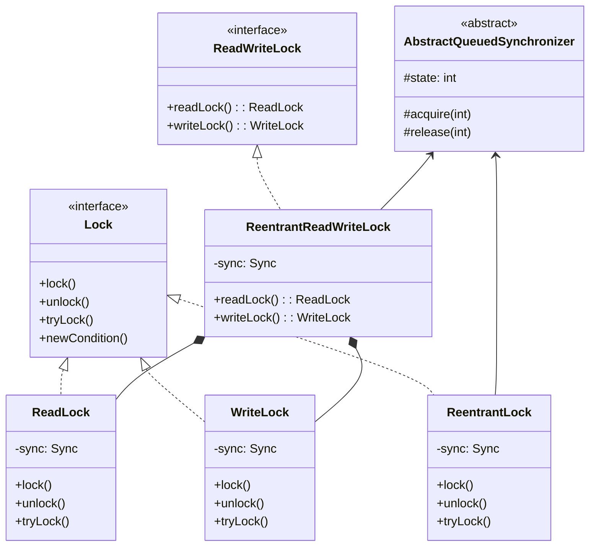

# Java Locks Deep Dive

## Lock Class Hierarchy



## 2 详细锁分类


### 2.0 锁分类总览
在Java中一把锁可能同时符合多个标准属于多种分类。例如，ReentrantLock既是可中断锁，又是可重入锁。

根据分类标准，我们将锁分为以下7大类别：

* 悲观锁/乐观锁；
* 自旋锁/非自旋锁；
* 可重入锁/非可重入锁；
* 公平锁/非公平锁；
* 共享锁/独占锁；
* 偏向锁/轻量级锁/重量级锁；
* 可中断锁/不可中断锁。


| 序号 | 锁名称 | 应用 | 实现机制 | 详细描述 |
|------|--------|-------|----------|----------|
| 1 | 乐观锁 | CAS | 版本号机制或CAS原子操作 | 乐观锁假设数据一般不会发生冲突，只在数据提交时检查是否违反数据完整性。实现方式通常是基于版本号(version)或CAS(Compare And Swap)算法。不会造成线程阻塞。 |
| 1 | 悲观锁 | synchronized、vector、hashtable | 监视器模式（Monitor）和操作系统互斥量 | 悲观锁假设数据随时会发生冲突，访问数据前先加锁。独占资源，同一时刻只允许一个线程访问。会造成其他线程阻塞等待。 |
| 2 | 自旋锁 | CAS | 循环检测CAS操作 | 当线程获取锁失败时，不会立即阻塞，而是循环尝试获取锁，直到成功为止。适用于锁竞争不激烈且锁持有时间短的场景。避免线程上下文切换的开销。 |
| 3 | 可重入锁 | synchronized、Reentrantlock、Lock | 线程ID识别和计数器机制 | 同一个线程可以多次获取同一把锁，而不会造成死锁。每次获取锁时锁计数器加1，释放锁时计数器减1，计数器为0时才真正释放锁。 |
| 4 | 读写锁 | ReentrantReadWriteLock，CopyOnWriteArrayList、CopyOnWriteArraySet | 读写状态位分离，AQS框架 | 将对共享资源的访问分为读操作和写操作。读锁可以由多个线程同时持有（共享），写锁是独占的。提高共享资源的并发访问效率。 |
| 5 | 公平锁 | Reentrantlock(true) | AQS框架的FIFO等待队列 | 严格按照线程申请锁的顺序来分配锁，等待时间最长的线程优先获取锁。虽然公平性得到保证，但整体吞吐量会下降。 |
| 5 | 非公平锁 | synchronized、reentrantlock(false) | 抢占式机制，无等待队列顺序 | 不保证等待线程获取锁的顺序，允许"插队"。可能导致某些线程长期等待，但整体吞吐量较高。 |
| 6 | 共享锁 | ReentrantReadWriteLock中读锁 | AQS框架的共享模式 | 允许多个线程同时获取锁，适用于只读操作。多个线程可以同时读取共享资源，提高并发性。 |
| 6 | 独占锁 | synchronized、vector、hashtable、ReentrantReadWriteLock中写锁 | AQS框架的独占模式 | 同一时刻只允许一个线程获取锁，其他线程必须等待。保证数据的强一致性。 |
| 7 | 偏向锁 | 锁优化技术 | 对象头的线程ID存储和CAS操作 | JVM对轻量级锁的进一步优化，假设同一个锁总是由同一个线程获取。当该假设成立时，不需要任何同步操作。 |
| 7 | 轻量级锁 | 锁优化技术 | 栈帧中的Lock Record和CAS操作 | JVM对重量级锁的优化，通过CAS操作实现加锁和解锁。适用于锁竞争不激烈的场景，可以避免线程阻塞。 |
| 7 | 重量级锁 | synchronized | 操作系统互斥量，内核态切换 | 传统的synchronized实现，线程阻塞和唤醒需要操作系统介入，性能开销较大。 |
| 8 | 分段锁 | ConcurrentHashMap | 散列算法和多个独立锁 | 将要加锁的数据分成多段，每段独立加锁。不同段的数据可以并发访问，提高并发度。 |
| 9| 信号量| Semaphore |  AQS框架的共享模式 | 控制同时访问特定资源的线程数量，可用于限流、并发控制等场景。支持公平和非公平两种模式。 | 同时，可以考虑添加一个专门的小节来介绍 Semaphore，放在 2.11 位置，详细说明其用途、特性和使用场景。 |
### 2.1 悲观锁与乐观锁
宏观分类

- **悲观锁 (Pessimistic Lock)**
  - 认为每次获取数据时都会被其他线程修改，所以每次都会上锁
  - 其他线程必须等待锁被释放才能访问数据
  - 适用于写操作频繁的场景

- **乐观锁 (Optimistic Lock)**
  - 认为每次获取数据时其他线程不会修改，因此不会上锁
  - 在更新时会检查数据是否被其他线程修改过
  - 如果数据被修改，则重新读取并尝试更新
  - 适用于写操作较少的场景
  - 常见实现方式：CAS (Compare And Swap)

### 2.2 自旋锁 (Spin Lock)
- 通过自旋来避免阻塞线程
- 实现机制：
  - CAS算法（Compare and Swap）
  - 乐观锁（Optimistic Locking）
- 适用场景：短时间的锁竞争

### 2.3 可重入锁（递归锁）
- Java中以Reentrant开头命名的锁都是可重入锁
- synchronized关键字锁也是可重入的
- 主要作用：避免死锁
- 特点：同一个线程可以多次获取同一把锁

### 2.4 读写锁，共享锁，互斥锁
- 实现类：ReentrantReadWriteLock
- 分类：
  - 读锁（共享锁）：多个读锁不互斥
  - 写锁（排他锁）：写锁与读锁互斥，写锁与写锁互斥
- 特点：提高并发性能，读多写少的场景性能更好

### 2.5 公平锁与非公平锁
- **公平锁**
  - 特点：按照申请锁的顺序获取锁
  - 优点：等待锁的线程不会饿死
  - 缺点：整体吞吐量相对较低

- **非公平锁**
  - 特点：随机或者按照其他优先级获取锁
  - 优点：整体吞吐量较高
  - 缺点：可能导致某些线程永远获取不到锁
     - ReentrantReadWriteLock是其主要实现
### 2.6 独占锁
一种思想，独占锁和悲观锁，互斥锁同义。独占锁的实现类是ReentrantLock。
- **StampedLock**
  - Java 8引入的新锁
  - 支持乐观读操作
  - 性能优于ReadWriteLock

### 2.7 synchronized锁升级: Spin -> lightwight -> heavy weight

### 2.8 分段锁
一种机制。ConcurrentHashMap。

ConcurrentHashMap 是一个 Segment (size 16)数组， Segment 通过继承ReentrantLock 来进行加锁，所以每次需要加锁的操作锁住的是一个 segment，这样只要保证每个 Segment 是线程安全的，也就实现了全局的线程安全


### 2.9 锁粗化

### 2.10 锁消除

## 3 ReentrantLock实现原理
ReentrantLock的核心实现原理:

1. 基于AQS(AbstractQueuedSynchronizer)框架实现
  * exclusiveOwnerThread字段
  * And below features are from AQS
2. 使用volatile变量state表示锁状态:
   - state=0表示锁空闲
   - state>0表示锁被占用,值为重入次数
3. 通过CAS操作实现加锁和解锁:
   - 加锁时CAS将state从0改为1
   - 解锁时将state减1
4. 使用CLH队列管理等待线程:
   - 获取锁失败的线程进入队列等待
   - 释放锁时唤醒队列中的后继节点
5. 支持公平锁和非公平锁:
   - 公平锁按照FIFO顺序获取
   - 非公平锁允许抢占
6. 可重入特性:
   - 同一线程可以多次获取锁
   - 每次获取state加1,释放减1


1. **核心组件**
```java
public class ReentrantLock implements Lock {
    private final Sync sync;
    
    abstract static class Sync extends AbstractQueuedSynchronizer {
        // 实现了锁的核心逻辑
    }
    
    static final class NonfairSync extends Sync {
        // 非公平锁实现
    }
    
    static final class FairSync extends Sync {
        // 公平锁实现
    }
}
```

2. **锁获取过程**
  - CAS操作检查
    - state=0表示锁空闲
    - state>0表示锁被占用，值表示重入次数
    - 当前线程尝试获取锁，成功state从0改为1
  - 如果CAS失败，检查当前持有锁的线程是否为自己:
    - 如果是自己持有，state加1（可重入）
    - 如果不是自己持有，进入CLH等待队列
  - 在CLH队列中等待:
    - 通过自旋或阻塞等待前驱节点释放锁
    - 前驱节点释放锁后会唤醒后继节点
    - 被唤醒后重新尝试获取锁
  - 被唤醒，重新尝试获取锁

3. **锁释放过程**
   - 将state值减1
   - 当state变为0时，完全释放锁
   - 唤醒CLH队列中的后继节点

4. **公平性实现**
   - 公平锁：线程获取锁前检查CLH队列
   - 非公平锁：线程先尝试CAS获取锁，失败才检查队列
### CLH
Key aspects of the CLH queue:
* Structure: The CLH queue is a FIFO queue implemented as a doubly-linked list of nodes. Each node in the queue represents a thread waiting to acquire the lock.
* Node-Based: Each thread waiting for the lock is encapsulated in a Node object that contains the thread's information and its waiting status.
* Waiting Mechanism: Threads in the CLH queue wait (spin or block) for their predecessor to release the lock. When a thread releases the lock, it wakes up its successor in the queue.


- CLH队列(Craig, Landin, and Hagersten queue)是一个FIFO队列:
  - 由Node节点组成的双向链表
  - 每个Node包含线程信息和等待状态
  - 新来的线程被包装成Node加入队尾
  - 前驱节点释放锁后会唤醒后继节点

## 4 分布式锁
1. **实现方式**
   - 基于数据库
   - 基于Redis
   - 基于Zookeeper
   
2. **要考虑的问题**
   - 互斥性
   - 防死锁
   - 可重入性
   - 高可用
   - 性能影响

## FAQ
### CAS 原理
1. **CAS操作的基本原理**
   - CAS操作是一种原子操作，由**硬件提供支持**
   - CAS操作包含三个参数 **CAS(memory_location, expected_value, new_value):**
     - 内存位置(V)
     - 预期原值(A)
     - 新值(B)
   - 操作过程:
     - 首先读取内存位置的值，与预期原值进行比较
     - 如果相等，则将内存位置的值更新为新值
     - 如果不相等，则不更新，返回当前值
   - 操作是原子的，不会被其他线程中断

2. **CAS操作的实现**
   - CAS操作是通过硬件指令实现的，如x86架构下的**cmpxchg**指令
   - 不同架构可能有不同的实现方式
   - CAS操作通常是原子的，不会被其他线程中断
   - In Java, CAS is implemented through classes like AtomicInteger , AtomicReference , etc.
3. **CAS操作的应用**
   - CAS操作广泛应用于多线程并发编程中
   - 用于实现无锁数据结构，如ConcurrentHashMap
   - 用于实现无锁算法，如无锁队列、无锁栈等
   - 用于实现乐观锁，如乐观并发控制(OCC)
### CAS and ABA
1. **什么是ABA问题?**
   - CAS操作检查值是否发生变化时，可能出现以下情况:
     - 初始值为A
     - 值被改为B 
     - 值又被改回A
     - CAS检查时发现值仍为A，认为没有变化
   - 这种情况下值实际已经被修改过，但CAS无法感知
   
2. **解决方案**
   - 使用版本号/时间戳
     - 每次修改操作都增加版本号
     - CAS比较时同时比较值和版本号
     - Java中的AtomicStampedReference类实现了版本号机制
   - 示例:
     ```java
     AtomicStampedReference<Integer> atomicStampedRef = 
         new AtomicStampedReference<>(100, 0);
     
     // 获取当前版本号
     int stamp = atomicStampedRef.getStamp();
     
     // CAS操作会比较值和版本号
     boolean success = atomicStampedRef.compareAndSet(100, 101, 
                                                     stamp, stamp + 1);
     ```
   

