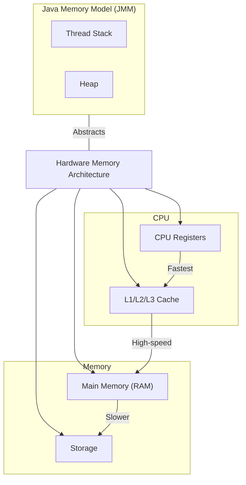

# Java Memory Model (JMM)

The Java Memory Model (JMM) specifies how the Java Virtual Machine (JVM) works with computer memory. It defines how and when different threads can see values written by other threads, and how to synchronize access to shared variables.

## Key Concepts

### 1. Working Memory and Main Memory
- **Main Memory**: Shared memory visible to all threads
- **Working Memory**: Each thread has its own working memory (cache)
  - Threads operate on copies of variables from main memory
  - Changes must be synchronized back to main memory

```
+-------+     +-------+     +-------+
| CPU1  |     | CPU2  |     | CPU3  |
| Cache |     | Cache |     | Cache |
+-------+     +-------+     +-------+
    ↓            ↓            ↓
+-----------------------------------+
|           系统总线（Bus）           |
+-----------------------------------+
    ↑
+-------+
| 主内存  |
+-------+

缓存行状态：
- Modified（修改）：该CPU已修改缓存行
- Exclusive（独占）：缓存行只在该CPU中
- Shared（共享）：缓存行可能在其他CPU中
- Invalid（无效）：缓存行已失效
```

### 1.1 Hardware Memory Architecture
The JMM abstracts the complex hardware memory architecture:

- **CPU Registers**: Fastest memory, CPU-specific
- **L1/L2/L3 Cache**: High-speed memory close to CPU
  - Each CPU core has private L1/L2 cache
  - L3 cache is typically shared between cores
- **Main Memory (RAM)**: Shared memory, slower than caches
- **Storage**: Non-volatile memory, very slow

This layered architecture leads to:
- **Cache Coherence Issues**: Different CPU caches may have different values
- **Memory Ordering**: CPU and compiler can reorder memory operations
- **Memory Visibility**: Updates in one CPU's cache not immediately visible to others

JMM provides a high-level abstraction that:
- Hides hardware complexity from developers
- Ensures consistent behavior across different architectures
- Provides guarantees for memory visibility and ordering

### 1.2 JMM and Hardware Architecture


### 2. Memory Operations
JMM defines several memory operations:
- **read**: Read from main memory to working memory
- **write**: Write from working memory to main memory
- **lock**: Get exclusive access to a variable
- **unlock**: Release exclusive access
- **load**: Read from working memory
- **store**: Write to working memory
- **use**: Use variable in computation
- **assign**: Assign result to variable

### 3. Happens-Before Relationship
Defines the memory visibility between different actions:
- Program order rule: Each action in a thread happens-before every subsequent action in that thread
- Monitor lock rule: An unlock happens-before subsequent locks of same monitor
- Volatile variable rule: Write to volatile variable happens-before reads of same variable
- Thread start rule: Thread start happens-before any actions in started thread
- Thread termination rule: All actions in a thread happen-before detection of thread termination

### 4. Memory Visibility
- Without proper synchronization, changes made by one thread may not be visible to other threads
- Synchronization mechanisms:
  - **synchronized** keyword
  - **volatile** variables
  - final fields without [reference escape] of `this`
    - If the constructor initializes a final field, that value is guaranteed to be visible to any thread that accesses the object after the constructor has completed.
  - concurrent collections
### 4. 指令重排 (Instruction Reordering)
指令重排是指编译器和处理器为了优化性能而对指令执行顺序进行调整的过程。虽然指令重排可以提高单线程性能，但在多线程环境下可能会导致内存可见性问题。

#### 4.1 重排类型
1）**编译器优化的重排序**: 编译器在不改变单线程程序语义的前提下，可以重新安排语句的执行顺序。

2）**指令级并行的重排序**: 现代处理器采用了指令级并行技术（Instruction-LevelParallelism，ILP）来将多条指令重叠执行。如果不存在数据依赖性，处理器可以改变语句对应机器指令的执行顺序。

3）**内存系统的重排序**: 由于处理器使用缓存和读/写缓冲区，这使得加载和存储操作看上去可能是在乱序执行。


#### 4.2 重排相关的语义
1. **As-If-Serial 语义**：不管怎么重排（编译器和处理器为了提高并行度而进行的重排），单线程程序的执行结果不能被改变。编译器、运行时和处理器都必须遵守 As-If-Serial 语义。
2. **Happens-Before 关系**：JMM 定义了 happens-before 关系来确保内存可见性和有序性。如果一个操作 happens-before 另一个操作，那么第一个操作的结果对第二个操作是可见的，并且第一个操作的执行顺序在第二个操作之前。
3. **Within-Thread As-If-Serial 语义**：在单个线程内，程序的执行结果和指令的顺序必须与源代码中的顺序一致，即使编译器和处理器进行了重排。

#### 4.3 Happens-Before 规则
从JDK 5开始，Java使用新的JSR-133内存模型, JSR-133使用happens-before的概念来阐述操作之间的内存可见性。

1. **程序次序规则**：在一个线程内，按照代码顺序，前面的操作 happens-before 于后面的操作。
2. **监视器锁规则**：对一个锁的解锁 happens-before 于随后对这个锁的加锁。
3. **volatile 变量规则**：对一个 volatile 变量的写操作 happens-before 于后续对这个 volatile 变量的读操作。
4. **线程启动规则**：Thread.start() 方法调用 happens-before 于启动线程中的每一个动作。
5. **线程终止规则**：线程中的所有操作 happens-before 于其他线程检测到该线程已经终止。
6. **线程中断规则**：对线程的中断操作 happens-before 于被中断线程的代码检测到中断事件的发生。
7. **对象终结规则**：一个对象的构造函数执行完毕 happens-before 于该对象的 finalize() 方法的开始。
8. **传递性**：如果 A happens-before B，且 B happens-before C，那么 A happens-before C。

通过理解和应用这些规则，开发者可以编写出线程安全的代码，避免由于指令重排导致的内存可见性问题。

### 5. Memory Barriers
JMM uses memory barriers to ensure ordering:
- **LoadLoad barriers**: Ensure loads before barrier complete before loads after
- **StoreStore barriers**: Ensure stores before barrier complete before stores after
- **LoadStore barriers**: Ensure loads before barrier complete before stores after
- **StoreLoad barriers**: Ensure all stores complete before subsequent loads

## Common Issues
1. **Race Conditions**: Multiple threads accessing shared data without proper synchronization
2. **Memory Visibility**: Changes by one thread not visible to others
3. **Reordering**: JVM/CPU reordering instructions affecting program semantics

## Best Practices
1. Use proper synchronization mechanisms
2. Minimize sharing mutable data between threads
3. Use immutable objects when possible
4. Prefer higher-level concurrency utilities over low-level synchronization
5. Document thread-safety guarantees


## Reference Escape
Idea that if the reference to the object (this) is shared with other threads before the constructor finishes, those threads may see an incomplete state of the object.

```java
class DatabaseService {
    private final String connectionString;
    private Connection connection;

    public DatabaseService(String connectionString) {
        this.connectionString = connectionString;

        // Start a monitoring thread (not ideal to do this in the constructor)
        new Thread(() -> {
            monitorConnection();
        }).start();
        
        // Initialize the database connection
        this.connection = DriverManager.getConnection(connectionString);
    }

    private void monitorConnection() {
        // Simulate monitoring the connection
        while (true) {
            if (connection == null) {
                System.out.println("Connection is not initialized yet!");
                break; // Exit if connection is null
            }
            // Perform monitoring logic...
        }
    }
}
```

## Reference
* [Java内存模型（JMM）总结](https://zhuanlan.zhihu.com/p/29881777)