# Android Movie Cinema App Design

## High-Level Architecture

I'll design a movie cinema app using MVVM, Clean Architecture, and modern Android development practices. Here's the high-level architecture:

```
┌─────────────────────────────────────────────────────────────┐
│                     Presentation Layer                       │
│  ┌─────────┐    ┌─────────────┐    ┌────────────────────┐   │
│  │         │    │             │    │                    │   │
│  │   UI    │◄───┤  ViewModels │◄───┤    UI State       │   │
│  │         │    │             │    │                    │   │
│  └─────────┘    └─────────────┘    └────────────────────┘   │
└────────┬────────────────────────────────────────┬───────────┘
         │                                        │
         ▼                                        ▼
┌─────────────────────────┐        ┌───────────────────────────┐
│     Domain Layer        │        │       Data Layer          │
│  ┌─────────────────┐   │        │  ┌────────────────────┐   │
│  │                 │   │        │  │                    │   │
│  │    Use Cases    │◄──┼────────┼──┤   Repositories    │   │
│  │                 │   │        │  │                    │   │
│  └────────┬────────┘   │        │  └─────────┬──────────┘   │
│           │            │        │            │              │
│  ┌────────▼────────┐   │        │  ┌─────────▼──────────┐   │
│  │                 │   │        │  │                    │   │
│  │    Entities     │   │        │  │   Data Sources     │   │
│  │                 │   │        │  │                    │   │
│  └─────────────────┘   │        │  └────────────────────┘   │
└─────────────────────────┘        └───────────────────────────┘
```


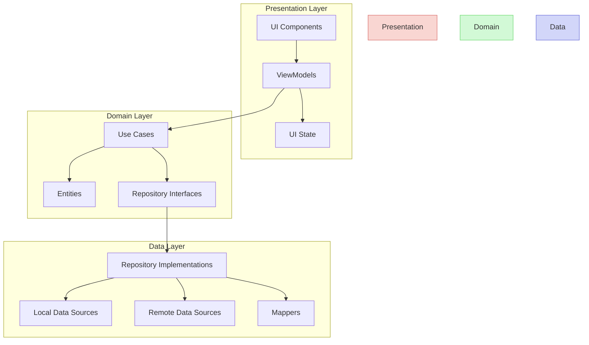

## Module Structure

```
app/
├── domain/                 # Domain Layer
│   ├── entity/             # Business models
│   ├── repository/         # Repository interfaces
│   └── usecase/            # Business logic use cases
├── data/                   # Data Layer
│   ├── repository/         # Repository implementations
│   ├── local/              # Local data sources (Room DB)
│   ├── remote/             # Remote data sources (Retrofit)
│   └── mapper/             # Data mappers
└── presentation/           # Presentation Layer
    ├── common/             # Shared UI components
    ├── movies/             # Movie listing feature
    │   ├── list/           # Movie list screen
    │   └── detail/         # Movie detail screen
    ├── booking/            # Seat booking feature
    │   ├── selection/      # Seat selection screen
    │   └── confirmation/   # Booking confirmation
    └── payment/            # Payment feature
        ├── checkout/       # Checkout screen
        └── confirmation/   # Payment confirmation
```

## Key Components
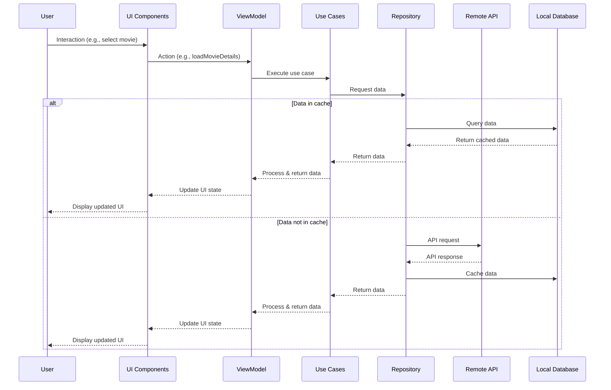

### 1. Movie Listing Feature

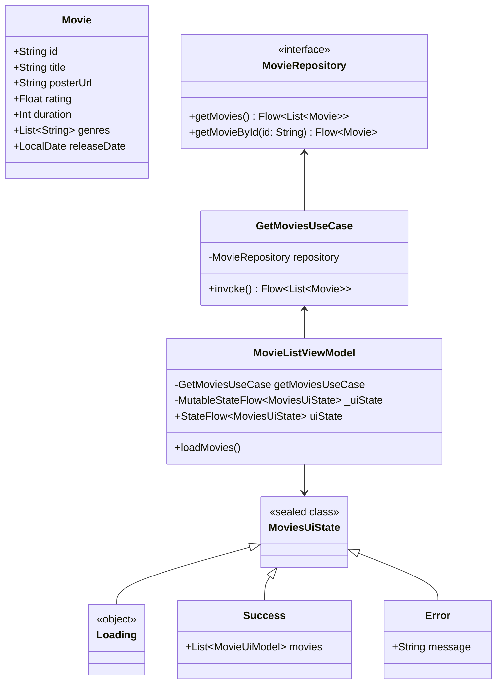

#### Movie List UI Mockup
┌─────────────────────────────────────────────────────┐
│                     CINEMA APP                       │
├─────────────────────────────────────────────────────┤
│ ┌─────────┐ ┌─────────┐ ┌─────────┐ ┌─────────┐     │
│ │         │ │         │ │         │ │         │     │
│ │  Movie  │ │  Movie  │ │  Movie  │ │  Movie  │     │
│ │   #1    │ │   #2    │ │   #3    │ │   #4    │     │
│ │         │ │         │ │         │ │         │     │
│ └─────────┘ └─────────┘ └─────────┘ └─────────┘     │
│                                                     │
│ ┌─────────┐ ┌─────────┐ ┌─────────┐ ┌─────────┐     │
│ │         │ │         │ │         │ │         │     │
│ │  Movie  │ │  Movie  │ │  Movie  │ │  Movie  │     │
│ │   #5    │ │   #6    │ │   #7    │ │   #8    │     │
│ │         │ │         │ │         │ │         │     │
│ └─────────┘ └─────────┘ └─────────┘ └─────────┘     │
│                                                     │
│ ┌─────────┐ ┌─────────┐ ┌─────────┐ ┌─────────┐     │
│ │         │ │         │ │         │ │         │     │
│ │  Movie  │ │  Movie  │ │  Movie  │ │  Movie  │     │
│ │   #9    │ │   #10   │ │   #11   │ │   #12   │     │
│ │         │ │         │ │         │ │         │     │
│ └─────────┘ └─────────┘ └─────────┘ └─────────┘     │
│                                                     │
└─────────────────────────────────────────────────────┘
#### Domain Layer
```kotlin
// Domain Entities
data class Movie(
    val id: String,
    val title: String,
    val posterUrl: String,
    val rating: Float,
    val duration: Int, // in minutes
    val genres: List<String>,
    val releaseDate: LocalDate
)

// Repository Interface
interface MovieRepository {
    suspend fun getMovies(): Flow<List<Movie>>
    suspend fun getMovieById(id: String): Flow<Movie>
}

// Use Cases
class GetMoviesUseCase(private val movieRepository: MovieRepository) {
    suspend operator fun invoke(): Flow<List<Movie>> = 
        movieRepository.getMovies()
}
```

#### Presentation Layer
```kotlin
// UI State
sealed class MoviesUiState {
    object Loading : MoviesUiState()
    data class Success(val movies: List<MovieUiModel>) : MoviesUiState()
    data class Error(val message: String) : MoviesUiState()
}

// ViewModel
class MovieListViewModel(
    private val getMoviesUseCase: GetMoviesUseCase
) : ViewModel() {
    private val _uiState = MutableStateFlow<MoviesUiState>(MoviesUiState.Loading)
    val uiState: StateFlow<MoviesUiState> = _uiState

    init {
        loadMovies()
    }

    private fun loadMovies() {
        viewModelScope.launch {
            try {
                getMoviesUseCase().collect { movies ->
                    _uiState.value = MoviesUiState.Success(
                        movies.map { it.toUiModel() }
                    )
                }
            } catch (e: Exception) {
                _uiState.value = MoviesUiState.Error(e.message ?: "Unknown error")
            }
        }
    }
}

// UI Implementation with Jetpack Compose
@Composable
fun MovieListScreen(
    viewModel: MovieListViewModel = hiltViewModel(),
    onMovieClick: (String) -> Unit
) {
    val uiState by viewModel.uiState.collectAsState()
    
    when (val state = uiState) {
        is MoviesUiState.Loading -> LoadingIndicator()
        is MoviesUiState.Success -> MovieGrid(
            movies = state.movies,
            onMovieClick = onMovieClick
        )
        is MoviesUiState.Error -> ErrorMessage(state.message)
    }
}
```

### 2. Movie Detail and Booking Feature

#### Seat Selection UI Mockup


┌─────────────────────────────────────────────────────┐
│                                                     │
│  ┌─────────────────────────────────────────────┐    │
│  │                                             │    │
│  │                Movie Poster                 │    │
│  │                                             │    │
│  └─────────────────────────────────────────────┘    │
│                                                     │
│  MOVIE TITLE                                ★ 4.5   │
│                                                     │
│  Action, Adventure | 2h 15m | PG-13                 │
│                                                     │
│  SYNOPSIS                                           │
│  Lorem ipsum dolor sit amet, consectetur adipiscing │
│  elit. Sed do eiusmod tempor incididunt ut labore  │
│  et dolore magna aliqua. Ut enim ad minim veniam.  │
│                                                     │
│  SHOWTIMES                                          │
│  ┌─────┐  ┌─────┐  ┌─────┐  ┌─────┐  ┌─────┐        │
│  │10:30│  │13:15│  │16:00│  │18:45│  │21:30│        │
│  └─────┘  └─────┘  └─────┘  └─────┘  └─────┘        │
│                                                     │
│  THEATER                                            │
│  ┌─────────┐  ┌─────────┐  ┌─────────┐              │
│  │Theater 1│  │Theater 2│  │Theater 3│              │
│  └─────────┘  └─────────┘  └─────────┘              │
│                                                     │
│  [           SELECT SEATS & BOOK NOW           ]    │
│                                                     │
└─────────────────────────────────────────────────────┘


┌─────────────────────────────────────────────────────┐
│                  SELECT YOUR SEATS                   │
├─────────────────────────────────────────────────────┤
│                                                     │
│                    SCREEN                           │
│ ┌─────────────────────────────────────────────────┐ │
│ └─────────────────────────────────────────────────┘ │
│                                                     │
│  A  [_] [_] [_] [_] [_] [_] [_] [_] [_] [_] [_] [_]  │
│                                                     │
│  B  [_] [_] [_] [_] [_] [_] [_] [_] [_] [_] [_] [_]  │
│                                                     │
│  C  [_] [_] [_] [X] [X] [_] [_] [_] [_] [_] [_] [_]  │
│                                                     │
│  D  [_] [_] [_] [_] [_] [_] [_] [_] [_] [_] [_] [_]  │
│                                                     │
│  E  [_] [_] [_] [_] [_] [_] [_] [_] [_] [_] [_] [_]  │
│                                                     │
│  F  [_] [_] [_] [_] [_] [_] [_] [_] [_] [_] [_] [_]  │
│                                                     │
│  G  [_] [_] [_] [_] [_] [_] [_] [_] [_] [_] [_] [_]  │
│                                                     │
│  Legend: [_] Available  [X] Selected  [#] Booked    │
│                                                     │
│  Selected: C4, C5                                   │
│  Total: $24.00                                      │
│                                                     │
│             [     CONFIRM SELECTION     ]           │
└─────────────────────────────────────────────────────┘

#### Seat Booking State Diagram
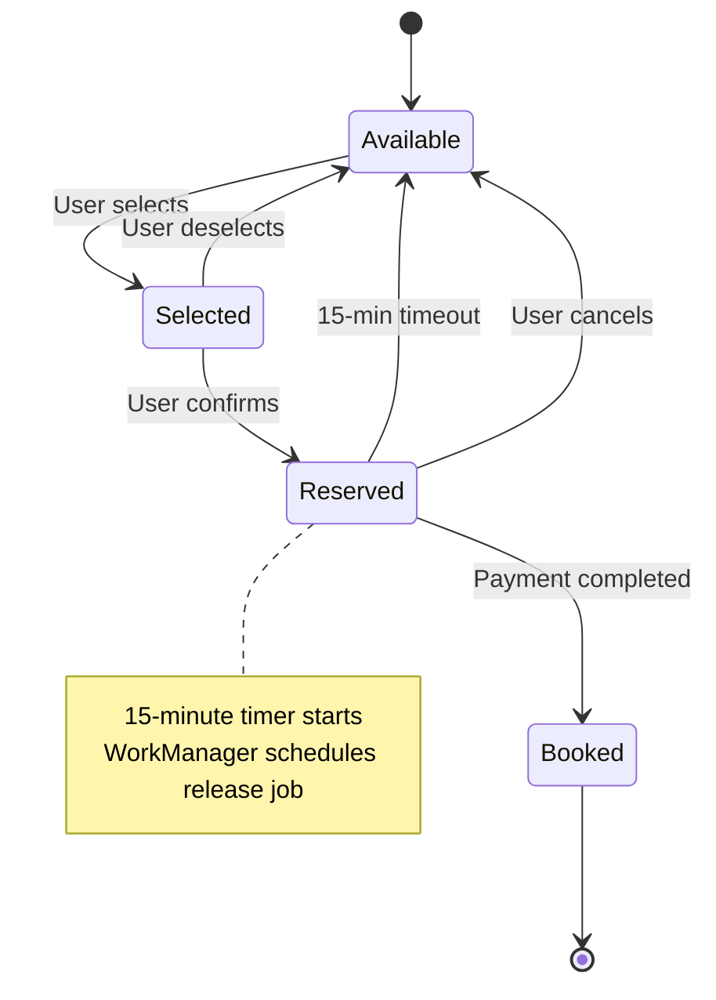
#### Domain Layer
```kotlin
// Domain Entities
data class MovieShowtime(
    val id: String,
    val movieId: String,
    val startTime: LocalDateTime,
    val endTime: LocalDateTime,
    val theater: String,
    val price: BigDecimal
)

data class Seat(
    val id: String,
    val row: String,
    val number: Int,
    val type: SeatType,
    val status: SeatStatus
)

enum class SeatType { STANDARD, PREMIUM, VIP }
enum class SeatStatus { AVAILABLE, RESERVED, BOOKED }

// Repository Interface
interface BookingRepository {
    suspend fun getShowtimes(movieId: String): Flow<List<MovieShowtime>>
    suspend fun getSeats(showtimeId: String): Flow<List<Seat>>
    suspend fun reserveSeats(showtimeId: String, seatIds: List<String>): Flow<ReservationResult>
    suspend fun releaseSeats(reservationId: String)
}

// Use Cases
class GetSeatsUseCase(private val bookingRepository: BookingRepository) {
    suspend operator fun invoke(showtimeId: String): Flow<List<Seat>> =
        bookingRepository.getSeats(showtimeId)
}

class ReserveSeatsUseCase(private val bookingRepository: BookingRepository) {
    suspend operator fun invoke(showtimeId: String, seatIds: List<String>): Flow<ReservationResult> =
        bookingRepository.reserveSeats(showtimeId, seatIds)
}
```

#### Presentation Layer
```kotlin
// UI State
sealed class SeatSelectionUiState {
    object Loading : SeatSelectionUiState()
    data class Success(
        val seats: List<SeatUiModel>,
        val selectedSeats: List<String> = emptyList(),
        val totalPrice: BigDecimal = BigDecimal.ZERO
    ) : SeatSelectionUiState()
    data class Error(val message: String) : SeatSelectionUiState()
}

// ViewModel
class SeatSelectionViewModel(
    private val getSeatsUseCase: GetSeatsUseCase,
    private val reserveSeatsUseCase: ReserveSeatsUseCase,
    savedStateHandle: SavedStateHandle
) : ViewModel() {
    private val showtimeId: String = checkNotNull(savedStateHandle["showtimeId"])
    
    private val _uiState = MutableStateFlow<SeatSelectionUiState>(SeatSelectionUiState.Loading)
    val uiState: StateFlow<SeatSelectionUiState> = _uiState
    
    private val selectedSeatIds = mutableSetOf<String>()
    
    init {
        loadSeats()
    }
    
    private fun loadSeats() {
        viewModelScope.launch {
            try {
                getSeatsUseCase(showtimeId).collect { seats ->
                    _uiState.value = SeatSelectionUiState.Success(
                        seats = seats.map { it.toUiModel() }
                    )
                }
            } catch (e: Exception) {
                _uiState.value = SeatSelectionUiState.Error(e.message ?: "Unknown error")
            }
        }
    }
    
    fun toggleSeatSelection(seatId: String) {
        val currentState = _uiState.value as? SeatSelectionUiState.Success ?: return
        
        if (selectedSeatIds.contains(seatId)) {
            selectedSeatIds.remove(seatId)
        } else {
            selectedSeatIds.add(seatId)
        }
        
        _uiState.value = currentState.copy(
            selectedSeats = selectedSeatIds.toList(),
            totalPrice = calculateTotalPrice(currentState.seats, selectedSeatIds)
        )
    }
    
    fun reserveSeats() {
        viewModelScope.launch {
            try {
                reserveSeatsUseCase(showtimeId, selectedSeatIds.toList())
                    .collect { result ->
                        // Handle reservation result
                    }
            } catch (e: Exception) {
                // Handle error
            }
        }
    }
}
```

### 3. High-Traffic Seat Booking System
#### Queue Management System
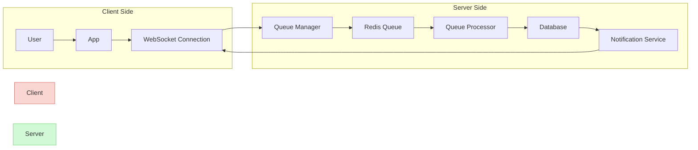


To handle high traffic for seat booking with a FIFO approach and 15-minute reservation window:

### Reservation Flow with Timeout
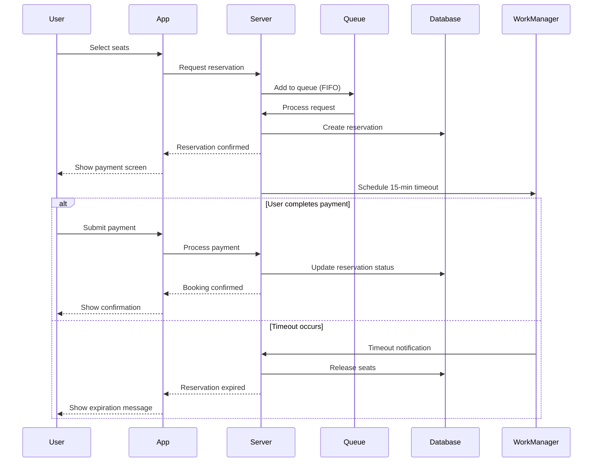

#### Domain Layer
```kotlin
// Additional Entities
data class SeatReservation(
    val id: String,
    val showtimeId: String,
    val seatIds: List<String>,
    val userId: String,
    val timestamp: Instant,
    val expiresAt: Instant,
    val status: ReservationStatus
)

enum class ReservationStatus { PENDING, CONFIRMED, EXPIRED, CANCELLED }

// Additional Repository Methods
interface BookingRepository {
    // ... existing methods
    
    suspend fun getActiveReservations(showtimeId: String): Flow<List<SeatReservation>>
    suspend fun confirmReservation(reservationId: String): Flow<Boolean>
    suspend fun checkReservationStatus(reservationId: String): Flow<ReservationStatus>
}

// Additional Use Cases
class ProcessReservationQueueUseCase(
    private val bookingRepository: BookingRepository
) {
    suspend operator fun invoke(showtimeId: String): Flow<QueueResult> {
        // Implementation of FIFO queue processing
    }
}
```

#### Data Layer Implementation
```kotlin
// Reservation Queue System
class ReservationQueueManager @Inject constructor(
    private val database: AppDatabase,
    private val workManager: WorkManager
) {
    fun enqueueReservation(reservation: SeatReservation) {
        // Add to queue and schedule expiration
        database.reservationDao().insert(reservation)
        
        // Schedule expiration worker
        val expirationWork = OneTimeWorkRequestBuilder<ReservationExpirationWorker>()
            .setInputData(workDataOf("reservationId" to reservation.id))
            .setInitialDelay(15, TimeUnit.MINUTES)
            .build()
            
        workManager.enqueue(expirationWork)
    }
    
    fun processQueue(showtimeId: String) {
        // Process reservations in FIFO order
    }
}

// Worker to handle reservation expiration
class ReservationExpirationWorker(
    context: Context,
    params: WorkerParameters,
    private val bookingRepository: BookingRepository
) : CoroutineWorker(context, params) {
    
    override suspend fun doWork(): Result {
        val reservationId = inputData.getString("reservationId") ?: return Result.failure()
        
        return try {
            bookingRepository.releaseSeats(reservationId)
            Result.success()
        } catch (e: Exception) {
            Result.retry()
        }
    }
}
```

#### Real-time Updates with WebSockets
```kotlin
class SeatStatusWebSocketClient @Inject constructor() {
    private val webSocketClient: WebSocketClient = // implementation
    
    fun observeSeatUpdates(showtimeId: String): Flow<List<SeatUpdate>> = 
        callbackFlow {
            webSocketClient.connect("ws://api.example.com/seats/$showtimeId")
            
            webSocketClient.onMessage { message ->
                val updates = message.toSeatUpdates()
                trySend(updates)
            }
            
            awaitClose {
                webSocketClient.disconnect()
            }
        }
}
```

### 4. Payment and Checkout System

┌─────────────────────────────────────────────────────┐
│                     CHECKOUT                         │
├─────────────────────────────────────────────────────┤
│                                                     │
│  BOOKING SUMMARY                                    │
│  ┌─────────────────────────────────────────────┐    │
│  │ Movie: Avengers: Endgame                    │    │
│  │ Date: June 15, 2023                         │    │
│  │ Time: 7:30 PM                               │    │
│  │ Theater: Theater 2, IMAX                    │    │
│  │ Seats: C4, C5                               │    │
│  └─────────────────────────────────────────────┘    │
│                                                     │
│  PAYMENT METHOD                                     │
│  ┌─────────────────────────────────────────────┐    │
│  │ ○ Credit Card (**** 1234)                   │    │
│  │ ○ Debit Card (**** 5678)                    │    │
│  │ ● PayPal (user@example.com)                 │    │
│  │ ○ Add New Payment Method                    │    │
│  └─────────────────────────────────────────────┘    │
│                                                     │
│  ORDER SUMMARY                                      │
│  ┌─────────────────────────────────────────────┐    │
│  │ Tickets (2)                      $24.00     │    │
│  │ Booking Fee                      $2.00      │    │
│  │ Tax                              $2.60      │    │
│  │                                             │    │
│  │ Total                            $28.60     │    │
│  └─────────────────────────────────────────────┘    │
│                                                     │
│  [               CONFIRM PAYMENT                ]   │
│                                                     │
└─────────────────────────────────────────────────────┘

#### Secure Payment Flow
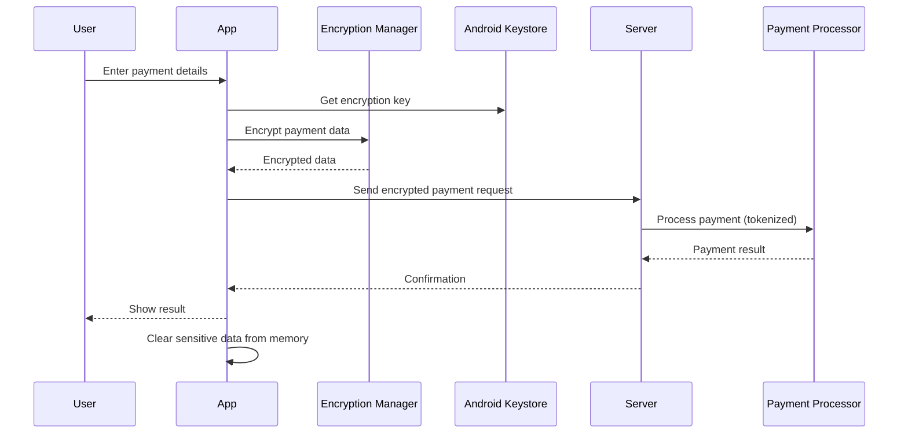


### Security Components Diagram
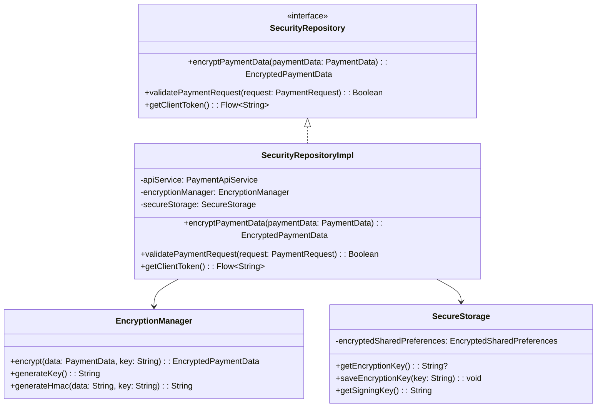
#### Domain Layer
```kotlin
// Payment Entities
data class PaymentMethod(
    val id: String,
    val type: PaymentType,
    val lastFourDigits: String? = null,
    val expiryDate: YearMonth? = null
)

enum class PaymentType { CREDIT_CARD, DEBIT_CARD, DIGITAL_WALLET }

data class PaymentRequest(
    val reservationId: String,
    val amount: BigDecimal,
    val paymentMethodId: String,
    val currency: String = "USD"
)

data class PaymentResult(
    val transactionId: String,
    val status: PaymentStatus,
    val timestamp: Instant
)

enum class PaymentStatus { PENDING, COMPLETED, FAILED, REFUNDED }

// Repository Interface
interface PaymentRepository {
    suspend fun getSavedPaymentMethods(userId: String): Flow<List<PaymentMethod>>
    suspend fun processPayment(paymentRequest: PaymentRequest): Flow<PaymentResult>
    suspend fun savePaymentMethod(userId: String, paymentMethod: PaymentMethod): Flow<Boolean>
}

// Use Cases
class ProcessPaymentUseCase(private val paymentRepository: PaymentRepository) {
    suspend operator fun invoke(paymentRequest: PaymentRequest): Flow<PaymentResult> =
        paymentRepository.processPayment(paymentRequest)
}
```

#### Presentation Layer
```kotlin
// UI State
sealed class CheckoutUiState {
    object Loading : CheckoutUiState()
    data class PaymentMethodSelection(
        val reservation: ReservationUiModel,
        val paymentMethods: List<PaymentMethodUiModel>,
        val selectedPaymentMethodId: String? = null
    ) : CheckoutUiState()
    data class Processing(val paymentMethod: PaymentMethodUiModel) : CheckoutUiState()
    data class Success(val transactionId: String) : CheckoutUiState()
    data class Error(val message: String) : CheckoutUiState()
}

// ViewModel
class CheckoutViewModel(
    private val getReservationUseCase: GetReservationUseCase,
    private val getPaymentMethodsUseCase: GetPaymentMethodsUseCase,
    private val processPaymentUseCase: ProcessPaymentUseCase,
    savedStateHandle: SavedStateHandle
) : ViewModel() {
    private val reservationId: String = checkNotNull(savedStateHandle["reservationId"])
    
    private val _uiState = MutableStateFlow<CheckoutUiState>(CheckoutUiState.Loading)
    val uiState: StateFlow<CheckoutUiState> = _uiState
    
    init {
        loadCheckoutData()
    }
    
    private fun loadCheckoutData() {
        viewModelScope.launch {
            try {
                // Combine reservation and payment methods data
                combine(
                    getReservationUseCase(reservationId),
I'll continue with the rest of the CheckoutViewModel implementation and then cover the security aspects of the payment system.

```kotlin:/Users/fangzhzh/workspace/leetcode/csFAQ/androidDesignMovieApp.md
                    getReservationUseCase(reservationId),
                    getPaymentMethodsUseCase(getCurrentUserId())
                ) { reservation, paymentMethods ->
                    _uiState.value = CheckoutUiState.PaymentMethodSelection(
                        reservation = reservation.toUiModel(),
                        paymentMethods = paymentMethods.map { it.toUiModel() }
                    )
                }.collect()
            } catch (e: Exception) {
                _uiState.value = CheckoutUiState.Error(e.message ?: "Unknown error")
            }
        }
    }
    
    fun selectPaymentMethod(paymentMethodId: String) {
        val currentState = _uiState.value as? CheckoutUiState.PaymentMethodSelection ?: return
        _uiState.value = currentState.copy(selectedPaymentMethodId = paymentMethodId)
    }
    
    fun processPayment() {
        val currentState = _uiState.value as? CheckoutUiState.PaymentMethodSelection ?: return
        val paymentMethodId = currentState.selectedPaymentMethodId ?: return
        val selectedMethod = currentState.paymentMethods.find { it.id == paymentMethodId } ?: return
        
        _uiState.value = CheckoutUiState.Processing(selectedMethod)
        
        viewModelScope.launch {
            try {
                val paymentRequest = PaymentRequest(
                    reservationId = reservationId,
                    amount = currentState.reservation.totalPrice,
                    paymentMethodId = paymentMethodId
                )
                
                processPaymentUseCase(paymentRequest).collect { result ->
                    if (result.status == PaymentStatus.COMPLETED) {
                        _uiState.value = CheckoutUiState.Success(result.transactionId)
                    } else if (result.status == PaymentStatus.FAILED) {
                        _uiState.value = CheckoutUiState.Error("Payment failed")
                    }
                }
            } catch (e: Exception) {
                _uiState.value = CheckoutUiState.Error(e.message ?: "Unknown error")
            }
        }
    }
    
    private fun getCurrentUserId(): String {
        // Get current user ID from authentication service
        return authManager.getCurrentUserId()
    }
}
```

### 5. Security Implementation for Payment System

#### Domain Layer - Security
```kotlin
// Security Entities
data class EncryptedPaymentData(
    val encryptedData: String,
    val iv: String,
    val keyId: String
)

// Security Repository Interface
interface SecurityRepository {
    suspend fun encryptPaymentData(paymentData: PaymentData): EncryptedPaymentData
    suspend fun validatePaymentRequest(request: PaymentRequest): Boolean
    suspend fun getClientToken(): Flow<String>
}

// Use Cases
class EncryptPaymentDataUseCase(private val securityRepository: SecurityRepository) {
    suspend operator fun invoke(paymentData: PaymentData): EncryptedPaymentData =
        securityRepository.encryptPaymentData(paymentData)
}

class ValidatePaymentRequestUseCase(private val securityRepository: SecurityRepository) {
    suspend operator fun invoke(request: PaymentRequest): Boolean =
        securityRepository.validatePaymentRequest(request)
}
```

#### Data Layer - Security Implementation
```kotlin
class SecurityRepositoryImpl @Inject constructor(
    private val apiService: PaymentApiService,
    private val encryptionManager: EncryptionManager,
    private val secureStorage: SecureStorage
) : SecurityRepository {

    override suspend fun encryptPaymentData(paymentData: PaymentData): EncryptedPaymentData {
        // Get encryption key from secure storage
        val encryptionKey = secureStorage.getEncryptionKey() ?: generateNewEncryptionKey()
        
        // Encrypt payment data
        return encryptionManager.encrypt(paymentData, encryptionKey)
    }
    
    override suspend fun validatePaymentRequest(request: PaymentRequest): Boolean {
        // Validate payment request integrity
        val requestSignature = generateRequestSignature(request)
        return requestSignature == request.signature
    }
    
    override suspend fun getClientToken(): Flow<String> = flow {
        // Get client token from payment gateway
        val response = apiService.getClientToken()
        emit(response.token)
    }
    
    private fun generateNewEncryptionKey(): String {
        val newKey = encryptionManager.generateKey()
        secureStorage.saveEncryptionKey(newKey)
        return newKey
    }
    
    private fun generateRequestSignature(request: PaymentRequest): String {
        // Generate HMAC signature for request validation
        return encryptionManager.generateHmac(
            data = "${request.reservationId}|${request.amount}|${request.paymentMethodId}",
            key = secureStorage.getSigningKey()
        )
    }
}
```

#### Security Utilities
```kotlin
class EncryptionManager @Inject constructor() {
    
    fun encrypt(data: PaymentData, key: String): EncryptedPaymentData {
        // Use AES/GCM for encryption
        val cipher = Cipher.getInstance("AES/GCM/NoPadding")
        val secretKey = SecretKeySpec(Base64.decode(key, Base64.DEFAULT), "AES")
        
        // Generate IV
        val iv = ByteArray(12)
        SecureRandom().nextBytes(iv)
        
        // Initialize cipher
        cipher.init(Cipher.ENCRYPT_MODE, secretKey, GCMParameterSpec(128, iv))
        
        // Encrypt data
        val serializedData = Json.encodeToString(data)
        val encryptedBytes = cipher.doFinal(serializedData.toByteArray())
        
        return EncryptedPaymentData(
            encryptedData = Base64.encodeToString(encryptedBytes, Base64.DEFAULT),
            iv = Base64.encodeToString(iv, Base64.DEFAULT),
            keyId = key.hashCode().toString()
        )
    }
    
    fun generateKey(): String {
        val keyGenerator = KeyGenerator.getInstance("AES")
        keyGenerator.init(256)
        val secretKey = keyGenerator.generateKey()
        return Base64.encodeToString(secretKey.encoded, Base64.DEFAULT)
    }
    
    fun generateHmac(data: String, key: String): String {
        val mac = Mac.getInstance("HmacSHA256")
        val secretKey = SecretKeySpec(Base64.decode(key, Base64.DEFAULT), "HmacSHA256")
        mac.init(secretKey)
        val hmacBytes = mac.doFinal(data.toByteArray())
        return Base64.encodeToString(hmacBytes, Base64.DEFAULT)
    }
}

class SecureStorage @Inject constructor(
    private val context: Context,
    private val encryptedSharedPreferences: EncryptedSharedPreferences
) {
    
    fun getEncryptionKey(): String? {
        return encryptedSharedPreferences.getString(KEY_ENCRYPTION, null)
    }
    
    fun saveEncryptionKey(key: String) {
        encryptedSharedPreferences.edit().putString(KEY_ENCRYPTION, key).apply()
    }
    
    fun getSigningKey(): String {
        return encryptedSharedPreferences.getString(KEY_SIGNING, null) ?: generateAndSaveSigningKey()
    }
    
    private fun generateAndSaveSigningKey(): String {
        val keyGenerator = KeyGenerator.getInstance("HmacSHA256")
        val secretKey = keyGenerator.generateKey()
        val keyString = Base64.encodeToString(secretKey.encoded, Base64.DEFAULT)
        encryptedSharedPreferences.edit().putString(KEY_SIGNING, keyString).apply()
        return keyString
    }
    
    companion object {
        private const val KEY_ENCRYPTION = "encryption_key"
        private const val KEY_SIGNING = "signing_key"
    }
}
```

## Low-Level Problems and Solutions

### 1. Handling High Traffic for Seat Booking

**Problem:** During peak times (new movie releases, weekends), thousands of users might try to book seats simultaneously, leading to race conditions and poor user experience.

**Solution:**
1. **Distributed Queue System:**
   - Implement a distributed queue using Redis or RabbitMQ
   - Process seat reservations in FIFO order
   - Provide real-time queue position updates to users

2. **Optimistic Locking:**
   - Use version-based concurrency control for seat status
   - Retry failed reservations with exponential backoff

3. **Seat Reservation Timeout:**
   - Implement 15-minute reservation window using WorkManager
   - Automatically release seats if payment not completed

4. **Real-time Updates:**
   - Use WebSockets to push seat status changes to all clients
   - Ensure UI reflects current seat availability

### 2. Payment Security

**Problem:** Handling payment information requires strict security measures to protect sensitive data and comply with regulations.

**Solution:**
1. **End-to-End Encryption:**
   - Encrypt payment data on the client before transmission
   - Use AES-256 for symmetric encryption
   - Implement key rotation policies

2. **PCI DSS Compliance:**
   - Use tokenization to avoid storing actual card details
   - Integrate with compliant payment processors (Stripe, PayPal)
   - Implement proper access controls and logging

3. **Certificate Pinning:**
   - Prevent man-in-the-middle attacks
   - Pin SSL certificates in the app

4. **Secure Storage:**
   - Use Android Keystore for cryptographic key storage
   - Implement EncryptedSharedPreferences for sensitive data
   - Clear payment data from memory after use

### 3. Offline Support and Data Synchronization

**Problem:** Users may lose connectivity during the booking process.

**Solution:**
1. **Offline Movie Browsing:**
   - Cache movie data using Room database
   - Implement Repository pattern with offline-first approach

2. **Reservation Queue:**
   - Queue booking requests when offline
   - Sync when connectivity is restored
   - Provide clear status indicators to users

3. **Conflict Resolution:**
   - Implement conflict resolution for seat selection
   - Prioritize server-side state for final decisions

### 4. Performance Optimization

**Problem:** Large movie catalogs and seat maps can cause performance issues.

**Solution:**
1. **Lazy Loading:**
   - Implement paging for movie lists using Paging 3 library
   - Load seat maps incrementally

2. **Image Optimization:**
   - Use Coil or Glide with proper caching
   - Implement responsive image loading based on device capabilities

3. **Prefetching:**
   - Prefetch likely-to-be-viewed movie details
   - Preload seat maps for popular showtimes

4. **UI Performance:**
   - Use RecyclerView with DiffUtil for efficient updates
   - Implement view binding for faster view access
   - Consider Jetpack Compose for declarative UI with better performance                    


#### Image Loading Strategy
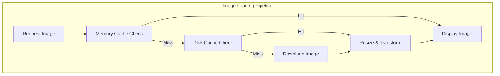

### Paging Implementation
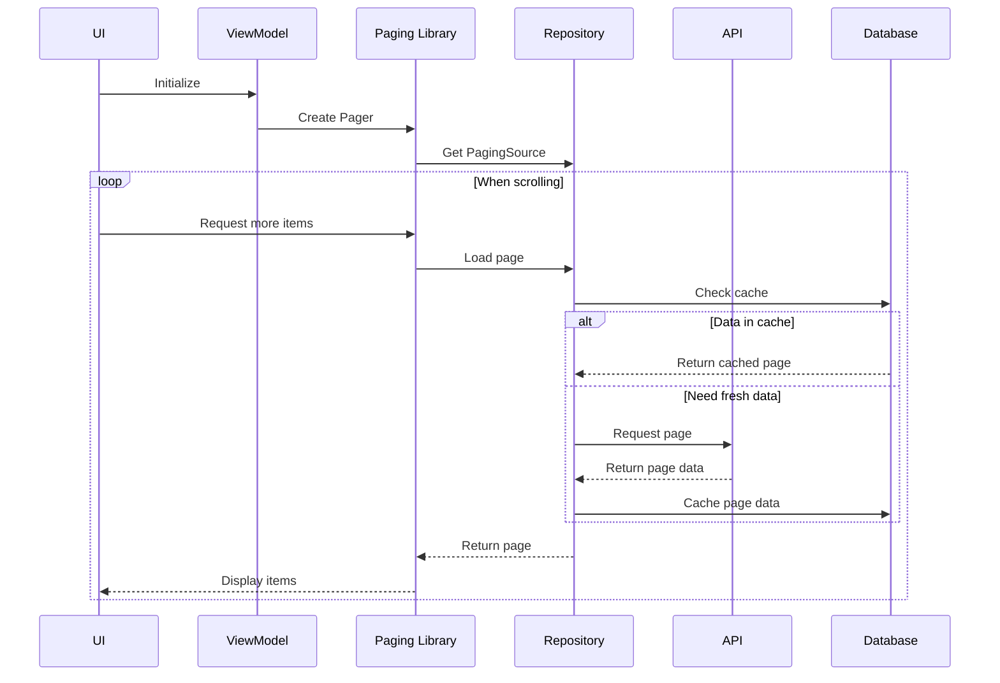

### ## App Navigation Flow Visualization
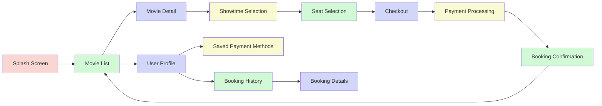