# Learn Java Hashmap in real world problems

## Problem 1. Currency Exchange

```java
/*
We are a currency exchange that maintains the current exchange rates between currencies. A user can come to us with some amount in one currency and request the equivalent amount in a different currency. Given a list of exchange rates between currencies, write a function that calculates currency rate between any 2 currencies.

(GBP, EUR, 10)     - read as "1 GBP equals 10 EUR"
(EUR, USD, 1.1)    - "1 EUR equals 1.1 USD"
(USD, JPY, 108.3)
(CNY, RUB, 14.6)
*/


class Solution {
    public static void main(String[] args) {
    }
}

```

## Question 2. Operator Assignment
```java
- Initializes with a set of available operators.
- set_limit(operator_name, n)
  Sets an operator’s limit.
- assign(conversation_id)
  Assigns a given conversation to the next available operator.
- get_assignment_queue(n)
  Returns the list of possible operators in the order they will be assigned to conversations, not real assignment yet.
```


## Question 3. Log Analyzer
```java
/*
Design a log analyzer that processes server logs and provides statistics:
- Most frequent IP addresses
- Count of each HTTP status code (200, 404, 500, etc.)
- Most requested URLs
- Peak traffic times

Input: List of log entries in format: "timestamp IP_address URL status_code response_time"
Example: "2023-05-15T14:22:33 192.168.1.1 /home 200 150"

Implement methods:
- void processLog(String logEntry)
- Map<String, Integer> getTopIPs(int n)
- Map<Integer, Integer> getStatusCodeCounts()
- String getMostRequestedURL()
- String getPeakHour()
*/
```

## Question 4. Product Inventory System
```java
import java.util.TreeMap
import java.util.concurrent.locks.ReentrantLock
import java.util.concurrent.locks.ReentrantReadWriteLock
import kotlin.concurrent.withLock

/*
Design a product inventory system with the following operations:
- add(productId, quantity): Add products to inventory
- remove(productId, quantity): Remove products from inventory
- getAvailableQuantity(productId): Get current quantity
- getProductsInRange(minPrice, maxPrice): Get products in price range
- getLowStockProducts(threshold): Get products below threshold quantity

Products have: ID, name, price, and quantity.
Optimize for fast lookups by ID and efficient range queries.
*/

data class Product(val id: String, val price: Double)
class ProductInventory {
    private val products = mapOf(
        Pair("1", Product("1" , 1.1)),
        Pair("2", Product("2" , 1.1)),
        Pair("3", Product("3" , 1.1)),
        Pair("4", Product("4" , 1.1)),
        Pair("5", Product("5" , 1.1)),
        Pair("6", Product("6" , 1.1)),
        Pair("7", Product("7" , 1.1)),
    )

    private val inventory: MutableMap<String, Int> = HashMap<String, Int>()
    private val priceMap = TreeMap<Double, MutableSet<String>>() // price -> set(products)
    private val stockMap = TreeMap<Int, MutableSet<String>>() // stock -> set(products)
    private val lock = ReentrantReadWriteLock()
    // populate priceMap
    init {
        products.forEach {
            product ->
            priceMap.computeIfAbsent(product.value.price, {HashSet()}).add(product.key)
        }

    }
    /***
     *
     * @param productId
     * @param quantity
     * Initial:
     *  - inventory: current
     *  - priceMap
     *  - stockMap
     * Operation: add quantity
     * Final:
     *  - inventory:
     *    - 0: add
     *    - 1: current + addition
     *  - priceMap:
     *    - 0:
     *  - stockMap:
     *    - 0: quantity -> productid
     *    - 1: remove [stock] - productid, add [stock + quantity] + prodcutid
     *
     */
    fun add(productId: String, quantity: Int)  { // : Add products to inventory
        assert(quantity > 0)
        lock.writeLock().withLock {
            var stock = inventory.computeIfAbsent(productId, {0})
            if(stock == 0) {
                inventory[productId] = quantity
                stockMap.computeIfAbsent(stock, { hashSetOf() }).add(productId)
            } else {
                inventory[productId] = stock + quantity
                stockMap.get(stock)?.remove(productId)
                stockMap.computeIfAbsent(stock+quantity, {HashSet()}).add(productId)
            }
        }
    }

    /***
     *
     * @param productId
     * @param quantity
     * Initial:
     *  - inventory: current
     *  - priceMap
     *  - stockMap
     * Operation: remove quantity
     * Final:
     *  - inventory: stock
     *      stock + quantity <= 0, remove, else update
     *  - priceMap:
     *  - stockMap:
     *      stock + quantity <= 0, remove
     *      else
     *          [stock].remove(prdId)
     *          [stock+quality]{new set}.add(proId)
     *
     */
    fun remove(productId: String, quantity: Int) { // : Remove products from inventory
        assert(quantity > 0)
        lock.writeLock().withLock {
            val stock = inventory.computeIfAbsent(productId, {0})
            if(stock - quantity <= 0) {
                inventory.remove(productId)
                stockMap.get(stock)?.remove(productId)
            } else {
                inventory[productId] = stock - quantity
                stockMap.get(stock)?.remove(productId)
                stockMap.computeIfAbsent(stock - quantity, {HashSet()}).add(productId)
            }
        }

    }

    fun getAvailableQuantity(productId: String): Int { // Get current quantity
        lock.readLock().withLock {
            return inventory.getOrDefault(productId, 0)
        }
    }

    fun getProductsInRange(minPrice: Double, maxPrice: Double): List<Product?> { //Get
        lock.readLock().withLock {
            val result = mutableListOf<Product?>()
            for (price in priceMap.subMap(minPrice, maxPrice)) {
                for (productId in price.value) {
                    result.add(products.get(productId))
                }
            }
            return result
        }
    }
    fun getLowStockProducts(threshold: Int): List<Product?> { //Get products below threshold quantity
        lock.readLock().withLock {
            val result = mutableListOf<Product?>()
            for (productset in stockMap.subMap(0, threshold)) {
                for (productId in productset.value) {
                    result.add(products.get(productId))
                }
            }
            return result
        }
    }

}
```

## Question 5. Word Frequency Counter with Synonyms
```java
/*
Implement a word frequency counter that:
- Counts occurrences of each word in a document
- Treats synonyms as the same word
- Returns the top N most frequent words

Example:
Document: "The car is fast. The automobile is red."
Synonyms: {"car", "automobile"}
Result: {"the": 2, "car": 2, "is": 2, "fast": 1, "red": 1}

Implement:
- void processSynonyms(List<List<String>> synonymGroups)
- void processDocument(String document)
- List<String> getTopNWords(int n)
*/
```


## Question 6. LRU Cache Implementation
```java
/*
Implement an LRU (Least Recently Used) cache with the following operations:
- put(key, value): Insert or update an item
- get(key): Get item by key (and mark as recently used)
- getMostRecentlyUsed(): Return most recently used item
- getLeastRecentlyUsed(): Return least recently used item
- evictLeastRecentlyUsed(): Remove least recently used item

The cache should have a fixed capacity and automatically evict the least recently used item when full.
Optimize for O(1) time complexity for all operations.
*/
```

## Question 7. Flight Booking System
```java
/*
Design a flight booking system with the following features:
- addFlight(flightId, source, destination, capacity)
- bookSeat(flightId, passengerId)
- cancelBooking(flightId, passengerId)
- getAvailableSeats(flightId)
- getFlightsFromCity(city)
- getFlightsToCity(city)
- getPassengerBookings(passengerId)

Optimize for:
- Fast lookup of flights by ID
- Quick retrieval of flights by source/destination
- Efficient booking management
*/
```

## Question 8. Social Network Friend Recommendation
```java
/*
Implement a friend recommendation system for a social network:
- addUser(userId)
- addFriendship(userId1, userId2)
- removeFriendship(userId1, userId2)
- getFriends(userId)
- getMutualFriends(userId1, userId2)
- getRecommendedFriends(userId, n): Return top n recommended friends based on mutual connections

Optimize for efficient friend lookup and recommendation generation.
*/
```

## Question 9. Online Shopping Cart
```java
/*
Implement an online shopping cart system:
- addItem(productId, quantity)
- removeItem(productId)
- updateQuantity(productId, newQuantity)
- getCartTotal(): Calculate total price
- applyDiscount(discountCode)
- checkout(): Process the order and clear cart

Products have varying prices and some may have discounts.
Multiple discount codes may be applied with different rules.
*/
```

## Question 10. Task Scheduler with Dependencies
```java
/*
Design a task scheduler that handles tasks with dependencies:
- addTask(taskId, executionTime)
- addDependency(taskId, dependsOnTaskId)
- removeDependency(taskId, dependsOnTaskId)
- getExecutionOrder(): Return valid execution order
- getEarliestExecutionTime(taskId): Calculate earliest possible start time

Tasks cannot start until all dependencies are completed.
Detect and handle circular dependencies.
*/
```

## Question 11. Stock Portfolio Tracker
```java
/*
Implement a stock portfolio tracker:
- buyShares(symbol, quantity, price)
- sellShares(symbol, quantity, price)
- getCurrentHoldings(): Map of stock symbols to quantities
- getAveragePurchasePrice(symbol)
- getPortfolioValue(currentPrices): Calculate total value
- getProfitLoss(currentPrices): Calculate profit/loss

Track multiple transactions per stock and handle partial sells correctly.
*/
```

## Question 12. Document Indexing System
```java
/*
Design a document indexing system for fast keyword searches:
- addDocument(docId, content)
- removeDocument(docId)
- updateDocument(docId, newContent)
- search(keyword): Return all documents containing the keyword
- searchMultiple(keywords, useAND): Search with multiple keywords
- rankResults(docIds): Rank results by relevance (keyword frequency)

Optimize for fast search operations across many documents.
*/
```

## Challenges
Real-world challenges including:
- Complex data modeling
- Efficient lookups and updates
- Handling relationships between entities
- Implementing business logic
- Optimizing for specific access patterns


          
# HashMap Problem Categories Analysis

```mermaid
graph TD
    A[HashMap Problems] --> B[Basic HashMap Operations]
    A --> C[HashMap with Specialized Data Structures]
    A --> D[HashMap with Advanced Indexing]
    A --> E[HashMap with Semantic Grouping]
    
    B --> B1[Direct Key-Value Lookups]
    B --> B2[Simple Aggregation]
    B --> B3[Basic CRUD Operations]
    
    C --> C1[HashMap + Graph]
    C --> C2[HashMap + Queue]
    C --> C3[HashMap + Linked List]
    C --> C4[HashMap + DAG]
    
    D --> D1[Multiple Indices]
    D --> D2[Range Queries]
    D --> D3[Inverted Indices]
    
    E --> E1[Synonym Resolution]
    E --> E2[Semantic Normalization]
    
    %% Properties
    F[HashMap Properties] --> F1[Key Uniqueness]
    F --> F2[Ordered Collections]
    F --> F3[Range Queries]
    F --> F4[Value Aggregation]
    F --> F5[Bidirectional Lookups]
    
    %% Problem Mapping
    B1 --> Q7[Q7: Flight Booking]
    B1 --> Q9[Q9: Shopping Cart]
    B1 --> Q11[Q11: Stock Portfolio]
    
    C1 --> Q1[Q1: Currency Exchange]
    C1 --> Q8[Q8: Social Network]
    C2 --> Q2[Q2: Operator Assignment]
    C3 --> Q6[Q6: LRU Cache]
    C4 --> Q10[Q10: Task Scheduler]
    
    D1 --> Q3[Q3: Log Analyzer]
    D2 --> Q4[Q4: Product Inventory]
    D3 --> Q12[Q12: Document Indexing]
    
    E1 --> Q5[Q5: Word Frequency Counter]
    
    %% Property Connections
    F2 --> Q6
    F2 --> Q10
    F2 --> Q3
    
    F3 --> Q4
    F3 --> Q3
    
    F4 --> Q3
    F4 --> Q5
    F4 --> Q8
    F4 --> Q11
    
    F5 --> Q1
    F5 --> Q8
    
    %% All connect to Key Uniqueness
    F1 --> Q1
    F1 --> Q2
    F1 --> Q3
    F1 --> Q4
    F1 --> Q5
    F1 --> Q6
    F1 --> Q7
    F1 --> Q8
    F1 --> Q9
    F1 --> Q10
    F1 --> Q11
    F1 --> Q12
```



## Problems Categories

### 1. Basic HashMap Operations (Vanilla)
Problems that primarily use hashmaps for direct key-value lookups with minimal additional logic:
- **Question 7: Flight Booking System** - Uses hashmaps for direct lookups of flights by ID, source/destination cities, and passenger bookings
- **Question 9: Online Shopping Cart** - Simple key-value mapping between product IDs and quantities/prices
- **Question 11: Stock Portfolio Tracker** - Basic mapping of stock symbols to quantities and prices

### 2. HashMap with Specialized Data Structures
Problems that combine hashmaps with other data structures to solve more complex problems:
- **Question 1: Currency Exchange** - HashMap + Graph (for currency conversion paths)
- **Question 2: Operator Assignment** - HashMap + Queue (for tracking operator availability)
- **Question 6: LRU Cache** - HashMap + Doubly Linked List (for O(1) access and ordering)
- **Question 8: Social Network** - HashMap + Graph (for friend relationships)
- **Question 10: Task Scheduler** - HashMap + Directed Acyclic Graph (for dependencies)

### 3. HashMap with Advanced Indexing
Problems that require specialized indexing or querying capabilities:
- **Question 3: Log Analyzer** - Multiple indices for different query types (IPs, URLs, timestamps)
- **Question 4: Product Inventory** - Range queries on price and quantity
- **Question 12: Document Indexing** - Inverted indices for keyword searches

### 4. HashMap with Semantic Grouping
Problems that require grouping or normalizing keys based on semantic meaning:
- **Question 5: Word Frequency Counter** - Synonym resolution and frequency counting

## Properties-Based Classification

We can also classify these problems based on the specific hashmap properties they leverage:

### A. Key Uniqueness
- All problems leverage this fundamental property

### B. Ordered Collections
- **Question 6: LRU Cache** - Ordering by recency
- **Question 10: Task Scheduler** - Ordering by dependencies
- **Question 3: Log Analyzer** - Time-based ordering for peak traffic analysis

### C. Range Queries
- **Question 4: Product Inventory** - Price range queries
- **Question 3: Log Analyzer** - Time range queries

### D. Value Aggregation
- **Question 3: Log Analyzer** - Counting occurrences
- **Question 5: Word Frequency** - Counting word frequencies
- **Question 8: Social Network** - Counting mutual friends
- **Question 11: Stock Portfolio** - Aggregating transactions

### E. Bidirectional Lookups
- **Question 1: Currency Exchange** - Bidirectional rate lookups
- **Question 8: Social Network** - Bidirectional friendship relationships

## Problem Categorization

Based on the refined categories, here's how I would classify each problem:

### 1. Basic HashMap Operations (Vanilla)
- **Question 7: Flight Booking System**
- **Question 9: Online Shopping Cart**
- **Question 11: Stock Portfolio Tracker**

### 2. HashMap with Specialized Data Structures
- **Question 1: Currency Exchange** (HashMap + Graph)
- **Question 2: Operator Assignment** (HashMap + Queue)
- **Question 6: LRU Cache** (HashMap + Linked List)
- **Question 8: Social Network** (HashMap + Graph)
- **Question 10: Task Scheduler** (HashMap + DAG)

### 3. HashMap with Advanced Indexing
- **Question 3: Log Analyzer**
- **Question 4: Product Inventory**
- **Question 12: Document Indexing**

### 4. HashMap with Semantic Grouping
- **Question 5: Word Frequency Counter**
