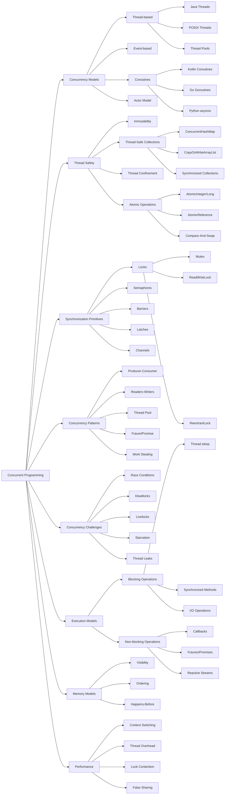

# Concurrency concepts

# Learn Concurrency with examples

[[hashMapRealWorldProblem.md]]

## Problem 1

```java
/*
We are a currency exchange that maintains the current exchange rates between currencies. A user can come to us with some amount in one currency and request the equivalent amount in a different currency. Given a list of exchange rates between currencies, write a function that calculates currency rate between any 2 currencies.

(GBP, EUR, 10)     - read as "1 GBP equals 10 EUR"
(EUR, USD, 1.1)    - "1 EUR equals 1.1 USD"
(USD, JPY, 108.3)
(CNY, RUB, 14.6)
*/

/*
We are a currency exchange that maintains the current exchange rates between currencies. A user can come to us with some amount in one currency and request the equivalent amount in a different currency. Given a list of exchange rates between currencies, write a function that calculates currency rate between any 2 currencies.

(GBP, EUR, 10)     - read as "1 GBP equals 10 EUR"
(EUR, USD, 1.1)    - "1 EUR equals 1.1 USD"
(USD, JPY, 108.3)
(CNY, RUB, 14.6)
*/


data  class CurrencyExchange(val source: String, val target: String, val rate: Double) {

}

class CurrencyExchanger{
    private val currencyExchangeGraph: MutableMap<String, MutableMap<String, Double>> = HashMap()
    
    private fun addExchangeRate(exchangeRate: CurrencyExchange) {
        val (source, target, rate) = exchangeRate
        currencyExchangeGraph.computeIfAbsent(source, {HashMap()})[target] =
            rate
        currencyExchangeGraph.computeIfAbsent(target, {HashMap()})[source] = 1.0 / rate
    }
    fun currencyGraphBuild(currenciesExchanges: Array<CurrencyExchange>) {
        currenciesExchanges.forEach {
            addExchangeRate(it)
        }
    }
    fun getCurrencyRate(source: String, target: String): Double {
        val visited: MutableMap<String, Boolean> = HashMap()
        return getCurrencyRate(source, target, visited)
    }
    fun getCurrencyRate(source: String, target: String, visited: MutableMap<String, Boolean>): Double {
        if(visited.getOrDefault(source, false)) {
            return -1.0;
        }
        if(!currencyExchangeGraph.containsKey(source) || !currencyExchangeGraph.containsKey(target)) {
            return -1.0;
        }
        return getCurrencyRateDFS(source, target, visited)
    }

    private fun getCurrencyRateDFS(source: String, target: String, visited: MutableMap<String, Boolean>): Double {
        // Graph, BFS, DFS
        visited[source] = true
        currencyExchangeGraph[source]?.let {
                sourceMap ->
            if(sourceMap.getOrDefault(target, -1.0) != -1.0) {
                return sourceMap[target]!!
            }
            for(neighbour in sourceMap.keys) {
                val neighbourRate = getCurrencyRate(neighbour, target, visited);
                if(neighbourRate != -1.0) {
                    return sourceMap[neighbour]!! * neighbourRate
                }
            }
        }
        return -1.0;
    }

}

internal object Solution {
    @JvmStatic
    fun main(args: Array<String>) {
        val currencyExchanger = CurrencyExchanger()
        val records = arrayOf<CurrencyExchange>(
            CurrencyExchange("GBP", "EUR", 10.0),
            CurrencyExchange("EUR", "USD", 1.1),
            CurrencyExchange("USD", "JPY", 108.3),
            CurrencyExchange("CNY", "RUB", 104.6)
        )
        currencyExchanger.currencyGraphBuild(records)
        var ans = currencyExchanger.getCurrencyRate("GBP", "EUR")
        println("GBP->EUR:$ans")
        ans = currencyExchanger.getCurrencyRate("GBP", "USD")
        println("GBP->USD:$ans")
        ans = currencyExchanger.getCurrencyRate("GBP", "JPY")
        println("GBP->JPY:$ans")
        ans = currencyExchanger.getCurrencyRate("GBP", "CNY")
        println("GBP->CNY:$ans")
    }
}

```
## Question 2. Operator Assignment
```java
/*
When assigning a task to an operator, we want to assign it to the operator with the fewest tasks, and if there are multiple operators with the same number of tasks, assign to the operator having most ilde time, if idel time are same, assign alphbeta by name.


- Initializes with a set of available operators.
- set_limit(operator_name, n)
  Sets an operator’s limit.
- assign(conversation_id)
  Assigns a given conversation to the next available operator.
- get_assignment_queue(n)
  Returns the list of possible operators in the order they will be assigned to conversations, not real assignment yet.
*/
```
### Code

```kotlin
import java.util.PriorityQueue
import kotlin.concurrent.timerTask

data class Operator(
    val name: String, var capability: Int = 0, var workLoad: Int = 0, var lastOpTime: Long = 0L
): Comparable<Operator>  {
    override fun compareTo(other: Operator): Int {
        if(this.workLoad != other.workLoad) {
            return this.workLoad - other.workLoad
        }
        if(this.lastOpTime != other.lastOpTime) {
            return (this.lastOpTime - other.lastOpTime).toInt()
        }
        return this.name.compareTo(other.name)
    }

}

// a, 3
// b, 3
// c, 2

// assign("1") => a
// assign("1") => b
// assign("1") => a
class TaskAssigner {
    private val operators: MutableMap<String, Operator> = HashMap()
    private val availableOperators: PriorityQueue<Operator> = PriorityQueue()

    constructor(operatorNames: List<String>) {
        operatorNames.forEach {
            val op = Operator(name = it)
            operators.put(it, op)
            availableOperators.add(op)
        }
    }

    fun set_limit(operator_name: String, n: Int) {
        operators[operator_name]?.let {
            it.capability = n
            availableOperators.remove(it)
            it.capability = n
            availableOperators.add(it)
        }
    }

    fun assign(conversation_id: String): String? {
        var bestOp: Operator? = null;
        val tmpQueue = PriorityQueue<Operator>()
        while(!availableOperators.isEmpty()) {
            val op = availableOperators.poll()
            if(op.workLoad < op.capability) {
                bestOp = op;
                break
            }
            tmpQueue.add(op)
        }
        availableOperators.addAll(tmpQueue)
        if (bestOp == null) {
            return null
        }
        availableOperators.remove(bestOp)
        bestOp.lastOpTime = System.currentTimeMillis()
        bestOp.workLoad+=1
        availableOperators.add(bestOp)
        return bestOp.name
    }

    fun get_assignment_queue(n: Int): List<String> {
        val res = ArrayList<String>()
        val tmpOperator = HashMap<String, Operator>()
        operators.forEach {
            tmpOperator.put(it.key, it.value.copy())
        }
        val tmpQueue = PriorityQueue<Operator>()
        tmpQueue.addAll(tmpOperator.values)
        for (i in 0 until n) {
            val op = tmpQueue.poll()
            if(op.workLoad >= op.capability) {
                continue;
            }
            res.add(op.name)
            tmpQueue.remove(op)
            op.workLoad++
            op.lastOpTime = System.currentTimeMillis()
            tmpQueue.add(op)
        }
        return res
    }
}
```


## Question 3

```java
/**
- concurrency, multithread, event uploader
- Ordered processing through sequence numbers
- No event loss during failures
- Strict batch size of 100 (except final batch)
 */
class UploadManagerChannel {
    // FIFO
    val channel = Channel<String>(100)
    val scope = CoroutineScope<newSingleThreadExecutor>();


    fun addEvent(event: String) {
        scope.launch{
          print(1)//
          channel.offer(event);// suspend function
          print(5)
        }
    }

    suspend fun upload() {
        // handle uploading
        scope.launch {
          print(2)
          val array = Array<String>;
          while(!channel.isEmpty()) {
            array.add(channel.poll())
          }
          // array => bytecode
          Network.post(array
            /* what */,
          onSuccess = { response ->
            // ?

          },
          onFailure = { error ->
              print(3)
              // ?
              val newArray = Array<String>;
              while(!channel.isEmpty()) {
                newArray.add(channel.poll())
              }
              for(String event: array) {
                channel.offer(event)
              }

              for(String event: newArray) {
                channel.offer(event);
              }


          })

        }
    }
}

// This is the network request tool you can use for posting data and you don't need to care about its implementation.
class Network {
  fun post(data, onSuccess, onFailure);
}
```


### Channel solution
```java
class UploadManagerChannel {
    // FIFO
    val channel = Channel<String>(100)
    val scope = CoroutineScope<newSingleThreadExecutor>();


    fun addEvent(event: String) {
        scope.launch{
          print(1)//
          channel.offer(event);// suspend function
          print(5)
        }
    }

    suspend fun upload() {
        // handle uploading
        scope.launch {
          print(2)
          val array = Array<String>;
          while(!channel.isEmpty()) {
            array.add(channel.poll())
          }
          // array => bytecode
          Network.post(array
            /* what */,
          onSuccess = { response ->
            // ?

          },
          onFailure = { error ->
              print(3)
              // ?
              val newArray = Array<String>;
              while(!channel.isEmpty()) {
                newArray.add(channel.poll())
              }
              for(String event: array) {
                channel.offer(event)
              }

              for(String event: newArray) {
                channel.offer(event);
              }


          })

        }
    }
}
```
### Improved Channel solution
```kotlin
import kotlinx.coroutines.*
import kotlinx.coroutines.channels.Channel
import kotlinx.coroutines.sync.Mutex
import kotlinx.coroutines.sync.withLock
import java.util.concurrent.ConcurrentLinkedQueue
import kotlin.random.Random

data class Event(val content: String, val seq: Int)
object Network {
    fun post(
        events: List<Event>,
        onSuccess: (String) -> Unit,
        onFailure: (Throwable) -> Unit
    ) {
        // Simulate async network call
        GlobalScope.launch {
            try {
                delay(50) // simulate latency
                val rdm = Random.nextInt()
                if(rdm % 2 == 0) {
                    onSuccess("Uploaded ${events.size} events")
                } else {
                    onFailure(Exception("$rdm"))
                }
            } catch (e: Exception) {
                onFailure(e)
            }
        }
    }
}
class UploadManagerChannelImproved {
    // FIFO
    private val channel = Channel<List<Event>>(capacity = Channel.UNLIMITED)
    private val scope = CoroutineScope(newSingleThreadContext("Single"))
    private val events = mutableListOf<Event>();
    private val mutex = Mutex()
    private var sequence = 0

    init {
        scope.launch {
            for(event in channel) {
                this@UploadManagerChannelImproved.processEvent(batch = event)
            }
        }

        scope.launch {
            while(true) {
                mutex.withLock {
                    if(events.size >= 100) {
                        val batch = mutableListOf<Event>()
                        batch.addAll(events.take(100))
                        events.drop(100)
                        channel.send(batch)
                    }
                }
                delay(100)
            }
        }
    }

    suspend fun addEvent(event: String) {
        mutex.withLock {
            val newE = Event(content = event, seq = sequence)
            events.add(newE)
            sequence++
        }
    }

    suspend fun processEvent(batch: List<Event>) {
        var retried = 0;
        var expontial = 100L;

        while (retried < 3) {
            try {
                upload(batch)
                return
            } catch (e:Throwable ) {
                retried++
                if(retried >= 3) {
                    scope.launch {
                        println("$batch failed and readded")
                        mutex.withLock {
                            events.addAll(batch)
                            val cache  = events.sortedBy { it.seq }
                            events.clear()
                            events.addAll(cache)
                        }
                    }
                }
                delay(expontial)
                expontial *= 2;
            }

        }

    }


    suspend fun upload(batch: List<Event>) {
        val array = batch.sortedBy { it.seq }
        // array => bytecode
        Network.post(array
            /* what */,
            onSuccess = { response: String ->
                // ?
                println("$response success")

            },
            onFailure = { error: Throwable ->
                println("Upload failed: ${error.message}")
                throw error;
            })

    }

    fun shutdown() {
        runBlocking {
            mutex.withLock {
                channel.send(events)
            }
            delay(1000)
            channel.close()
            scope.cancel()     
        }
    }
}
```

### Thread solution
```kotlin
import kotlinx.coroutines.processNextEventInCurrentThread
import java.lang.Thread.sleep


class UploadManagerChannelNoCoroutine {
    private val events = mutableListOf<Event>();
    private val mutex = Object()
    private var sequence = 0
    

    fun addEvent(name: String) {
        synchronized(mutex) {
            events.add(Event(name, seq = sequence))
            sequence++
        }
    }


    fun uploadBatch() {
        var retries = 0
        var delay = 100
        synchronized(mutex) {
            val batch = events.take(100).toList()
            val cache = events.drop(100)
            events.clear()
            events.addAll(cache)
        }
        while(retries < 3) {
            try{
                upload(batch)
                return
            } catch (e: Throwable) {
                retries++
                if(retries >= 3) {
                    synchronized(mutex) {
                        events.addAll(0, batch)
                    }
                    return
                }
                sleep(delay.toLong())
                delay*=2
            }
        }

    }
    fun upload(batch: List<Event>) {
        Network.post(batch
            /* what */,
            onSuccess = { response: String ->
                // ?
                println("$response success")

            },
            onFailure = { error: Throwable ->
                println("Upload failed: ${error.message}")
                throw error
            })
    }

    fun shutdown() {
        synchronized(mutex) {
            if (events.isNotEmpty()) {
                upload(events)
                sleep(1000L)
            }
        }
    }
}
```
### Current collection solution
```normal
class UploadManagerThread {
    // FIFO
    val queue1 = ConcurrencyLinkedList(100);
    val queue2 = ConcurrencyLinkedList(100);
    val memoryQueue = ConcurrencyLinkedList();
    // val apiServer = APIServer();

    fun addEvent2(event: String) {
        // handle adding event
        if(q1) {
          if(queue1.size() < 100) {
            queue1.add(event);
            return
          }

        } else {
          if(queue2.size() < 100) {
            queue2.add(event);
            return
          }
        }
        memoryQueue.add(event)

    }

// upload(50) --10--> onFailure
// 50,10
// 10, 50

    fun upload2() {
      val curQ = if(q1)
      val array = Array<String>;
          while(String event: queue) {
            array.add(event)
          };
      Network.post(
            /* what */,
          onSuccess = { response ->
            // ?

          },
          onFailure = { error ->
              print(3)
              // ?
              val newArray = Array<String>;
              while(!channel.isEmpty()) {
                newArray.add(channel.poll())
              }
              for(String event: array) {
                channel.offer(event)
              }

              for(String event: newArray) {
                channel.offer(event);
              }


          })
    }
}
```
# Concurrency Challenges          
## 1. Read-Write Conflicts

**Challenge:** Managing concurrent reads and writes to shared data structures without sacrificing performance or correctness.

**General Solutions:**
- **Read-Write Locks:** Allow multiple concurrent reads but exclusive writes
  ```java
  private final ReadWriteLock lock = new ReentrantReadWriteLock();
  
  public void update() {
      lock.writeLock().lock();
      try {
          // Update operation
      } finally {
          lock.writeLock().unlock();
      }
  }
  
  public Data read() {
      lock.readLock().lock();
      try {
          // Read operation
          return data;
      } finally {
          lock.readLock().unlock();
      }
  }
  ```

- **Copy-on-Write Pattern:** Create a new copy for updates, atomically replace the reference
  ```java
  private final AtomicReference<Map<K, V>> mapRef = new AtomicReference<>(new HashMap<>());
  
  public void update(K key, V value) {
      Map<K, V> oldMap, newMap;
      do {
          oldMap = mapRef.get();
          newMap = new HashMap<>(oldMap);
          newMap.put(key, value);
      } while (!mapRef.compareAndSet(oldMap, newMap));
  }
  ```

## 2. Atomic Operations

**Challenge:** Ensuring that complex operations involving multiple steps appear atomic to other threads.

**General Solutions:**
- **Optimistic Locking:** Use version numbers or timestamps to detect conflicts
  ```java
  public boolean updateIfNotChanged(K key, V oldValue, V newValue) {
      return map.replace(key, oldValue, newValue);
  }
  ```

- **Pessimistic Locking:** Acquire locks before operations
  ```java
  public void transferBetweenMaps(K key, Map<K, V> source, Map<K, V> target) {
      synchronized(lockObject) {
          V value = source.remove(key);
          if (value != null) {
              target.put(key, value);
          }
      }
  }
  ```

## 3. Deadlock Prevention

**Challenge:** Avoiding situations where threads wait indefinitely for resources held by each other.

**General Solutions:**
- **Lock Ordering:** Always acquire locks in the same order
  ```java
  public void transferBetweenAccounts(Account from, Account to, double amount) {
      // Sort accounts by ID to ensure consistent lock ordering
      Account first = from.getId() < to.getId() ? from : to;
      Account second = from.getId() < to.getId() ? to : from;
      
      synchronized(first) {
          synchronized(second) {
              // Transfer logic
          }
      }
  }
  ```

- **Lock Timeouts:** Use tryLock with timeout to prevent indefinite waiting
  ```java
  public boolean transferWithTimeout(Account from, Account to, double amount) {
      try {
          if (from.getLock().tryLock(1, TimeUnit.SECONDS)) {
              try {
                  if (to.getLock().tryLock(1, TimeUnit.SECONDS)) {
                      try {
                          // Transfer logic
                          return true;
                      } finally {
                          to.getLock().unlock();
                      }
                  }
              } finally {
                  from.getLock().unlock();
              }
          }
      } catch (InterruptedException e) {
          Thread.currentThread().interrupt();
      }
      return false; // Couldn't acquire both locks
  }
  ```

## 4. Thread-Safe Collections

**Challenge:** Using appropriate thread-safe collections for different access patterns.

**General Solutions:**
- **ConcurrentHashMap:** For high-concurrency read/write scenarios
  ```java
  private final Map<K, V> map = new ConcurrentHashMap<>();
  
  // No explicit synchronization needed for basic operations
  public V get(K key) {
      return map.get(key);
  }
  
  public void put(K key, V value) {
      map.put(key, value);
  }
  
  // For compound operations, use atomic methods
  public V putIfAbsent(K key, V value) {
      return map.putIfAbsent(key, value);
  }
  
  // For operations that need to be atomic but aren't built-in
  public V computeIfPresent(K key, Function<V, V> updateFn) {
      return map.computeIfPresent(key, (k, v) -> updateFn.apply(v));
  }
  ```

- **Synchronized Collections:** For simpler thread-safety needs
* locked in all operations
  ```java
  private final Map<K, V> map = Collections.synchronizedMap(new HashMap<>());
  
  // For compound operations, explicit synchronization is still needed
  public V getOrCompute(K key, Supplier<V> valueSupplier) {
      synchronized(map) {
          V value = map.get(key);
          if (value == null) {
              value = valueSupplier.get();
              map.put(key, value);
          }
          return value;
      }
  }
  ```

## 5. Non-Blocking Algorithms

**Challenge:** Implementing lock-free algorithms for high-throughput scenarios.

**General Solutions:**
- **Compare-and-Swap (CAS):** Use atomic variables for lock-free updates
  ```java
  private final AtomicInteger counter = new AtomicInteger(0);
  
  public int incrementAndGet() {
      int current, next;
      do {
          current = counter.get();
          next = current + 1;
      } while (!counter.compareAndSet(current, next));
      return next;
  }
  ```

- **Atomic Reference Updates:** For more complex data structures
  ```java
  private static class Node<T> {
      final T value;
      final AtomicReference<Node<T>> next;
      
      Node(T value) {
          this.value = value;
          this.next = new AtomicReference<>(null);
      }
  }
  
  private final AtomicReference<Node<T>> head = new AtomicReference<>(null);
  
  public void push(T value) {
      Node<T> newHead = new Node<>(value);
      Node<T> oldHead;
      do {
          oldHead = head.get();
          newHead.next.set(oldHead);
      } while (!head.compareAndSet(oldHead, newHead));
  }
  ```


## 7. Thread Confinement

**Challenge:** Avoiding shared mutable state by confining data to specific threads.

**General Solutions:**
- **ThreadLocal:** For thread-specific storage
  ```java
  private final ThreadLocal<SimpleDateFormat> dateFormat = 
      ThreadLocal.withInitial(() -> new SimpleDateFormat("yyyy-MM-dd"));
  
  public String formatDate(Date date) {
      return dateFormat.get().format(date);
  }
  ```

- **Worker Threads:** Dedicated threads for specific operations
  ```java
  public class WorkerThread extends Thread {
      private final BlockingQueue<Runnable> taskQueue = new LinkedBlockingQueue<>();
      
      @Override
      public void run() {
          while (!isInterrupted()) {
              try {
                  Runnable task = taskQueue.take();
                  task.run();
              } catch (InterruptedException e) {
                  Thread.currentThread().interrupt();
                  break;
              }
          }
      }
      
      public void submitTask(Runnable task) {
          taskQueue.offer(task);
      }
  }
  ```

## 8. Partitioning and Sharding

**Challenge:** Distributing data and workload across multiple independent units to reduce contention.

**General Solutions:**
- **Data Partitioning:** Split data based on keys
  ```java
  public class ShardedMap<K, V> {
      private static final int SHARD_COUNT = 16;
      private final Map<K, V>[] shards = new HashMap[SHARD_COUNT];
      
      public ShardedMap() {
          for (int i = 0; i < SHARD_COUNT; i++) {
              shards[i] = new HashMap<>();
          }
      }
      
      private int shardIndex(K key) {
          return Math.abs(key.hashCode() % SHARD_COUNT);
      }
      
      public V get(K key) {
          int index = shardIndex(key);
          synchronized (shards[index]) {
              return shards[index].get(key);
          }
      }
      
      public void put(K key, V value) {
          int index = shardIndex(key);
          synchronized (shards[index]) {
              shards[index].put(key, value);
          }
      }
  }
  ```

- **Task Partitioning:** Process different parts of data in parallel
  ```java
  public <T> List<T> processInParallel(List<T> items, Function<T, T> processor) {
      int cpuCount = Runtime.getRuntime().availableProcessors();
      int batchSize = Math.max(1, items.size() / cpuCount);
      
      return items.parallelStream()
          .map(processor)
          .collect(Collectors.toList());
  }
  ```

## 9. Versioning and Immutability

**Challenge:** Managing concurrent access to data that changes over time.

**General Solutions:**
- **Immutable Objects:** Create new instances instead of modifying existing ones
  ```java
  public class ImmutablePair<A, B> {
      private final A first;
      private final B second;
      
      public ImmutablePair(A first, B second) {
          this.first = first;
          this.second = second;
      }
      
      public A getFirst() { return first; }
      public B getSecond() { return second; }
      
      public ImmutablePair<A, B> withFirst(A newFirst) {
          return new ImmutablePair<>(newFirst, second);
      }
      
      public ImmutablePair<A, B> withSecond(B newSecond) {
          return new ImmutablePair<>(first, newSecond);
      }
  }
  ```

- **Versioned Data:** Track versions to detect conflicts
  ```java
  public class VersionedValue<T> {
      private final AtomicReference<Versioned<T>> ref;
      
      public VersionedValue(T initialValue) {
          ref = new AtomicReference<>(new Versioned<>(initialValue, 0));
      }
      
      public Versioned<T> get() {
          return ref.get();
      }
      
      public boolean compareAndSet(Versioned<T> expected, T newValue) {
          Versioned<T> next = new Versioned<>(newValue, expected.version + 1);
          return ref.compareAndSet(expected, next);
      }
      
      private static class Versioned<T> {
          final T value;
          final long version;
          
          Versioned(T value, long version) {
              this.value = value;
              this.version = version;
          }
      }
  }
  ```

## 10. Concurrency Control Patterns

**Challenge:** Implementing higher-level concurrency control mechanisms.

**General Solutions:**
- **Producer-Consumer Pattern:** For asynchronous processing
  ```java
  public class ProducerConsumer<T> {
      private final BlockingQueue<T> queue;
      private final int numConsumers;
      private final ExecutorService executor;
      
      public ProducerConsumer(int queueSize, int numConsumers) {
          this.queue = new ArrayBlockingQueue<>(queueSize);
          this.numConsumers = numConsumers;
          this.executor = Executors.newFixedThreadPool(numConsumers + 1);
      }
      
      public void start(Supplier<T> producer, Consumer<T> consumer) {
          // Start producer
          executor.submit(() -> {
              try {
                  while (!Thread.currentThread().isInterrupted()) {
                      T item = producer.get();
                      if (item == null) break;
                      queue.put(item);
                  }
              } catch (InterruptedException e) {
                  Thread.currentThread().interrupt();
              }
          });
          
          // Start consumers
          for (int i = 0; i < numConsumers; i++) {
              executor.submit(() -> {
                  try {
                      while (!Thread.currentThread().isInterrupted()) {
                          T item = queue.take();
                          consumer.accept(item);
                      }
                  } catch (InterruptedException e) {
                      Thread.currentThread().interrupt();
                  }
              });
          }
      }
      
      public void shutdown() {
          executor.shutdownNow();
      }
  }
  ```

- **Read-Copy-Update (RCU):** For read-heavy workloads
  ```java
  public class RCUMap<K, V> {
      private volatile Map<K, V> current = new HashMap<>();
      private final ReentrantLock writeLock = new ReentrantLock();
      
      public V get(K key) {
          return current.get(key);
      }
      
      public void put(K key, V value) {
          writeLock.lock();
          try {
              Map<K, V> updated = new HashMap<>(current);
              updated.put(key, value);
              current = updated;
          } finally {
              writeLock.unlock();
          }
      }
      
      public void remove(K key) {
          writeLock.lock();
          try {
              Map<K, V> updated = new HashMap<>(current);
              updated.remove(key);
              current = updated;
          } finally {
              writeLock.unlock();
          }
      }
  }
  ```
