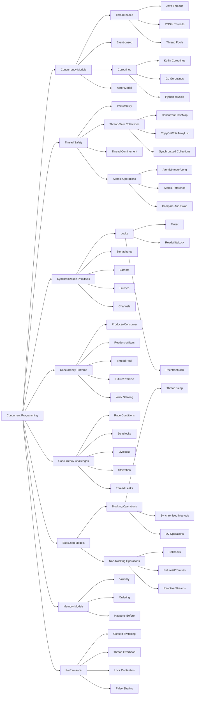

# Concurrency concepts

## Big Picture

Concurrency is the broader problem domain. It studies how multiple tasks can make progress in overlapping time periods while still coordinating correctly around shared resources, ordering, cancellation, failures, and performance.

Multithreading is one implementation technique for concurrency. It means using multiple threads of execution inside one process. But concurrency can also be implemented with multiple processes, event loops, coroutines, non-blocking I/O, actors, channels, message queues, or distributed coordination.

Many of them are about **coordination under overlap**: how tasks share state safely, communicate with each other, wait for conditions, avoid races, recover from failures, shut down gracefully, and keep throughput predictable.

## Where These Problems Fit

- **Shared-state concurrency**: multiple tasks access the same mutable data, so we need mutual exclusion, memory visibility, atomic operations, or immutable data.
- **Task coordination**: tasks wait for signals, hand off work, enforce ordering, coordinate shutdown, or implement producer-consumer pipelines.
- **Task execution and scheduling**: work is submitted, queued, batched, retried, cancelled, timed out, or processed by worker pools.
- **Message-passing concurrency**: tasks communicate by sending data through queues, channels, actors, streams, or event pipelines.
- **Async I/O concurrency**: one or a few execution units handle many waiting I/O operations through event loops, callbacks, futures, or promises.
- **Parallel computing**: multiple CPU cores work at the same time to speed up CPU-bound work.
- **Distributed concurrency**: multiple machines or services coordinate through locks, leases, idempotency, versioning, transactions, or consensus.

## Language Mapping

- **Java**: thread-based shared-memory concurrency is the main interview focus. Know [JMM](JVMMemoryModel.md), [`volatile`](volatile.md), [`synchronized`](javaSynchronized.md), [Lock](JavaLock.md), CAS, `BlockingQueue`, `ExecutorService`, and thread-safe collections. → 详见 [Thread Pool](threadpool.md)、[HashMap & ConcurrentHashMap](HashMap.md)
- **Python**: split the topic into `threading` for I/O-bound shared-memory tasks, `multiprocessing` for CPU-bound parallelism, and `asyncio` for event-loop based concurrency.
- **Go**: the common model is goroutines plus channels, with `sync.Mutex`, `sync.RWMutex`, `sync.WaitGroup`, `sync.Cond`, `sync/atomic`, and `context` for coordination and cancellation.


```mermaid
graph LR
    A[Concurrent Programming] --> B[Concurrency Models]
    A --> C[Thread Safety]
    A --> D[Synchronization Primitives]
    A --> E[Concurrency Patterns]
    A --> F[Concurrency Challenges]
    
    %% Concurrency Models
    B --> B1[Thread-based]
    B --> B2[Event-based]
    B --> B3[Coroutines]
    B --> B4[Actor Model]
    
    B1 --> B1a[Java Threads]
    B1 --> B1b[POSIX Threads]
    B1 --> B1c[Thread Pools]
    
    B3 --> B3a[Kotlin Coroutines]
    B3 --> B3b[Go Goroutines]
    B3 --> B3c[Python asyncio]
    
    %% Thread Safety
    C --> C1[Immutability]
    C --> C2[Thread-Safe Collections]
    C --> C3[Thread Confinement]
    C --> C4[Atomic Operations]
    
    C2 --> C2a[ConcurrentHashMap]
    C2 --> C2b[CopyOnWriteArrayList]
    C2 --> C2c[Synchronized Collections]
    
    C4 --> C4a[AtomicInteger/Long]
    C4 --> C4b[AtomicReference]
    C4 --> C4c[Compare-And-Swap]
    
    %% Synchronization Primitives
    D --> D1[Locks]
    D --> D2[Semaphores]
    D --> D3[Barriers]
    D --> D4[Latches]
    D --> D5[Channels]
    
    D1 --> D1a[Mutex]
    D1 --> D1b[ReadWriteLock]
    D1 --> D1c[ReentrantLock]
    
    %% Concurrency Patterns
    E --> E1[Producer-Consumer]
    E --> E2[Readers-Writers]
    E --> E3[Thread Pool]
    E --> E4[Future/Promise]
    E --> E5[Work Stealing]
    
    %% Concurrency Challenges
    F --> F1[Race Conditions]
    F --> F2[Deadlocks]
    F --> F3[Livelocks]
    F --> F4[Starvation]
    F --> F5[Thread Leaks]
    
    %% Blocking vs Non-blocking
    A --> G[Execution Models]
    G --> G1[Blocking Operations]
    G --> G2[Non-blocking Operations]
    
    G1 --> G1a[Thread.sleep]
    G1 --> G1b[Synchronized Methods]
    G1 --> G1c[I/O Operations]
    
    G2 --> G2a[Callbacks]
    G2 --> G2b[Futures/Promises]
    G2 --> G2c[Reactive Streams]
    
    %% Memory Models
    A --> H[Memory Models]
    H --> H1[Visibility]
    H --> H2[Ordering]
    H --> H3[Happens-Before]
    
    %% Performance Considerations
    A --> I[Performance]
    I --> I1[Context Switching]
    I --> I2[Thread Overhead]
    I --> I3[Lock Contention]
    I --> I4[False Sharing]
```
# 面试编程题

> 🔗 并发相关的面试编程题（含多种解法对比）已单独整理，见 **[concurrencyProblems.md](concurrencyProblems.md)**
>
> | 题目 | 核心考点 | 备注 |
> |------|---------|------|
> | [Problem 1 — Currency Exchange](concurrencyProblems.md) | 图 DFS + 并发安全 follow-up | ⚠️ 本质是图论题 |
> | [Problem 2 — Operator Assignment](concurrencyProblems.md) | PriorityQueue 调度、线程安全 | 优先队列经典题 |
> | [Problem 3 — Event Uploader](concurrencyProblems.md) | Producer-Consumer、重试、Channel vs Thread | 核心并发设计题 |
>
> 更多 HashMap 并发场景见 → [hashMapRealWorldProblem.md](hashMapRealWorldProblem.md)

> **相关深入资料（本地文件）：**
> - [JVMMemoryModel.md](JVMMemoryModel.md) — JMM、happens-before、可见性、重排序、MESI 协议
> - [volatile.md](volatile.md) — volatile 三大特性、内存屏障、DCL 单例
> - [javaSynchronized.md](javaSynchronized.md) — synchronized 原理、对象头、锁升级（偏向→轻量→重量）、锁消除/粗化
> - [JavaLock.md](JavaLock.md) — ReentrantLock、ReadWriteLock、公平锁、CAS、ABA 问题、分布式锁
> - [threadpool.md](threadpool.md) — 线程池原理、参数、BlockingQueue、ThreadLocal
> - [HashMap.md](HashMap.md) — ConcurrentHashMap JDK7/8 实现、CAS+synchronized 配合
> - [Singleton.md](Singleton.md) — 各语言单例实现（含 DCL+volatile）
> - [IO.md](IO.md) — BIO/NIO/AIO，Java IO 模型
> - [eventDemultiplexer.md](eventDemultiplexer.md) — epoll/kqueue/IOCP 事件多路复用
> - [javaConcurrencyStory.md](javaConcurrencyStory.md) — 并发概念故事串联
> - [androidAsyncMultipleThreading.md](androidAsyncMultipleThreading.md) — Android 异步演进（Thread→Handler→Coroutines）
> - [androidBackgroundScheduler.md](androidBackgroundScheduler.md) — WorkManager/AlarmManager/JobScheduler 等
## 1. Read-Write Conflicts

**Challenge:** Managing concurrent reads and writes to shared data structures without sacrificing performance or correctness.

**General Solutions:**
- **Read-Write Locks:** Allow multiple concurrent reads but exclusive writes
  ```java
  private final ReadWriteLock lock = new ReentrantReadWriteLock();
  
  public void update() {
      lock.writeLock().lock();
      try {
          // Update operation
      } finally {
          lock.writeLock().unlock();
      }
  }
  
  public Data read() {
      lock.readLock().lock();
      try {
          // Read operation
          return data;
      } finally {
          lock.readLock().unlock();
      }
  }
  ```

- **Copy-on-Write Pattern:** Create a new copy for updates, atomically replace the reference
  ```java
  private final AtomicReference<Map<K, V>> mapRef = new AtomicReference<>(new HashMap<>());
  
  public void update(K key, V value) {
      Map<K, V> oldMap, newMap;
      do {
          oldMap = mapRef.get();
          newMap = new HashMap<>(oldMap);
          newMap.put(key, value);
      } while (!mapRef.compareAndSet(oldMap, newMap));
  }
  ```

## 2. Atomic Operations

> 🔗 深入原理见 [JavaLock.md § CAS原理](JavaLock.md) 和 [JVMMemoryModel.md § 原子性问题](JVMMemoryModel.md)

**Challenge:** Ensuring that complex operations involving multiple steps appear atomic to other threads.

**General Solutions:**
- **Optimistic Locking:** Use version numbers or timestamps to detect conflicts
  ```java
  public boolean updateIfNotChanged(K key, V oldValue, V newValue) {
      return map.replace(key, oldValue, newValue);
  }
  ```

- **Pessimistic Locking:** Acquire locks before operations
  ```java
  public void transferBetweenMaps(K key, Map<K, V> source, Map<K, V> target) {
      synchronized(lockObject) {
          V value = source.remove(key);
          if (value != null) {
              target.put(key, value);
          }
      }
  }
  ```

## 3. Deadlock Prevention

> 🔗 锁的完整分类与原理见 [JavaLock.md](JavaLock.md)

**Challenge:** Avoiding situations where threads wait indefinitely for resources held by each other.

**General Solutions:**
- **Lock Ordering:** Always acquire locks in the same order
  ```java
  public void transferBetweenAccounts(Account from, Account to, double amount) {
      // Sort accounts by ID to ensure consistent lock ordering
      Account first = from.getId() < to.getId() ? from : to;
      Account second = from.getId() < to.getId() ? to : from;
      
      synchronized(first) {
          synchronized(second) {
              // Transfer logic
          }
      }
  }
  ```

- **Lock Timeouts:** Use tryLock with timeout to prevent indefinite waiting
  ```java
  public boolean transferWithTimeout(Account from, Account to, double amount) {
      try {
          if (from.getLock().tryLock(1, TimeUnit.SECONDS)) {
              try {
                  if (to.getLock().tryLock(1, TimeUnit.SECONDS)) {
                      try {
                          // Transfer logic
                          return true;
                      } finally {
                          to.getLock().unlock();
                      }
                  }
              } finally {
                  from.getLock().unlock();
              }
          }
      } catch (InterruptedException e) {
          Thread.currentThread().interrupt();
      }
      return false; // Couldn't acquire both locks
  }
  ```

## 4. Thread-Safe Collections

> 🔗 ConcurrentHashMap 详细实现（JDK 7 分段锁 / JDK 8 CAS+synchronized）见 [HashMap.md § ConcurrentHashMap的实现](HashMap.md)

**Challenge:** Using appropriate thread-safe collections for different access patterns.

**General Solutions:**
- **ConcurrentHashMap:** For high-concurrency read/write scenarios
  ```java
  private final Map<K, V> map = new ConcurrentHashMap<>();
  
  // No explicit synchronization needed for basic operations
  public V get(K key) {
      return map.get(key);
  }
  
  public void put(K key, V value) {
      map.put(key, value);
  }
  
  // For compound operations, use atomic methods
  public V putIfAbsent(K key, V value) {
      return map.putIfAbsent(key, value);
  }
  
  // For operations that need to be atomic but aren't built-in
  public V computeIfPresent(K key, Function<V, V> updateFn) {
      return map.computeIfPresent(key, (k, v) -> updateFn.apply(v));
  }
  ```

- **Synchronized Collections:** For simpler thread-safety needs
* locked in all operations
  ```java
  private final Map<K, V> map = Collections.synchronizedMap(new HashMap<>());
  
  // For compound operations, explicit synchronization is still needed
  public V getOrCompute(K key, Supplier<V> valueSupplier) {
      synchronized(map) {
          V value = map.get(key);
          if (value == null) {
              value = valueSupplier.get();
              map.put(key, value);
          }
          return value;
      }
  }
  ```

## 5. Non-Blocking Algorithms

> 🔗 CAS 原理与 ABA 问题见 [JavaLock.md § CAS原理](JavaLock.md)；volatile 如何配合 CAS 保证可见性见 [volatile.md](volatile.md)

**Challenge:** Implementing lock-free algorithms for high-throughput scenarios.

**General Solutions:**
- **Compare-and-Swap (CAS):** Use atomic variables for lock-free updates
  ```java
  private final AtomicInteger counter = new AtomicInteger(0);
  
  public int incrementAndGet() {
      int current, next;
      do {
          current = counter.get();
          next = current + 1;
      } while (!counter.compareAndSet(current, next));
      return next;
  }
  ```

- **Atomic Reference Updates:** For more complex data structures
  ```java
  private static class Node<T> {
      final T value;
      final AtomicReference<Node<T>> next;
      
      Node(T value) {
          this.value = value;
          this.next = new AtomicReference<>(null);
      }
  }
  
  private final AtomicReference<Node<T>> head = new AtomicReference<>(null);
  
  public void push(T value) {
      Node<T> newHead = new Node<>(value);
      Node<T> oldHead;
      do {
          oldHead = head.get();
          newHead.next.set(oldHead);
      } while (!head.compareAndSet(oldHead, newHead));
  }
  ```


## 6. Synchronization Primitives Deep Dive

> 🔗 以下主题在独立文件中有完整讲解：
> - **synchronized** 原理、对象头 Mark Word、锁升级过程 → [javaSynchronized.md](javaSynchronized.md)
> - **volatile** 可见性、有序性、内存屏障 → [volatile.md](volatile.md)
> - **ReentrantLock / ReadWriteLock / 公平锁** → [JavaLock.md](JavaLock.md)
> - **JMM happens-before 规则** → [JVMMemoryModel.md](JVMMemoryModel.md)

## 7. Thread Confinement

> 🔗 ThreadLocal 的工作原理与内存泄漏风险见 [threadpool.md § ThreadLocal](threadpool.md)

**Challenge:** Avoiding shared mutable state by confining data to specific threads.

**General Solutions:**
- **ThreadLocal:** For thread-specific storage
  ```java
  private final ThreadLocal<SimpleDateFormat> dateFormat = 
      ThreadLocal.withInitial(() -> new SimpleDateFormat("yyyy-MM-dd"));
  
  public String formatDate(Date date) {
      return dateFormat.get().format(date);
  }
  ```

- **Worker Threads:** Dedicated threads for specific operations
  ```java
  public class WorkerThread extends Thread {
      private final BlockingQueue<Runnable> taskQueue = new LinkedBlockingQueue<>();
      
      @Override
      public void run() {
          while (!isInterrupted()) {
              try {
                  Runnable task = taskQueue.take();
                  task.run();
              } catch (InterruptedException e) {
                  Thread.currentThread().interrupt();
                  break;
              }
          }
      }
      
      public void submitTask(Runnable task) {
          taskQueue.offer(task);
      }
  }
  ```

## 8. Partitioning and Sharding

**Challenge:** Distributing data and workload across multiple independent units to reduce contention.

**General Solutions:**
- **Data Partitioning:** Split data based on keys
  ```java
  public class ShardedMap<K, V> {
      private static final int SHARD_COUNT = 16;
      private final Map<K, V>[] shards = new HashMap[SHARD_COUNT];
      
      public ShardedMap() {
          for (int i = 0; i < SHARD_COUNT; i++) {
              shards[i] = new HashMap<>();
          }
      }
      
      private int shardIndex(K key) {
          return Math.abs(key.hashCode() % SHARD_COUNT);
      }
      
      public V get(K key) {
          int index = shardIndex(key);
          synchronized (shards[index]) {
              return shards[index].get(key);
          }
      }
      
      public void put(K key, V value) {
          int index = shardIndex(key);
          synchronized (shards[index]) {
              shards[index].put(key, value);
          }
      }
  }
  ```

- **Task Partitioning:** Process different parts of data in parallel
  ```java
  public <T> List<T> processInParallel(List<T> items, Function<T, T> processor) {
      int cpuCount = Runtime.getRuntime().availableProcessors();
      int batchSize = Math.max(1, items.size() / cpuCount);
      
      return items.parallelStream()
          .map(processor)
          .collect(Collectors.toList());
  }
  ```

## 9. Versioning and Immutability

**Challenge:** Managing concurrent access to data that changes over time.

**General Solutions:**
- **Immutable Objects:** Create new instances instead of modifying existing ones
  ```java
  public class ImmutablePair<A, B> {
      private final A first;
      private final B second;
      
      public ImmutablePair(A first, B second) {
          this.first = first;
          this.second = second;
      }
      
      public A getFirst() { return first; }
      public B getSecond() { return second; }
      
      public ImmutablePair<A, B> withFirst(A newFirst) {
          return new ImmutablePair<>(newFirst, second);
      }
      
      public ImmutablePair<A, B> withSecond(B newSecond) {
          return new ImmutablePair<>(first, newSecond);
      }
  }
  ```

- **Versioned Data:** Track versions to detect conflicts
  ```java
  public class VersionedValue<T> {
      private final AtomicReference<Versioned<T>> ref;
      
      public VersionedValue(T initialValue) {
          ref = new AtomicReference<>(new Versioned<>(initialValue, 0));
      }
      
      public Versioned<T> get() {
          return ref.get();
      }
      
      public boolean compareAndSet(Versioned<T> expected, T newValue) {
          Versioned<T> next = new Versioned<>(newValue, expected.version + 1);
          return ref.compareAndSet(expected, next);
      }
      
      private static class Versioned<T> {
          final T value;
          final long version;
          
          Versioned(T value, long version) {
              this.value = value;
              this.version = version;
          }
      }
  }
  ```

## 10. Concurrency Control Patterns

**Challenge:** Implementing higher-level concurrency control mechanisms.

**General Solutions:**
- **Producer-Consumer Pattern:** For asynchronous processing
  ```java
  public class ProducerConsumer<T> {
      private final BlockingQueue<T> queue;
      private final int numConsumers;
      private final ExecutorService executor;
      
      public ProducerConsumer(int queueSize, int numConsumers) {
          this.queue = new ArrayBlockingQueue<>(queueSize);
          this.numConsumers = numConsumers;
          this.executor = Executors.newFixedThreadPool(numConsumers + 1);
      }
      
      public void start(Supplier<T> producer, Consumer<T> consumer) {
          // Start producer
          executor.submit(() -> {
              try {
                  while (!Thread.currentThread().isInterrupted()) {
                      T item = producer.get();
                      if (item == null) break;
                      queue.put(item);
                  }
              } catch (InterruptedException e) {
                  Thread.currentThread().interrupt();
              }
          });
          
          // Start consumers
          for (int i = 0; i < numConsumers; i++) {
              executor.submit(() -> {
                  try {
                      while (!Thread.currentThread().isInterrupted()) {
                          T item = queue.take();
                          consumer.accept(item);
                      }
                  } catch (InterruptedException e) {
                      Thread.currentThread().interrupt();
                  }
              });
          }
      }
      
      public void shutdown() {
          executor.shutdownNow();
      }
  }
  ```

- **Read-Copy-Update (RCU):** For read-heavy workloads
  ```java
  public class RCUMap<K, V> {
      private volatile Map<K, V> current = new HashMap<>();
      private final ReentrantLock writeLock = new ReentrantLock();
      
      public V get(K key) {
          return current.get(key);
      }
      
      public void put(K key, V value) {
          writeLock.lock();
          try {
              Map<K, V> updated = new HashMap<>(current);
              updated.put(key, value);
              current = updated;
          } finally {
              writeLock.unlock();
          }
      }
      
      public void remove(K key) {
          writeLock.lock();
          try {
              Map<K, V> updated = new HashMap<>(current);
              updated.remove(key);
              current = updated;
          } finally {
              writeLock.unlock();
          }
      }
  }
  ```
## 阻塞队列

> 🔗 BlockingQueue 各实现对比（ArrayBlockingQueue / LinkedBlockingQueue / SynchronousQueue / DelayQueue / PriorityBlockingQueue）及有界/无界队列详解见 [threadpool.md § Blocking queue](threadpool.md)

## thread pool

> 🔗 线程池完整内容见 [threadpool.md](threadpool.md)，包括：
> - 线程池工作原理与参数（核心线程数、最大线程数、队列、拒绝策略）
> - 四种内置线程池类型（Fixed / Cached / Single / Scheduled）
> - Executor 框架与 ExecutorService
> - 线程池正确关闭（`shutdown` vs `shutdownNow`）
> - 代码实现参考：[SimpleThreadPool.java](SimpleThreadPool.java)

## 消息队列

> 消息队列（MQ）是分布式系统中进程间解耦的通信机制，与线程间的 BlockingQueue 形成对比：
> - **线程级**：`BlockingQueue`（同进程内）→ 见 [threadpool.md](threadpool.md)
> - **进程/服务级**：Kafka、RabbitMQ、RocketMQ 等（跨服务异步通信）→ 见 [backend.md](backend.md)

## Async I/O & Event-Driven Concurrency

> 🔗 以下文件覆盖了异步 IO 和事件驱动模型：
> - **Java BIO / NIO / AIO** → [IO.md](IO.md)
> - **epoll / kqueue / IOCP 事件多路复用** → [eventDemultiplexer.md](eventDemultiplexer.md)
> - **Android 异步演进**（Thread → Handler → AsyncTask → Coroutines）→ [androidAsyncMultipleThreading.md](androidAsyncMultipleThreading.md)
> - **Android 后台调度**（WorkManager / AlarmManager / JobScheduler）→ [androidBackgroundScheduler.md](androidBackgroundScheduler.md)

## 单例模式与并发

> 单例是并发中最经典的模式之一，涉及 DCL（Double-Checked Locking）和 `volatile`。
> 🔗 完整实现见 [Singleton.md](Singleton.md)，原理解释见 [JVMMemoryModel.md § 单例模式的内存语义](JVMMemoryModel.md)

---

# 11. Liveness Issues：活跃性问题详解

Mermaid 图中提到了 Livelock 和 Starvation，以下展开具体说明。

## 11.1 Livelock（活锁）

**定义**：两个或多个线程都在响应对方的动作而不断改变自己的状态，但整体没有任何进展——与死锁不同，线程并没有被阻塞，而是在"忙碌"地什么都没做。

**经典类比**：两个人在走廊相遇，都往同一侧让路，然后又同时往另一侧让路，永远无法通过。

```java
// Livelock 示例：两个线程互相"礼让"
public class LivelockExample {
    static class Spoon {
        private Diner owner;
        public synchronized void use(Diner user) {
            System.out.println(user.name + " is using the spoon");
        }
    }

    static class Diner {
        String name;
        boolean isHungry = true;

        Diner(String name) { this.name = name; }

        // 互相谦让 -> 活锁
        public void eatWith(Spoon spoon, Diner spouse) {
            while (isHungry) {
                if (spoon.owner != this) {
                    try { Thread.sleep(1); } catch (InterruptedException e) {}
                    continue;
                }
                // 如果配偶也饿了，先让给对方
                if (spouse.isHungry) {
                    System.out.println(name + ": You eat first, " + spouse.name);
                    spoon.owner = spouse; // 把勺子让给对方 -> 对方也会让回来
                    continue;
                }
                spoon.use(this);
                isHungry = false;
                spoon.owner = spouse;
            }
        }
    }
}
```

**解决方案**：
- 引入**随机退避**（random backoff）：线程等待随机时间后再重试，打破对称性
- 指定优先级或主从关系，避免完全对称的礼让逻辑

```java
// 随机退避打破活锁
private static final Random RANDOM = new Random();

public void retryWithBackoff(Runnable action, int maxRetries) throws InterruptedException {
    for (int i = 0; i < maxRetries; i++) {
        try {
            action.run();
            return;
        } catch (ConflictException e) {
            // 随机等待 0~100ms，打破对称性
            Thread.sleep(RANDOM.nextInt(100));
        }
    }
    throw new RuntimeException("Max retries exceeded");
}
```

---

## 11.2 Starvation（饥饿）

**定义**：某个线程因为长期得不到所需资源（CPU、锁）而无法推进，通常是因为其他高优先级线程持续占用资源。

**常见场景**：
- 使用非公平锁时，某些线程永远抢不到锁
- 线程优先级设置不当，低优先级线程被饿死
- `synchronized` 唤醒时 `notifyAll()` 后某线程总是竞争失败

```java
// 饥饿示例：非公平锁下低优先级线程被饿死
public class StarvationExample {
    private final ReentrantLock unfairLock = new ReentrantLock(false); // 非公平

    public void criticalSection(String threadName) {
        unfairLock.lock();
        try {
            System.out.println(threadName + " acquired lock");
            // 模拟短暂工作
        } finally {
            unfairLock.unlock();
        }
    }
}

// 解决方案：使用公平锁
public class FairLockExample {
    // 公平锁：按等待顺序授予锁，防止饥饿
    private final ReentrantLock fairLock = new ReentrantLock(true); // fair=true

    public void criticalSection() {
        fairLock.lock();
        try {
            // 保证所有等待线程轮流获得执行机会
        } finally {
            fairLock.unlock();
        }
    }
}
```

**Starvation vs Deadlock vs Livelock 对比**：

| 问题 | 线程状态 | 是否有进展 | 典型原因 | 解决思路 |
|------|---------|-----------|---------|---------|
| **Deadlock** | 阻塞 | 无 | 循环等待锁 | 锁排序、超时、避免嵌套锁 |
| **Livelock** | 运行 | 无 | 互相响应陷入循环 | 随机退避、打破对称 |
| **Starvation** | 部分运行 | 部分有 | 资源分配不公平 | 公平锁、优先级调整 |

---

# 12. CountDownLatch / CyclicBarrier / Semaphore

这三个是 `java.util.concurrent` 中的**同步辅助工具**，面试高频考点。

## 12.1 CountDownLatch（倒计时门闩）

**语义**：一次性的，count 减到 0 后所有等待线程被释放，不可重置。

**核心方法**：
- `countDown()`：计数器 -1（通常由工作线程调用）
- `await()`：阻塞直到计数到 0（通常由主线程或汇总线程调用）
- `await(timeout, unit)`：带超时版本

**典型场景**：主线程等待所有子任务完成后再汇总。

```java
import java.util.concurrent.CountDownLatch;
import java.util.concurrent.ExecutorService;
import java.util.concurrent.Executors;

public class CountDownLatchExample {

    // 场景：并行初始化多个服务，全部就绪后才开放请求
    public void initServices() throws InterruptedException {
        int serviceCount = 3;
        CountDownLatch latch = new CountDownLatch(serviceCount);
        ExecutorService executor = Executors.newFixedThreadPool(serviceCount);

        String[] services = {"DatabaseService", "CacheService", "MessageQueueService"};
        for (String service : services) {
            executor.submit(() -> {
                try {
                    System.out.println(service + " initializing...");
                    Thread.sleep(1000); // 模拟初始化耗时
                    System.out.println(service + " ready");
                } catch (InterruptedException e) {
                    Thread.currentThread().interrupt();
                } finally {
                    latch.countDown(); // 无论成功失败都必须 countDown，否则主线程永久阻塞
                }
            });
        }

        latch.await(); // 主线程阻塞，等待 count 归零
        System.out.println("All services ready, start accepting requests");
        executor.shutdown();
    }
}
```

> ⚠️ **陷阱**：`countDown()` 必须放在 `finally` 块中，否则异常会导致主线程永久阻塞。

---

## 12.2 CyclicBarrier（循环屏障）

**语义**：可重用的，所有参与方都到达屏障点后，才一起继续，然后屏障自动重置。

**核心方法**：
- `await()`：到达屏障点并等待其他参与方
- 构造时可传入 `barrierAction`：所有线程到齐后触发的回调

**与 CountDownLatch 的关键区别**：

| | CountDownLatch | CyclicBarrier |
|--|----------------|---------------|
| **可重用** | ❌ 一次性 | ✅ 可重置 |
| **等待方向** | 主线程等工作线程 | 线程互相等待 |
| **计数触发** | count 降为 0 | 所有方到达屏障 |
| **典型场景** | 等待多任务完成 | 多阶段并行计算 |

```java
import java.util.concurrent.BrokenBarrierException;
import java.util.concurrent.CyclicBarrier;

public class CyclicBarrierExample {

    // 场景：多线程分批次处理数据，每批完成后汇总，再处理下一批
    public void parallelCompute(int[][] data) {
        int threadCount = 4;
        // 所有线程到齐后执行 barrierAction（可选）
        CyclicBarrier barrier = new CyclicBarrier(threadCount, () ->
            System.out.println("=== Phase complete, merging results ===")
        );

        for (int i = 0; i < threadCount; i++) {
            final int partitionId = i;
            new Thread(() -> {
                for (int phase = 0; phase < 3; phase++) { // 3 个阶段
                    try {
                        // 每个线程处理自己的数据分区
                        processPartition(data[partitionId], phase);
                        System.out.println("Thread " + partitionId + " finished phase " + phase);

                        barrier.await(); // 等待所有线程完成当前阶段，然后一起进入下一阶段
                        // CyclicBarrier 自动重置，可直接进入下一轮
                    } catch (InterruptedException | BrokenBarrierException e) {
                        Thread.currentThread().interrupt();
                    }
                }
            }).start();
        }
    }

    private void processPartition(int[] partition, int phase) throws InterruptedException {
        Thread.sleep(100); // 模拟计算
    }
}
```

---

## 12.3 Semaphore（信号量）

**语义**：控制同时访问某资源的**线程数量**，许可证池——`acquire()` 获取许可，`release()` 归还许可。

**典型场景**：限流、连接池、资源池。

```java
import java.util.concurrent.Semaphore;

public class SemaphoreExample {

    // 场景 1：数据库连接池，最多允许 10 个线程同时持有连接
    private final Semaphore connectionPool = new Semaphore(10, true); // fair=true 防止饥饿

    public void executeQuery(String sql) throws InterruptedException {
        connectionPool.acquire(); // 获取一个许可（没有则阻塞）
        try {
            // 使用连接执行 SQL
            doQuery(sql);
        } finally {
            connectionPool.release(); // 归还许可，必须在 finally 中
        }
    }

    // 场景 2：限流器，控制 QPS
    private final Semaphore rateLimiter = new Semaphore(100); // 每批最多 100 个并发请求

    public boolean tryHandleRequest(Runnable handler) {
        // tryAcquire 非阻塞：拿不到直接返回 false（限流拒绝）
        if (!rateLimiter.tryAcquire()) {
            return false; // 触发限流
        }
        try {
            handler.run();
            return true;
        } finally {
            rateLimiter.release();
        }
    }

    // 场景 3：Semaphore(1) 实现互斥锁（但推荐用 ReentrantLock）
    private final Semaphore mutex = new Semaphore(1);

    public void mutualExclusion() throws InterruptedException {
        mutex.acquire();
        try {
            // 临界区
        } finally {
            mutex.release();
        }
    }

    private void doQuery(String sql) { /* ... */ }
}
```

**Semaphore vs Lock 区别**：
- `Semaphore` 许可证可以跨线程 release（A 线程 acquire，B 线程 release）
- `ReentrantLock` 只能由持锁线程解锁

---

# 13. CompletableFuture & Future

## 13.1 Future 的局限性

`Future` 是 Java 5 引入的，获取异步计算结果，但有明显缺陷：

```java
ExecutorService executor = Executors.newFixedThreadPool(4);

// Future 的问题：get() 是阻塞的，无法非阻塞地组合多个 Future
Future<String> future = executor.submit(() -> {
    Thread.sleep(1000);
    return "result";
});

// ❌ 问题 1：get() 会阻塞当前线程，丧失异步优势
String result = future.get(); // 阻塞

// ❌ 问题 2：无法链式组合（result 需要做进一步处理）
// ❌ 问题 3：无法手动完成或触发回调
// ❌ 问题 4：多个 Future 的组合极其繁琐
```

## 13.2 CompletableFuture 核心用法

Java 8 引入，解决了上述所有问题：

```java
import java.util.concurrent.*;

public class CompletableFutureExamples {

    private final ExecutorService executor = Executors.newFixedThreadPool(4);

    // ── 1. 基础创建 ──────────────────────────────────────────────────
    public void basics() throws Exception {
        // supplyAsync：有返回值的异步任务
        CompletableFuture<String> future = CompletableFuture.supplyAsync(() -> {
            return fetchFromDB(); // 在线程池中执行
        }, executor);

        // runAsync：无返回值
        CompletableFuture<Void> voidFuture = CompletableFuture.runAsync(() -> {
            sendMetrics();
        }, executor);

        // 手动完成（用于测试或桥接回调 API）
        CompletableFuture<String> manualFuture = new CompletableFuture<>();
        manualFuture.complete("manual result");
    }

    // ── 2. 链式转换：thenApply / thenCompose ────────────────────────
    public void chaining() {
        CompletableFuture<Integer> pipeline = CompletableFuture
            .supplyAsync(() -> fetchUserId())          // String userId
            .thenApply(userId -> fetchUser(userId))    // thenApply：同步转换，类似 map
            .thenApply(user -> user.getAge());         // 继续链式

        // thenCompose：异步转换，避免嵌套 CompletableFuture，类似 flatMap
        CompletableFuture<String> composed = CompletableFuture
            .supplyAsync(() -> fetchUserId())
            .thenCompose(userId ->                     // 返回另一个 CompletableFuture
                CompletableFuture.supplyAsync(() -> fetchUserDetails(userId))
            );
    }

    // ── 3. 组合多个 Future ───────────────────────────────────────────
    public void combining() throws Exception {
        CompletableFuture<String> userFuture = CompletableFuture.supplyAsync(() -> fetchUser("id1"));
        CompletableFuture<String> orderFuture = CompletableFuture.supplyAsync(() -> fetchOrders("id1"));

        // thenCombine：等待两个 Future 都完成，合并结果
        CompletableFuture<String> combined = userFuture.thenCombine(
            orderFuture,
            (user, orders) -> "User: " + user + ", Orders: " + orders
        );

        // allOf：等待所有 Future 完成（无返回值，需手动 join）
        CompletableFuture<Void> allDone = CompletableFuture.allOf(userFuture, orderFuture);
        allDone.thenRun(() -> System.out.println("All done"));

        // anyOf：任意一个完成即触发
        CompletableFuture<Object> firstDone = CompletableFuture.anyOf(userFuture, orderFuture);
        System.out.println("First result: " + firstDone.get());
    }

    // ── 4. 异常处理 ──────────────────────────────────────────────────
    public void errorHandling() {
        CompletableFuture<String> future = CompletableFuture
            .supplyAsync(() -> {
                if (Math.random() > 0.5) throw new RuntimeException("fetch failed");
                return "data";
            })
            // exceptionally：出错时提供默认值（类似 catch）
            .exceptionally(ex -> {
                System.err.println("Error: " + ex.getMessage());
                return "default data";
            });

        CompletableFuture<String> future2 = CompletableFuture
            .supplyAsync(() -> fetchFromDB())
            // handle：无论成功失败都执行（类似 finally + 转换）
            .handle((result, ex) -> {
                if (ex != null) return "fallback";
                return result.toUpperCase();
            });
    }

    // ── 5. 超时控制（Java 9+）────────────────────────────────────────
    public void timeout() throws Exception {
        CompletableFuture<String> future = CompletableFuture
            .supplyAsync(() -> slowOperation())
            .orTimeout(3, TimeUnit.SECONDS)           // 超时则抛 TimeoutException
            .exceptionally(ex -> "timeout fallback");

        // completeOnTimeout：超时时用默认值完成（不抛异常）
        CompletableFuture<String> future2 = CompletableFuture
            .supplyAsync(() -> slowOperation())
            .completeOnTimeout("default", 3, TimeUnit.SECONDS);
    }

    // ── 6. 实际场景：并行聚合多个服务调用 ──────────────────────────
    public UserProfile getUserProfile(String userId) {
        // 三个独立服务并行调用，全部完成后聚合
        CompletableFuture<UserInfo> userInfoFuture =
            CompletableFuture.supplyAsync(() -> userService.getUser(userId), executor);
        CompletableFuture<List<Order>> ordersFuture =
            CompletableFuture.supplyAsync(() -> orderService.getOrders(userId), executor);
        CompletableFuture<List<Review>> reviewsFuture =
            CompletableFuture.supplyAsync(() -> reviewService.getReviews(userId), executor);

        return CompletableFuture.allOf(userInfoFuture, ordersFuture, reviewsFuture)
            .thenApply(v -> new UserProfile(
                userInfoFuture.join(),   // join() 不抛 checked exception
                ordersFuture.join(),
                reviewsFuture.join()
            ))
            .orTimeout(5, TimeUnit.SECONDS)
            .exceptionally(ex -> UserProfile.empty())
            .join();
    }

    // 辅助方法（省略实现）
    private String fetchFromDB() { return "db_result"; }
    private String fetchUserId() { return "user_123"; }
    private String fetchUser(String id) { return "User"; }
    private String fetchUserDetails(String id) { return "Details"; }
    private String fetchOrders(String id) { return "Orders"; }
    private void sendMetrics() {}
    private String slowOperation() { try { Thread.sleep(5000); } catch (InterruptedException e) {} return "slow"; }
    private int fetchUser(Object o) { return 25; }
}
```

## 13.3 thenApply vs thenCompose vs thenCombine 对比

| 方法 | 输入 | 输出 | 类比 |
|------|------|------|------|
| `thenApply(f)` | `T` → `U`（同步函数） | `CompletableFuture<U>` | `Stream.map` |
| `thenCompose(f)` | `T` → `CompletableFuture<U>` | `CompletableFuture<U>`（扁平化） | `Stream.flatMap` |
| `thenCombine(other, f)` | 两个 Future 的结果 | `CompletableFuture<V>` | zip 两个流 |
| `thenAccept(f)` | `T`（消费，无返回值） | `CompletableFuture<Void>` | `Stream.forEach` |

---

# 14. 面试高频对比总结

## synchronized vs ReentrantLock

> 🔗 详细实现见 [javaSynchronized.md § Synchronized vs Lock](javaSynchronized.md) 和 [JavaLock.md](JavaLock.md)

| 特性 | `synchronized` | `ReentrantLock` |
|------|---------------|-----------------|
| **使用方式** | 关键字，自动加锁/解锁 | 显式 `lock()` / `unlock()` |
| **可中断等待** | ❌ | ✅ `lockInterruptibly()` |
| **超时尝试** | ❌ | ✅ `tryLock(timeout)` |
| **公平性** | ❌ 非公平 | ✅ 可选公平锁 |
| **多条件变量** | 一个（wait/notify） | ✅ 多个 `Condition` |
| **锁状态查询** | ❌ | ✅ `isLocked()`, `getQueueLength()` |
| **性能（高竞争）** | JDK6+ 差距不大 | 稍好 |
| **推荐场景** | 简单互斥 | 需要高级功能时 |

## CountDownLatch vs CyclicBarrier vs Semaphore

| | CountDownLatch | CyclicBarrier | Semaphore |
|--|----------------|---------------|-----------|
| **可重用** | ❌ | ✅ | ✅ |
| **等待语义** | 主线程等子线程 | 线程互相等待 | 限制并发数 |
| **计数归零动作** | 释放所有 await | 执行 barrierAction | 不适用 |
| **典型用途** | 服务初始化、测试 | 多阶段计算 | 限流、连接池 |

## Future vs CompletableFuture

| | `Future` | `CompletableFuture` |
|--|----------|---------------------|
| **获取结果** | `get()`（阻塞） | `thenApply` 等（非阻塞回调） |
| **链式组合** | ❌ | ✅ |
| **异常处理** | try-catch `get()` | `exceptionally` / `handle` |
| **多个组合** | 非常繁琐 | `allOf` / `anyOf` |
| **手动完成** | ❌ | ✅ `complete()` |
| **超时控制** | `get(timeout)` 阻塞 | `orTimeout`（Java 9，非阻塞）|

