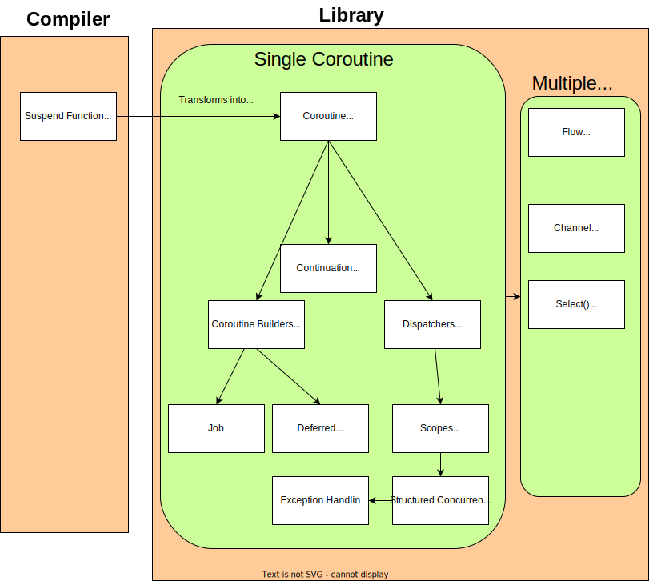

## Why kotlin


## Kotlin Coroutine
> Keyword: State Machine, Continuation Passing Style(CPS), suspend function, Coroutine, Coroutine builder, Coroutine Context, Coroutine scopes, Structured Concurrency

```
                       +----------------------+
                      |   Suspend Function   |  (Marks a function as suspendable)
                      +----------------------+
                                |
                                | Transforms into coroutine-friendly code
                                v
                      +------------------+
                      |    Coroutine     |  (A lightweight thread-like entity)
                      +------------------+
                        |       |       |       |
                        |       |       |       |
                        |       |       |       |
       +--------------------+   |       +------------------+
       | Coroutine Builders |   |       |   Dispatchers    |
       | (launch, async)    |   |       | (Controls thread)|
       +--------------------+     |     +------------------+
                        |      |
                        |      |  +------------------+
                        |      |  |   Continuation   |  (Low-level coroutine state management)
                        |      |  +------------------+
                        |
                        | Starts a coroutine
                        v
              +-----------------+     +-----------------+
              |      Job        |     |   Deferred       |  (A Job that returns a value)
              +-----------------+     +-----------------+
                        |
                        | Handles coroutine lifecycle (cancel, join, etc.)
                        v
              +-----------------+
              |     Scopes      | (Manages coroutine lifecycles)
              +-----------------+
                        |
                        | Ensures child coroutines complete properly
                        v
       +----------------------------+
       |  Structured Concurrency    | (Prevents leaks, ensures completion)
       +----------------------------+
                        |
                        | Exception Handling & Cancellation
                        v
          +---------------------------+
          |  Exception Handling       | (try/catch, CoroutineExceptionHandler)
          +---------------------------+
                        |
                        | Handles multiple coroutines over time
                        v
        +----------------+      +---------------+
        |     Flow       |      |    Channel    | (Communication between coroutines)
        | (Cold streams) |      | (Buffered & rendezvous modes) |
        +----------------+      +---------------+
                        |
                        | Supports waiting on multiple async operations
                        v
              +------------------+
              |  Select { }      |  (Wait for multiple suspending calls)
              +------------------+
```

And the diagram is:


### coroutine, suspend function, continuation, CPS
* `coroutine` is a lightweight thread-like entity that can be suspended and resumed.
    * it has a coroutine context, which contains information about the coroutine's execution environment.
    * it can be suspended and resumed at any point in its execution.
* `suspend` keyword can pausing the execution of a function and saving the current state of the function.
* `continuation` is an object that holds the state of a coroutine.
    * execution point
    * local variables and values
    * coroutine context(dispatcher, job, etc.)
* `Continuation Passing Style(CPS)` a technical where control flow is passed explicitly as a continuation.
    * In Kotlin coroutines, the `compiler` transfer **suspend** function inoto state machine using CPS.

### coroutine, continuation, job and deferred
* **job** and **deferred** is a handle for a coroutine's lifecycle.
* **continuation** a low-level mechanism that represents the suspended state of a coroutine.(current execution point, local variables, coroutine context), **bookmark**

#### Relationship
* 0 launch{}
* 1. a new **coroutine** is created
* 2. a job(or deferred) is created to manager lifecycle, returned as a handle
* 3. a continuation is created to manage the coroutine's state, use d internally by coroutine framework


## The coroutine run process

### Overview
```
UI Thread Stack
-----------------
| launch {       |
|   val newName =|  <--- Stack frame for launch block
|   fetchNewName()|
|   updateUI(newName) |
| }              |
-----------------

Continuation Object
-----------------
| Stack Frame:   |
| - newName      |
| - Execution Point (after fetchNewName) |
| Context: Dispatchers.IO |
| Resume Callback: lambda to resume coroutine |
-----------------

IO Thread Stack
-----------------
| withContext {  |
|   delay(1000)  |  <--- Stack frame for withContext block
|   return "New Name" |
| }              |
-----------------
```

### Step by step

1. UI thread
```
UI Thread Stack
-----------------
| launch {       |
|   val newName =|  <--- Stack frame for launch block
|   fetchNewName()|
|   updateUI(newName) |
| }              |
-----------------
```

2. suspend
it run to the `fetchNewName` the coroutine suspends, The current stack frame (including newName and the execution point) is saved into a Continuation object.

```
Continuation Object:
-----------------
| Stack Frame:   |
| - newName      |
| - Execution Point (after fetchNewName) |
| Context: Dispatchers.IO |
| Resume Callback: lambda to resume coroutine |
-----------------
```


3. UI thread
```
IO Thread Pool Stack:
-----------------
| withContext {  |
|   delay(1000)  |  <--- Stack frame for withContext block
|   return "New Name" |
| }              |
-----------------
```

4. Resume
```
UI Thread Stack (Restored):
-----------------
| launch {       |
|   val newName = "New Name" |
|   updateUI(newName) |  <--- Stack frame restored
| }              |
-----------------
```
## Channel VS Flow
Let me explain the key differences between Flow and Channel in Kotlin Coroutines:

1. **Hot vs Cold**
   - Channel: Hot stream (active once created)
   ```kotlin
   val channel = Channel<Int>()
   // Starts working immediately
   channel.send(1) // Will work even without collectors
   ```
   - Flow: Cold stream (only active when collected)
   ```kotlin
   val flow = flow {
       emit(1)
       emit(2)
   }
   // Nothing happens until collected
   flow.collect { ... }
   ```

2. **State Management**
   - Channel: Has buffer state
   ```kotlin
   // Can specify buffer capacity
   val channel = Channel<Int>(Channel.BUFFERED)
   channel.send(1) // Stored in buffer
   channel.receive() // Removes from buffer
   ```
   - Flow: Stateless
   ```kotlin
   val flow = flow {
       emit(1)
       emit(2)
   }
   // Each collection starts fresh
   ```

3. **Multiple Collectors**
   - Channel: Single consumer (one value, one receiver)
   ```kotlin
   val channel = Channel<Int>()
   channel.send(1)
   // Only one coroutine will receive this value
   val value = channel.receive()
   ```
   - Flow: Multiple collectors (each gets all values)
   ```kotlin
   val flow = flow { emit(1) }
   // Both collectors get the value
   flow.collect { println("Collector 1: $it") }
   flow.collect { println("Collector 2: $it") }
   ```

4. **Back Pressure**
   - Channel: Built-in back pressure
   ```kotlin
   val channel = Channel<Int>(1) // Buffer size 1
   channel.send(1) // OK
   channel.send(2) // Suspends until space available
   ```
   - Flow: Handled by operators
   ```kotlin
   flow.buffer(10) // Explicit buffering
   flow.conflate() // Drop intermediate values
   ```

Choose Channel when:
- Need communication between coroutines
- Have single consumer scenarios
- Need back pressure handling

Choose Flow when:
- Working with asynchronous data streams
- Need multiple collectors
- Want reactive-style operations (map, filter, etc.)


## Kotlin Lambda Functions

### 核心特性
1. **函数字面量**：可作为参数传递或存储的代码块
   ```kotlin
   val sum = { a: Int, b: Int -> a + b }
   println(sum(2,3)) // 输出5
   ```

2. **协程构建器中的lambda**：
   ```kotlin
   // 与launch协程构建器结合
   launch(Dispatchers.IO) { 
       delay(1000)
       println("Async operation completed")
   }
   ```

3. **带接收者的lambda**（DSL风格）：
   ```kotlin
   val myChannel = Channel<Int>().apply { 
       send(1)
       send(2)
   }
   ```

### 特殊语法糖
| 特性                | 示例                                      | 对应协程应用场景         |
|--------------------|-----------------------------------------|---------------------|
| 单个参数隐式`it`      | `list.filter { it > 5 }`                | `onReceive { ... }` |
| 下划线忽略参数         | `view.setOnClickListener { _ -> ... }`  | 事件回调处理            |
| Lambda返回值最后表达式 | `val result = run { 2 + 3 }`            | 协程作用域返回值          |

### 与Java Lambda对比
```kotlin
// Kotlin lambda（支持SAM转换）
val androidRunnable = Runnable { 
    println("Running in Android")
}

// Java lambda（需要@FunctionalInterface）
public interface MyJavaInterface {
    void execute();
}

val javaLambda: MyJavaInterface = MyJavaInterface { 
    println("Java style")
}
```

### 在协程中的高级用法
```kotlin
// 1. Channel生产者lambda
val channel = produce {
    for (i in 1..5) send(i * i)
}

// 2. Flow构建器lambda
val flow = flow {
    emit("Start")
    delay(100)
    emit("End")
}

// 3. 挂起lambda（suspend lambda）
val suspendLambda: suspend (Int) -> String = { num ->
    delay(num.toLong())
    "Delayed $num ms"
}
```


## The Magic Library: A Kotlin Coroutine Story

Imagine a magical library where books can write themselves, but only one page at a time. This is the world of Kotlin Coroutines.

### The Library and Its Workers

The **Main Hall** (Main Thread) is where visitors come to request books. It must always remain responsive to new visitors.

**Librarians** (Coroutines) are magical workers who can pause their work at any moment, save their exact place, and resume later - even in a different room. They're incredibly lightweight, so the library can have thousands of them.

**Spell Books** (Suspend Functions) contain special incantations marked with the `suspend` keyword. These spells can be paused midway through recitation without blocking the entire library.

```kotlin
suspend fun findRareBook(title: String): Book {
    delay(1000) // Pause without blocking
    return bookRepository.fetch(title)
}
```

### The Library Management System

The **Head Librarian** (CoroutineScope) manages groups of librarians, ensuring they complete their tasks properly or cancel them when needed.

```kotlin
val libraryScope = CoroutineScope(Dispatchers.Main)
```

**Work Orders** (Coroutine Builders) are how tasks get assigned:
- **launch** orders: "Complete this task, but don't worry about bringing back results"
- **async** orders: "Complete this task and bring back the results when done"

```kotlin
// Launch order - fire and forget
libraryScope.launch {
    organizeShelf("History")
}

// Async order - we need the result
val rareBookDeferred = libraryScope.async {
    findRareBook("Ancient Coroutines")
}
val rareBook = rareBookDeferred.await() // Get the result when ready
```

### The Library Rooms and Communication

The library has specialized rooms (Dispatchers) for different types of work:
- **Main Hall** (Dispatchers.Main): For interacting with visitors
- **Research Room** (Dispatchers.IO): For time-consuming searches and fetching
- **Restoration Workshop** (Dispatchers.Default): For intensive book repair work

```kotlin
withContext(Dispatchers.IO) {
    // Do time-consuming book search here
}
```

When a librarian needs to switch rooms, they use a **Bookmark** (Continuation) to save their exact place in their work. This bookmark contains:
- What they were working on
- Where they left off
- Where they should resume
- How to get back to their original room

### Communication Between Librarians

Librarians communicate through two magical systems:

**Pneumatic Tubes** (Channels) connect different parts of the library. When a librarian puts a book in the tube, exactly one other librarian will receive it. The tubes are "hot" - they work even if no one is waiting at the other end.

```kotlin
val bookRequests = Channel<BookRequest>()
// Librarian 1 sends a request
bookRequests.send(BookRequest("Kotlin Magic"))
// Librarian 2 receives it
val request = bookRequests.receive()
```

**Enchanted Scrolls** (Flows) are "cold" magical parchments that produce content only when someone is actively reading them. Multiple librarians can read copies of the same scroll, each getting all the information.

```kotlin
val newArrivals = flow {
    while(true) {
        val book = acquireNewBook()
        emit(book) // Add book to the flow
        delay(1000)
    }
}

// Multiple collectors can observe
newArrivals.collect { book -> displayInCatalog(book) }
newArrivals.collect { book -> notifyInterestedReaders(book) }
```

### Library Organization and Safety

The library follows **Structured Concurrency** principles - if a senior librarian stops working, all junior librarians under them must also stop. This prevents "ghost workers" who continue tasks no one cares about anymore.

When accidents happen, the library has an **Exception Handling** system:
```kotlin
try {
    riskyBookRestoration()
} catch (e: BookDamageException) {
    repairDamage()
}
```

For complex tasks requiring coordination, librarians use **Select** to efficiently wait for the first available result from multiple sources:
```kotlin
select<Book> {
    localCatalog.onReceive { it }
    partnerLibraries.onReceive { it }
    timeoutChannel.onReceive { fallbackBook }
}
```

### The Library's State Machine

Behind the scenes, the entire library operates as a **State Machine**. Each time a librarian pauses their work, the library:
1. Saves their current state (what they're working on)
2. Stores their continuation (how to resume)
3. Frees them to do other work
4. Later, restores their exact state and continues

This is the magic of **Continuation Passing Style (CPS)** - the ability to save and resume work from exact points, making the library incredibly efficient without needing a separate full-time worker (thread) for each task.

Through this magical system, the library handles thousands of book requests concurrently while using minimal resources, keeping the Main Hall responsive, and ensuring all work is properly completed or cleaned up.

# Story "The Restaurant Coroutine Story"

### The Restaurant Story

Imagine a restaurant (our application) where:

1. **Suspend Functions** are like recipes that can be paused
   - A chef can pause cooking one dish to work on another
   - Example: `suspend fun prepareMainDish()`

2. **Coroutines** are like individual chefs
   - Each chef can work independently
   - They can switch between tasks efficiently
   ```kotlin
   launch {
       val mainDish = prepareMainDish()
       val sideDish = prepareSideDish()
   }
   ```

3. **Dispatchers** are like different kitchen stations
   - Main kitchen (Main thread)
   - Prep kitchen (IO operations)
   - Grill station (CPU intensive tasks)
   ```kotlin
   withContext(Dispatchers.IO) {
       fetchIngredients()
   }
   ```

4. **Coroutine Scope** is like a shift manager
   - Keeps track of all running tasks
   - Ensures all tasks complete before closing
   - Can cancel all tasks if needed

5. **Channels** are like service windows
   - Chefs put completed dishes on one side
   - Waiters pick up from the other side
   ```kotlin
   val orders = Channel<Order>()
   // Chef puts orders
   orders.send(newOrder)
   // Waiter receives
   val order = orders.receive()
   ```

6. **Flow** is like a conveyor belt of dishes
   - Continuous stream of items
   - Can be transformed, filtered
   ```kotlin
   flow {
       emit(appetizer)
       emit(mainCourse)
       emit(dessert)
   }
   ```

7. **Structured Concurrency** is like the restaurant hierarchy
   - Head Chef (parent coroutine)
   - Line Cooks (child coroutines)
   - If Head Chef stops, all Line Cooks stop

This restaurant runs efficiently because:
- Tasks can be paused (suspended)
- Resources are well-managed (scopes)
- Communication is organized (channels/flows)
- Clear hierarchy exists (structured concurrency)
```

Define the kotlin lambda function.