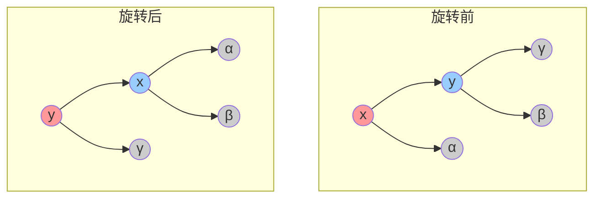
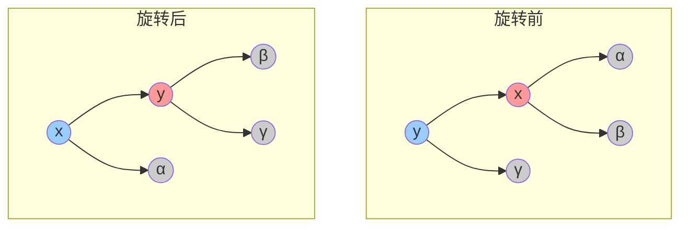
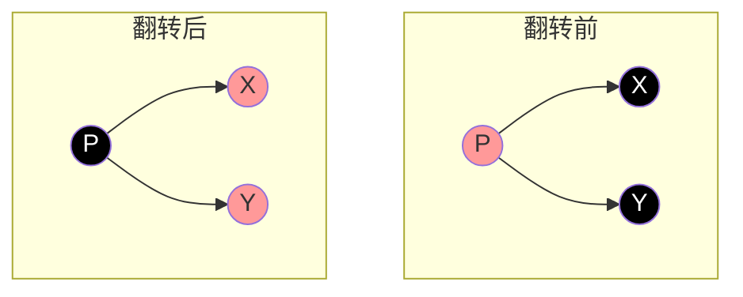

# red black tree 红黑树
# 红黑树 (Red-Black Tree)

## 1. 定义
红黑树是一种自平衡的二叉查找树，它在每个节点上增加了一个存储位来表示节点的颜色（红或黑）。通过对任何一条从根到叶子的路径上各个节点着色方式的限制，红黑树确保没有一条路径会比其他路径长出两倍，因而是近似平衡的。

## 2. 性质
红黑树必须满足以下五个性质：
1. 每个节点是红色或黑色
2. 根节点是黑色
3. 每个叶子节点（NIL节点）是黑色
4. 如果一个节点是红色，则它的两个子节点都是黑色（即不存在两个连续的红色节点）
5. 从任一节点到其每个叶子的所有路径都包含相同数目的黑色节点

## 3. 操作
### 3.1 查找
与普通二叉查找树相同，时间复杂度为O(log n)

### 3.2 插入
插入新节点时，首先按照二叉查找树的规则插入，然后将新节点着色为红色。如果违反了红黑树的性质，需要通过旋转和重新着色来恢复平衡。

插入后可能需要进行以下操作：
1. 左旋
2. 右旋
3. 颜色翻转
## 8. 旋转与颜色翻转

### 8.1 左旋 (Left Rotation)


```java
private void leftRotate(Node x) {
    Node y = x.right;
    x.right = y.left;
    if (y.left != null) {
        y.left.parent = x;
    }
    y.parent = x.parent;
    if (x.parent == null) {
        root = y;
    } else if (x == x.parent.left) {
        x.parent.left = y;
    } else {
        x.parent.right = y;
    }
    y.left = x;
    x.parent = y;
}
```
### 8.2 右旋 (Right Rotation)


```java
private void rightRotate(Node y) {
    Node x = y.left;
    y.left = x.right;
    if (x.right != null) {
        x.right.parent = y;
    }
    x.parent = y.parent;
    if (y.parent == null) {
        root = x;
    } else if (y == y.parent.right) {
        y.parent.right = x;
    } else {
        y.parent.left = x;
    }
    x.right = y;
    y.parent = x;
}
```

### 8.3 颜色翻转 (Color Flip)


```java
private void flipColors(Node h) {
    h.color = !h.color;
    h.left.color = !h.left.color;
    h.right.color = !h.right.color;
}
```

### 8.4 旋转与颜色翻转的应用场景
1. 左旋：当右子树比左子树高时使用
2. 右旋：当左子树比右子树高时使用
3. 颜色翻转：当父节点和两个子节点都是红色时使用

### 3.3 删除
删除操作比插入更复杂，需要考虑多种情况。删除节点后，如果违反了红黑树的性质，需要通过旋转和重新着色来恢复平衡。

## 4. 时间复杂度
| 操作 | 时间复杂度 |
|------|------------|
| 查找 | O(log n)   |
| 插入 | O(log n)   |
| 删除 | O(log n)   |

## 5. 应用场景
1. Java中的TreeMap和TreeSet
2. C++ STL中的map和set
3. Linux内核中的进程调度
4. 文件系统的目录结构
5. 数据库索引

## 6. 与AVL树的比较
| 特性 | 红黑树 | AVL树 |
|------|--------|-------|
| 平衡性 | 近似平衡 | 严格平衡 |
| 查找效率 | 略低 | 更高 |
| 插入/删除效率 | 更高 | 略低 |
| 旋转次数 | 较少 | 较多 |
| 适用场景 | 频繁插入删除 | 频繁查找 |

## 7. 实现要点
1. 节点结构：
```java
class Node {
    int data;
    Node parent;
    Node left;
    Node right;
    boolean isRed; // true for red, false for black
}