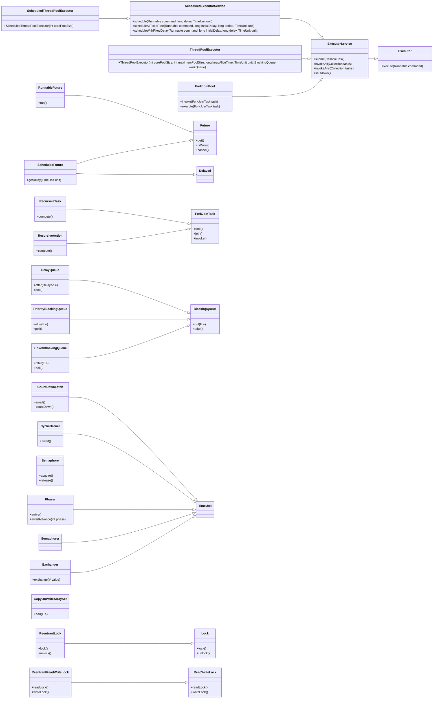

# Java Concurrency Interview Questions
### thread pool Class Relationship Diagram


## Thread Pool Related (⭐⭐⭐)

### 1. What is a thread pool and how is it used? Why use a thread pool?
**Answer:** A thread pool is a container that holds multiple thread objects, allowing you to reuse threads instead of creating new ones each time. This saves the time required to create new threads and improves code execution efficiency.

### 2. What types of thread pools are available in Java?
Java has four types of thread pools:

- **newCachedThreadPool**:  
  - A thread pool with an unlimited number of threads, supporting a maximum of Integer.MAX_VALUE threads.  
  - Example:
    ```java
    public static ExecutorService newCachedThreadPool() {
        return new ThreadPoolExecutor(0, Integer.MAX_VALUE,
                                       60L, TimeUnit.SECONDS,
                                       new SynchronousQueue<Runnable>());
    }
    ```

- **newFixedThreadPool**:  
  - A thread pool with a fixed number of threads.  
  - Example:
    ```java
    public static ExecutorService newFixedThreadPool(int nThreads) {
        return new ThreadPoolExecutor(nThreads, nThreads,
                                       0L, TimeUnit.MILLISECONDS,
                                       new LinkedBlockingQueue<Runnable>());
    }
    ```

- **newSingleThreadExecutor**:  
  - A thread pool with a single thread.  
  - Example:
    ```java
    public static ExecutorService newSingleThreadExecutor() {
        return Executors.newSingleThreadExecutor();
    }
    ```

- **newScheduledThreadPool**:  
  - A thread pool that supports scheduling tasks to run after a given delay or to execute periodically.  
  - Example:
    ```java
    public static ScheduledExecutorService newScheduledThreadPool(int corePoolSize) {
        return Executors.newScheduledThreadPool(corePoolSize);
    }
    ```

### 3. What is the principle behind thread pools?


From a data structure perspective, thread pools mainly use blocking queues (BlockingQueue). Blocking queues are used to store tasks that are submitted to the thread pool. The process of submitting tasks involves the following steps:
1. If the number of running threads < coreSize, create a core thread to execute the task immediately.  
   - A core thread is a thread that is always kept in the pool and reused to execute tasks.  
   - Core threads are created when the pool is first created and are never terminated until the pool is shut down.
2. If the number of running threads >= coreSize, place the task in a blocking queue.
3. If the queue is full and the number of running threads < maximumPoolSize, create a new non-core thread to execute the task.  
   - A non-core thread is a thread that is created when the pool needs more threads to execute tasks.  
   - Non-core threads are terminated when the pool reaches the idle timeout.
4. If the queue is full and the number of running threads >= maximumPoolSize, the thread pool calls the handler's reject method to refuse the submission.
For example, for a thread pool size of 10:
- The core size is typically set to 5, so 5 core threads are always kept in the pool and reused to execute tasks.
- The queue size is typically set to 10, so up to 10 tasks can be queued for execution.
- The maximum pool size is typically set to 10, so the pool can grow up to 10 threads to execute tasks.
5. What happens to the core threads after the thread pool is shut down?
When a thread pool is shut down, the core threads are allowed to finish any tasks they are currently running. After all tasks are finished, the core threads are terminated and the pool is shut down gracefully.

### 4. What are the types of work queues in thread pools?
1. **ArrayBlockingQueue**: A bounded blocking queue based on an array structure, ordered by FIFO (first in, first out).
2. **LinkedBlockingQueue**: A blocking queue based on a linked list structure, also ordered by FIFO, typically with higher throughput than ArrayBlockingQueue.
3. **SynchronousQueue**: A blocking queue that does not store elements. Each insert operation must wait for a corresponding remove operation.
4. **PriorityBlockingQueue**: An unbounded blocking queue that supports priority ordering.

### 5. How to understand bounded and unbounded queues?
- **Bounded Queue**: Limits the number of tasks that can be queued. If the queue is full, tasks may be rejected or may block until space becomes available.
- **Unbounded Queue**: Does not limit the number of tasks that can be queued, but may lead to resource exhaustion if too many tasks are submitted.

### 6. How are thread-safe queues typically implemented in multithreading?
Java provides thread-safe queues, which can be categorized into blocking and non-blocking queues. A typical example of a blocking queue is `BlockingQueue`, while a non-blocking queue example is `ConcurrentLinkedQueue`. Blocking queues implement blocking functionality through methods like `put(e)` and `take()`, while `ConcurrentLinkedQueue` is based on linked nodes and is an unbounded, thread-safe non-blocking queue.

### 7. What is the Executor framework?
The Executor framework in Java provides a higher-level abstraction for managing threads and executing tasks. It decouples task submission from the mechanics of how each task will be run, including the details of thread management.

#### Key Components of the Executor Framework:
1. **Executor Interface**: The simplest interface for executing tasks. It has a single method, `execute(Runnable command)`, which takes a `Runnable` task and executes it.
2. **ExecutorService Interface**: Extends `Executor` and provides methods for managing the lifecycle of the executor, such as `shutdown()` and `submit()`.
3. **ScheduledExecutorService Interface**: Extends `ExecutorService` and provides methods for scheduling tasks to run after a given delay or to execute periodically.
4. **ThreadPoolExecutor Class**: A flexible implementation of the `ExecutorService` interface that allows for customizing thread pool behavior, including core and maximum pool sizes, queue types, and rejection policies.
5. **Executors Utility Class**: A factory class that provides methods for creating different types of executor services, such as fixed thread pools, cached thread pools, and scheduled thread pools.

#### Example of Using the Executor Framework:
```java
import java.util.concurrent.ExecutorService;
import java.util.concurrent.Executors;

public class ExecutorExample {
    public static void main(String[] args) {
        ExecutorService executor = Executors.newFixedThreadPool(3);

        for (int i = 0; i < 10; i++) {
            final int taskId = i;
            executor.submit(() -> {
                System.out.println("Task " + taskId + " is running");
            });
        }

        executor.shutdown(); // Initiates an orderly shutdown
    }
}
```

#### Benefits of Using the Executor Framework:
- **Simplified Thread Management**: The framework handles thread creation, scheduling, and management for you.
- **Improved Resource Management**: It allows for better control over the number of concurrent threads and helps avoid resource exhaustion.
- **Task Scheduling**: The framework provides built-in support for scheduling tasks, making it easier to implement recurring tasks.

### 8. What is the relationship between thread-safe queues and the Executor framework?
Thread-safe queues are a fundamental component of the Executor framework, as they are used to manage the tasks that are submitted to the executor for execution. The Executor framework provides a higher-level abstraction for managing threads and executing tasks, and it relies on thread-safe queues to handle the underlying task management.
