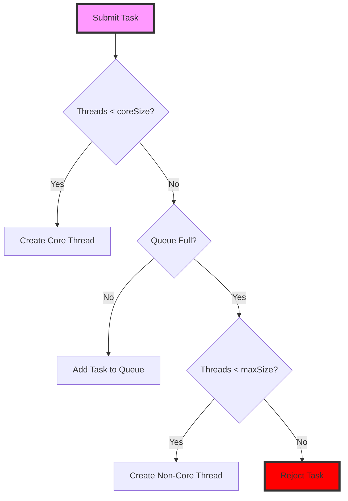

# Java Concurrency Interview Questions
### thread pool Class Relationship Diagram


## Thread Pool

### 1. What is a thread pool and how is it used? Why use a thread pool?
**Answer:** A thread pool is a container that holds multiple thread objects, allowing you to reuse threads instead of creating new ones each time. This saves the time required to create new threads and improves code execution efficiency.

### 2. What is the principle behind thread pools?

From a data structure perspective, thread pools mainly use **blocking queues (BlockingQueue)** to store tasks that are submitted to the thread pool. The process of submitting tasks involves the following steps:


1. If the number of running threads < coreSize, create a core thread to execute the task immediately.  
   - A core thread is a thread that is always kept in the pool and reused to execute tasks.  
   - Core threads are created when the pool is first created and are never terminated until the pool is shut down.
2. If the number of running threads >= coreSize, place the task in a blocking queue.
3. If the queue is full and the number of running threads < maximumPoolSize, create a new non-core thread to execute the task.  
   - A non-core thread is a thread that is created when the pool needs more threads to execute tasks.  
   - Non-core threads are terminated when the pool reaches the idle timeout.
4. If the queue is full and the number of running threads >= maximumPoolSize, the thread pool calls the handler's reject method to refuse the submission.

5. What happens to the core threads after the thread pool is shut down?
When a thread pool is shut down, the core threads are allowed to finish any tasks they are currently running. After all tasks are finished, the core threads are terminated and the pool is shut down gracefully.

#### Typical setting: a thread pool size of 10:
- The core size is typically set to 5, so 5 core threads are always kept in the pool and reused to execute tasks.
- The task queue size is typically set to 10, so up to 10 tasks can be queued for execution.
- The maximum pool size is typically set to 10, so the pool can grow up to 10 threads to execute tasks.


### 3. What types of thread pools are available in Java?
Java has four types of thread pools:

- **newCachedThreadPool**:  
  - A thread pool with an unlimited number of threads, supporting a maximum of Integer.MAX_VALUE threads.  
  - Example:
    ```java
    public static ExecutorService newCachedThreadPool() {
        return new ThreadPoolExecutor(0, Integer.MAX_VALUE,
                                       60L, TimeUnit.SECONDS,
                                       new SynchronousQueue<Runnable>());
    }
    ```

- **newFixedThreadPool**:  
  - A thread pool with a fixed number of threads.  
  - Example:
    ```java
    public static ExecutorService newFixedThreadPool(int nThreads) {
        return new ThreadPoolExecutor(nThreads, nThreads,
                                       0L, TimeUnit.MILLISECONDS,
                                       new LinkedBlockingQueue<Runnable>());
    }
    ```

- **newSingleThreadExecutor**:  
  - A thread pool with a single thread.  
  - Example:
    ```java
    public static ExecutorService newSingleThreadExecutor() {
        return Executors.newSingleThreadExecutor();
    }
    ```

- **newScheduledThreadPool**:  
  - A thread pool that supports scheduling tasks to run after a given delay or to execute periodically.  
  - Example:
    ```java
    public static ScheduledExecutorService newScheduledThreadPool(int corePoolSize) {
        return Executors.newScheduledThreadPool(corePoolSize);
    }
    ```


### 4. How to understand bounded and unbounded queues?
- **Bounded Queue**: Limits the number of tasks that can be queued. If the queue is full, tasks may be rejected or may block until space becomes available.
- **Unbounded Queue**: Does not limit the number of tasks that can be queued, but may lead to resource exhaustion if too many tasks are submitted.

### 5. What are the types of work queues in thread pools(任务策略)?
#### Blocking queue
* **ArrayBlockingQueue**: A bounded blocking queue based on an array structure, ordered by FIFO (first in, first out).
* **LinkedBlockingQueue**: A blocking queue based on a linked list structure, also ordered by FIFO, typically with higher throughput than ArrayBlockingQueue.
* **SynchronousQueue**: A blocking queue that does not store elements. Each insert operation must wait for a corresponding remove operation.
* **PriorityBlockingQueue**: An unbounded blocking queue that supports priority ordering.
#### Non blocking queue
* `ConcurrentLinkedQueue`: An unbounded, thread-safe, non-blocking queue based on linked nodes
* `ConcurrentLinkedDeque`: A thread-safe, non-blocking deque (double-ended queue)
* `LinkedTransferQueue`: A unbounded queue that supports both blocking and non-blocking operations

**Characteristics of Non-Blocking Queues**:
- Use CAS (Compare-And-Swap) operations instead of locks
- Generally provide better performance under high contention
- Don't block threads when the queue is empty or full
- May require more complex task handling logic in thread pools


**Example of Using Non-Blocking Queue**:
```java
ExecutorService executor = new ThreadPoolExecutor(
    corePoolSize,
    maxPoolSize,
    keepAliveTime,
    TimeUnit.MILLISECONDS,
    new ConcurrentLinkedQueue<>()  // Using non-blocking queue
);
```

However, in most standard thread pool implementations, blocking queues are preferred because they:
- Provide better control over resource usage
- Support bounded capacity(imp in non-blocking queue is more complex)
- Integrate better with thread pool's task handling logic
- Prevent busy-waiting when the queue is empty

The standard thread pools (`newFixedThreadPool`, `newCachedThreadPool`, etc.) typically use blocking queues by default.

### 6. How are thread-safe queues typically implemented in multithreading?
Java provides thread-safe queues, which can be categorized into blocking and non-blocking queues. A typical example of a blocking queue is `BlockingQueue`, while a non-blocking queue example is `ConcurrentLinkedQueue`. Blocking queues implement blocking functionality through methods like `put(e)` and `take()`, while `ConcurrentLinkedQueue` is based on linked nodes and is an unbounded, thread-safe non-blocking queue.

### 7. What is the Executor framework?
The Executor framework in Java provides a higher-level abstraction for managing threads and executing tasks. It decouples task submission from the mechanics of how each task will be run, including the details of thread management.

#### Key Components of the Executor Framework:
1. **Executor Interface**: The simplest interface for executing tasks. It has a single method, `execute(Runnable command)`, which takes a `Runnable` task and executes it.
2. **ExecutorService Interface**: Extends `Executor` and provides methods for managing the lifecycle of the executor, such as `shutdown()` and `submit()`.
3. **ScheduledExecutorService Interface**: Extends `ExecutorService` and provides methods for scheduling tasks to run after a given delay or to execute periodically.
4. **ThreadPoolExecutor Class**: A flexible implementation of the `ExecutorService` interface that allows for customizing thread pool behavior, including core and maximum pool sizes, queue types, and rejection policies.
5. **Executors Utility Class**: A factory class that provides methods for creating different types of executor services, such as fixed thread pools, cached thread pools, and scheduled thread pools.

#### Example of Using the Executor Framework:
```java
import java.util.concurrent.ExecutorService;
import java.util.concurrent.Executors;

public class ExecutorExample {
    public static void main(String[] args) {
        ExecutorService executor = Executors.newFixedThreadPool(3);

        for (int i = 0; i < 10; i++) {
            final int taskId = i;
            executor.submit(() -> {
                System.out.println("Task " + taskId + " is running");
            });
        }

        executor.shutdown(); // Initiates an orderly shutdown
    }
}
```

| Parameter | Value | Description |
|-----------|-------|-------------|
| Core Pool Size | 3 | Always maintained, even when idle |
| Maximum Pool Size | 3 | Fixed size, never grows beyond this limit |
| Task Queue Size | Unbounded | Uses LinkedBlockingQueue with no capacity limit |

#### Benefits of Using the Executor Framework:
- **Simplified Thread Management**: The framework handles thread creation, scheduling, and management for you.
- **Improved Resource Management**: It allows for better control over the number of concurrent threads and helps avoid resource exhaustion.
- **Task Scheduling**: The framework provides built-in support for scheduling tasks, making it easier to implement recurring tasks.

### 8. What is the relationship between thread-safe queues and the Executor framework?
Thread-safe queues are a fundamental component of the Executor framework, as they are used to manage the tasks that are submitted to the executor for execution. The Executor framework provides a higher-level abstraction for managing threads and executing tasks, and it relies on thread-safe queues to handle the underlying task management.


## ThreadLocal

ThreadLocal is a Java class that provides thread-local variables. These variables differ from their normal counterparts in that each thread that accesses one (via its get or set method) has its own, independently initialized copy of the variable. ThreadLocal instances are typically private static fields in classes that wish to associate state with a thread (e.g., a user ID or transaction ID).

```java
public class ThreadLocalExample {
    // Create a ThreadLocal variable
    private static final ThreadLocal<Integer> threadLocalValue = ThreadLocal.withInitial(() -> 0);

    public static void main(String[] args) {
        // Create and start multiple threads
        for (int i = 0; i < 3; i++) {
            new Thread(() -> {
                // Set thread-specific value
                threadLocalValue.set((int) (Math.random() * 100));
                // Get thread-specific value
                System.out.println("Thread " + Thread.currentThread().getId() + 
                                 " value: " + threadLocalValue.get());
                // Clear the thread-local variable to avoid memory leaks
                threadLocalValue.remove();
            }).start();
        }
    }
}
```
### ThreadLocal 的工作原理解释

`ThreadLocal` 变量虽然被声明为 `static final`，但这并不意味着它的值在所有线程间共享。这里有一个关键的区别需要理解：

- **ThreadLocal 存储的值**是线程隔离的，每个线程都有自己独立的副本

1. 每个 `Thread` 对象内部都有一个 `ThreadLocalMap` 字段
2. 这个 Map 以 `ThreadLocal` 对象为键，以线程特定的值为值
3. 当调用 `threadLocalValue.set(value)` 时：
   - 获取当前线程的 `ThreadLocalMap`
   - 将 `threadLocalValue`（静态 ThreadLocal 对象）作为键
   - 将值存储在当前线程的 Map 中

4. 当调用 `threadLocalValue.get()` 时：
   - 获取当前线程的 `ThreadLocalMap`
   - 使用 `threadLocalValue` 作为键查找值
   - 返回当前线程特定的值

### 简化的内部结构

```
Thread-1:
  threadLocalMap: {
    threadLocalValue -> 42
  }

Thread-2:
  threadLocalMap: {
    threadLocalValue -> 17
  }

Thread-3:
  threadLocalMap: {
    threadLocalValue -> 99
  }
```

ThreadLocal works by maintaining a map (actually a ThreadLocalMap ) inside each thread. When you call get() or set() , it looks up or stores the value in the current thread's map. This is why each thread has its own independent copy of the variable.