# 栈
栈是实现了FILO的数据结构

## 单栈

利用FILO的性质，一个栈信息足够的题。
* [20. 有效的括号](./20.valid-parentheses/)

## 辅助栈
但是有时候，单栈没有足够的信息来解决问题
* [155. 最小栈]

一个栈可以实现所有栈的功能，push，pop，top，但是最小栈需要另外的数据结构来维护。

一个naive解法就是维护一个list，添加元素就排序，然后总是反悔list.get(0)。

这个解法复杂度非常高。一个排序O(nLogN),所以n个push就是O(n^2LogN)

实际上也是， 159ms，比95%的user都慢。

那么有没有办法只用O(1)的时间来维护这个最小值功能呢。

思路就是，这个最小值不能是算出来的，必须是在一个数据结构里维护的，一个可以和主栈同步更新的数据结构。

* 辅助栈

