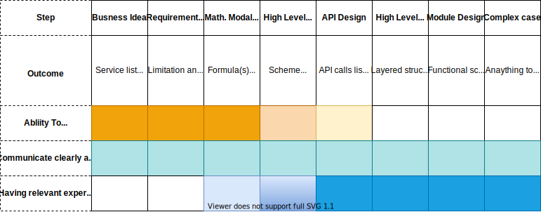
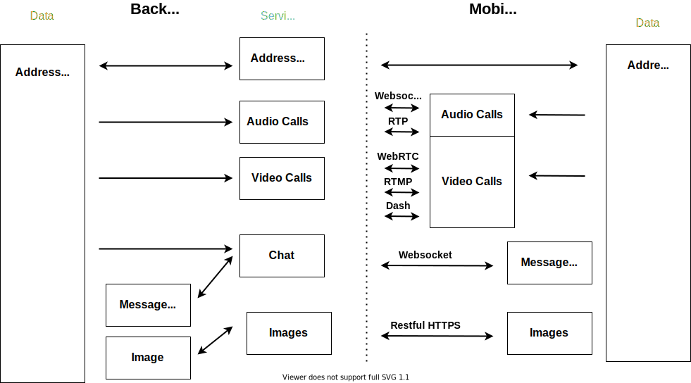

[timer](http://www.intervaltimer.com/timers/9835337-interview)

# 系统设计最好的模板

## Business idea 3–4 minutes

	Ability to think about the business part of the task. WHY

Business idea 3–4 minutes WHO,WHY,WHEN,WHAT  

* The list of services we sell to our users
* The data entities access we sell to our users
* Understanding the main idea of the product or the feature (if you don't understand something, don't hesitate to ask all the needed questions. The more you know about the product the easier will be making decisions during the the rest of the process)

## Requirements clarification 5 minutes
	Ability to clarify requirement, boundary, priority

	The requirements clarification process should be driven by definite and clear aims, questions shouldn't be random, but should rather follow some system.

 Requirements clarification 1–2 minutes (5 min) WHAT 

1. Use cases  
2. Scenarios that will be/not be covered  
3. Who will use  
4. How many will use  
5. Usage patterns
6. Priority

* What are the basic requirements of the system? 
* How will the app deliver updates to listening friends? 
* What data, battery and privacy concerns will it face? 
* Should it work constantly in the background, or only when active and in the foreground?​

some notes:
* Lollipop 21, permission
* google play store needs new app *API level 28* above
 
* Availability 
	* country
		* Europe/ gdpr
		* China, google play store
		* India, low internet speed and coverage
	* OS/language
		* Lollipop 21, permission
		* google play store needs new app *API level 28* above
	* Multiple Lauguage & cultures
		* especially Persian
	* offline
	* phone/tablet
* Testability 
	* CI automation test
	* do we have QA already?
	* do they have related experiences?
	* do need training?

* Scalability/Performance
	*  scalability of our team
		* how many team do we have involving this feature
		* how do we separate feature across teams
		* how do we reuse our code
* Security 
	* how security requirement for our data
	* wss, htps, tls

## Mathematical model design (if needed)
	User Experience

 Mathematical model design (if needed) 3–5 Math 

* Data useage
* Storage usage
* battery usage
* 以及这些数学在我们做决策的作用

## High level system design 3–5 minutes
	Define how to split that state and functionality between the server and the client sides :

 High level system design 3–5 minutes HOW Overview 

* define communication protocol
	* bidirectional or unidirectional, 
	* streaming or request-response-based,
	* then more details — HTTP REST (simple, long-polling), web-socket, raw-socket,

Always provide information about the alternatives and defend your choice

## API design  7–10 minutes
	The language the client are talking
## High level client side design 10 mins
	Always provide information about the alternatives and defend your choice

 High level client side design 10 mins (How Clients) 

Always provide information about the alternatives and defend your choice
在设计时，总是要列举各种选择并陈述其优缺点
* Archtecture

我们这里使用MVI的模式，来实现react类似的mvvm，uni direction data flow， immutable statue，

那么把这个模式，应用到我们的系统设计里

## Detailed design of some modules 10
	Deep Dive for one feature

 Detailed design of some modules 10 mins (How Details) 

## One complex case and detailed discussion

One complex case and detailed discussion x mins (Example) 

# Android System Design Template 2

## Define the scope of the problem.​ 5 minutes

**Why is ti? What is it?**

* What are the basic requirements of the system? 
* How will the app deliver updates to listening friends?
* What data, battery and privacy concerns will it face? 
* Should it work constantly in the background, or only when active and in the foreground?​

 
 
## HIGH LEVEL DESIGN (5-10 min)

**how** 

## Explore the solution space.​ 5 minutes
1. What kind of data will we need to track? 
1. What kind of database options do we have? 
1. What are their advantages and disadvantages? 
1. Which one would you choose?​

### Ensure the solution is complete.​ 

1. Does this design leave an entire area of the system undescribed? 
1. Does it cover the “send location update” use case end-to-end? How about “receive location update”? 

 

### Ensure the different components of the system are well-defined.​

1. Are the responsibilities between components clear? 
1. Would different people be able to work on different components independently? 
1. Does the architecture help the system scale in the long-term? 
1. What pieces are Activities, and what pieces are Services? How do they interact?

 
### Evaluate trade-offs as you make decisions​

1. What is this system optimal for? 
1. What are its drawbacks? How would you scale this system to new use cases (e.g.: discovering friends in your area?)​

## DEEP DIVE (15-20 min)

**iterate every component** 

## Justify your decisions, but be flexible to new information.​ 5 minutes

1. Would you change your design based on a new requirement? 
1. Can you do a rough calculation to justify why you chose one architecture vs the other (e.g.: push vs pull)?

# Example App to explore
## How would you design Instagram / Instagram Stories
* Instagram/Instragram stories

## How would you design Facebook

## How would you design Facebook Messenger

* peers online
* message sent
* message read

## How would you design Facebook's live update of comments on posts

## How would you design an online collaborative editor (e.g. Google Docs)

## How would you design a typehead feature (e.g. Google search autocomplete)

## How would you design Twitter's trending topics

## How would you design a distributed Botnet

## How would you design a system that can handle millions of card transactions per hour

## How would you design security for Facebook's corporate network from scratch (Security team interview)
