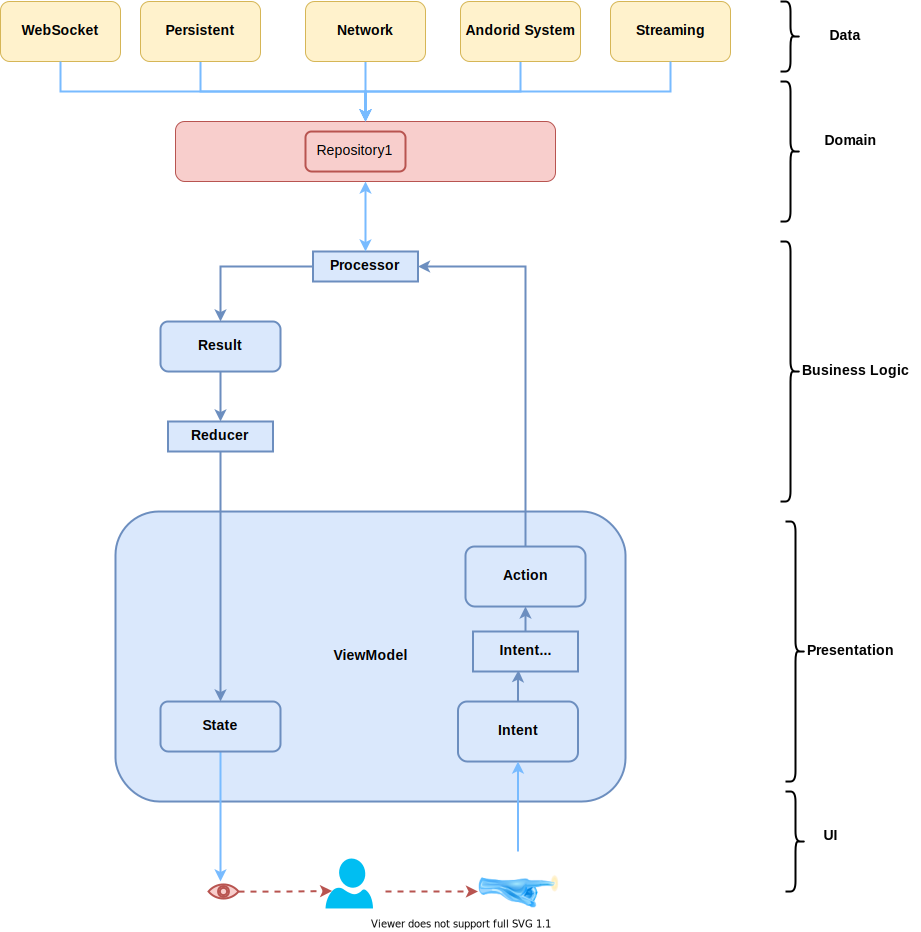

[timer](http://www.intervaltimer.com/timers/9835337-interview)

# 系统设计最好的模板

## Business idea and requirement 

### Business idea 3–4 minutes
	Ability to think about the business part of the task. WHY

Business idea 3–4 minutes WHO,WHY,WHEN,WHAT  **OUTPUT:VISION**

* The list of services we sell to our users
* The data entities access we sell to our users
* Understanding the main idea of the product or the feature (if you don't understand something, don't hesitate to ask all the needed questions. The more you know about the product the easier will be making decisions during the the rest of the process)

### Example
* The list of services we sell to our users
	* Safely storing and providing read/write access to your address book
	* Provoding the ability to make/receive Audio and Video calls to contacts from your address book
	* Providing the ability to send/receive text messages and images to contacts from your address book and safely store the history of all the chats
* The data entities access we sell to our users
	* Address book item:
		* First name
		* Family name
		* Phone number
	* Chat history message:
		* User oppenent
		* Inbound or outbound
		* Date and time of the message
		* Message text or image	
### Requirements clarification 5 minutes
	Ability to clarify requirement, boundary, priority

	The requirements clarification process should be driven by definite and clear aims, questions shouldn't be random, but should rather follow some system.

 Requirements clarification 5 minutes (5 min) WHAT **OUTPUT:PRD**

1. Use cases  
2. Scenarios that will be/not be covered  
3. Who will use  
4. How many will use  
5. Usage patterns
6. Priority

* What are the basic requirements of the system? 
* How will the app deliver updates to listening friends? 
* What data, battery and privacy concerns will it face? 
* Should it work constantly in the background, or only when active and in the foreground?​

some notes:
* Lollipop 21, permission
* google play store needs new app *API level 28* above
 

*Check Use cases section in mobileSystemDesign*

## Mathematical model design (if needed)
	User Experience

 Mathematical model design (if needed) 3–5 Math 

* Data useage
* Storage usage
* battery usage
* 以及这些数学在我们做决策的作用

## High level system design 10 minutes
	Define how to split that state and functionality between the server and the client sides :

 High level system design 3–5 minutes HOW Overview 

* define communication protocol
	* bidirectional or unidirectional, 
	* streaming or request-response-based,
	* then more details — HTTP REST (simple, long-polling), web-socket, raw-socket,

Always provide information about the alternatives and defend your choice

## API design  5 minutes
	The language the client are talking

## High level client side design 10 mins
	Always provide information about the alternatives and defend your choice

 High level client side design 10 mins (How Clients) 

Always provide information about the alternatives and defend your choice
在设计时，总是要列举各种选择并陈述其优缺点

那么把这个模式，应用到我们的系统设计里

* high level design

	

* Architecture
我们这里使用MVI的模式，来实现react类似的mvvm，uni direction data flow， immutable statue，

	

## Detailed design of some modules 10
	Deep Dive for one feature

 Detailed design of some modules 10 mins (How Details) 

## One complex case and detailed discussion

One complex case and detailed discussion x mins (Example) 

# Android System Design Template 2

## Define the scope of the problem.​ 5 minutes

**Why is ti? What is it?**

* What are the basic requirements of the system? 
* How will the app deliver updates to listening friends?
* What data, battery and privacy concerns will it face? 
* Should it work constantly in the background, or only when active and in the foreground?​

 
 
## HIGH LEVEL DESIGN (5-10 min)

**how** 

## Explore the solution space.​ 5 minutes
1. What kind of data will we need to track? 
1. What kind of database options do we have? 
1. What are their advantages and disadvantages? 
1. Which one would you choose?​

### Ensure the solution is complete.​ 

1. Does this design leave an entire area of the system undescribed? 
1. Does it cover the “send location update” use case end-to-end? How about “receive location update”? 

 

### Ensure the different components of the system are well-defined.​

1. Are the responsibilities between components clear? 
1. Would different people be able to work on different components independently? 
1. Does the architecture help the system scale in the long-term? 
1. What pieces are Activities, and what pieces are Services? How do they interact?

 
### Evaluate trade-offs as you make decisions​

1. What is this system optimal for? 
1. What are its drawbacks? How would you scale this system to new use cases (e.g.: discovering friends in your area?)​

## DEEP DIVE (15-20 min)

**iterate every component** 

## Justify your decisions, but be flexible to new information.​ 5 minutes

1. Would you change your design based on a new requirement? 
1. Can you do a rough calculation to justify why you chose one architecture vs the other (e.g.: push vs pull)?

# Example App to explore
## Category
* Direct Message
* Social Network
* Position sharing
* Video Sharing
* Live Video
* Photo Sharing

* Matching based on location

# Cloud 设计的一个模板
## Cloud system design 

### FEATURE EXPECTATIONS (5 min)

FEATURE EXPECTATIONS (5 min)  

1. Use cases  
2. Scenarios that will be/not be covered  
3. Who will use  
4. How many will use  
5. Usage patterns

* What are the basic requirements of the system? 
* How will the app deliver updates to listening friends? 
* What data, battery and privacy concerns will it face? 
* Should it work constantly in the background, or only when active and in the foreground?​

some notes:
* Lollipop 21, permission
* google play store needs new app *API level 28* above
 

### ESTIMATIONS (5 min)

 ESTIMATIONS (5 min)  

1. Data usage
2. Storage usage
3. Baterry usage
4. App

### DESIGN GOALS (5 min)

 DESIGN GOALS (5 min) 

1. Latency and Throughput requirements  

2. Consistency vs Availability [Weak/strong/eventual => consistency | Failover/replication => availability]  

### HIGH LEVEL DESIGN (5-10 min)

 HIGH LEVEL DESIGN (5 min)  

1. APIs for Read/Write scenarios for crucial components  

2. Database schema  

3. Basic algorithm  

4. High level design for Read/Write scenario  

### DEEP DIVE (15-20 min)

 
* Scaling the algorithm
* Scaling individual components
* Component

1. Scaling the algorithm  

2. Scaling individual components:  

	* -> Availability, Consistency and Scale story for each component  

	* -> Consistency and availability patterns  

3. Think about the following components, how they would fit in and how it would help  

	* a. DNS  

	* b. CDN [Push vs Pull]  

	* c) Load Balancers [Active-Passive, Active-Active, Layer 4, Layer 7]  

	* d) Reverse Proxy  

	* e) Application layer scaling [Microservices, Service Discovery]  

	* f) DB [RDBMS, NoSQL]  

		* > RDBMS  
		* >> Master-slave, Master-master, Federation, Sharding, Denormalization, SQL Tuning  

		* > NoSQL  
		* >> Key-Value, Wide-Column, Graph, Document  
		* Fast-lookups:  
		* >>> RAM [Bounded size] => Redis, Memcached  
		* >>> AP [Unbounded size] => Cassandra, RIAK, Voldemort  
		* >>> CP [Unbounded size] => HBase, MongoDB, Couchbase, DynamoDB  

	* g) Caches  

		* > Client caching, CDN caching, Webserver caching, Database caching, Application caching, Cache @Query level, Cache @Object level  

		* > Eviction policies:  
		* >> Cache aside  
		* >> Write through  
		* >> Write behind  
		* >> Refresh ahead  

	* h) Asynchronism  
		* > Message queues  
		* > Task queues  
		* > Back pressure  

	* i) Communication  

		* > TCP  

		* > UDP  

		* > REST  

		* > RPC  

### JUSTIFY [5 min]  

 JUSTIFY [5 min]  

	* (1) Throughput of each layer  

	* (2) Latency caused between each layer  

	* (3) Overall latency justification  

