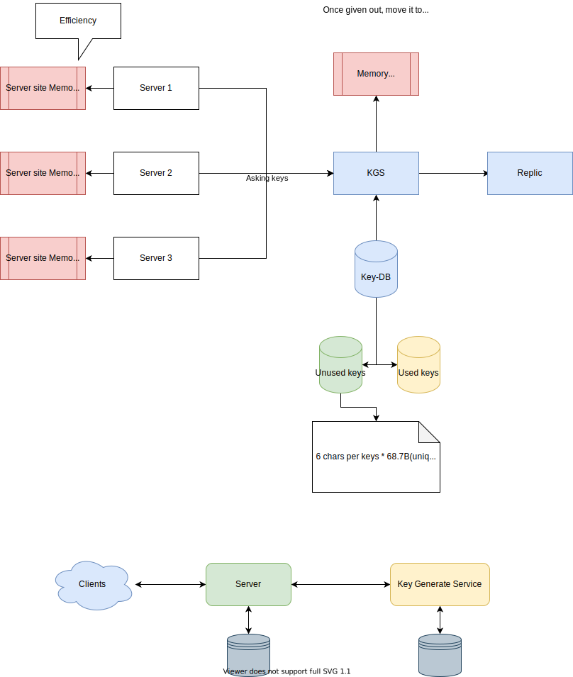

# Pastebin
## 厘清需求
用户拷贝粘贴然后分享。

* 功能性需求
    * 用户上传数据得到链接
    * 过期
    * 自定义
    * input
        * 用户系统？
        * 管理
        * 删除分享
    * output
        * 自定义url？
        * 相同文字，相同url？
        * edit？
* 非功能性需求
    * security
        * SSO integration
    * scalability
        * sharding
        * replica
    * efficiency
        * load balancer
        * CDN     
    * Big Data 分析
        * 统计

* 设计需求
    * 最大数据 10M    
## 估算
### 读写
* 读写比例
    * 我们假设读写比例5:1
* Traffic:
    * 我们假设每天1M新paste
    * 5M read
    * Requestper second
        * Write: 1M/(24 * 3600)=12 request / second
        * READ: 60/second
#### 存储
    * 假设平均每个请求10K数据
    * 1M * 10KB = 10GB/day
    * ten years
    * 10 * 365 * 10 = 36TB
### Hashing
* Hashing
    * 1M * 10 years = 1M * 10 * 365 = 3.6 billion Pastes
    * Base64
    * 可选字符[A-Z,a-z,0-9,.,-] 64个字符
        * 26(A-Z) + 26(a-z) + 10(0-9) + 2(.-) = 64
    * 64^6
        * 64^6~=68.7 billion uniqu strings
    * Hashging存储
        * one byte / one char, 
        * 3.6B * 6(chars) = 22G
### 存储的总体考虑
    * 70% capacity， totals: 36TB/0.7 = 51TB

### 带宽

我们有这个么读写，很少，可以忽略不计
* 12 write request
    * 12 * 10KB => 120KB/s
* 60 read request
    * 60 * 10KB => 0.6M/s

### 内存
我们考虑80/20原则，keep 20%的数据到内存里
    5M request * 10KB * 20% = 10GB

## 系统API
* Create
    * `addPast(api_key, user_name, custom_url, paste_data, expire_date)`
        * api_key: 
        * Return: URL
* Retrive
    * getPaste(api_key, paste_key)
        * return contents
* Delete
    * deltePaste(api_key, paste_key)
        *  return true/false
 
## 接口设计
* POST api/pastebin/  
    * body: string
    * token: jwt
    * return ID
* GET api/pastebin/id
    * token: jwt
    * return { status: 200, ret: string}, {status: 401, , msg: "permission denied"} {status: 404, msg: "not found"}
* DEL api/pastbin/id

## 数据模型
```java

user {
    id: string,
    name: string, 
    email: string,
    createdDate: Datetime(UTC),
    udpatedDate: DAtetime(UTC),

}
binUser{
    binId: string,
    userId: string,
    accessLevel: string(read, edit, admin)
}

bin
{
    id: string(PK),
    owner: id,
    content: string,
    access: string(anoumymous, alluser, table),
    createdDate: Datetime(UTC),
    updatedDate: Datetime(UTC),

}
```
## high level的设计
client => application server --> object storage

## 详细设计
###  Application layer
#### Handle write
* problem, hash clash
    * retry, retry, retyr
    * **Key Generation Service**

#### Key Generation Service
* 两个DB，一个未用，一个已用
    * 来一个请求，数据库里读一个出来，
    * 性能太差，两个db需要不停的读写，可能还需要transaction
* 两个DB，一个未用，一个已用，一部分未用放到内存    
    * 把一些未用的load到内存，然后一旦把key给了一个application request，把这个key挪到已用
    * 如果是多个server，都把同一个key装到内存，那个一个key可能会分给不同的paste
* 两个DB，一个未用，一个已经，一部分未用放到内存，这下马上移动已用
    * 这样，保证不会一个key被多用
    * 一个小问题，如果机器挂了，内存里的key就丢了，但是可以忽略不计    


## Clean up service


## 瓶颈识别+解决


## 问题
* 如何设计这种分享的权限问题
