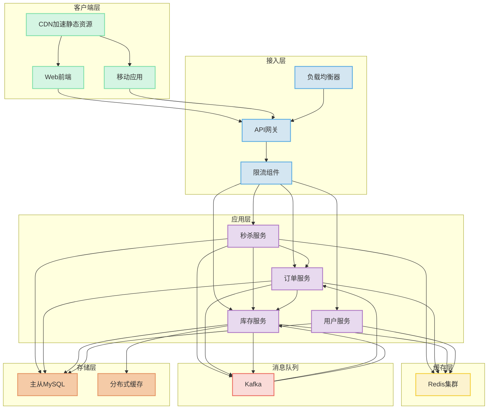

# 电商系统秒杀功能设计

## Business idea and requirement (3-4分钟)

### 业务理念
秒杀功能是电商平台的重要营销手段，通过限时限量的特价商品吸引用户，提高平台活跃度和销售额。

我们提供给用户的服务包括：
* 提供限时特价商品的浏览和购买
* 提供实时的秒杀活动状态更新
* 保证公平的购买机会
* 确保订单的准确性和一致性

数据实体包括：
* 秒杀商品：
  * 商品ID
  * 商品名称
  * 原价
  * 秒杀价
  * 库存数量
  * 活动开始时间
  * 活动结束时间
  * 每人限购数量
* 用户订单：
  * 订单ID
  * 用户ID
  * 商品ID
  * 购买数量
  * 订单状态
  * 下单时间

### 需求澄清 (5分钟)

1. **用例**：
   * 用户浏览秒杀商品列表
   * 用户参与秒杀活动
   * 用户查看秒杀结果
   * 管理员创建和管理秒杀活动

2. **覆盖/不覆盖的场景**：
   * 覆盖：正常秒杀流程、超卖防护、并发控制
   * 不覆盖：支付流程、物流配送、售后服务

3. **用户群体**：
   * 普通电商用户
   * 平台管理员

4. **使用规模**：
   * 日活用户：1000万
   * 秒杀峰值：10万QPS
   * 单次秒杀活动参与人数：100万

5. **使用模式**：
   * 秒杀时间通常为固定时段（如10:00、20:00）
   * 活动持续时间短（几分钟到几小时）
   * 流量呈现尖刺特征

6. **优先级**：
   * 高优先级：系统稳定性、防止超卖、用户体验
   * 中优先级：实时库存展示、活动倒计时
   * 低优先级：个性化推荐

## 数学模型设计 (3-5分钟)

### 数据使用估算
* 单个商品数据大小：约1KB
* 单个订单数据大小：约2KB
* 秒杀期间数据传输：~200MB/s

### 存储使用估算
* 商品数据：1000个商品 × 1KB = 1MB
* 订单数据：100万订单 × 2KB = 2GB
* 用户数据：1000万用户 × 0.5KB = 5GB

### 系统容量估算
* 秒杀峰值QPS：10万
* 数据库写入QPS：1万
* 缓存读取QPS：50万

## 高层系统设计 (10分钟)

### 通信协议选择
* 用户界面与应用服务器：HTTP REST（单向、请求-响应式）
* 实时库存更新：WebSocket（双向、流式）
* 内部服务通信：gRPC（高性能RPC）

### 系统架构
1. **客户端层**：
   * Web前端/移动应用
   * CDN加速静态资源

2. **接入层**：
   * 负载均衡器
   * API网关
   * 限流组件

3. **应用层**：
   * 秒杀服务
   * 订单服务
   * 库存服务
   * 用户服务

4. **缓存层**：
   * Redis集群（商品库存、活动信息）

5. **消息队列**：
   * Kafka（异步处理订单）

6. **存储层**：
   * 主从复制的MySQL（订单、用户数据）
   * 分布式缓存（商品库存）



## API设计 (5分钟)

### 秒杀服务API
```
GET /api/seckill/activities - 获取秒杀活动列表
GET /api/seckill/activities/{id} - 获取特定秒杀活动详情
GET /api/seckill/products/{id} - 获取秒杀商品详情
POST /api/seckill/orders - 创建秒杀订单
GET /api/seckill/orders/{id} - 查询秒杀订单状态
```

### 数据模型
```
Activity:
  id: Long
  name: String
  startTime: DateTime
  endTime: DateTime
  status: Enum(NOT_STARTED, ONGOING, ENDED)

Product:
  id: Long
  activityId: Long
  name: String
  originalPrice: Decimal
  seckillPrice: Decimal
  totalStock: Integer
  availableStock: Integer
  limitPerUser: Integer

Order:
  id: Long
  userId: Long
  productId: Long
  quantity: Integer
  status: Enum(CREATED, PAID, CANCELLED)
  createTime: DateTime
```

## 高层客户端设计 (10分钟)

### 架构层次
1. **表现层**：
   * 活动列表页面
   * 商品详情页面
   * 订单确认页面
   * 结果页面

2. **业务层**：
   * 秒杀活动UseCase
   * 订单UseCase
   * 用户认证UseCase

3. **服务层**：
   * API客户端
   * WebSocket客户端
   * 本地缓存管理

4. **数据层**：
   * 本地数据库
   * 共享偏好设置

### 数据流
采用单向数据流模式（MVI）：
* 用户操作触发意图（Intent）
* 意图由Reducer处理生成新状态
* 状态更新驱动UI渲染

## 关键模块详细设计 (10分钟)

### 库存管理模块

这个模块负责处理商品库存，是解决超卖问题的核心。

**类结构**：
* `InventoryService`: 库存服务接口
* `RedisInventoryServiceImpl`: 基于Redis的库存实现
* `InventoryLock`: 库存锁定机制

**关键算法**：
1. **预扣减库存**：
   ```
   // 伪代码
   boolean preDeductStock(productId, userId, quantity) {
     // 使用Redis的原子操作
     Long remain = redis.eval(LUA_SCRIPT, productId, quantity);
     if (remain >= 0) {
       // 记录预扣减
       redis.setex("prededuct:" + userId + ":" + productId, 300, quantity);
       return true;
     }
     return false;
   }
   ```

2. **库存确认**：
   ```
   // 伪代码
   void confirmDeduction(productId, userId) {
     String key = "prededuct:" + userId + ":" + productId;
     Integer quantity = redis.get(key);
     if (quantity != null) {
       // 确认扣减，更新数据库
       orderService.createOrder(userId, productId, quantity);
       redis.del(key);
     }
   }
   ```

3. **库存恢复**：
   ```
   // 伪代码
   void releaseStock(productId, userId) {
     String key = "prededuct:" + userId + ":" + productId;
     Integer quantity = redis.get(key);
     if (quantity != null) {
       // 恢复库存
       redis.incrBy("stock:" + productId, quantity);
       redis.del(key);
     }
   }
   ```

**状态管理**：
* 商品库存状态：使用Redis的计数器
* 预扣减状态：使用带过期时间的键值对
* 库存同步状态：使用定时任务与数据库同步

### 解决超卖的关键技术

1. **Redis原子操作**：
   * 使用Lua脚本保证库存检查和扣减的原子性
   * 利用Redis单线程模型避免并发问题

2. **乐观锁**：
   * 在数据库层使用版本号控制
   * 更新时检查版本号，避免ABA问题

3. **分布式锁**：
   * 使用Redis的SETNX实现分布式锁
   * 防止多个服务实例同时操作同一商品库存

## 复杂场景处理 (10分钟)

### 秒杀瞬时高并发场景

这个场景的挑战在于如何处理短时间内的巨大流量，同时保证系统稳定性和数据一致性。

**处理流程**：

1. **流量控制层**：
   * CDN缓存静态资源，减轻源站压力
   * 负载均衡器分发请求到多个服务实例 
   * API网关实施限流和熔断 [[API Gateway]]

2. **请求预处理**：
   * 验证用户是否有资格参与（登录状态、黑名单检查）
   * 验证请求参数合法性
   * 检查用户是否已经购买过（限购控制）

3. **库存检查与预扣减**：
   * 从Redis获取实时库存
   * 使用Lua脚本原子性地检查和预扣减库存
   * 将成功的预扣减请求写入消息队列

4. **异步订单处理**：
   * 消息队列消费者处理订单创建
   * 写入订单数据库
   * 确认库存扣减

5. **结果返回**：
   * 对于成功的请求，返回订单ID
   * 对于失败的请求，返回具体原因

**边缘情况**：
* **用户重复提交**：使用请求去重，基于用户ID和商品ID的组合键
* **库存不足**：快速失败，避免无谓的系统消耗
* **系统故障**：预扣减的库存设置过期时间，自动释放
* **数据库写入失败**：通过补偿机制恢复预扣减的库存

### 总结

本设计通过多层次的架构和多种技术手段解决了电商秒杀系统面临的核心问题：

1. **高并发处理**：
   * 前端静态化、CDN加速
   * 多级缓存、读写分离
   * 限流、熔断、降级

2. **防止超卖**：
   * Redis原子操作
   * 乐观锁机制
   * 预扣减 + 确认模式

3. **系统可靠性**：
   * 消息队列解耦
   * 分布式事务
   * 库存补偿机制