# Live

live streaming
* 高层次架构
* 高并发挑战
* 传输协议，编码
* 数据获取及处理
* 可靠性挑战

## 直播的一些术语 Live Streaming
1. 视频数据流->encoder->server,这个叫做first mile。
1. 处理过的数据流通过CDN->用户设备，这个叫last mile。

## 高层次架构

1. 直播端使用RTMPS协议发送数据到边缘节点POP
1. PO发送数据到数据中心(DC)
1. DC将数据编码不同清晰度进行持久化存储
1. 播放端使用MPEG-DASH/RTMS协议接受直播数据

## 高并发挑战
* 实时数据，无法预缓存
* 随时发生，无法提前分配资源
* 无法预测直播的观看量

## 传输协议，编码

此处省略一些Facebook特有的问题，只讨论general的一些问题及其取舍

### first mile协议对比
| 协议 | 端对端延迟 | 问题 |
|------|---------|-----|
| WebRTC|       | UDP|
| Http Upload|  blocking | 会导致网络高延迟 |
| RTMPS| good | good |

### RTMS协议介绍 Real-Time Messaging Protocol
* 低延迟
    * streaming数据分成不同的段fragments，size可以由客户端和服务器动态商议决定。所以可以传输大量的data，latency可以降到5秒钟。
* 减少缓冲时间
* 带宽自适应streaming Adaptive Bitrate Streaming
    * ABS 根据客户端的带宽，自动调整压缩率和图像质量
* 快进和回放    
* 业界规范

#### 如何直播 How to streaming by RTMP
* TCP handshake
* connection
* createstream invocation, ping and a play message

### last mile协议
* HLS
    * by Apple, for HTTP LIve Streaming
    * most used last-mile delivery.
* MPET-dash
    * open-source alternative to HLS for last-mile delivery
    * Dynamic Adaptive Streaming over HTTP

## 数据获取以及处理    
### 直播流程

1. 直播使用RTMPS协议发送直播数据流到POP内随机一个代理服务器
2. 代码服务器发送直播数据到数据中心
3. 数据中心的代理服务器使用直播id与一致性哈希算法，发送直播数据到合适的编码服务器
4. 编码服务器职责？？？
    1. 验证格式正确
    2. 关联id以及编码服务器，保证即使连接终端，重连依然是相同编码服务器
    3. 编码成不同解析度输出数据
    4. 使用DASH协议输出数据
    5. 输出数据持久话存储

### 播放流程

1. 播放端使用HTTP DASH协议，向POP请求直播数据
2. POP检查缓存，返回，若无缓存，向DC请求直播数据
3. DC代理服务器检查数据在DC中，有则返回，无则使用一致性哈希算法向对应编码服务器请求数据，更新DC缓存，返回POP，返回播放端

## 可靠性挑战
### 惊群
* 短时间多个播放端向同一个POP请求直播数据，如果无缓存，只有一个请求发往DC，如果A超时，或者所有请求一起发往DC，或者所有请求全部超时。

## 扩展知识点之一致性哈希算法
### 传统hash算法 哈希取模算法

#### 面临的问题：
* 增加节点，节点失效可能出现大量缓存失效

