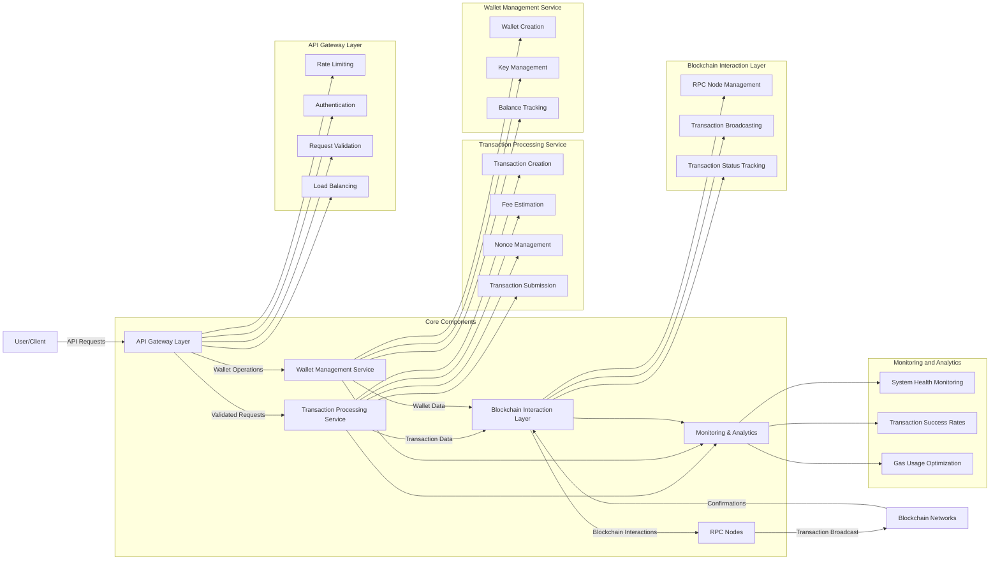

# High-TPS Stablecoin Transfer System Design

## System Requirements

- **Throughput**: 10,000 transactions per second (TPS)
- **Reliability**: Ensure nonce correctness and minimize stuck transactions
- **Efficiency**: Optimize gas usage
- **Scalability**: Handle high concurrent load

## Architecture Overview

### Core Components

1. **API Gateway Layer**
   - Rate limiting and throttling
   - Authentication and authorization
   - Request validation
   - Load balancing

2. **Transaction Processing Service**
   - Transaction creation and signing
   - Fee estimation
   - Nonce management
   - Transaction submission

3. **Wallet Management Service**
   - Wallet creation and management
   - Key management and security
   - Balance tracking

4. **Blockchain Interaction Layer**
   - RPC node management
   - Transaction broadcasting
   - Transaction status tracking

5. **Monitoring and Analytics**
   - System health monitoring
   - Transaction success rates
   - Gas usage optimization

## Detailed Design

### Wallet Abstraction Strategy

**Hybrid Approach**:
- **Per-user wallets** for small/medium users
  - Provides clear ownership and transaction history
  - Simplifies accounting and auditing
  - Better for regulatory compliance

- **Pooled wallets** for high-frequency users
  - Reduces on-chain transactions (internal ledger for intra-pool transfers)
  - Amortizes gas costs across multiple users
  - Allows for batching of transactions

**Implementation Considerations**:
- Smart contract-based wallet infrastructure for pooled wallets
- Cryptographic proof of ownership for pooled wallet balances
- Clear separation of funds with robust accounting

### Nonce Management System

**Distributed Nonce Manager**:
- Sharded by user/wallet address
- Redis-based distributed counter with optimistic locking
- In-memory cache with persistent storage backup

**Nonce Tracking Process**:
1. Retrieve current on-chain nonce at service startup
2. Maintain pending transaction queue per wallet
3. Increment nonce atomically for each new transaction
4. Track confirmed transactions to reconcile nonce state

**Handling Concurrency**:
- Dedicated microservice for nonce management
- Lock-free algorithms where possible
- Conflict resolution with priority queuing

### Transaction Queueing System

**Custom Mempool Buffer**:
- Multi-tier priority queue based on:
  - User priority level
  - Transaction urgency
  - Gas price offered
  - Time in queue

**Queue Management**:
- Kafka-based transaction queue for durability
- In-memory processing for high-throughput
- Dead letter queue for failed transactions

**Transaction Lifecycle**:
1. Validation and nonce assignment
2. Signing and gas estimation
3. Prioritization and queueing
4. Submission to blockchain
5. Monitoring and confirmation tracking

### Backpressure Strategies

**Gas Price Volatility Handling**:
- Dynamic gas price adjustment based on network conditions
- Transaction batching during high gas periods
- Optional delay mechanisms with user consent

**System Overload Protection**:
- Circuit breakers for extreme network conditions
- Graceful degradation of service
- Request throttling with fair allocation

**Implementation**:
- Reactive programming model (e.g., Project Reactor, RxJava)
- Adaptive rate limiting based on blockchain congestion
- Predictive modeling for gas price trends

### RPC Provider Scaling

**Multi-Provider Strategy**:
- Primary-secondary setup with multiple RPC providers
- Geographic distribution for latency optimization
- Provider-specific health monitoring

**Scaling Approach**:
- Connection pooling for efficient RPC usage
- Request caching for common queries
- Load balancing across multiple endpoints

**Providers**:
- Premium services: Alchemy, QuickNode, Infura
- Self-hosted nodes for critical operations
- Fallback mechanisms between providers

## Performance Optimizations

### Transaction Batching

- Group multiple transfers into single transactions where possible
- Use smart contracts for batch processing
- Implement EIP-2930 (Optional Access Lists) for gas savings

### Gas Optimization

- Implement EIP-1559 fee model with base fee + priority fee
- Gas price oracle for optimal fee estimation
- Historical analysis for gas usage patterns

### Parallel Processing

- Shard transaction processing by wallet address
- Parallel submission of transactions from different wallets
- Asynchronous confirmation tracking

## Monitoring and Reliability

### Transaction Monitoring

- Real-time dashboard for transaction status
- Alerting for stuck transactions
- Automatic retry mechanisms with escalating gas prices

### System Health Metrics

- End-to-end latency tracking
- Success rate monitoring
- Gas usage efficiency

### Failure Recovery

- Automatic nonce reconciliation
- Transaction replacement for stuck transactions
- Rollback mechanisms for failed operations

## Security Considerations

- Private key management with HSM integration
- Strict access controls for transaction signing
- Rate limiting to prevent DoS attacks
- Transaction amount limits and anomaly detection

## Conclusion

This high-throughput stablecoin transfer system balances performance, reliability, and cost-efficiency through careful architecture design. The hybrid wallet approach, sophisticated nonce management, and multi-tier transaction queueing enable the system to achieve 10k TPS while maintaining transaction integrity and optimizing gas usage.

The system's resilience to network congestion and gas price volatility is ensured through intelligent backpressure mechanisms and a robust RPC provider strategy, making it suitable for production-grade financial applications.

        