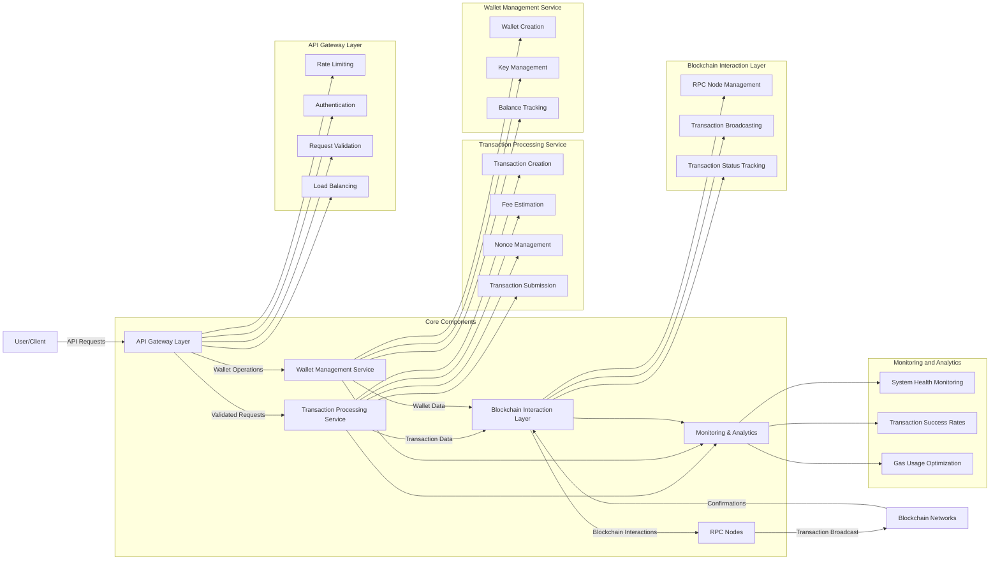

# High-TPS Stablecoin Transfer System Design

## System Requirements

- **Throughput**: 10,000 transactions per second (TPS)
- **Reliability**: Ensure nonce correctness and minimize stuck transactions
- **Efficiency**: Optimize gas usage
- **Scalability**: Handle high concurrent load

## Architecture Overview



### Core Components

1. **API Gateway Layer**
    - Rate limiting and throttling
    - Authentication and authorization
        * JWT/Oauth token
    - Request validation
    - Load balancing

2. **Transaction Processing Service**
   - Transaction creation and signing
   - Fee estimation
   - Nonce management
   - Transaction submission

3. **Wallet Management Service**
   - Wallet creation and management
   - Key management and security
   - Balance tracking

4. **Blockchain Interaction Layer**
   - RPC node management
   - Transaction broadcasting
   - Transaction status tracking

5. **Monitoring and Analytics**
   - System health monitoring
   - Transaction success rates
   - Gas usage optimization

## Detailed Design

### Wallet Abstraction Strategy

**Hybrid Approach**:
- **Per-user wallets** for small/medium users
  - Provides clear ownership and transaction history
  - Simplifies accounting and auditing
  - Better for regulatory compliance

- **Pooled wallets** for high-frequency users
  - Reduces on-chain transactions (internal ledger for intra-pool transfers)
  - Amortizes gas costs across multiple users
  - Allows for batching of transactions

**Implementation Considerations**:
- Smart contract-based wallet infrastructure for pooled wallets
- Cryptographic proof of ownership for pooled wallet balances
- Clear separation of funds with robust accounting

### Nonce Management System

**Distributed Nonce Manager**:
- Sharded by user/wallet address
- Redis-based distributed counter with optimistic locking
- In-memory cache with persistent storage backup

**Nonce Tracking Process**:
1. Retrieve current on-chain nonce at service startup
2. Maintain pending transaction queue per wallet
3. Increment nonce atomically for each new transaction
4. Track confirmed transactions to reconcile nonce state

**Handling Concurrency**:
- Dedicated microservice for nonce management
- Lock-free algorithms where possible
- Conflict resolution with priority queuing

### Transaction Queueing System

**Custom Mempool Buffer**:
- Multi-tier priority queue based on:
  - User priority level
  - Transaction urgency
  - Gas price offered
  - Time in queue

**Queue Management**:
- Kafka-based transaction queue for durability
- In-memory processing for high-throughput
- Dead letter queue for failed transactions

**Transaction Lifecycle**:
1. Validation and nonce assignment
2. Signing and gas estimation
3. Prioritization and queueing
4. Submission to blockchain
5. Monitoring and confirmation tracking

### Backpressure Strategies

**Gas Price Volatility Handling**:
- Dynamic gas price adjustment based on network conditions
- Transaction batching during high gas periods
- Optional delay mechanisms with user consent

**System Overload Protection**:
- Circuit breakers for extreme network conditions
- Graceful degradation of service
- Request throttling with fair allocation

**Implementation**:
- Reactive programming model (e.g., Project Reactor, RxJava)
- Adaptive rate limiting based on blockchain congestion
- Predictive modeling for gas price trends

### RPC Provider Scaling

**Multi-Provider Strategy**:
- Primary-secondary setup with multiple RPC providers
- Geographic distribution for latency optimization
- Provider-specific health monitoring

**Scaling Approach**:
- Connection pooling for efficient RPC usage
- Request caching for common queries
- Load balancing across multiple endpoints

**Providers**:
- Premium services: Alchemy, QuickNode, Infura
- Self-hosted nodes for critical operations
- Fallback mechanisms between providers

## Performance Optimizations

### Transaction Batching

- Group multiple transfers into single transactions where possible
- Use smart contracts for batch processing
- Implement EIP-2930 (Optional Access Lists) for gas savings

### Gas Optimization

- Implement EIP-1559 fee model with base fee + priority fee
- Gas price oracle for optimal fee estimation
- Historical analysis for gas usage patterns

### Parallel Processing

- Shard transaction processing by wallet address
- Parallel submission of transactions from different wallets
- Asynchronous confirmation tracking

## Monitoring and Reliability

### Transaction Monitoring

- Real-time dashboard for transaction status
- Alerting for stuck transactions
- Automatic retry mechanisms with escalating gas prices

### System Health Metrics

- End-to-end latency tracking
- Success rate monitoring
- Gas usage efficiency

### Failure Recovery

- Automatic nonce reconciliation
- Transaction replacement for stuck transactions
- Rollback mechanisms for failed operations

## Security Considerations

- Private key management with HSM integration
- Strict access controls for transaction signing
- Rate limiting to prevent DoS attacks
- Transaction amount limits and anomaly detection

          
# User Flow and Error Handling in High-TPS Stablecoin Transfer System


## Normal User Request Flow

### 1. User Sends Request

A typical user request would look like:

```json
POST /api/v1/transfers
{
  "from": "0x1234...abcd",  // User's wallet address
  "to": "0x5678...efgh",    // Recipient's wallet address
  "amount": "100.00",       // Amount to transfer
  "token": "USDC",          // Stablecoin type
  "priority": "normal",     // Transaction priority (affects gas price)
  "idempotencyKey": "uuid-1234-5678" // Prevents duplicate submissions
}
```

### 2. API Gateway Processing

The API Gateway:
- Authenticates the user (JWT/OAuth token validation)
- Validates the request format and parameters
- Checks rate limits for the user
- Load balances to an available server

**Response to User:**
The system doesn't make the user wait for blockchain confirmation. Instead, it returns an immediate acknowledgment:

```json
{
  "status": "accepted",
  "transferId": "tr-12345",
  "estimatedCompletionTime": "30 seconds",
  "trackingUrl": "/api/v1/transfers/tr-12345"
}
```

This allows the user to continue their activities while tracking the transaction status separately.

### 3. Service Processing

Depending on the request type:

**Transaction Processing Service:**
- Creates and signs the transaction
- Estimates appropriate gas fees
- Obtains the next nonce from the Nonce Management System
- Submits the transaction to the queue

**Wallet Management Service:**
- Verifies sufficient balance
- Updates internal balance records (optimistic update)
- Tracks transaction in user history

### 4. Blockchain Interaction

- The Blockchain Interaction Layer sends the transaction to RPC nodes
- Transaction is broadcast to the blockchain network
- System monitors for confirmations

### 5. Status Updates to User

**Websocket/Server-Sent Events:**
The system uses real-time communication channels to update the user:
```
ws://api.example.com/ws/transfers/tr-12345
```
A single server might support 10,000-100,000 concurrent WebSocket connections depending on hardware

**Webhook Callbacks:**
For applications, the system can send webhook notifications to a registered URL:
```
POST https://user-app.example.com/callbacks/transfers
{
  "transferId": "tr-12345",
  "status": "confirmed",
  "blockNumber": 15243687,
  "transactionHash": "0xabc..."
}
```

**HTTP Polling Endpoint:**
For clients that can't use websockets:
```
GET /api/v1/transfers/tr-12345
```

Response:
```json
{
  "transferId": "tr-12345",
  "status": "pending", // pending, confirmed, failed
  "confirmations": 2,
  "transactionHash": "0xabc...",
  "blockNumber": 15243687,
  "estimatedCompletionTime": "10 seconds remaining"
}
```

## Error Handling Strategies

### 1. Pre-Submission Errors

**Validation Errors:**
```json
{
  "status": "error",
  "code": "VALIDATION_ERROR",
  "message": "Invalid recipient address format",
  "details": {
    "field": "to",
    "reason": "Not a valid Ethereum address"
  }
}
```

**Insufficient Funds:**
```json
{
  "status": "error",
  "code": "INSUFFICIENT_FUNDS",
  "message": "Insufficient balance for transfer",
  "details": {
    "available": "50.00 USDC",
    "required": "100.00 USDC"
  }
}
```

### 2. Transaction Processing Errors

**Nonce Conflicts:**
- System automatically retries with corrected nonce
- No user action required
- Status updates reflect "processing" with details

**Gas Price Spikes:**
- For extreme spikes, system may notify user:
```json
{
  "status": "pending_approval",
  "code": "HIGH_GAS_PRICE",
  "message": "Network congestion detected",
  "options": {
    "proceed": {
      "estimatedFee": "5.00 USD",
      "estimatedDelay": "none"
    },
    "wait": {
      "estimatedFee": "1.50 USD",
      "estimatedDelay": "~30 minutes"
    }
  }
}
```

### 3. Blockchain-Level Errors

**Transaction Dropped from Mempool:**
- System automatically resubmits with higher gas price
- Updates status to "resubmitted"
- Tracks multiple submission attempts

**Network Partition/RPC Failure:**
- System fails over to alternate RPC providers
- Implements circuit breaker if all providers fail
- Returns service degradation notice to user

### 4. System-Level Error Recovery

**Transaction Reconciliation:**
- Periodic job checks for transactions stuck in "pending" state
- Compares on-chain state with internal records
- Automatically resolves discrepancies

**Dead Letter Queue:**
- Failed transactions after max retries go to DLQ
- Operations team can manually resolve or refund
- User receives notification of manual intervention

## Error Notification Channels

The system uses the same channels for error notifications as for status updates:

1. **Websocket/SSE:** Real-time error notifications
2. **Webhook Callbacks:** For application integration
3. **Email/Push Notifications:** For critical errors requiring user action
4. **In-app Notifications:** For mobile/web applications

## Conclusion

This comprehensive approach ensures:
- Users receive immediate feedback on their requests
- Transactions are reliably processed even during network congestion
- Users can track transaction status in real-time
- Errors are handled gracefully with appropriate recovery mechanisms
- The system maintains data consistency between internal state and blockchain state

The design prioritizes user experience by providing immediate responses while handling the complexities of blockchain transactions behind the scenes.


        